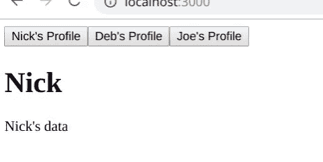
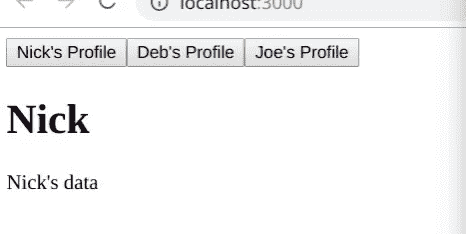

# 使用 React 挂钩提取数据时避免竞争情况

> 原文：<https://medium.com/hackernoon/avoiding-race-conditions-when-fetching-data-with-react-hooks-220d6fd0f663>


Man jumping over clock

大约一个月前，我在 Twitter 上发布了一个使用 React Hooks 获取数据的例子。虽然本意是好的，但是 Dan abro mov(React 核心团队的)让我知道我的实现包含了一个竞争条件。因此，我答应写一篇博文来纠正我的实现。这就是那个帖子！

**注:**如果这篇文章对你有帮助，请借一个拍手(或 50)帮忙传播一下！👏👏

***

## 通过注册我的免费时事通讯，在您的收件箱中获得快速 JavaScript 技巧！

***

# 设置

在我们的示例应用程序中，当人们的名字被点击时，我们将虚假加载他们的个人资料数据。为了帮助可视化竞争条件，我们将创建一个`fakeFetch`函数，实现 0 到 5 秒之间的随机延迟。

```
const fakeFetch = person => {
  return new Promise(res => {
    setTimeout(() => res(`${person}'s data`), Math.random() * 5000);
  });
};
```

# 初始实施

我们最初的实现将使用按钮来设置当前配置文件。我们使用`useState`钩子来实现它，维护以下状态:

*   `person`，用户选择的人
*   `data`，根据所选人员从我们的假获取中加载的数据
*   `loading`，当前是否正在加载数据

我们额外使用了`useEffect`钩子，每当`person`改变时，它执行我们的假获取。

```
import React, { Fragment, useState, useEffect } from 'react';const fakeFetch = person => {
  return new Promise(res => {
    setTimeout(() => res(`${person}'s data`), Math.random() * 5000);
  });
};const App = () => {
  const [data, setData] = useState('');
  const [loading, setLoading] = useState(false);
  const [person, setPerson] = useState(null); useEffect(() => {
    setLoading(true);
    fakeFetch(person).then(data => {
      setData(data);
      setLoading(false);
    });
  }, [person]); return (
    <Fragment>
      <button onClick={() => setPerson('Nick')}>Nick's Profile</button>
      <button onClick={() => setPerson('Deb')}>Deb's Profile</button>
      <button onClick={() => setPerson('Joe')}>Joe's Profile</button>
      {person && (
        <Fragment>
          <h1>{person}</h1>
          <p>{loading ? 'Loading...' : data}</p>
        </Fragment>
      )}
    </Fragment>
  );
};
export default App;
```

如果我们运行我们的应用程序并单击其中一个按钮，我们的伪 fetch 将按预期加载数据。

# 达到比赛条件

当我们开始在人与人之间快速转换时，麻烦就来了。假设我们的假提取有一个随机延迟，我们很快就会发现我们的提取结果可能会乱序返回。此外，我们选择的配置文件和加载的数据可能不同步。那是一副糟糕的表情！



Clicking buttons quickly and hitting the race condition

这里发生的事情相对直观:`useEffect`钩子内的`setData(data)`只有在`fakeFetch`承诺被解析后才被调用。无论哪个承诺最后解决，都将最后调用`setData`，而不管哪个按钮实际上是最后调用的。

# 取消以前的提取

我们可以通过“取消”任何非最新点击的`setData`调用来修复这种竞争情况。我们通过在`useEffect`钩子内创建一个布尔变量，并从`useEffect`钩子返回一个清理函数，将这个布尔“取消”变量设置为`true`来实现。当承诺解析时，只有当“取消”变量为假时，`setData`才会被调用。

如果这个描述有点混乱，下面的代码示例应该会有所帮助。

```
useEffect(() => {
  let canceled = false; setLoading(true);
  fakeFetch(person).then(data => {
    if (!canceled) {
      setData(data);
      setLoading(false);
    }
  }); return () => (canceled = true);
}, [person]);
```

即使前一次按钮点击的`fakeFetch`承诺稍后解决，它的`canceled`变量将被设置为`true`并且`setData(data)`将不会被执行！

让我们来看看我们的新应用程序是如何运行的:



Clicking buttons quickly and avoiding the race condition

完美——无论我们点击不同的按钮多少次，我们将总是只看到与最后一次按钮点击相关的数据。

# 完整代码

这篇博文的完整代码可以在下面找到:

```
import React, { Fragment, useState, useEffect } from 'react';const fakeFetch = person => {
  return new Promise(res => {
    setTimeout(() => res(`${person}'s data`), Math.random() * 5000);
  });
};const App = () => {
  const [data, setData] = useState('');
  const [loading, setLoading] = useState(false);
  const [person, setPerson] = useState(null); useEffect(() => {
    let canceled = false; setLoading(true);
    fakeFetch(person).then(data => {
      if (!canceled) {
        setData(data);
        setLoading(false);
      }
    }); return () => (canceled = true);
  }, [person]); return (
    <Fragment>
      <button onClick={() => setPerson('Nick')}>Nick's Profile</button>
      <button onClick={() => setPerson('Deb')}>Deb's Profile</button>
      <button onClick={() => setPerson('Joe')}>Joe's Profile</button>
      {person && (
        <Fragment>
          <h1>{person}</h1>
          <p>{loading ? 'Loading...' : data}</p>
        </Fragment>
      )}
    </Fragment>
  );
};
export default App;
```