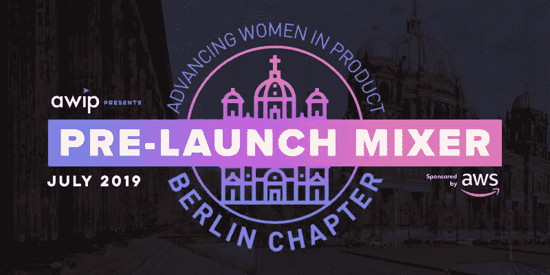

# 随着柏林分部的成立，AWIP 扩展全球网络以增加技术多样性

> 原文：<https://medium.com/hackernoon/awip-expands-global-network-to-increase-diversity-in-tech-with-launch-of-berlin-chapter-c443c0eb33e2>

## 第一章开始包括由亚马逊网络服务(AWS)主办的一场关于用产品构建一个更加互联互通的全球经济的亲密讨论

## AWIP 继续全球扩张，在巴黎和柏林设有办事处，拥有超过 10，000 名全球会员

**德国柏林——2019 年 7 月 4 日——**[通过机会平等为高潜力女性产品和技术领导者赋能的组织](https://www.advancingwomeninproduct.org/) (AWIP)宣布在德国柏林开启新篇章。继去年在巴黎成立分会后，这一新的分会正在扩大 AWIP 的全球足迹，并进一步推进其为女性和在技术领域代表性不足的少数族裔建立项目的使命。

“世界各地的女性在科技行业的代表性不足，AWIP 致力于改变现状，全面增强科技领导者的能力，”[首席执行官兼 AWIP 联合创始人南希·王](https://www.linkedin.com/in/wangnancy/)表示。“我们期待我们的柏林分会为下一代技术领导者提供成功所需的技能和指导机会。”

自 2017 年在三藩市成立以来，AWIP 已在全球拥有 10，000 名会员，以缩小科技领域日益扩大的多样性差距。Nancy Wang 创建了这个组织，为产品经理、风投、产品设计师和工程师提供编程社区，以支持他们的职业目标和职业发展。该组织的每个分会都提供高管指导、基于技能的培训研讨会、小组讨论、网络机会和其他计划，以增强各种背景和职业水平的产品经理的能力。

AWIP 柏林分会将致力于为当地会员组织技能培训和交流机会。柏林 AWIP 酒店将全年举办以当地技术领导者为特色的活动。

AWIP 柏林分会的启动将包括一场讨论，重点是技术领导者如何利用产品建立一个更加互联互通的全球经济，随后是问答环节。对于这个小组，AWIP 邀请了柏林当地的创始人来分享他们设计国际产品的经验。此次活动将拉开 AWIP 柏林分会即将开幕的序幕。

**什么:**

AWIP 将举办首次发布前交流会和讨论会:“为国际观众打造产品”

**世卫组织:**

讨论由首席执行官 Nancy Wang 主持

演讲者包括:

[卡斯帕·冯·格伦伯格](https://www.linkedin.com/in/kaspar-von-gr%C3%BCnberg-73872380/?originalSubdomain=de)，创始人&首席执行官，[人文科技](https://humanitec.com/)

[凯莉·舒勒](https://www.linkedin.com/in/carrie-shuler/)，创始人&首席执行官[斯塔克移动](https://starkmobility.com/)

**何时:**

2019 年 7 月 8 日上午 8:45—10:45。CEST

**其中:**

自动警报系统

克劳斯特拉埃 38

德国柏林 10117 号

有关参加活动的票务信息，请访问[此处](https://www.eventbrite.com/e/building-products-for-an-international-audience-tickets-62931807731)。

**关于 AWIP**

由谷歌和亚马逊的两位项目经理共同创立的“提高女性在产品中的地位”( AWIP)通过为男性和女性提供平等的职业发展机会来增强技术领导者的能力。AWIP 相信平等机会的力量能够推动科技产业向前发展。要了解更多信息并加入 AWIP，请访问 www.advancingwomeninproduct.org 的[、推特上的](http://cts.businesswire.com/ct/CT?id=smartlink&url=http%3A%2F%2Fwww.advancingwomeninproduct.org&esheet=51835472&newsitemid=20180712005203&lan=en-US&anchor=www.advancingwomeninproduct.org&index=28&md5=8a7c5b5ab8ca3e1d447693887815836e) [@theAWIP](http://cts.businesswire.com/ct/CT?id=smartlink&url=https%3A%2F%2Ftwitter.com%2Ftheawip&esheet=51835472&newsitemid=20180712005203&lan=en-US&anchor=%40theAWIP&index=29&md5=b8708362df5190c2fae1cf21eae6f00c) 和脸书的[@ advancing womeningproduct](http://cts.businesswire.com/ct/CT?id=smartlink&url=https%3A%2F%2Fwww.facebook.com%2Fadvancingwomeninproduct%2F&esheet=51835472&newsitemid=20180712005203&lan=en-US&anchor=%40AdvancingWomenInProduct&index=30&md5=86c48dd5a4f5a98f9b855e5c2e6a9b63)。

**媒体联系**

[高音](http://www.treblepr.com)

Ale Valeriano，512–960–8222

awip@treblepr.com