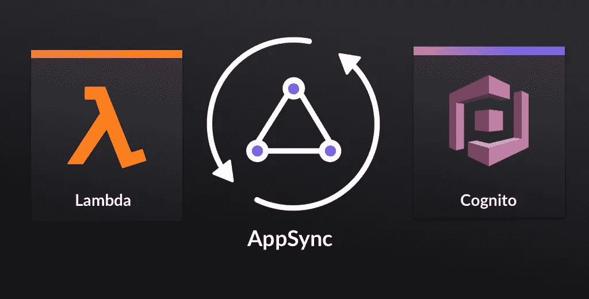
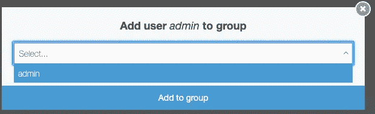

# Lambda 中的 AWS AppSync

> 原文：<https://medium.com/hackernoon/aws-appsync-queries-and-mutations-with-lambda-2aee303c66b0>

## 如何在 AWS Lambda 和 Cognito 池中调用 AppSync 查询和变异

我正在使用 AWS AppSync 构建 Floom，[一个微服务市场](https://market.floom.app)。90%的情况下它都很棒，但是仍然有一些非常明显的特性差距。其中最大的一个问题是不能通过`AWSAppSyncClient`使用私钥访问 GraphQL 操作(例如，当使用 Lambda 进行后端操作时)。似乎应该有某种开箱即用的管理访问，允许您在不需要使用 AWS Cognito 进行身份验证的情况下修改和查询数据库。

如果您正在使用 AppSync，您可能已经将 GraphQL API 配置为使用 AWS Cognito 池(这是默认设置)。在客户端控制不同用户的访问时，使用 Cognito pools 非常方便。它允许您在您的`schema.graphql`中使用`@auth`装饰器来定义读(列表、获取)和写(创建、更新、删除)访问点。

如果是这种情况，并且您想在自己的后端服务器(或 AWS Lambda)上访问 GraphQL 操作，那么您基本上只能有两种选择:

1.  **您可以在您的 Cognito 池中创建一个 admin 用户，然后使用该用户获取** `**AWSAppSyncClient**` **SDK 的访问凭证。**
2.  这里有一个使用 AWS IAM 角色的解决方法[在这里进行了概述](https://read.acloud.guru/backend-graphql-how-to-trigger-an-aws-appsync-mutation-from-aws-lambda-eda13ebc96c3)。这包括创建经过身份验证和未经身份验证的角色，然后创建 Amazon Cognito 身份池，并将刚刚创建的角色链接到身份池。这还将涉及到更改客户端应用程序中的身份验证机制。您将不再能够在`schema.graphql`中使用`@auth`装饰器，除非您编写自己的解析器。

在这里，我将解释如何推进选项#1。该过程的鸟瞰图如下所示:

1.  在 AWS Cognito 中设置管理员用户
2.  使用管理员的登录凭证从 AWS Cognito 获取会话`jwtToken`
3.  使用这个`jwtToken`来获得一个`AWSAppSyncClient`的实例
4.  现在，您可以像在前端一样使用 AppSync GraphQL 查询和变异。

# 创建管理员用户

我创建了一个用户名为`admin`的用户，并将这个用户添加到一个名为`admin`的组中。

一旦你完成了这些，确保这个用户能够访问你在 Lambda 函数中需要的 GraphQL 操作。例如，在 [Floom](https://floom.app) 中，一旦卖家完成订单，我们就需要一个`Transaction`，所以我添加了一个`@auth`规则，允许`admin`组中的用户完成对`Transaction`模型的读/写访问。

# 在 Lambda 中获取会话令牌

要在 Lambda 中访问 AppSync 的 GraphQL 操作，而不需要切换到 AWS_IAM 身份验证，我们需要使用 admin 用户获取会话令牌。我们可以通过`aws-sdk`的`CognitoIdentityServiceProvider`模块做到这一点:

# 实例化 AWSAppSyncClient

现在我们有了 Cognito 凭证，我们可以用它们实例化一个`AWSAppSyncClient`对象的实例，这将允许我们使用 AppSync GraphQL 查询和变异。

# 使用 AWSAppSyncClient

当你的`amplify push`你的`schema.graphql`改变时，Amplify 会给你提供一个`queries.js`和一个`mutations.js`的 GraphQL 操作，看起来像这样:

您可以导入整个文件以在 Lambda 函数中使用，或者简单地复制您需要的文件(如果您对`schema.graphql`做了更改，记得更新它们)。

现在，您可以在 Lambda 设置中使用 AppSync 的 GraphQL 操作，同时仍然使用 Cognito 身份验证(没有 AWS_IAM 角色)。当您调用`mutations`时，Amplify GraphQL 客户端甚至可以使用`subscriptions.js`中提供的订阅来订阅这些突变，就像本例中的`onUpdateTransaction` 。