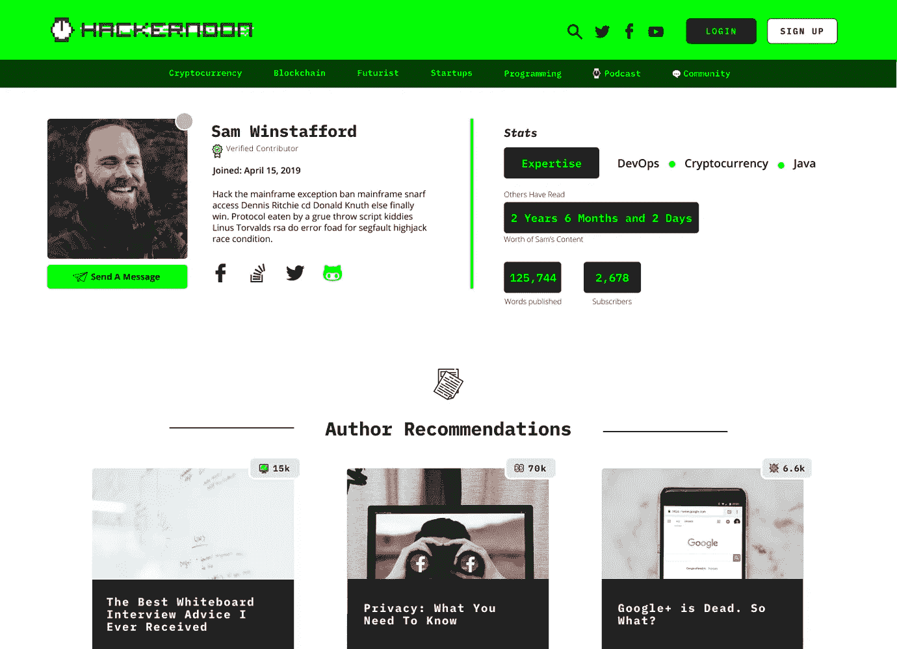
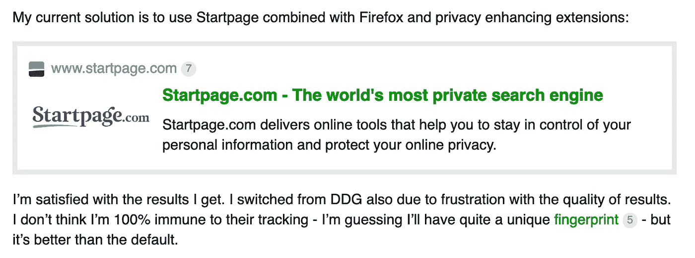

# 回到互联网

> 原文：<https://medium.com/hackernoon/back-to-the-internet-433edcddc1e6>

## [community.hackernoon.com](http://community.hackernoon.com)——专业技术人员谈论工作的地方

join the discourse: [community.hackernoon.com](https://community.hackernoon.com/)

嘿黑客们，

错过了昨天与 Alicia Ferratusco 的 [AMA，她是 Starfish 的创始人，Starfish 是加州最具活力的新兴技术合作和活动场所之一。](https://community.hackernoon.com/t/i-am-alicia-ferratusco-realaliciafe-founder-of-starfish-network-ask-me-anything-5-9-noon-pst/2417)

## [*阅读全文 AMA 对于费拉图斯科的看法区块链社区、合作办公、实验性房地产、生态系统建设以及空间运营的机制设计。*](https://community.hackernoon.com/t/i-am-alicia-ferratusco-realaliciafe-founder-of-starfish-network-ask-me-anything-5-9-noon-pst/2417)

当我们没有[为你提供](https://community.hackernoon.com/t/ama-signup-nomination-thread/1101/5)接触[传奇创始人](https://community.hackernoon.com/t/i-am-jeff-atwood-codinghorror-co-founder-of-stack-overflow-and-discourse-ask-me-anything-4-8-noon-pst/1800/71)和[创造者](https://community.hackernoon.com/t/im-courtland-allen-creator-of-indie-hackers-ask-me-anything-thu-apr-18-noon-pst/1945)的机会，或者为你创造一个空间来试验[公共建筑项目](https://community.hackernoon.com/t/food-alliance-project-diary/2034/3)，或者思考[尊重你的网友到底意味着什么](https://community.hackernoon.com/t/treat-your-internet-friends-with-respect/1212)时，我们谈论的是 **/** [**科技**](https://community.hackernoon.com/c/Technology) 。在本周的社区综述中:

## **问&答/** [软件开发](https://community.hackernoon.com/c/Software-Development)

# 从开发者的角度来看，你对 WordPress 及其相关性有什么看法？*——*[***@乔丹***](https://community.hackernoon.com/u/jordan/)

> “我知道传统的 wordpress 安装可能很烦人，尤其是使用 PHP，但是我真的推荐使用 WP 自定义字段和 WP API 来进行无头 WP 开发。你会惊讶于你可以用它实现多少(你实际上可以使用 Ruby on Rails。NET，React，Vue，你说吧。”— [*@* ***阿涅利耶夫***](https://community.hackernoon.com/u/agnelnieves)

# **——@**[**raziel 2244**](https://community.hackernoon.com/u/raziel2244)

> **[**枪 8**](https://gun.eco/) **有意思。与我见过的其他方法相比，创建并运行 hello world 非常容易。—**[***@戴恩***](https://community.hackernoon.com/u/Dane)**

# **关于我的开源项目的帮助——你如何传播消息？——[@ jojo . lichten Berger](https://community.hackernoon.com/u/jojo.lichtenberger)**

> ***“在相关的子栏目上发布你的项目，利用社交媒体来提高知名度。你也可以试着将你的项目细节和一篇文章提交到通常会有这类内容的热门网站上。”—*[***@乔丹***](https://community.hackernoon.com/u/jordan/)**

# **2019 年，一个电子商务网站的成本是多少？——@[玛丽莎](https://community.hackernoon.com/u/marissa)**

> **“我发现，一个小型电子商务网站大致由几个方面决定:小型产品目录(100-1000)，一些定制程序，现成的主题，轻流量，基本设计。小型网站的页面不超过 25 页，并且具有开箱即用的功能。估计小型电子商务网站开发成本:2，000 至 15，000 美元。”— [@gln](https://community.hackernoon.com/u/gln)**

# **[**你最喜欢的很酷的 GitHub 项目？**](https://community.hackernoon.com/t/cool-github-projects/2345)**——**[***@乔丹***](https://community.hackernoon.com/u/jordan/)**

> ***【产品爬虫】这个开源项目旨在创建一个* ***数据库*** *，存储关于* ***日常用品*** *的重要信息(最初只关注食品、可食用产品)。产品信息如******营养价值*******防腐剂*******家族企业*** *等——*[*@****ckerha***](https://community.hackernoon.com/u/ckerha)******

## ****hackernoon 2.0 英寸/ [产品](https://community.hackernoon.com/c/product)上的热印****

# ****[HN 2.0 评论系统如何工作？](https://community.hackernoon.com/t/story-comment-system/2398)——[@ agnel nieves](https://community.hackernoon.com/u/agnelnieves)****

> ****“我们计划使用社区论坛本身作为评论系统。对于每个故事，论坛上会有一个相关的帖子，你可以在那里评论和讨论这个故事。出于几个原因，我们决定以这种方式与话语相结合，但最大的原因是我们真的相信我们可以在这里建立一个伟大的社区，这在一定程度上要归功于故事讨论。”—[***@奥斯汀***](https://community.hackernoon.com/u/austin/)****

# ****[奖金设计更新:贡献者简介 I-1](https://community.hackernoon.com/t/bonus-design-update-contributor-profile-i-1/1987)——[@ faith corinne](https://community.hackernoon.com/u/faithcorinne/summary)****

********

# ****[我们应该把故事分为基础、中级和高级吗？](https://community.hackernoon.com/t/should-we-label-stories-as-basic-intermediate-and-advanced/2089)—[@戴恩](https://community.hackernoon.com/u/Dane)****

> *****“我认为围绕专业水平提供的上下文将更好地为读者构建标题。我们可以多玩一点 3 级的语言。也许“入门，中级&高级”？还是“Intro，Tech Professional &高级黑客”？还是“基础的，专业的&专家”？就像滑雪斜坡一样，颜色可以是绿色、蓝色和黑色。”—* [*@* ***大卫***](https://community.hackernoon.com/u/David)****

## ****/ [随机](https://community.hackernoon.com/c/random)上交/ [密码](https://community.hackernoon.com/c/Crypto)和/ [技术](https://community.hackernoon.com/c/Technology)****

# ****[只用表情符号命名乐队/歌曲/专辑](https://community.hackernoon.com/t/name-a-band-song-album-using-only-emojis/2330)——[@奥斯汀](https://community.hackernoon.com/u/austin)****

********

# ****思考如何解决城市高峰时间的交通拥堵问题。有没有可能有一条可以改变方向的单行道？——[@戴恩](https://community.hackernoon.com/u/Dane)****

> ****“是的，就是它！在河内这样拥挤的小城市，人们不得不这样做。这就像是对人们的偷袭，因为当街道变成单行道或双行道或单行道时，规则总是在变，这让人们非常困惑。交通警察也利用了这一点，他们“躲”在停车标志后面，跳出来抓住那些事先不知道有开关的人。— [*@* ***林***](https://community.hackernoon.com/u/linh)****

# ****【Hackernoon 是否应该公开出来反对比特币 SV(BSV)？ — [@jayz](https://community.hackernoon.com/u/jayz)****

> *****“就其本身而言，作为一个社区驱动的技术出版物，Hacker Noon 邀请其读者对正在进行的关于加密货币领域普遍存在的古怪行为的辩论采取立场。我们已经发表了几篇文章，宣称区块链技术是自切片面包以来最伟大的创新，正如我们已经发表了几篇文章，称其为十年/世纪的骗局(取决于夸张程度)……”——*[*【hacker hodl*](https://community.hackernoon.com/u/Hackerhodl)****

# ****最佳电子游戏配乐？——[@奥斯丁](https://community.hackernoon.com/u/austin)****

> ****“试试质量效应:仙女座号开始主题曲。它会激励你，激励你！非常容易上瘾的东西。”— [@h3ypb](https://community.hackernoon.com/u/h3ypb)****

# ****[网络课堂 vs .现场课堂？](https://community.hackernoon.com/t/online-classes-vs-on-site-classes/2082)—[@毛毛虫](https://community.hackernoon.com/u/caternoon)****

> ****“学费泡沫总有一天会破灭……”——[*@****大卫***](https://community.hackernoon.com/u/David)****

# ****什么将取代谷歌搜索？——[@奥斯汀](https://community.hackernoon.com/u/austin)****

********

****- @[***raulrpearson***](https://community.hackernoon.com/u/raulrpearson)****

********

****join the discourse: [community.hackernoon.com](https://community.hackernoon.com/)****