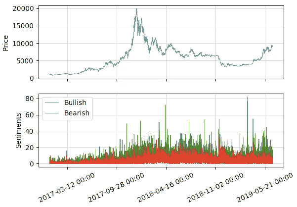
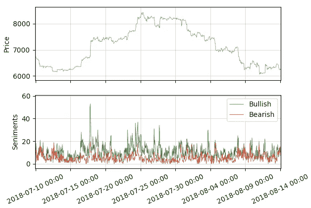
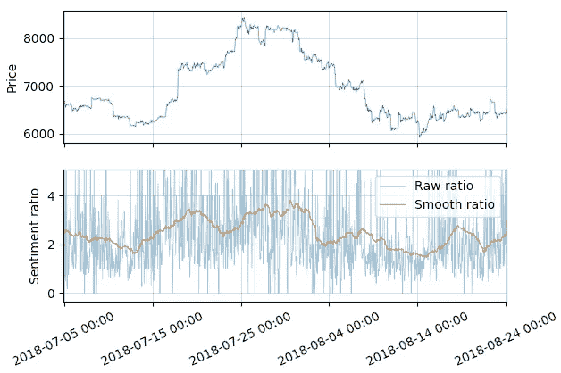
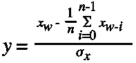
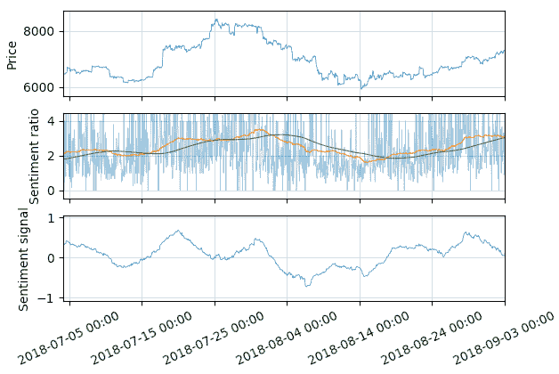
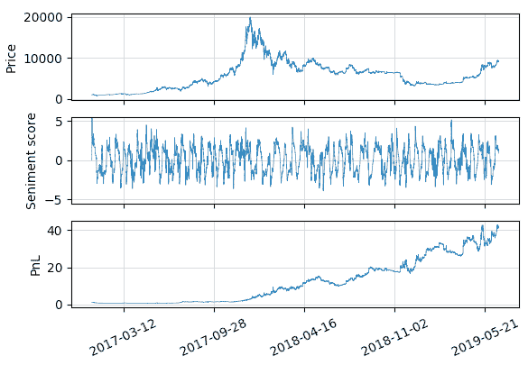
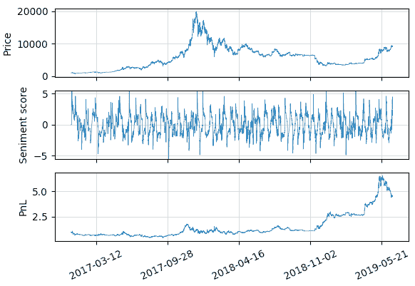

# 对比特币的情绪分析策略进行回溯测试

> 原文：<https://medium.com/hackernoon/backtesting-a-sentiment-analysis-strategy-for-bitcoin-3f79ddeb86f1>

> TL；DR:我们使用 Augmento 情绪信号开发了一个策略，并在 Bitmex XBTUSD 上进行回测，以在 2017 年至 2019 年之间产生正回报。

创建交易比特币的算法很难，找到独立于价格但仍与市场相关的好数据就更难了。情绪数据可能是答案，但它通常很难用于算法交易，而且很少能提供比简单的积极或消极信号更多的信息。

[Augmento](https://www.augmento.ai/) 情绪数据为加密货币市场提供了一个广阔的多维视角，以与顶级加密货币交易所的市场数据相同的蜡烛格式打包。在本文中，我们将加载一些数据，基于这些数据开发一个简单的交易信号，使用一个基本的市场模型对信号进行回溯测试，并评估结果。

所有代码都可以在 [Github](https://github.com/augmento-ai/quant-reseach) 上找到。

# 加载数据

Bitmex API 使用*/trade/bucked*端点提供了一种获取历史烛台数据(以及其他数据)的超级简单的方法。以下是获取*2019–01–01 00:00*和*2019–01–02 00:00*之间的 1 小时蜡烛图数据的示例:

```
params = {
 "symbol" : "XBt",
 "binSize" : "1h",
 "count" : 10,
 "start" : 0,
 "startTime" : "2019–01–01T00:00:00Z",
 "endTime" : "2019–02–01T00:00:00Z",
}url = "[https://www.bitmex.com/api/v1/trade/bucketed](https://www.bitmex.com/api/v1/trade/bucketed)"r = requests.get(url, params=params).json()
```

看着回应:

```
[{'close': 3693,
'foreignNotional': 24965778,
'high': 3695.5,
'homeNotional': 6766.36017934,
'lastSize': 20,
'low': 3682.5,
'open': 3686.5,
'symbol': 'XBTUSD',
'timestamp': '2019–01–01T00:00:00.000Z',
'trades': 10718,
'turnover': 676636017934,
'volume': 24965778,
'vwap': 3689.7646},...{'close': 3712.5,
'foreignNotional': 37688803,
'high': 3722,
'homeNotional': 10149.23641118001,
'lastSize': 167,
'low': 3702.5,
'open': 3703,
'symbol': 'XBTUSD',
'timestamp': '2019–01–01T09:00:00.000Z',
'trades': 14849,
'turnover': 1014923641118,
'volume': 37688803,
'vwap': 3713.4688}]
```

我们已经包含了一个[脚本](https://github.com/augmento-ai/quant-reseach/blob/master/examples/2_load_bitmex_example_data.py)，用于加载示例 XBTUSD 数据并运行示例和测试。只需转到根文件夹并运行:

```
python3 examples/2_load_bitmex_example_data.py
```

从 [Augmento API](http://api-dev.augmento.ai/v0.1/documentation) 获取数据同样简单。对于同一时期推特上关于比特币的活动:

```
params = {
 "source" : "twitter",
 "coin" : "bitcoin",
 "bin_size" : "1H",
 "count_ptr" : 2,
 "start_ptr" : 0,
 "start_datetime" : "2019–01–01T00:00:00Z",
 "end_datetime" : "2019–02–01T00:00:00Z",
}endpoint_url = "[http://api-dev.augmento.ai/v0.1/events/aggregated](http://api-dev.augmento.ai/v0.1/events/aggregated)"r = requests.get(endpoint_url, params=params).json()
```

再看一下数据:

```
[{'counts': [1, 1, 0 ... 0, 2, 17],
'datetime': '2019–01–01T00:00:00Z',
't_epoch': 1546300800},...{'counts': [0, 1, 0, 0 ... 0, 7, 19],
'datetime': '2019–01–01T01:00:00Z',
't_epoch': 1546304400}]
```

*counts* 列表中的每个元素给出了从给定时间戳开始，在 bin 中按照给定主题或情感分类的 Tweets 的数量。要获得这些主题和观点的列表，请查询*主题*端点:

```
r = requests.get("[http://api-dev.augmento.ai/v0.1/topics](http://api-dev.augmento.ai/v0.1/topics)").json()
```

Response 是主题和情感的字典，其关键字给出了上述*计数*列表中主题或情感的索引:

```
{'0': 'Hacks',
'1': 'Pessimistic/Doubtful',
'10': 'Institutional_money',
'11': 'FOMO',...'90': 'Airdrop',
'91': 'Optimistic',
'92': 'Negative'}
```

同样，我们已经在 Github repo 中包含了[脚本](https://github.com/augmento-ai/quant-reseach/blob/master/examples/0_load_augmento_example_data.py)来加载这些数据，只需运行以下命令来本地保存一些数据:

```
python3 examples/0_load_augmento_example_data.pypython3 examples/1_load_augmento_example_info.py
```

# 查看数据

一旦我们加载了一些示例数据，我们就可以绘制一些信号——在这种情况下，我们选择了*看涨*和*看跌*情绪信号——与价格的关系:

```
python3 examples/3_plot_augmento_example_data.py
```

这给了我们一个比特币价格(实际上是 Bitmex 上的 XBTUSD)相对于*看涨*和*看跌*数量的漂亮图表:



有趣的是，*看涨*和*看跌*的推文量在 2017 年底的繁荣期间增加，在价格大幅下跌后，在 2019 年初左右再次下降(尽管只是轻微下降)。这与炒作期间社交媒体活动可能很高的想法一致。

让我们更仔细地看看一段随机的数据:



请注意上涨期间*看涨*的推文数量增加，而下跌期间*看涨*的推文数量减少。

# 创建策略

尽管情绪数据中有一些明显的趋势与价格走势相对应，但似乎没有任何明确的买入或卖出指标。我们需要做一些处理来获得信号。

我们可以从挑选我们想要使用的信号开始，在这种情况下，*看涨*和*看跌*比特币情绪。我们的假设是，当*看涨*情绪与*看跌*情绪的比率较高时，价格可能会上涨，反之则价格会下跌。查看*看涨*情绪与*看跌*情绪的比率，该比率非常尖锐，具有明显的偏差；离我们要找的平稳信号还很远。

我们可以通过取过去 7 天的[简单移动平均线](https://en.wikipedia.org/wiki/Moving_average#Simple_moving_average) (SMA)来平滑信号。7 天 SMA 的选择是任意的，但是请注意这在某种程度上仍然与价格相关:



这个平滑的信号看起来好多了，但仍然没有提供一个明确的买入或卖出指标。一个示例指示符可以是均值约为 0.0 的振荡信号，当> 0.0 时指示多头头寸，当<0.0\. One way to generate this signal would be to calculate a rolling mean of the smooth signal *x* 时指示空头头寸，并将该窗口中的最后值 *x* ʷ与均值进行比较:



这里，我们也将信号除以平滑信号的标准偏差 *x* ，因此我们得到一个输出 *y* ，它大致落在界限 *[-2.5，2.5]* 内。

这给了我们一个很好的平稳情绪信号，看起来它可能与价格运动相关，并且可以用作策略的基础。考虑到价格和情绪信号是独立的；它们之间的相关程度相当令人惊讶。



# 回溯测试策略

开发了一个信号后，我们现在可以根据这个信号创建一个策略，并在一个简单的市场模拟中测试它。

为了进行回溯测试，我们在每一步都查看价格和 [PnL](https://www.bitmex.com/app/pnlGuide) (基本上是钱包的总价值)，并且——根据我们的信号在前一步中是做多还是做空——根据前一步价格的变化计算新的 PnL。我们也在每次交易时减去总 PnL 的一小部分来模拟交易费用。下面是伪代码:

```
for i in steps:
 if s[i-1] > 0.0:
  pnl[i] = (p[i] / p[i-1]) * pnl[i-1]
 else if s[i-1] < 0.0:
  pnl[i] = (p[i-1] / p[i]) * pnl[i-1]
 else if s[i-1] = 0.0:
  pnl[i] = pnl[i-1]

 if sign(s[i-1]) != sign(s[i-2]):
  pnl[i] = pnl[i] - (pnl[i] * trade_fee)
```

请注意，PnL 的计算只是近似的，并且根据交易所和资产的不同而不同。还要注意，我们小心地确保回溯测试是[因果](https://en.wikipedia.org/wiki/Causal_system)，使用前一步中的情绪分值来设置当前步骤的位置，为当前步骤计算新的 PnL。

一旦我们建立了回溯测试，我们就可以针对一对情感/主题和一组给定的参数，对一些历史价格和情感数据进行回溯测试。下图显示了*看涨/看跌*策略的表现，第一个和第二个滚动窗口(SMAs)的窗口大小为 168 小时(7 天)。注意，情绪得分也已经被每个窗口的第二滚动窗口的标准偏差缩放，所以它大致保持在-5.0 到 5.0 的范围内。



上述回溯测试也包含在回购的中:

```
python3 examples/4_basic_strategy_example.py
```

再次注意，PnL 计算只是近似的，我们没有考虑费用或[滑点](https://en.wikipedia.org/wiki/Slippage_(finance))，所以它不太可能是真实的，但考虑到窗口参数是随机选取的，这是一个好的开始。

对随机选取的主题/情感对进行回溯测试也是明智的，以便为我们上面的实验提供基本的[控制](https://en.wikipedia.org/wiki/Randomized_controlled_trial)。这里，我们在*谣言/技术分析*对上回测了相同的策略:



这里的最终 PnL 要低得多，夏普比率也要差得多(PnL 总体上是平坦的，偶尔会有大的跳跃)。这提供了一些证据，证明我们的*看涨/看跌*实验的相对良好的表现是我们选择主题/情绪对的结果，而不是因为我们的模型中的一些差异。

# 结论

我们已经看到了如何使用嘈杂的原始[非平稳](https://en.wikipedia.org/wiki/Stationary_process)数据来开发适合交易策略的信号，以及如何使用回溯测试来评估策略性能。需要再次注意的是，我们忽略了几个重要的因素，比如交易费、滑点和市场流动性；这将在以后的文章中讨论。

在下一篇文章中，我们将回顾我们创建的信号和回溯测试，看看我们是否可以通过选择其他主题/情感对来优化它，并测试各种窗口大小参数。我们还将通过观察这些参数在一系列市场条件下的表现，并在添加随机噪声后，对这些参数进行压力测试。

以上实验的所有代码都可以在 [Github](https://github.com/augmento-ai/quant-reseach) 上找到，还有 Augmento API 的[文档](http://api-dev.augmento.ai/v0.1/documentation)。从 2014 年到最近 30 天，比特币的历史情绪数据也可以在 API 上免费获得，以及所有其他主要硬币(以太坊、Ripple、Dash、Stellar、0x 等)的各种开始日期的历史数据。).

希望这是有趣和有用的！期待在评论中得到你的反馈！

*本文由*[*augmento . ai*](https://www.augmento.ai/)*制作，作为使用其数据的一系列入门指南的一部分，并不构成投资或交易建议。*