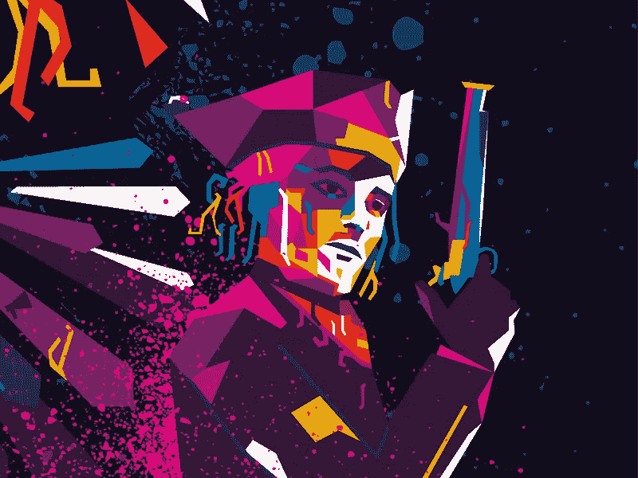

# 坏骗子，坏。关于一个没有想象力的骗子的悲伤喜剧

> 原文：<https://medium.com/hackernoon/bad-scammer-bad-a-sad-comedy-about-a-scammer-without-imagination-8a61f4d1cd61>

## 加密是一个艰难的世界。当我告诉他们骗子、法庭和其他事件时，人们说我们这里有一个平行宇宙。尽管如此，它从不无聊。

Image by [Stepher Leadbetter](https://dribbble.com/shots/6182760-The-Thief)

长话短说:想象一下，一家公司与一家金融服务提供商建立了合作关系，并在没有事先进行背景调查的情况下提前付款？把这看做一部有着美好结局的悲剧喜剧，吸取教训吧。

该公司等待服务交付，但它们不断被推迟。在 1.5 个月的 Skype 通话中，什么也没发生。供应商与我们联系，给出了我们无法继续前进的新理由。其中之一是 API:人们认为该公司将对其进行改造，并与欧洲最大的银行之一进行整合。

与此同时，该公司获准披露银行名称。好消息可以振奋精神！很有趣，不是吗？银行愿意公开宣布与一家加密货币公司合作，这多酷啊？谁知道在接下来的 3 分钟内，银行会拒绝与金融提供商的任何关系，并威胁要提起诉讼？接下来我明白了，没有人真正知道他们在和谁打交道。

我不相信一切都很清楚*:
——那么……他们有没有提交任何证据证明他们确实是合法的企业？
—是的，他发了文件，他的公司注册了。
***我，穿着 haX0r gRRrl 服装*:**
——嗯……你说‘他’？

骗子很容易愚弄那些关闭了批判性思维的人。谢天谢地，至少有一个人承认了社会工程攻击。

我从公司注册处开始。的确，他的公司注册了。他还拥有不同行业的其他公司，甚至是能源公司。哦，这是他的名字。让我们检查一下社交网络。他来了。好吧，其他坚守岗位的人是谁？等一下……同一个人有好几个职位？我们去查查他的其他公司。同一个人不同的名字和出生日期？

第三个人当时没有被确认，但后来被确认了。公司的时间表在很短的时间内充满了任命和离职，以形成事情正在发生的感觉。

当然，他在命名方面没有生动的想象力，但这可能是一个典型的骗局，选择听起来像现有公司或完全相同的名称。他所有的公司都有一个邮箱。奇怪的是，他和自己在脸书的另一个身份是朋友。到底为什么会有人这么做？

— *哎呀，真的，你为什么把这些都放在一个地方！如果你选择了相似的命名，也许你“偷”了别的东西？金融界有没有叫这个名字的真实公司…嗯，在这里。他抄袭了网站内容。*

***我，打字…*:**
*—亲爱的亚洲公司，我注意到这家公司声称提供您的服务并要求付款。我只是想在付款前确认一下你是否与他们有关联。请看报告。
——谢谢你的信息邮件。我们没有关系。非常感谢。我们的团队目前正在调查。*

哎哟...我开始深入研究他的资料。他有一个廉价的假冒奢侈品网店，当然，他在任何地方都使用相同的标识。他在网上留下了他家庭地址的痕迹。我想知道他如何在家乡度过他的日子，扭曲了他房子的街景，‪who 是一个身份不明的共有人。

金融服务网站看起来过时了。我好像在滚动 1997 年的互联网。源代码显示它只花了 10 美元。一个朋友告诉我:这个网站可能有一个可访问的目录。对于一家声称提供“安全”银行服务的企业来说，这是一个多么可笑的笑话啊，但当我们到达那里时，你必须看看我的脸。
*—奇怪的文件名。数字签名、公用事业账单、护照扫描……一张名为 blockchain.jpg 的照片，还有……那位神秘的共同所有者的护照，他的文件被用于网站注册和公司董事职位。*

上面有一些樱桃。他的角色英雄是一个 17 世纪的小偷。他使用了一个众所周知的恶意软件作为他在网上昵称的一部分。报纸文章和法庭记录显示，他曾因盗窃和伪造罪被判刑。我的报告增加了。他的网站第二天就被关闭了，并被发送给各种金融欺诈调查人员。命运未知。

附注:网站关闭后，他将 XX，XXX 美元返还给了公司。

万岁。我爱信息安全。

感谢阅读！加入我的 [Twitter](https://twitter.com/cryptokatia) 或 [LinkedIn](https://www.linkedin.com/in/cryptokatia) 🍀🔥

*免责声明:为了保护个人隐私，该故事在发布时没有具体细节。*