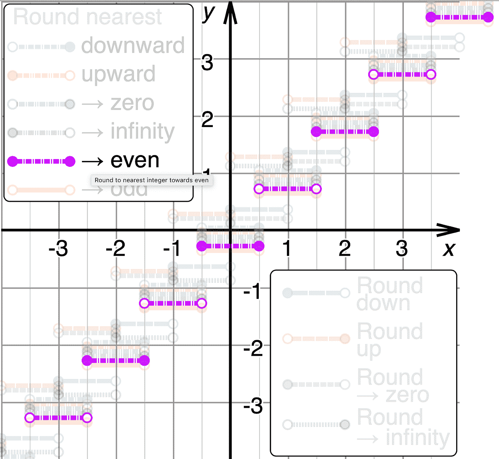

# 智能合约的“银行家舍入”

> 原文：<https://medium.com/hackernoon/bankers-rounding-for-smart-contracts-2bccd0b664>

大家好！我叫安东，是 [crypto.tickets 的首席技术官。](https://crypto.tickets) Crypto Tickets 开发了新的分散售票协议，可以防止门票被伪造或重复出售。对于活动组织者来说，加密门票的吸引力在于能够控制二级市场，保留每张门票转售的额外佣金，完全禁止转售，或者只允许授权粉丝转售。这项技术旨在成为市场上任何售票技术的附加产品。

# 整数？

如你所知，以太坊智能合约无法轻松处理实数(浮点数)。所以，我们都和整数打交道。

但是，如果你用百分数计算，你将不得不用一个数除以另一个数。这就是舍入的用武之地。比如，假设你需要给账户 a 发“13%作为分红”，如果你有 10 个代币要分呢？你应该把 1.3 个代币四舍五入到 1 个还是 2 个？很明显 1.3 要四舍五入到 1。就是高中数学，没什么意思。

*在智能合约中有一些处理实数的通用方法。* [*有些将分子和分母存储为单独的变量*](https://github.com/ConsenSys/smart-contract-best-practices/blob/master/docs/recommendations.md#beware-rounding-with-integer-division) *所以你可以通过在分子中存储 1，在分母中存储 3 来描述 1/3，但那是另一个不同的故事了。*

故事从你必须四舍五入到 1.5 开始。如果我们总是四舍五入到 1 呢？你的系统会累积误差，你的投资者会损失红利。如果你把它四舍五入到 2，你就会一直赔钱。想象你分红几百万次。有什么方法可以减少累积误差？

银行家不一定总是反对整个社会。他们有一些我们可以使用的东西，叫做“银行家四舍五入”，也就是“四舍五入”。这个想法是，当一个数在两个数的中间时，它被四舍五入到最近的**甚至**数。例如，2.125 向下舍入到 2.12。同时，2.135 向上舍入到 2.14。其他小数按照同样的方法四舍五入:2.122 到 2.12，2.127 到 2.13，-2.122 到-2.12 等等。所以，你不会一直赔钱，就像你的客户一样。

[https://en.wikipedia.org/wiki/Rounding](https://en.wikipedia.org/wiki/Rounding)

好了，让我们把那个功能介绍给加密货币世界吧！

在 crypto.tickets 中，我们使用智能合约进行记账(我们称之为“计费”)，因此当门票在二级市场上转售时，活动组织者将收到 50%的加价作为费用。让我们描述一下如何以及在哪里使用银行家舍入。

1.  **让** *feeOrg_ppm* 存储活动组织者应该收到的红利 ppm 数。Ppm 代表百万分率，所以 1%就是 10000 ppm。最终， *feeOrg_ppm* 将等于 50000。
2.  **让** *markup_cents* 存储当前的加价，比如 14 美分。

为了计算组织者应该得到多少，我们使用这个简单的公式:

这就是*bankersloudediv()*方法的用武之地:

如果 markup_cents 是 14，那么活动组织者将获得 **7 美分**。

如果 markup_cents 为 15，那么活动组织者将获得 **8 美分** (7.5 四舍五入为最接近的偶数)。

如果 markup_cents 是 17，那么活动组织者将收到 **8 美分** (8.5 被四舍五入为最接近的偶数，仍然是 8)。

# “银行家舍入”代码

代码可在此处获得[—https://github . com/cryptoticket/open zeppelin-solidity/blob/master/contracts/math/roundeddivmath . sol # L53](https://github.com/cryptoticket/openzeppelin-solidity/blob/master/contracts/math/RoundedDivMath.sol#L53)

测试可在此处获得[—https://github . com/cryptoticket/open zeppelin-solidity/blob/master/test/math/roundeddivmath . test . js](https://github.com/cryptoticket/openzeppelin-solidity/blob/master/test/math/RoundedDivMath.test.js)

# 结论

四舍五入有助于你将累计误差降至最低，因此你的客户在收到费用或股息时会很高兴。

随时联系我: [tony@crypto.tickets](mailto: tony@crypto.tickets)