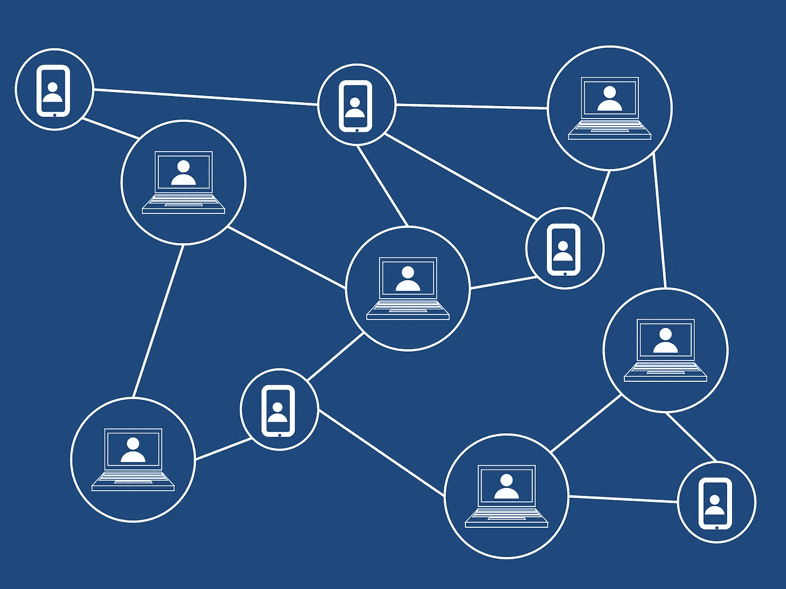
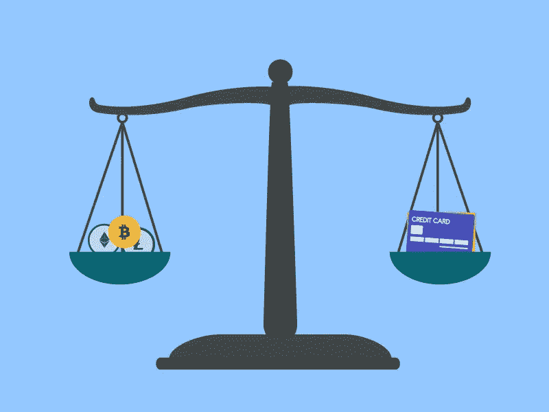

# 银行业不需要银行

> 原文：<https://medium.com/hackernoon/banking-doesnt-require-banks-bc33cd7a0625>

当中本聪发布区块链技术和比特币白皮书时，他(他们)这样做的意图是创建一个基于点对点网络共享协议的分散支付系统。区块链技术是促进比特币和其他加密货币交易的网络。该技术的亮点是提出了一个基于“信任”的系统，该系统在没有中央权威的情况下运行。

*Image by* [*Tumisu*](https://pixabay.com/users/Tumisu-148124/?utm_source=link-attribution&utm_medium=referral&utm_campaign=image&utm_content=3019120) *from* [*Pixabay*](https://pixabay.com/?utm_source=link-attribution&utm_medium=referral&utm_campaign=image&utm_content=3019120)

然而，这种技术相对于经济以及金融和银行服务的破坏性，导致比特币的使命出现了缺口。随着时间的推移，这个系统已经显示出许多优点和缺点，但比特币的使命正面临着普及的障碍，因为各个政府都持怀疑态度，不愿意参与去中心化。

怀疑可以归因于:-

## 理解内容

区块链网络和加密货币交易所的基础是密码学。仅仅试图理解其中的过程可能是一项艰巨的任务。想象一下，试图将这项技术纳入一个基于集权的更大的经济框架。

这项技术有能力引起经济和金融服务的范式转变。然而，为了将这项技术成功地实施到更大的事物方案中，重要的是从整体上理解区块链技术和加密货币，以便能够成功地被实体、个人和组织使用。

## 对未知的恐惧

银行和其他金融机构收取很高的贷款利率，以及经常性交易、服务和维护费等。这些机构通常赚取高额利润，有时是以牺牲客户利益为代价。2008 年金融危机引发了对透明度和问责制的需求，让金融专家和学者们寻找合理的解决方案。

区块链技术促进了新的和创新的过程，这些过程在没有被网络的大多数验证的情况下不能被追溯修改。这为用户提供了相当大的透明度和操作效率。它还消除了收取高额交易费的中介，这通常会增加执行交易的时间。

银行和金融机构是传统经济结构的支柱，世界的很大一部分仍然依赖于此。向区块链科技和加密货币交易转移，让这些机构感到恐惧。银行从交易费和贷款高利率中赚取大量利润。由于区块链在 p2p 网络上的分散交易，他们可能会失去这些产生的收入。

# Ripple 进入这个空间

Ripple 的存在是为了解决银行机构面临的这些问题。它是第三大加密货币，仅次于比特币和以太坊。截至 2019 年 4 月 30 日，其市值超过 120 亿美元，交易价格约为 0.30 美元。

Ripple 被认为是支付交易的数字资产。XRP 令牌主要帮助企业和银行以更快的速度和最小的交易成本进行支付交易。

Ripple 的模式基于与银行的合作，解决与比特币相关的跨境支付问题。其目的是解决由于法定货币注入经济而导致的通货膨胀问题。它还通过在 27 个国家提供实时全球支付解决了地理问题。

比特币的框架消除了中央银行提供金融服务的必要性。该框架阐明了以下事实:虽然金融服务是必要的，但金融机构不是。

按照微软的主要创始人比尔·盖茨的说法，“我们需要银行业，但我们不再需要银行了。”

# 没有银行你怎么方便银行业务？

我认为，我们需要在比特币的愿景与监管障碍、区块链解决方案中的低网络障碍等实际普遍情况之间找到一个中间地带。目标应该是创造作为交换媒介和价值储存手段的实际价值。

有很多公司虽然不是银行，但却为银行和金融服务提供便利。如果没有一个集中的监管机构，如何确保客户偿还他们所借的金额？

确保这一点的第一个方法是在银行系统内部运作。如果客户不偿还贷款金额，它会影响他们的信用评分。

第二种方法是确保公司有一定的安全保障，在资金短缺时可以清算。

这方面的问题是，信用评分数据是主观的，容易出错和不准确。因为它是一个主观参数，所以它不是一个好的指标，因此，它不是一个可靠的指标。大多数人的信用评分会因为错误而受到影响。此外，信用评分数据不是最安全的，因为信用评分公司一直被黑客攻击。例如，2017 年，Equifax 经历了历史上最大的安全漏洞之一，超过 1.4 亿用户的数据被一名身份不明的窃贼窃取。

# 那么，什么是确保有效偿还贷款的可行办法呢？

第一步是确保贷款有抵押，如果可以的话。贷款必须以加密货币资产作为抵押。加密货币形式的资产将取代以贷款形式流出公司的资金。

第二步是先发制人，因为没有正确资产的客户无法利用这些服务。

抵押系统将能够提供更好的用户体验。这将使一家公司能够客观地提供服务。

最好的抵押品应该是价格可以在动态基础上理解的抵押品，我们可以根据贷款与资产价值(LAV)来理解它们的波动性。被视为贷款抵押品的项目是国家或国际交易所持有的股票、国家或国库债券以及加密货币。

至于股票和债券，人们需要在国家中央金融管理局的严格规则下操作时购买，人们可以说这些规则保护了客户——这基本上是真的。然而，这违背了在没有中央集权的情况下运作的目的。

唯一合乎逻辑的是提供加密支持的金融服务。它仍然没有解决比特币试图培育的去中心化方法。

下一个最好的事情是在代币持有者之间分配公司的利润，在代币的公共分类账上公布交易数据，通过分散的应用程序促进这些金融服务，并确保公司不是这些服务的中间人。

这接近于 Satoshi 的愿景，即不需要依赖任何特定的硬币或货币就能成为无处不在的国际货币。

*本文由霍德勒银行首席执行官兼联合创始人达尔山·巴蒂贾撰写。*

# 关于霍德勒银行

[**霍德勒银行**](https://bankofhodlers.com/) 是一家总部位于区块链的公司，专注于为那些拥有加密资产的人提供金融服务。我们最近发布了我们的资产支持贷款平台，您可以使用您的加密货币作为抵押品进行借贷，并从中赚取利息。

如果您想了解更多关于霍德勒银行的信息，以及我们正在努力实现的目标，您可以在 BoH 中的[处阅读](https://bankofhodlers.com/inside)