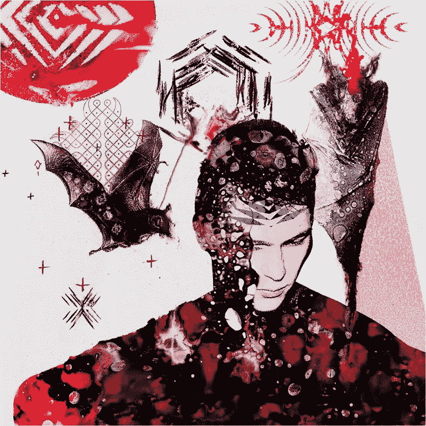
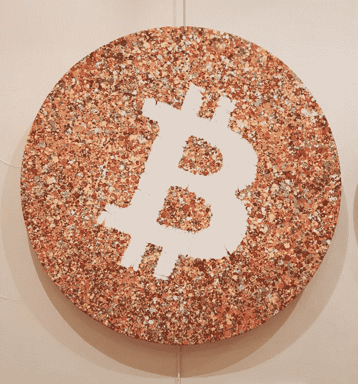
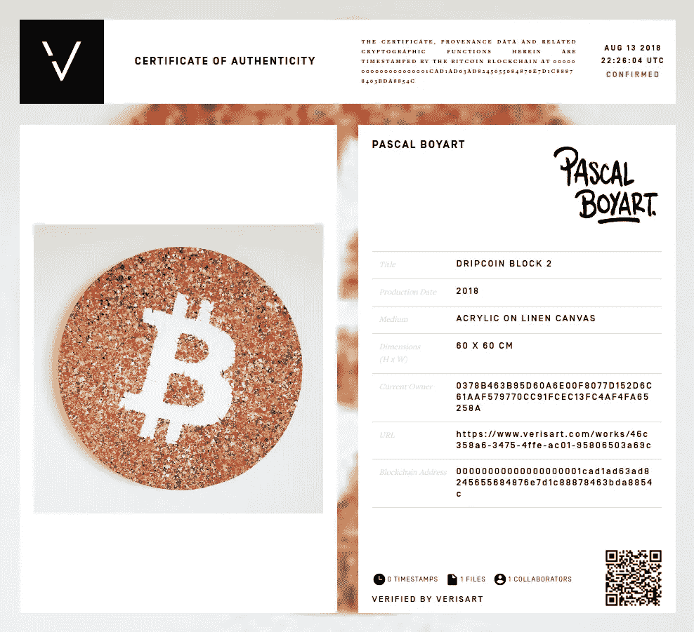

# 做一个艺术品经销商:✨艺术与密码

> 原文：<https://medium.com/hackernoon/be-an-art-dealer-art-crypto-1b54fda98fb6>

## 艺术界正在迅速采用加密技术，而且这一运动越来越强大。

Series “Traces of Feelings in Time”, Viktor Gornostaev
(instagram: [gornostaevv](https://www.instagram.com/gornostaevv/))

✨✨艺术展是人类最具创造力的表现形式，丰富了人类的体验。理解艺术并分享艺术有助于打造社区价值观。现代艺术运动有一个愿景，人类社会将通过民主的传播和边界的“模糊”而发展。

## 它与密码配合得很好！

Crypto 为艺术家提供了拥有自己的视觉的机会，提供了一种将视觉变为现实的工具。

今天，我们正在进入一个将艺术与加密货币融合的新阶段。对于艺术家和收藏家来说，了解推动市场的当前趋势至关重要。因此，毫不奇怪，艺术家们一直在利用密码来买卖和创作艺术品。

> 艺术是提供难忘的密码印象和展示可用性的一个极好的工具。

## 在艺术中寻找新的价值！

有些艺术家将密码作为他们创作背后的主题和灵感。

举个例子，

**帕斯卡尔·博雅特**是一位住在巴黎的艺术家(推特:[@帕斯卡尔·博雅特](https://twitter.com/pascalboyart?lang=fr))。目前正在研究艺术和金钱之间关系的主题，他对加密货币产生了热情，并开始在他最近的艺术作品中使用它们。值得注意的是，他是第一个在自己的画作上贴上比特币二维码进行捐赠的壁画画家。这些捐款用于资助接下来的街头艺术壁画、艺术品和展览。

“Dripcoin Blocks Serie: Bitcoin Logo” 2018, Pascal Boyart

这是一部独特的原创作品，在 [OpenBazaar](https://openbazaar.com/store/QmYTXDyMNjdUSvqNc88T2VeVF3KdG7PMefnGQKrp9NZ5Tp/bitcoin-art-dripcoin-block-2) 上可以买到。

[**OpenBazaar**](https://www.openbazaar.org/) 是一个使用比特币(以及其他顶级加密货币)的点对点去中心化开源交易协议，具有以法定货币指定价格的能力——“无审查的伪匿名交易”。

Dripcoin Blocks 系列于 2018 年 9 月在巴黎的集体加密艺术展[比特币艺术进化](https://www.pboy-art.com/single-post/2018/10/02/Photos-de-lexposition-Bitcoin-Art-revolution)上展出。

这件艺术品的真实性得到了 [Verisart](https://verisart.com/works/46c358a6-3475-4ffe-ac01-95806503a69c) 的认证，并在比特币区块链上打上了时间戳。

Certificate of Authenticity on the Bitcoin’s blockchain

**符合[【DMCA】](https://en.wikipedia.org/wiki/Digital_Millennium_Copyright_Act)数字千年版权法及其他适用法律。Verisart 使用区块链技术结合透明性、匿名性和安全性来保护您的作者身份和财产记录。Verisart 正在为 art 的认证和验证建立一个新的全球标准。**

> **艺术界正在迅速采用加密技术，而且这一运动越来越强大。**

## **媒介和艺术形式总是在进化，**

**“加密视觉”的加入将有助于这一变化。**

**像 [Verisart](https://verisart.com/) 、 [Codex Protocol](https://codexprotocol.com/) 、[区块链艺术集体](https://blockchainartcollective.com/)这样的公司，已经在研究真实的使用案例，还有许多其他的✨为✨艺术界创造令人兴奋的解决方案**

## **有什么意义？当今艺术货币化的可能性！**

**如何评价“转瞬即逝”的东西，比如一个数字文件？数字艺术家很难将他们的作品货币化。艺术市场的非流动性(艺术品进入市场的罕见性)意味着评估艺术家的作品不是一件容易的事情。此外，也不能保证艺术家会找到买家。数字文件具有不同于物理图像的属性:它们可以很容易地复制而不损失质量，并在几秒钟内在互联网上分发。**

****区块链将通过让市场更具流动性来解决这个问题。****

**区块链世界艺术中最重大的事件之一是，技术赋予创作者和购买者追踪和证明作品所有权、确认数字内容的作者身份以及获得“不受审查”的交易机会的能力**

****现在你有机会像比特币一样拥有数字艺术品了！****

> **对于艺术(数字艺术)来说，这样的机会当然至关重要。**

**区块链增加了世界各地艺术品的速度、透明度和销售，最重要的是，使该行业民主化，让我们所有人，艺术家、收藏家和观众，都能从其财富中受益。**

**这个想法是为了给你的作品更多的控制权:给你机会将你的数字财产货币化！**

## **这对你意味着什么？**

**将你的作品货币化并与观众发展新的互动的能力是艺术和密码学的艺术运动，这是业界努力的目标。✨艺术+✨加密——这是艺术家吸引观众的方式！**

**毫无疑问，这种潜力允许 **✨获得更多的创作自由**✨允许艺术家在创作中保持任何独立性，并从中介(画廊、机构和其他)中解放出来。**

****好主意仅仅是个开始！**用一小群用户测试一个产品，获得反馈并重复。**

> **[我们支持入职培训、教育以及为艺术中的真实用例所做的努力。](https://www.linkedin.com/company/pena-marketing/people/)**

## **目标:联合合作**

**一起将探讨比特币和其他加密货币如何影响艺术家以及他们与观众的互动。特别强调的是，比特币是否能够将艺术家从传统艺术市场中解放出来，也就是传统银行体系内的“客户-艺术家”互动。**

**我是一个对技术有偏好的艺术爱好者，并且确信加密视觉是重要和必要的！**

## **记下来！**

**这篇文章的目标不仅是“联合合作”，而且试图让人们更多地意识到这种不断增长的技术创新。**

> **艺术家应该在拥有技术之前先拥有技术！**

****感谢阅读！朋友们，** [**欢迎反馈**](https://twitter.com/cousteau8383pop) **👋****

**如果你喜欢这篇文章，给它一些“掌声”来帮助人们发现它！**

****你如何看待 crypto 对艺术界的影响？**请在下面的评论区留言。**