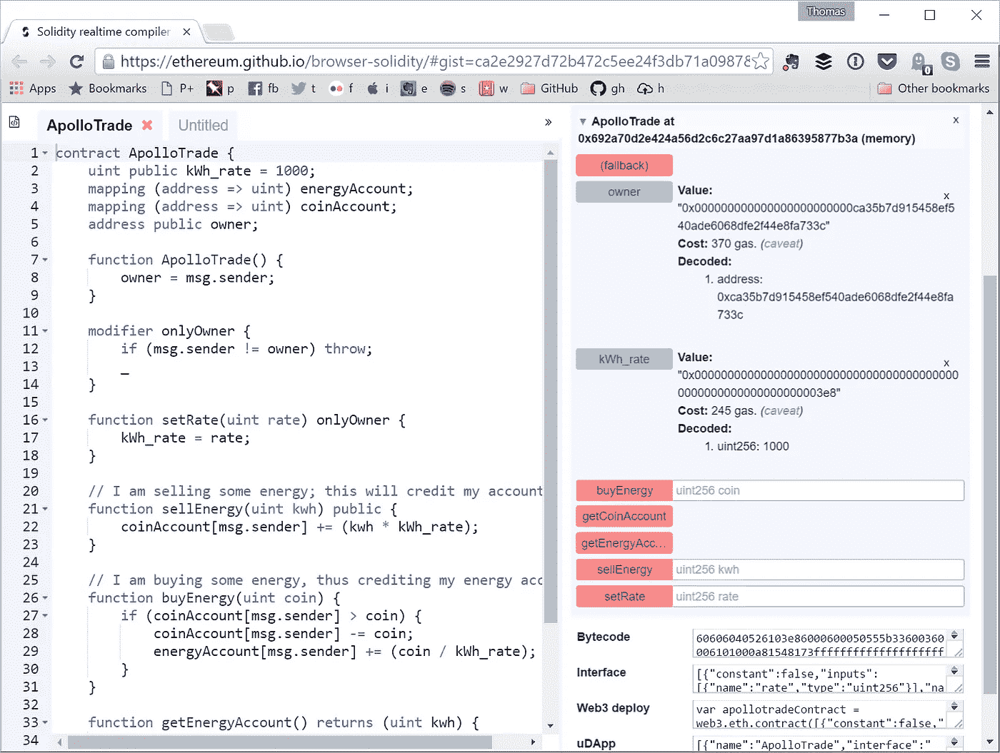

# 做自己的“X”——为什么区块链很重要

> 原文：<https://medium.com/hackernoon/be-your-own-x-why-blockchain-matters-4f07fe899992>

在加密推特上，你通常会遇到三种人。

1.  “区块链只是一项被夸大的技术。又慢又烂”
2.  “区块链只对比特币有利，对其他什么都没有。其他一切都是骗局。还有，聪是我的主和救世主”
3.  “区块链是计算领域的一次重大转变，而我们才刚刚开始”

我在第三阵营，我来告诉你为什么。

The market looks fine today, doesn’t it?

## 区块链重新定义数据托管

你听说过“做自己的银行”这句话吗？

这句话很好地概括了比特币的价值主张:你不需要银行，因为你有一个分散的网络，让你能够控制自己的钱。你，而不是其他人。

所以本质上，我们在讨论监护权的转移。

**银行- >你。**

但是如果我们看看**以太坊呢？**是什么？

以太坊的流行特色是“智能合约”。虽然“智能合同”的正式定义是由 Nick Zsabo 提出的，但我们不会深入研究语义。相反，我们将看看以太坊实际上做什么。

以太坊上的“智能契约”是一组函数的集合，它们可以做创造者编程让它们做的任何事情。本质上，它就像部署一个函数集合——一个 API。只有这个 API 是以**分散**的方式托管的。部署后，您可以从任何地方访问这些功能，并支付使用费。以太坊区块链然后管理网络上的状态——这些功能用来操作的信息。

Smart contract code — in the flesh

我们试着把比特币的口号运用到以太坊:**做自己的云提供商。**这是什么意思？

这意味着你可以在一个分散的云上托管代码。没人能关闭的代码。没人能审查的代码。没人能改变。您，部署者，是代码的唯一保管者。你不用付钱给谷歌或亚马逊来运行它。你付钱给矿工——分散网络中的独立参与者——来托管它，并执行计算操作。

## 这是控制的问题

那么，具有如此影响力的区块链的本质特征是什么呢？当您从集中式网络切换到分散式网络时，会发生什么变化？**保管**。**控制。所有权。选择。**

这个值钱吗？**是的！**

今天，你无法控制。你的数据被大公司垄断了。你不知道谁有它，谁可能黑了它，或者它卖给了谁。

有些人可能会说，这实际上很好。我们从科技巨头那里得到的服务是值得的。或许他们是对的。但是目前的趋势告诉我们，即使这样也可能是不可持续的。

看看脸书最近受到的各种指责。

难怪他们最近在寻找区块链的解决方案来帮助他们解决法律难题。让我们面对现实吧，作为超过 20 亿个账户+他们的私人数据的唯一托管人并不容易。将这一责任卸载给一个分散的网络并铸造一种本地加密货币来支付网络运营，这难道不是一个好主意吗？

这意味着脸书放弃对用户数据的监管。但这也意味着他们可以印刷自己的钱。这意味着他们承担更少的责任，但潜在的收入是一样的。

这里正等待着一个转变的发生。从集中到分散的平台。因为有道理所以必然。这对大公司来说是有意义的，因为没人想要扎克享受的审查。这对用户来说是有意义的，因为他们获得了在线数据的唯一所有权。

我认为这是一个何时而不是如果的问题。

## 但是什么时候？

今天，区块链的技术无疑是缓慢的，而且肯定没有准备好迎接黄金时代。到目前为止，主流采用的缺乏吸引了大量的巨魔，他们突袭任何敢于建立超出“比特币”有限范围的东西的项目。

但是这种转变何时会发生呢？一旦我们解决了当前的未决问题:

**区块链需要变得足够优秀，以便继续发展。这意味着:**

*   **区块链需要扩大规模。**比特币正随着闪电网络和其他第二层解决方案一起前进。以太坊正在研究股权证明、等离子和分片，以帮助加快网络速度。EOS 正在做…不管他们在做什么。这只是时间问题。
*   **各种区块链之间的互操作性需要成为现实。**区块链生态系统是多样而伟大的，但今天的每个区块链主要只是一个协议。一个非常低级的技术实体。对于开发者和用户来说，如果访问每个区块链的功能不需要一套独特的工具和应用程序(钱包、交易所)，我们的生活将变得简单得多。没有人想要为每一条链子或每一枚硬币都准备一个专用的钱包。没有人想为每一个分散的网络学习一种独特的编程语言。此外，更好的互操作性意味着新类型的跨链功能——跨链智能合约、原子互换和其他好处。
*   **优秀的开发人员工具:**一旦我们有了优秀的互操作性，我们还需要开发人员工具，使我们能够在各种分散协议的基础上进行构建。如果我们能利用现有分散网络的所有能力，我们就能构建出真正令人惊叹的分散应用。
*   **抚养权需要解决。**虽然迁移到分散式网络是件好事，但这只是意味着保护敏感信息(密码、私钥)的责任现在完全落在了用户身上。这是一颗难以下咽的药丸，但是密钥管理可以大大简化。为此，我们需要用户的自我主权身份和强大的私钥管理工具。

(嘶。我正在研究这些。查看[安全位](https://safebit.io)。

## 文字游戏

为了好玩，让我们玩“做你自己的 X”吧。只要我们在谈论分散的系统，我认为这个短语是适用的。

*   **ICOs？**做自己的投资银行
*   **分散身份？去中心化平台？去中心化的社交网络？做你自己的脸书/谷歌**
*   **智能合约？**成为自己的云提供商

还有吗？把它们写在下面的评论里。