# 光束搜索和注意文本摘要变得容易(教程 5)

> 原文：<https://medium.com/hackernoon/beam-search-attention-for-text-summarization-made-easy-tutorial-5-3b7186df7086>

本教程是一系列教程中的第五个，将帮助您使用 tensorflow 构建一个抽象的文本摘要器，今天我们将讨论对核心 RNN seq2seq 模型的一些有用的修改，我们在上一个教程中已经介绍过

这些修改是

1.  **光束搜索**
2.  **注意力模式**

## 关于系列

这是一系列教程，将帮助您使用 tensorflow 使用多种方法构建一个抽象的文本摘要器， ***您不需要下载数据，也不需要在您的设备*** 上本地运行代码，因为**数据**可以在 **google drive** 上找到，(您可以简单地将其复制到您的 google drive，在此了解更多，本系列的**代码**是用 Jupyter 编写的

到目前为止我们已经讨论过了(这个系列的代码可以在[这里](https://github.com/theamrzaki/text_summurization_abstractive_methods)找到)

0.[深度学习免费生态系统概述](https://hackernoon.com/begin-your-deep-learning-project-for-free-free-gpu-processing-free-storage-free-easy-upload-b4dba18abebc)(如何使用 google colab 和 google drive)

1.  [概述文本摘要任务和用于该任务的不同技术](https://hackernoon.com/text-summarizer-using-deep-learning-made-easy-490880df6cd)
2.  [使用的数据以及如何表示我们的任务](https://hackernoon.com/abstractive-text-summarization-tutorial-2-text-representation-made-very-easy-ef4511a1a46)
3.  [什么是 seq2seq 文本摘要，为什么](https://hackernoon.com/tutorial-3-what-is-seq2seq-for-text-summarization-and-why-68ebaa644db0)
4.  [多层双向 LSTM/GRU](/@theamrzaki/multilayer-bidirectional-lstm-gru-for-text-summarization-made-easy-tutorial-4-a63db108b44f)

所以让我们开始吧

EazyMind free Ai-As-a-service for text summarization

我在一个网站上添加了一个文本摘要模型 [eazymind](http://bit.ly/2VxhPqU) ，这样你就可以自己尝试生成你自己的摘要(看看你能构建什么)，它可以通过简单的 api 调用来调用，并且通过 [python 包](http://bit.ly/2Ef5XnS)，这样文本摘要就可以很容易地集成到你的应用程序中，而不需要设置 tensorflow 环境的麻烦，你可以免费注册，并享受免费使用这个 api 的乐趣。

# 快速回顾

我们的任务是文本摘要，我们称之为抽象，因为我们教神经网络生成单词，而不仅仅是复制单词。

将被使用的数据将是新闻和它们的标题，可以在我的 google drive 上找到，所以你只需将它复制到你的 google drive 上，而不需要下载它

我们将使用单词嵌入来表示数据，这只是简单地将每个单词转换成一个特定的向量，我们将为我们的单词创建一个字典([更多关于这个](https://hackernoon.com/abstractive-text-summarization-tutorial-2-text-representation-made-very-easy-ef4511a1a46))

对于这项任务，有[种不同的方法](https://hackernoon.com/begin-your-deep-learning-project-for-free-free-gpu-processing-free-storage-free-easy-upload-b4dba18abebc)，它们建立在一个基石概念之上，并且它们继续开发和建立，它们从一种称为 RNN 的网络开始，这种网络被安排在一种称为 seq2seq 的编码器/解码器架构中([更多关于此](https://hackernoon.com/tutorial-3-what-is-seq2seq-for-text-summarization-and-why-68ebaa644db0))，然后我们将在一个多层双向结构中建立 seq2seq，其中 rnn 小区将是一个 LSTM 小区([更多关于此](/@theamrzaki/multilayer-bidirectional-lstm-gru-for-text-summarization-made-easy-tutorial-4-a63db108b44f))，这些不同方法的代码可以在这里找到

> *本教程一直基于* ***吴君如****[*的惊人之作，他关于 RNN*](https://www.coursera.org/lecture/nlp-sequence-models/recurrent-neural-network-model-ftkzt) *的课程确实很有用，推荐你去看一下**

*T 今天，我们将对编码器/解码器模型的核心组件进行一些修改，这些修改有助于网络从不同的可能性池中选择最佳结果，这被称为**波束搜索**，我们还将讨论**注意力模型**，这是一个简单的网络，添加到我们的架构中，帮助它更多地关注特定的单词，以帮助它更好地输出摘要。*

*所以让我们开始吧！！*

# *1.波束搜索*

## *1.一种直觉(为什么要光束搜索)*

*我们的文本摘要任务可以看作是一个条件语言模型，这意味着我们在给定一个输入句子的情况下生成一个输出，因此输出是以输入句子为条件的，所以这就是为什么它被称为条件。*

*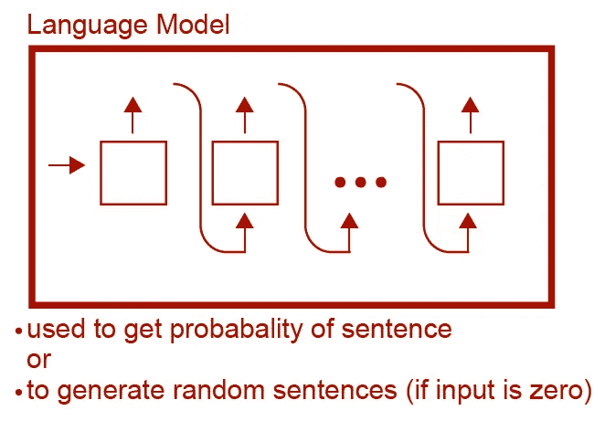*

*这可以被视为与简单的语言模型相反，因为正常的语言模型只输出某个句子的概率，这可以用于生成新颖的句子，(如果它的输入可以是零)，但在我们的情况下，它会选择给定输入句子的最可能的输出。*

*所以我们的架构实际上分为两个部分，一个编码器和一个解码器(就像这里讨论的)，因为编码器将输入句子表示为一个向量，并将其传递给架构的下一部分(解码器)*

*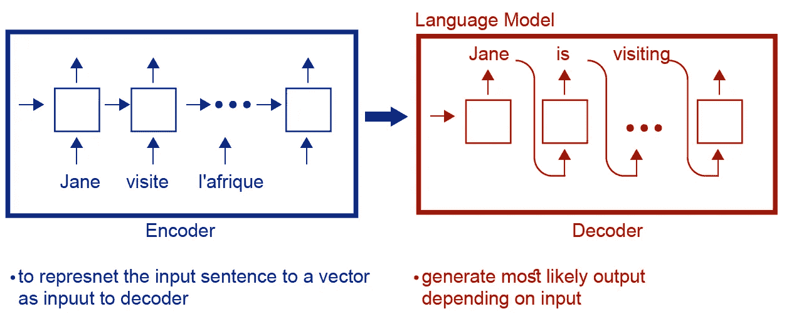*

*但是在解码器中会出现选择哪个句子的问题，因为对于某个输入句子可能有大量的输出*

**

*那么如何从这一大堆可能的输出中选择最有可能的句子呢？*

1.  *简将在九月访问非洲*
2.  *简将在九月访问非洲*
3.  *九月份简将访问非洲*

*一种解决方案是一次生成一个单词，生成第一个最可能的单词，然后生成下一个最可能的单词，如此等等，这被称为**贪婪搜索**，但这往往不是最佳的方法，原因有二*

1.  *实际上，贪婪搜索的表现并不好*
2.  *在每一步中，我们必须考虑字典中所有单词的所有可能性，如果你有 10k 个单词，那么在每一步中，你必须考虑 10k^ 10k (10k 的 10k 次方)*

*因此，我们将采用更优化的近似搜索方法 **→波束搜索***

## *1.如何进行波束搜索*

*现在我们已经了解了波束搜索背后的基本直觉，那么如何实际实现呢？*

*简单地说，波束搜索不同于基本的贪婪搜索**，它在每一步都考虑多个选项，而不仅仅是一个选项**，这些选项的数量由一个叫做**波束宽度**的变量控制*

*在贪婪搜索中:*

**

*在每一步中，我们只考虑每一步最可能的输出，但这并不总是保证最佳的解决方案*

**

*greedy search would output that the best solution is Jane is going , while Jane is visiting is better output*

*这是因为在“is”之后的单词“going”的概率大于在“is”之后的单词“visiting ”,所以这就是为什么我们需要考虑另一种方法而不是贪婪搜索，一种将多个单词考虑在内的方法*

*因此，在波束搜索中，它将是**(波束宽度=3)***

**

*在步骤 1 中，我们将选择 3 个最可能的单词，然后对于 3 个选择的单词中的每一个，我们将得到最可能的 3 个单词，然后在这 3 个输出句子上发生相同的逻辑，直到我们建立我们的最佳输出。*

*因此，如果我们的词汇是 10k，对于每一步，我们试图从 10k 词汇中寻找最有可能的单词，因此我们只考虑 30k 单词*

## *1.波束宽度的影响*

*当波束宽度= 3 时→每步考虑 3 个字*

*当波束宽度= 1 时→每步考虑 1 个字→贪婪搜索*

*随着波束宽度的增加→更好的结果→但是需要更多的计算资源*

# *2.注意力模型*

## *2.注意力直觉*

*当我们作为人类总结文本时，我们实际上一次只看几个词，而不是在给定的情况下总结整个文本，这是我们试图教给我们的模型的。*

*我们试图教会我们的模型只注意相邻的词而不是整篇文章，但是这种注意的作用是什么，我们其实也不知道！！这就是为什么我们要为这个任务构建一个简单的神经网络。*

## *2.注意力结构*

*在这里，我们将致力于我们的 seq2seq 编码器解码器结构([更多关于这个](https://hackernoon.com/tutorial-3-what-is-seq2seq-for-text-summarization-and-why-68ebaa644db0?source=post_stats_page---------------------------))，我们将致力于一个双向编码器([更多关于这个](/@theamrzaki/multilayer-bidirectional-lstm-gru-for-text-summarization-made-easy-tutorial-4-a63db108b44f))，我们的工作将实际上发生在编码器和解码器之间的一个新接口上，这个新接口被称为上下文向量，它实际上代表了给予单词的关注量*

*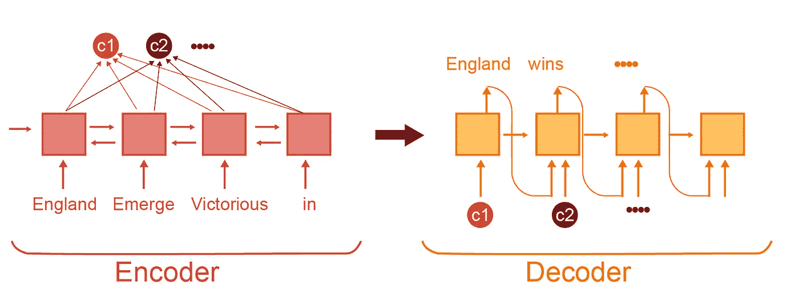*

*编码器应该是*

*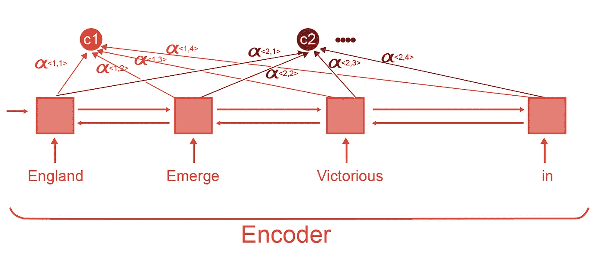**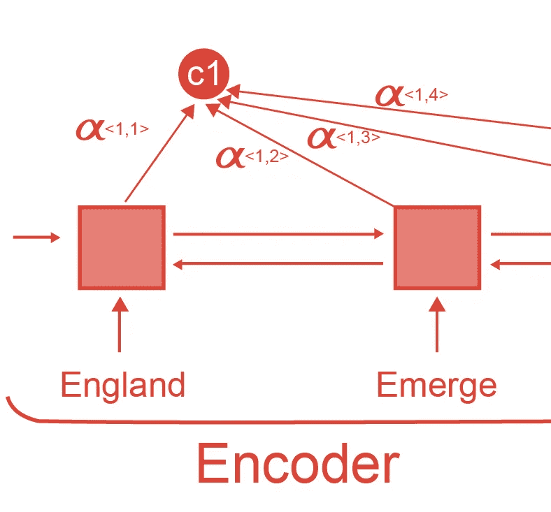*

*因此，为了计算作为解码器中第一个单词的输入的上下文 C1，我们将计算多个阿尔法参数，因此现在我们需要知道如何获得这些阿尔法参数*

## *2.计算注意力参数(上下文和 alpha)*

*既然我们已经通过上下文向量了解了编码器和解码器之间的接口，而上下文向量实际上是通过 attention alpha 参数计算的，那么我们需要知道更多关于如何计算的信息*

*首先:让我们来看看如何计算上下文向量*

*别忘了我们正在开发双向编码器，所以激活实际上分为左右两部分(更多关于这个的*

*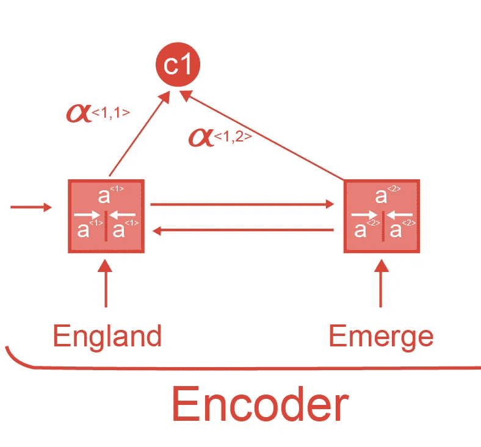**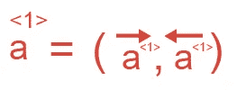*

*so the attention would be*

*所以注意力有左右两部分，形成每个细胞的激活参数*

*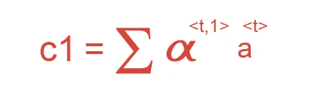*

*那么上下文将是激活的加权和(t 代表编码器中的单元数),其中权重是阿尔法参数，这将发生在每个上下文向量中*

***第二:**我们需要知道如何计算阿尔法本身*

*阿尔法群岛*

*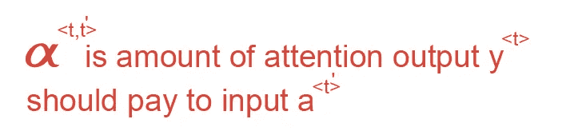*

> *t 代表输出中的时间步长，而 t '代表输入中的时间步长*
> 
> *所有阿尔法的和是 1*

*有一个公式确保总和为 1*

*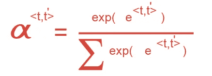*

*那么我们只需要知道什么是 e*

*凭直觉，我们可以说注意力实际上取决于*

1.  *当前激活的输入(alpha <t>)</t>*
2.  *解码器 (s < t-1 >)中最后一个时间步的**先前状态***

*但是我们实际上不知道它们之间的真实函数，所以**我们简单地建立一个简单的神经网络来为我们学习这个关系**。这个网络的输出将是“e”参数，该参数将用于计算α注意力参数*

*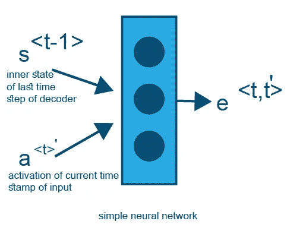*

*所以整个场景会是*

*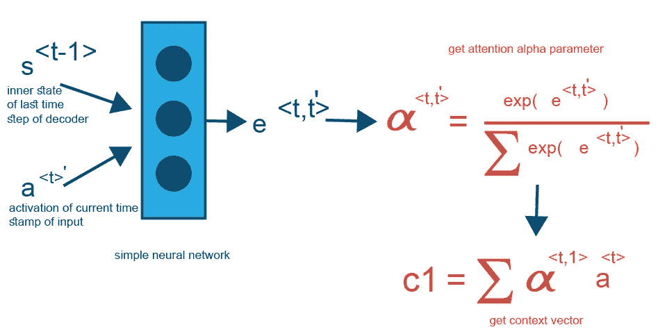*

*下一次，如果上帝愿意，我们将介绍如何真正实现一个文本摘要模型，我们将介绍实现[的步骤。这个模型](https://github.com/theamrzaki/text_summurization_abstractive_methods/blob/master/Implementation%20A%20(seq2seq%20with%20attention%20and%20feature%20rich%20representation)/Model%202/Model_2.ipynb)使用张量流中的波束搜索和注意力实现了一个多层双向 LSTM，代码来自[董军-李](https://github.com/dongjun-Lee/text-summarization-tensorflow)，我已经将其构建到 google colab 笔记本中，并将数据托管到 google drive， 这样你就不需要下载数据，也不需要在你的电脑上运行代码，你只需要在 google colab 上运行，并将 google colab 连接到你的 google drive 上。*

> **我真心希望你喜欢阅读本教程，我希望我已经把这些概念讲清楚了，这一系列教程的所有代码都可以在这里找到***，你可以简单地使用 google colab 来运行它，请查看教程并告诉我你对它的看法，希望再次见到你。***

# **后续教程**

*   **[在 Tensorflow 的 94 行中构建一个抽象的文本摘要器！！(教程 6)](http://bit.ly/2ZeEmvO)**
*   **[用于文本摘要的抽象的组合&提取方法(教程 7)](http://bit.ly/2EhcRIZ)**