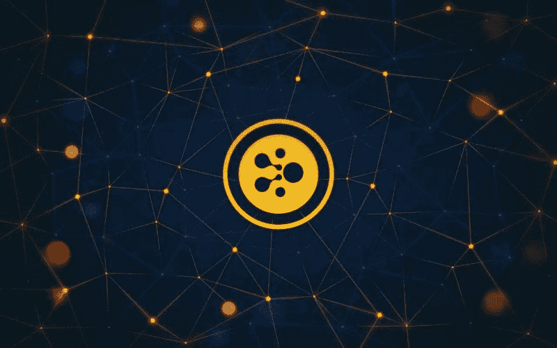
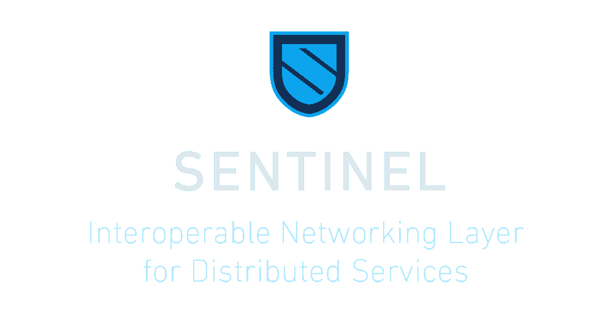
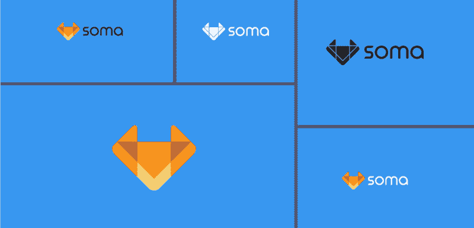
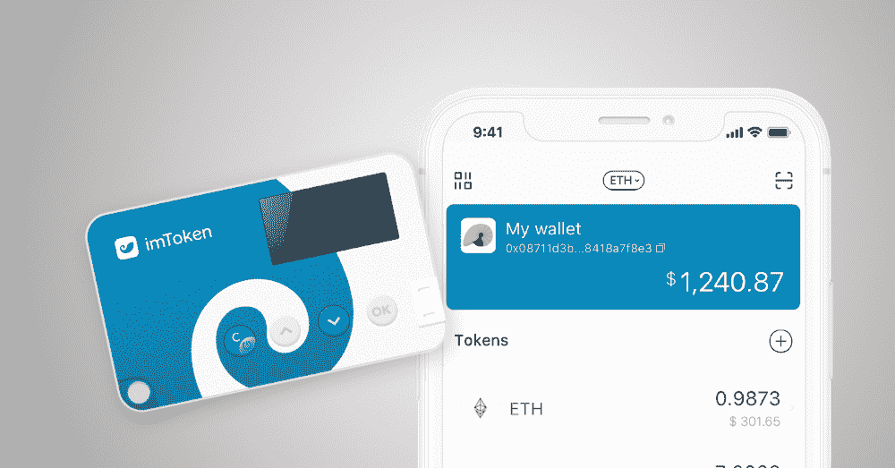

# 熊市或牛市——这些项目总是在变动中

> 原文：<https://medium.com/hackernoon/bear-or-bull-market-these-projects-are-always-on-the-move-d02450ddc378>

在熊市期间，我们看到许多承诺很高的项目失败了。但是，正如一句名言所说的那样“**艰难时期**造就坚强的**人”，**一些项目继续进展顺利，达到了设定的里程碑，发布了 MVP，启动了 Testnet 和 Mainnet，建立了合作伙伴关系和联盟等。

随着我们开始 2019 年的旅程，让我们看看一些不顾市场条件而推进的项目。

# Aelf

我跟踪的最活跃的项目之一是 Aelf (ELF)。评估加密项目进展的最佳方式之一是跟踪 GitHub 活动。2018 年，Aelf 在 GitHub [提交](https://www.cryptomiso.com/months_3.html#)方面排名前十。

总部设在新加坡，Aelf 是一个分散的云计算平台区块链网络，这是试图发展成为区块链专用的操作系统。据该团队称，“aelf 计划成为区块链的“Linux 系统”。

Aelf 将致力于解决区块链当前面临的三个核心问题。

*   **可扩展性**
*   **资源隔离**
*   **适应性强的治理模式**

为了解决当前区块链的上述问题，Aelf 引入了侧链来提高可扩展性，并引入了一个名为 DPOS 的独特治理系统来帮助解决该问题。

与依赖主链进行所有处理的传统区块链不同，Aelf 由主链和创新侧链组成，将用于运行智能合同。随着侧链的引入，网络不会拥塞，这将有助于网络有效地扩展。

侧链的另一个优点是交叉链相互作用。这意味着 Aelf 区块链将能够与外部区块链网络互动，如以太坊、比特币等，这有助于信息共享。

为了解决治理问题，Aelf 选择了委托利益证明流程。DPoS 在某种程度上类似于 PoS，但是具有不同的和更“民主”的特征，Aelf 认为它使之更加有效和公平。在 dpo 中，令牌持有者能够投票选举 block，或者我们可以说是矿工。选票按选民的股份加权，获得最多选票的区块是生产/开采区块的区块。

这一过程更加民主，使所有令牌持有者成为生态系统的一部分，治理更加顺畅。DPoS 也是环保的，因为电力不会像工作证明中那样被浪费，这意味着 Aelf 也关心环境。

## 2018 年的显著成就

⭐️**Aelf testnet 发布:【2018 年 8 月 8 日，aelf 开发团队公布了 [aelf testnet v1.0](/aelfblockchain/announcement-aelf-testnet-tps-data-release-14968-times-per-second-3d3bd37defe9) 的首批成果。最初的 testnet 实现了每秒 15，000 次交易(TPS)，这是公共链商业化应用的一个重要发展。这是 2018 年的重要里程碑，预计 mainnet 将于 2019 年推出。**

⭐️ **Aelf 创新联盟:**为了加速区块链的适应，区块链项目 Aelf 最近引入了创新联盟。除了 Aelf，创新联盟的其他成员还包括迈克尔·阿灵顿(TechCrunch 的创始人)、希格诺资本(总部位于新加坡的数字基金)、FBG 资本(亚洲区块链对冲基金)、罗兰·贝格(总部位于德国的战略咨询公司)和火币实验室(火币的区块链孵化部门)。

# 泰佐斯(XTZ)

Tezos 于 2017 年 7 月 14 日作为 ico 推出，筹集了约 2.32 亿美元。该项目由亚瑟和凯瑟琳·布雷特曼共同创建。2017 年对 Tezoz 来说是动荡的一年，经历了联合创始人亚瑟和凯瑟琳·布雷特曼与前总裁兼董事会成员约翰·格弗斯之间的权力斗争。由于令牌发放的延迟，它还面临着心怀不满的 ICO 参与者的集体诉讼。

泰佐斯是一个可以通过自我升级而进化的区块链。利益攸关方对议定书的修正案进行表决，包括对表决程序本身的修正案，以就提案达成社会共识。Tezos 支持智能合约，并提供了一个构建分散应用程序的平台。

Tezos 类似于以太坊，但没有以太坊的缺点。Tezis 的计算强度要低得多，需要更少的能量来挖掘(烘焙)Tezos 定义的它们，仍然保持可靠的 PoS 共识机制(DPoS)。

Tezos 最大的特点之一是它的自动升级功能，这使得它在其他区块链中脱颖而出。它允许区块链进化和改进，而不需要复杂的升级或硬分叉

## 2018 年的显著成就

⭐️**Tezos Mainnet 发布:2018 年 9 月 7 日，tezos mainnet 发布**

# 哨兵(已发送)

提交超过 1200 次，是 2018 年最活跃的项目之一。

根据他们的官方媒体渠道

> Sentinel Network 是一个网络层，支持真正的 p2p 和分散式应用和资源市场。Sentinel 使任何人都能够创建公共和私有网络，提供免费和受激励以及支付方式不可知(预付费/托管/后付费)服务(dApps)和分布式资源的访问，使其客户能够成为网络中的生产者和消费者。
> 
> Sentinel 利用直接来自 Tendermint core 和 Cosmos SDK 的锁定、锁定和多重签名，旨在完全消除上一代协议的缺点，这些协议由于与其他 dApps 共享的区块链的限制而无法扩展，或者具有不可持续的经济模式，降低了可用性或对其提供的产品的访问。

简单来说，Sentinel 就是一个点对点的 dVPN 网络。它有助于为人们提供克服互联网限制的工具，从而让他们进入自由世界。与其他仅提供 VPN 服务的项目不同，SENT 提供主要的 VPN 服务以及其他有用的服务，如 dChat、dVOIP、dDNS 等。

## 2018 年的显著成就

⭐️Sentinel Tendermint 测试网与 dVPN 桌面应用程序一起运行

⭐️Sentrix — dChat & dVoIP

带 Metalyfe 浏览器的⭐️Partnership

# 身体

Soma 是一个革命性的去中心化平台，它通过区块链技术和本地加密货币(Soma Community Token，或 SCT)在 Soma 社区内实现流动性，从而促进贸易和社交互动。通过解除价值链的中介，买方和卖方可以实现更大的利润。与此同时，创新的奖励系统激励有益的合作，并确保增值服务得到补偿——雅各布·安德拉，CMO @索玛

简而言之，SOMA 是无可争议的“第一个”分散市场，在这里卖家和买家可以安全可靠地相互交易。不像传统的在线购物门户依赖于产品评论或评级(其中大部分是假货)，SOMA 利用了良好的社交互动因素(喜欢、分享等)。)来帮助买家做出决策，并向他提供真实的反馈。

对于参与平台的用户，SOMA 鼓励并奖励他们 SOMA 令牌(SCT)。由于所有的互动都是有偿的，这将有助于创造更多的用户参与，从而有助于产品接触更多的受众。SOMA 奖励系统还将积极参与者视为向目标受众推广产品的核心要素，并作为托管代理来保护所有交易。

## 2018 年的显著成就

⭐️从芬兰商业银行获得了价值 5 万€的第一轮资助，

⭐️宜家孵化器训练营

⭐️与领先制表商合作

# imToken

imToken 是一个数字资产钱包，是目前市场上最简单但功能丰富的钱包之一。仅在两年前推出，它迅速俘获了全世界加密爱好者的心。它是由 ConSen Labs 开发的，目前有来自大约 200 个国家的数百万用户使用。

imToken 支持多令牌，包括以太网、BTC、EOS 等。它还具有 DApp 浏览器、内置交换(Tokenlon)、离线签名等功能。

## 2018 年的显著成就

⭐️推出 imToken 2.0

⭐️从 IDG 资本获得了 1000 万美元的资助

⭐️推出 imKey Cold wallet(预计 2019 年 3 月发货)。

总之，上述项目很快就有了巨大的承诺，不管市场条件如何艰难。*本文无意作为投资建议。一如既往的 DYOR。*