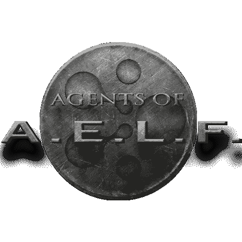
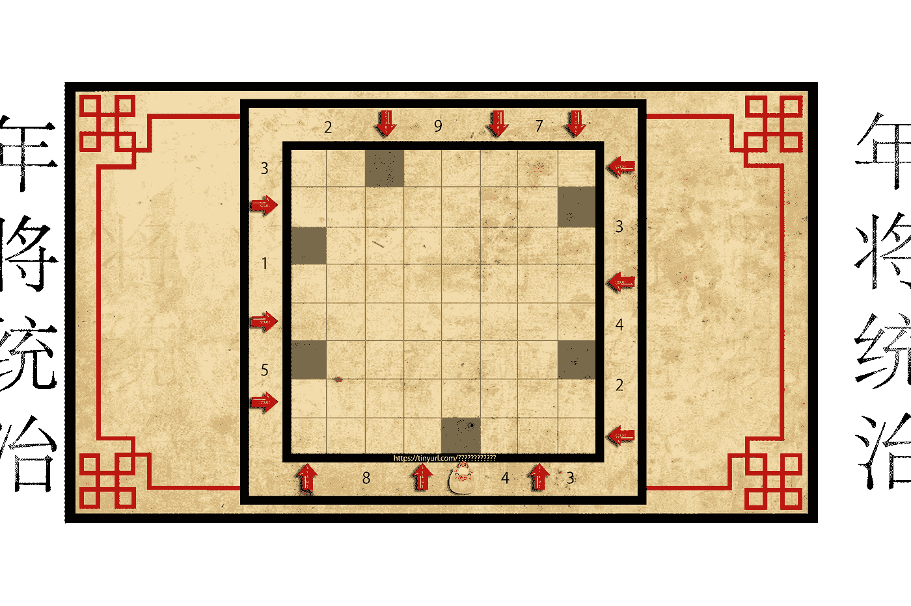
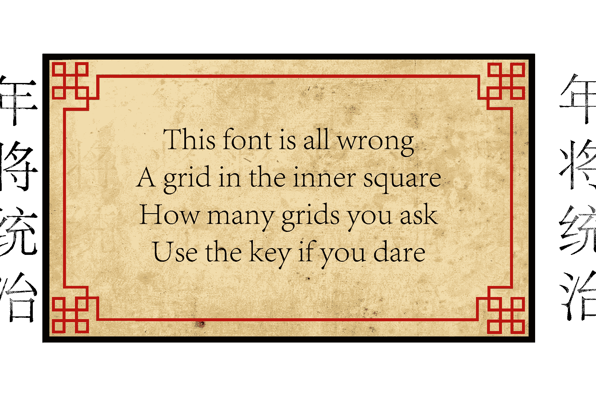

# 击败老板游戏系列(现场)

> 原文：<https://medium.com/hackernoon/beat-the-boss-game-series-live-15547dcabded>

在过去的 3 个月里，我们举办了一系列名为
***‘击败老板’的社区活动。***

*该活动使用了多个平台，包括 telegram、reddit、medium、twitter 和 youtube。这些活动由两部分组成，迷你拼图和老板琐事。迷你谜题是用来发布情报和奖励的，而 Boss trivia 是我们与 Boss 战斗获得更大奖励的地方。*

*下面你会按时间顺序找到所有最新内容，包括所有当前谜题&可用奖励。*

***当前谜题:*** [念的宝藏——谜题 2.8](/aelfblockchain/beat-the-boss-nians-treasure-trove-d06c8d525064)

***仍有奖励:*** [年纵横字谜 2.5](/aelfblockchain/beat-the-boss-nian-puzzle-2-3-fc555501fb4f)

***线索:*** *结合拼图 2.8* 使用这些

Nian’s Treasure Trove — Clue 1

线索将在每周一晚上公布

# AELF 特工

Aelf 成立于一年前，当时 aelf 的创始人发现了区块链 3.0 的种子“Seed 3.0”(seed3p 0)。从那以后，aelf 核心团队一直在培育这颗种子，让它开花结果。许多人认为已经发现了这种种子，却发现它们是过时的区块链 2.0 的变种。但是我们相信我们已经发现了真正的种子。自从真正的种子被培育的消息传到公众领域，谣言就像野火一样传播，从种子是一个人，到种子是圣杯，拥有它的人将获得永生。由于这些过分美化的谣言，许多人是 aelf 的敌人，他们会不择手段地寻求拥有“Seed3.0”。

并由此形成了 A.E.L.F. 的 ***代理商。***

你们，我们最新招募的成员，已经加入了誓死保护“Seed3.0”和 aelf 网络的特工队伍，aelf 网络是为培育种子而创建的。

aelf 的特工在全球范围内运作，在世界各大洲都有特工。我们是一个积极主动的机构，我们是一个强大的机构，一股不可忽视的力量。我们不仅保护自己和种子，而且我们根据英特尔采取行动，先发制人地打击那些为了自己的利益而寻找种子的人。

这项技术不会落入坏人之手，它的威力超乎想象，如果被贪婪和自大所驱使的人所利用，它可能是这个世界上最具破坏性的力量。aelf 生态系统几乎已经完成，Seed 3.0 的培育也已经完成，在短短的几个月内，我们的工作将会完成，Seed 将会发展成为一个自我维持的生态系统，即使是最强的敌人也无法阻止。它将为世界带来区块链 3.0，人类将再次高枕无忧。

# 重要的

你的角色: ***主动代理***

作为这一领域的代理人，你将被指派完成一些任务，这些任务不仅要保护 seed 和自身，还要保护更广泛的公众。你必须认真对待这个责任，错误是不能容忍的。我们将尽我们所能提供任何需要的支持。总部将是一个你可以随时寻求帮助和建议的地方。你将永远装备着完成任务所需的工具。

## 地点:去哪里

[***AELF 师部***](https://mappopk.wixsite.com/beattheboss)

虽然你们，我们的代理人，遍布全球，但总部将永远为你们服务。它将永远不会超过一个点击之外，是开放的白天或夜晚。如果你需要帮助，这应该是你的第一个停靠港。

***【AELF 议器(添加)***

aelf 的每个特工都将得到一个特殊的装置，他们可以通过这个装置联系其他特工以及被称为“MODs”的精英卫队。在这里，你可以为了所有人的利益与他人交谈。可能会有一些重要的线索在这个空间被分享，所以确保你积极地监控这里的所有活动。

## 工具

战场可能会因敌人、分配的任务或手头的工具而有很大的不同。我们发现，在这些战斗中，您通常会在特定位置找到有用的工具或信息:

***AELF 图书馆***

在这里，你可以找到从 aelf 核心团队一直追溯到古代第一代人的文本，他们培育了第一个“种子 1.0”，被称为比特币。在这些文本中，你会找到击败任何对手所需的线索。

***AELF 留言板***
随着新闻的发展，或者新的信息被发现，你会第一时间在 AELF 留言板上听说。这是一个张贴在 aelf 大楼前的公告板。由于其中一些作业的敏感性，你可能需要破译一些线索，因为它们可能会被秘密共享。

***AELF 笔下的池意象***

游泳池位于街对面的公园里。如果你认为你可能走错了路，不要紧张。这个池子的神奇之处在于，如果你是 aelf 的代理，无论你在哪里，它都会一直在街对面。从表面上看，这个水池就像任何其他有着令人兴奋的图像的图像池一样，但是你看得越深，你就会发现更多的洞察力。在这个水池的深处，你会发现对你的任务非常有价值的视觉宝石。确保你偶尔花些时间钻研这个池子。

***《AELF 书》没有名字，却有许多面孔***

这本书是每个特工都有的，你会在里面找到空白页。空白，直到有你将需要知道的信息，然后它将被写在这些页中供你快速参考。地点、时间和名字只是你可能会发现出现在这些神秘页面上的一些关键信息。

## 抢劫

当你冒险进行这些任务时，毫无疑问会有一些有价值的东西出现在你面前。Aelf 对这些不感兴趣，只要它们不干扰手头的任务，你可以保留任何奖励。不过，它们需要向总部申报，因为这些通常可以用来跟踪特定任务的成功。

祝你好运…探员

## 系列 0

**(10 月 12 日)Boss 1 Bio — Mappo** —这是对我们所有特工的一次测试，以确保你达到标准，有能力击败任何试图扰乱美国航空和航天联合会和我们特工的恶棍。

[**(10 月 26 日)Boss 2 Bio——朱里安·周博士**](/aelfblockchain/beat-the-boss-trivia-version-2-c461f3f7a61a)——朱里安·周博士在过去 4 年的探索中找到了自己。Aelf 拥有最纯净和原始的 Merkle 树根资源，保存在地下实验室的主保险柜里，必须不惜一切代价保护它！

在我们的侦察报告中，我们发现周博士的克星是琐事。我们用琐事开发了一个防御系统，但我们需要所有人来操作它，确保 Choo 博士无法突破。如果博士得到了 Merkle 树根，我们所知道的所有区块链技术都将不复存在。

[**(11 月 8 日)Boss 3 Bio—Moud 将军**](/aelfblockchain/beat-the-boss-trivia-boss-bio-3-b02555f40d71)—Moud 将军制定了一个阴险的方案，需要 ***Seed3.0*** (区块链 3.0 的源码，目前由 aelf 持有)作为最终组件。当他在美国*时，发现它的消息传到他的耳朵里，所有其他优先考虑的事情都不复存在，这是他从此的唯一目的。*

*现在他已经到了艾尔夫，正在用他的军队来攻破我们的大门。作为 aelf 的潜在特工，你的任务是尽一切可能阻止他。他认为他对所有的研究都很有知识，但是我们应该利用我们的琐事防御系统(TDS)来利用他的知识！*

*[**(11 月 22 日)特别感恩节老板 4 —柴火火鸡**](/aelfblockchain/beat-the-boss-trivia-boss-bio-4-499f81d9c33f) —使用电话簿，名单上的第一家公司当然是…*

*AAA 汽车维修(你以为我会说 aelf 不是吗！).好吧，这是一个短期的工作，用一些蛮力和橡皮擦，他把他们的名字从历史(和电话簿)中删除了。所以他周游世界进行他的十字军东征，直到他扭曲的火鸡大脑把他带到了一个 elf 总部。*

## *系列 1*

***红色警戒红色警戒***

*在空军总部发现了安全漏洞！！！！所有进一步的情报将以加密格式提供。*

*[第一次沟通——谜题 1.1](https://www.reddit.com/r/aelfofficial/comments/a1px11/agents_of_aelfcommunicaiton_compromised/)*

*[代理 Aelfonzo 更新—谜题 1.2](https://www.reddit.com/r/aelfofficial/comments/a2n289/agents_of_aelfwhisper_protocol_update/)*

*[特工 Aelfonzo 在行动中失踪(MIA)——谜题 1.3](https://www.reddit.com/r/aelfofficial/comments/a3as0y/agents_of_aelffinal_message_by_agent_aelfonzo/)*

*《老板 5》传记——阿什利·摩根小姐——(见上面的谜题)*

*[阿什莉·摩根小姐的神秘案件(大奖)——谜题 1.4](/aelfblockchain/aelf-major-puzzle-1b7484ba589c)*

## *2a 系列*

*在摩根小姐的箱子里，我们发现了一份特殊的文件，这份文件让我们相信年和他的手下参与了绑架艾尔冯佐探员*

**

*[打字机测试—难题 2.1](https://twitter.com/mappopk_crypto/status/1084758798219132928)*

*[年的二把手——谜题 2.2](/aelfblockchain/beat-the-boss-nian-puzzle-1-2-866c85e7aab5)*

***(1 月 18 日)Boss 6 Bio——r nzhībǎobèI**——(见以上谜题)*

## *2b 系列*

*在抓获 rn zh b obèI 和一些严肃的审讯之后，我们设法收集了一些重要的情报。*

*[询问板—谜题 2.3](/aelfblockchain/beat-the-boss-interrogation-room-a67574b06ea3)*

*接下来是哪个位置？—谜题 2.4*

*[年纵横字谜—字谜 2.5](/aelfblockchain/beat-the-boss-nian-puzzle-2-3-fc555501fb4f) ***(仍有奖励)****

*[白皮书有什么问题？—谜题 2.6](/aelfblockchain/beat-the-boss-nian-puzzle-2-4-fd91862b4f36)*

*给我唱你最喜欢的歌？—谜题 2.7*