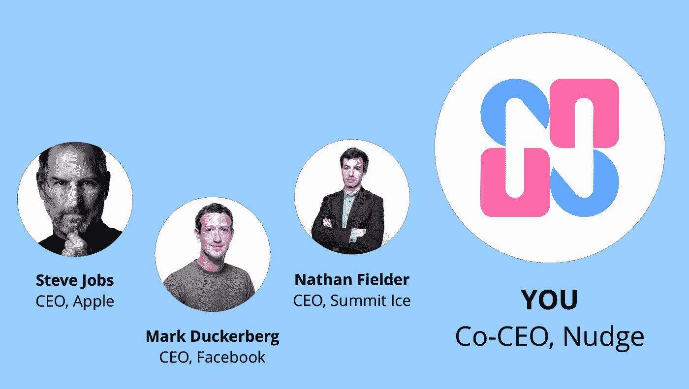

# 成为这个性感创业公司的首席执行官，每月仅 1 美元

> 原文：<https://medium.com/hackernoon/become-ceo-of-this-sexy-startup-for-just-1-a-month-6f3db6828410>

## 一个让你的 LinkedIn 不那么无聊的独特机会

## 人类历史上第一次，你每月只需支付 1 美元，就可以成为现实生活中的科技创业公司的首席执行官。

再见，公司的走狗。你好，首席执行官。

嗨，我叫路易斯。我是帮助你控制上网时间的科技创业公司 [Nudge](http://bit.ly/2gFsVrf) 的创始人。

每天有 1800 人使用微移来做一些事情，比如[默认关闭令人上瘾的网站](/@louisbarclay/welcome-to-the-new-version-of-nudge-d65b2c0e56c8)，完全删除他们的脸书新闻订阅等等。在 Chrome 网上商店上，Nudge 的星级是 4.7 分，任何人都可以完全免费使用。

不幸的是，免费使用的模式意味着 Nudge 并没有带来大笔收入，所以我没有钱来让它变得更好。

这就是为什么我采取了前所未有的步骤，向任何愿意付费的人开放我们的高级领导团队，特别是联席首席执行官的角色。

这是人类历史上第一次有人将 CEO 的角色进行大众营销。我知道这一点，因为我花了 15-20 秒谷歌了一下。

也许这足以让你逛到 PayPal 并订阅成为一名轻推高管。

但是如果你仍然需要说服，这里有更多的理由:

*   你在 LinkedIn 上的个人资料会变得更性感 5%,更令人讨厌 12%
*   像大多数首席执行官一样，你不需要知道公司实际上做什么
*   Nudge 最近在 B 轮投资中筹集了 1560 万美元
*   你将资助一个工具，反击窃取我们时间和数据的科技巨头

## 还有呢！

如果你购买联席首席执行官的职位，我会通过电子邮件向你发送一份完全可打印的证书*:

The certificate is fully printable

**很遗憾，由于复杂的技术限制，我无法在向您发送证书之前将“您的姓名”更改为您的姓名。*

以下是 Nudge 的组织结构，展示了一旦你付费，你将如何融入其中:

Technically you’ll be senior to me (which means nothing in reality)

## 会议室见

请务必尽快订阅，因为如果我们达到 70 亿联合首席执行官的最大容量，PayPal 可能会要求我取消订阅链接。

如果你想给这篇文章打 50 分，就给这篇文章打 50 分。

## 如何成为 Nudge 的联合首席执行官:

*   通过 PayPal 付款[这里](https://goo.gl/uvfBqT)
*   在你的 LinkedIn 上添加“Nudge 的联合首席执行官”,并描述 Nudge 的作用，这样人们就会对你令人难以置信的新工作印象深刻
*   可选:买几辆兰博基尼

## 如何免费下载 Nudge 并减少使用令人上瘾的网站:

*   去[这里](http://bit.ly/2gFsVrf)
*   要删除你的脸书新闻订阅源:安装闪屏振动，加载脸书，刷新页面，你应该会在顶部看到“删除你的新闻订阅源”(试试吧——我保证这很爽)

## 如何为 Nudge 的开源代码库做出贡献:

*   点击这里在 GitHub [上找到闪屏并提交一个拉取请求](https://github.com/lgwb89/nudge)