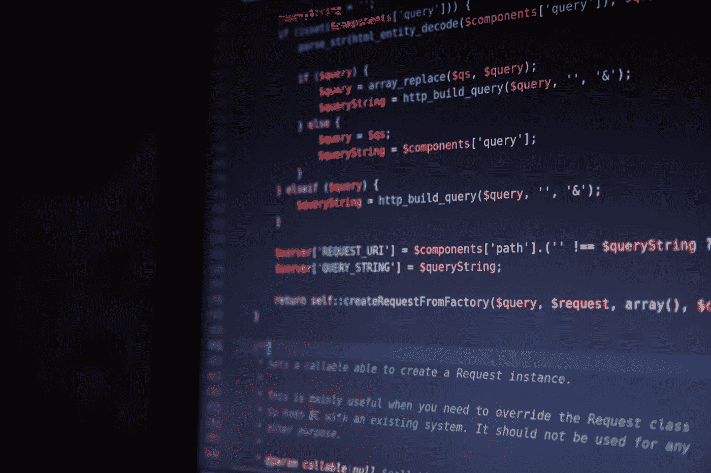
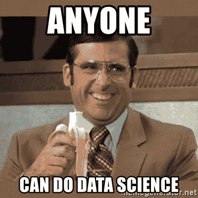
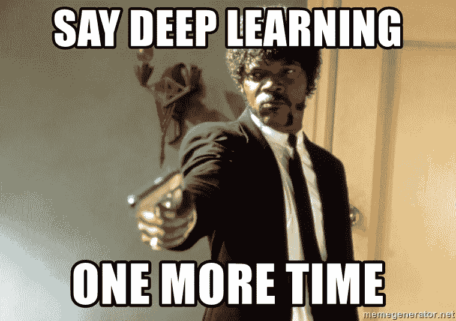

# 数据科学初学者指南

> 原文：<https://medium.com/hackernoon/beginners-guide-for-data-science-388a2ceab93d>

## 2020 年数据科学和深度学习入门资源精选列表

Photo by [Henri L.](https://unsplash.com/photos/CHt4BMi0-Is?utm_source=unsplash&utm_medium=referral&utm_content=creditCopyText) on [Unsplash](https://unsplash.com/search/photos/data-analytics?utm_source=unsplash&utm_medium=referral&utm_content=creditCopyText)

无论是机械行业还是汽车行业，几乎所有的公司都在采用数据科学。

据 [Glassdoor](https://www.google.com/url?sa=t&rct=j&q=&esrc=s&source=web&cd=6&cad=rja&uact=8&ved=2ahUKEwid2JPPlcXfAhUo9YMKHaIDC6EQFjAFegQICRAB&url=https%3A%2F%2Fwww.forbes.com%2Fsites%2Flouiscolumbus%2F2018%2F01%2F29%2Fdata-scientist-is-the-best-job-in-america-according-glassdoors-2018-rankings%2F&usg=AOvVaw2RDrP8iTYAsmd0V-ITRS0m) 报道，数据科学家是 2018 年美国最好的工作，底薪中位数为 11 万美元。然而，数据科学也存在巨大的技能缺口。

如果在学习过程中给予适当的时间和精力，成为一名数据科学家并不困难。然而，我经常发现人们尝试不同的课程和资源，但仍然无法学习

Photo by [Tim Gouw](https://unsplash.com/photos/1K9T5YiZ2WU?utm_source=unsplash&utm_medium=referral&utm_content=creditCopyText) on [Unsplash](https://unsplash.com/search/photos/machine-learning?utm_source=unsplash&utm_medium=referral&utm_content=creditCopyText)

我从事数据科学已经 2 年了，我尝试了一些课程/资源，所以这里有一个入门建议列表:

# 数据科学

数据科学入门课程有很多付费和免费课程/mooc，因此选择一门变得很困难。

**1。Python 应用数据科学**

数据科学入门的第二个最佳资源是 Coursera 的“**应用数据科学与 Python** ”。

 [## 应用数据科学与 Python | Coursera

### 密歇根大学专业的 5 门课程通过 python 向学习者介绍了数据科学

www.coursera.org](https://www.coursera.org/specializations/data-science-python) 

这个专业包含 4 门课程**从 Python 基础开始，然后学习数据科学所需的统计学。**

然后，它涵盖了使用 Python 中的 matplotlib 等库的各种可视化技术，机器学习的基础，在最后的课程中，它涵盖了自然语言处理的基础。

如果您选择“*审核本课程*”，则可以免费获得该专业。然而，要获得证书，你必须申请财政援助或者向 coursera 支付 50 美元的订阅费。

# 机器学习

来自 *coursera* 的“*应用数据科学与 Python* ”涵盖了专业化的机器学习，然而，如果你想深入研究机器学习算法及其背后的数学，还有另一个名为 [fast.ai](https://course.fast.ai/ml.html) 的免费资源

 [## 面向程序员的机器学习——24 小时免费课程

### fast.ai 面向编码员的实用机器学习 MOOC。学习随机森林，逻辑回归，梯度下降，自然语言处理，推荐系统…

course.fast.ai/](https://course.fast.ai/ml.html) 

这门课程由人工智能研究员(也是前总统卡格尔))**教授，是旧金山大学[数据科学硕士](https://www.usfca.edu/arts-sciences/graduate-programs/data-science)项目的一部分。**

# ****深度学习****

****

**此外，对于深度学习，有很多课程可以教你应用深度学习算法，并在几行代码内获得最先进的结果。**

**应用这些算法并得到结果感觉很棒，但人们必须知道它们是如何工作的，而不是将这些算法视为一个黑盒。**

1.  ****深度学习专业化****

**这个专业是由伟大的**吴恩达教授的。****

** [## 深度学习| Coursera

### 来自 deeplearning.ai 的深度学习如果你想打入 ai，这个专精会帮你做到。深…

www.coursera.org](https://www.coursera.org/specializations/deep-learning) 

本课程面向初学者，只需要基本的 Python、线性代数和微积分知识。

算法是从零开始教授的，这是开始深度学习的资源。

Daniel Bourke 在他的 YouTube 频道上对这门课有一个很好的评论，如果你想看的话，这里有一段视频:

**2。fast.ai**

 [## 面向程序员的深度学习——36 小时免费课程

### fast.ai 面向编码员的实用深度学习 MOOC。学习 CNN，RNNs，计算机视觉，NLP，推荐系统…

course.fast.ai](https://course.fast.ai/index.html) 

这是由**杰瑞米·霍华德(前副总裁，Kaggle)教授的。**

这是深度学习最丰富最全面的课程。它涵盖了算法的所有方面。

这门课是在 PyTorch 包装器 fastai 库的帮助下教授的，它有一个很棒的社区，可以在你遇到的每一个障碍时帮助你！

**3。PyTorch 深度学习简介**

 [## PyTorch 深度学习简介| Udacity

### 学习深度学习的基础知识，并使用 PyTorch 实现自己的深度神经网络

www.udacity.com](https://www.udacity.com/course/deep-learning-pytorch--ud188) 

最近，脸书发布了 PyTorch 1.0 stable，它能够充分利用你的 gpu 能力来训练模型，因为它基于基本的数据结构张量。

Udacity 与 Factbook 合作推出了免费的深度学习课程。他们从神经网络的基础开始，然后使用 PyTorch 实现各种深度学习算法。

# **杂项数据科学资源:**

除了参加 MOOCs，你还可以通过以下链接随时了解最新趋势:

 [## 科技中的数据科学-黑客正午

### 数据科学是一个跨学科的领域，使用科学的方法，过程，算法和系统来提取…

hackernoon.com](https://hackernoon.com/data-science/home) 

**Youtube** :

 [## 西拉伊·拉瓦尔

### 我是西拉杰。我正在为激励和教育开发人员构建人工智能而奋斗。游戏、音乐、聊天机器人…

www.youtube.com](https://www.youtube.com/channel/UCWN3xxRkmTPmbKwht9FuE5A)  [## 莱克斯·弗里德曼

### 探索人工智能、深度学习、自动驾驶汽车等研究主题的视频。

www.youtube.com](https://www.youtube.com/lexfridman)  [## 3 蓝色 1 棕色

### 格兰特·桑德森的《3blue1brown》是数学和娱乐的结合，这取决于你的喜好。目标是…

www.youtube.com](https://www.youtube.com/channel/UCYO_jab_esuFRV4b17AJtAw)  [## 丹尼尔·伯克

### 你好，世界！很高兴见到大家。我上传关于健身、营养、技术和其他我正在做的实验的视频…

www.youtube.com](https://www.youtube.com/channel/UCr8O8l5cCX85Oem1d18EezQ) 

**出版物:**

 [## 走向数据科学

### 分享概念、想法和代码。

towardsdatascience.com](https://towardsdatascience.com)  [## 成为人类:人工智能杂志

### 关于人工智能、机器学习、深度学习、大数据及其含义的最新新闻、信息和教程…

becominghuman.ai](https://becominghuman.ai)  [## 机器学习

### 了解机器学习和人工智能将如何改变你的工作和生活。

machinelearnings.co](https://machinelearnings.co) 

## 媒体出版物

 [## ML 评论

### 来自机器学习研究、项目和学习材料的亮点。从和为 ML 科学家，工程师和…

medium.com](https://medium.com/mlreview)  [## 分析 Vidhya

### 分析 Vidhya 是一个由分析和数据科学专业人士组成的社区。我们正在构建下一代数据科学…

medium.com](https://medium.com/analytics-vidhya)  [## 应用数据科学

### 前沿数据科学新闻和项目

medium.com](https://medium.com/applied-data-science) 

**备注:**

 [## 克里斯·阿尔邦

### 我是一名数据科学家和机器学习工程师，有十年应用统计学习的经验…

chrisalbon.com](https://chrisalbon.com/) 

法维奥·巴斯克斯的备忘单:

 [## FavioVazquez/ds-cheatsheets

### 统治世界的数据科学清单- FavioVazquez/ds-cheatsheets

github.com](https://github.com/FavioVazquez/ds-cheatsheets) 

同样，这些是建议。你可以使用任何资源在这个领域开始。不要只是完成这些 MOOCs，开发一些**真实世界的项目**来测试你的技能，使用 [Kaggle](http://kaggle.com) 上可用的数据集或者创建你自己的数据集，因为实现它们会让你了解工具和库是如何工作的。

> 快乐学习！

 [## 科技中的数据科学-黑客正午

### 数据科学是一个跨学科的领域，使用科学的方法，过程，算法和系统来提取…

hackernoon.com](https://hackernoon.com/data-science/home)**