# BEM 不应该存在

> 原文：<https://medium.com/hackernoon/bem-should-not-exist-6414005765d6>

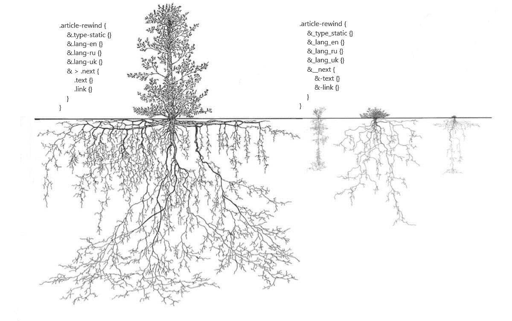

有很多理由不使用这种方法，但由于它的简单性和对 HTML 和 CSS 工作的误解，这种方法已经在全世界的前端开发人员中广泛传播；大多数情况下是来自独联体国家的开发者。BEM 现在用于大型俄语项目( [Yandex](http://yandex.ru) 、 [Habr](http://habr.com) )和几个框架( [react-md](https://github.com/mlaursen/react-md) )中。在本文中，将对这种开发方法的优缺点进行详细的回顾。所有的例子都将在 BEM 官方网站上展示。

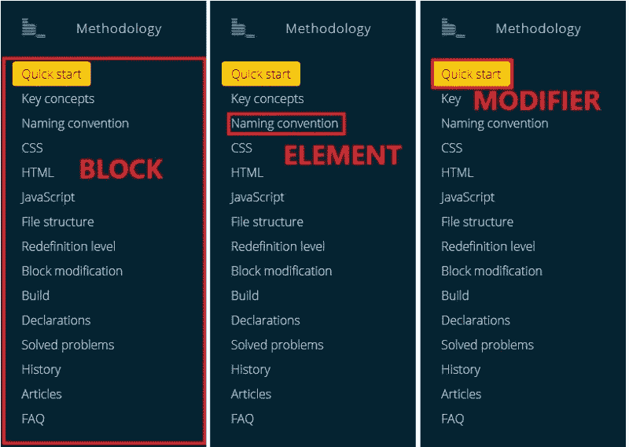

缩写“**BEM**”—块/元素/修饰符。每一个设计或布局都可以在视觉上被分割成块，比如侧边栏。每个块可以包含一个或几个元素。元素可以有状态的修饰符(活动的，禁用的)，
用于改变边框、宽度、颜色等的附加类。将设计分成可视块的想法并不新鲜，BEM 提供的是使类名更长，总是使元素依赖于块标题，并全局声明所有类。这实际上毫无帮助，并导致项目标记的可悲后果。以下是边界元法使用中的所有问题:

# 不可读的 HTML

这是来自 BEM 官方网站的标记。冗长且类似 PHP 的名称类使得任何混有属性的标记都不可读:

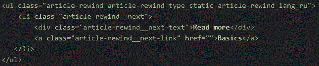

下面显示的标记是一个在类名中没有继承
的例子，父块的标题，修饰符通过 SASS 中的继承绑定到主类，而不是 HTML 类名:

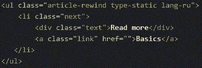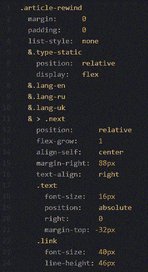

# 修饰符继承的困难

BEM-global 中的任何类，修饰符也不例外。例如，在 CSS 提供给 main 类的地方，一个按钮继承了几个修饰符，如"*活动的*，*禁用的*，*错误的*BEM。这个类将是全局的，继承了块标题和元素标题的类名。这种方法忽视了 CSS 功能，如级联和突然延长类名:

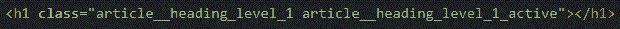

通过 SASS 而不是从类名中的单词继承修饰符的例子:

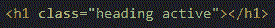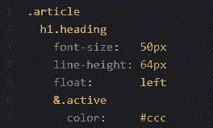

所有类都是伪全局的。基本上一点都不差。问题是，在类名中，我们保存了块或元素名，不能在块外的任何地方使用它们，类的全局性质变得无用。另外，在浏览器中的一个选项卡上，我们有像“*promo _ section _ color _ white”*这样的全局类，它们只能将“*promo _ section”*的背景色改为白色。对于其他具有白色背景的块，您应该编写一个名称中带有硬编码的新类。元素不能在项目中的任何地方使用，尽管这在技术上是可行的:

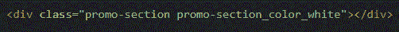

它可以由真正的全局类来完成，在其他部分重用而不会丢失任何东西，而不是通过 HTML 中的文本绑定到 block:

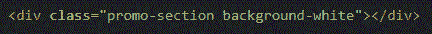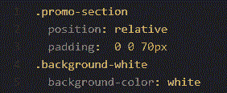

# 禁止语义使用

这是文件中的一段引文:

> 在使用 BEM 时，你也不应该使用 CSS 标签或者 `ID` *选择器。*

ID 在 CSS 中的用法值得怀疑，但为什么不是标签呢？如此大的潜力，mixins 或 cycles 可以用在带有语义的预处理程序中，但是它被贬低了:

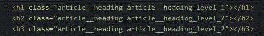

在这里，h1、h2 等可以应用样式。，但是没有链接到 HTML 标签，我们有 class "*article _ _ heading _ level _ 1 "*:

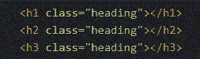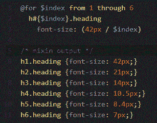

# 仅通过块暗示标记

仅通过块暗示标记。有很多元素:按钮、下拉菜单、标题、副标题、部分等等。在每一个大模板里。但是在 BEM 中你不能重用类。如果您希望"*article _ _ heading _ level _ 1 "*不在文章中而是用相同的样式您将编写相同的样式，但是用新的类或者将从其他块中继承"*article _ _ heading _ level _ 1 "*。基本上，这是禁止创建一个完整的模板，但没有比登陆页面更复杂的东西。

# 赞成的意见

一亲:写代码更简单，不应该支持。如果你用 BEM 编写 CSS，改变文件样式的机会几乎为零。如果标记需要一些编辑，代码无论如何都会被重写，因为没有人愿意去阅读。

BEM 破坏了模板的概念，禁止使用 CSS 函数和可能性，强迫开发者硬编码。评论中任何关于 BEM 的好想法都值得思考。这里提供的所有例子都是一种可能的方式，而不是我自己的标记。
也许我在某些地方甚至没有保存语义。如果批评，那就建议。我建议 Bootstrap、SMACSS 和 OOCSS 的架构和想法。