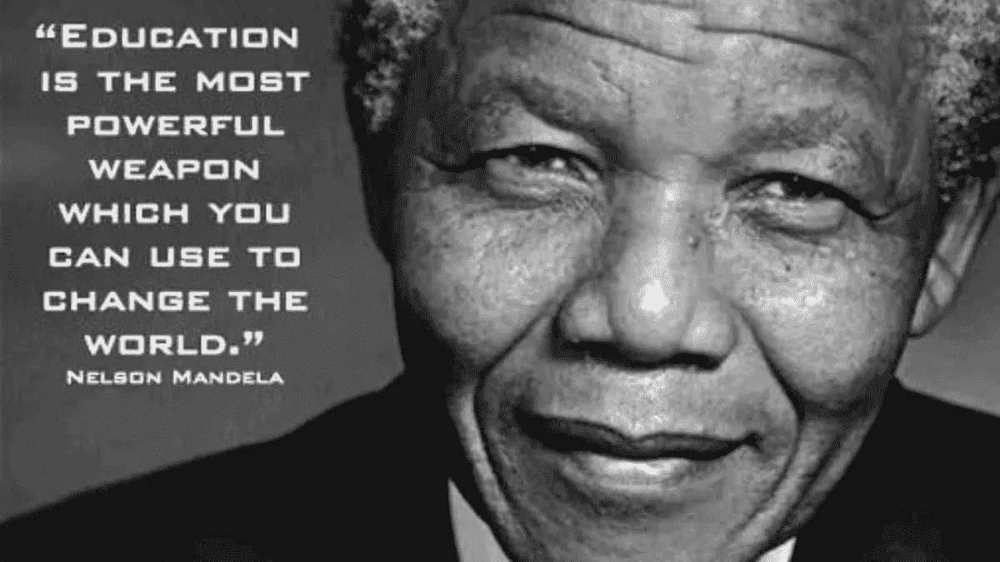
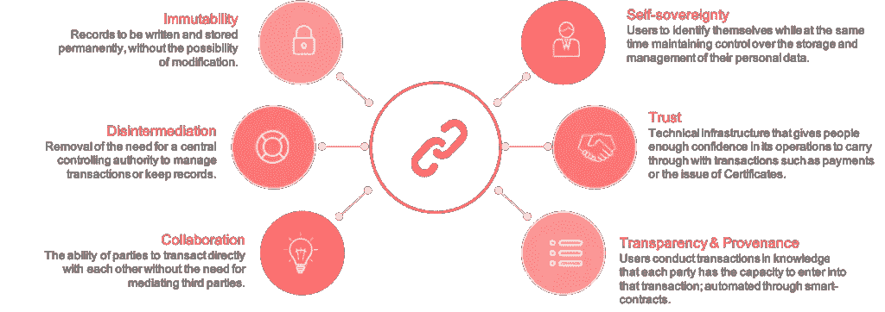
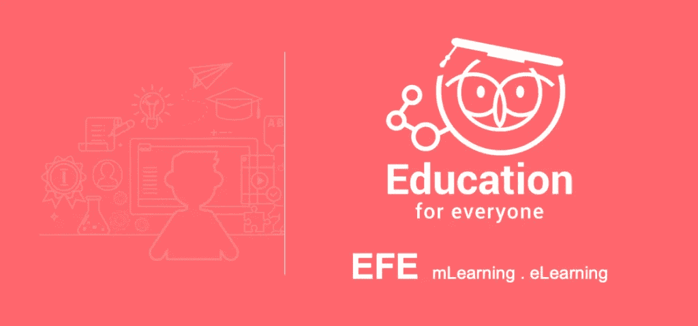

# 区块链技术在教育系统中的优势

> 原文：<https://medium.com/hackernoon/benefits-of-blockchain-technology-in-the-education-system-8402f6a7aeb8>

教育是我们生活中不可或缺的一部分。它也是新技术的基础。[区块链](https://hackernoon.com/tagged/blockchain) [技术](https://hackernoon.com/tagged/technology)就是这种技术能够造福教育生态系统的一个例子。随着互联网的兴起，教育材料就在我们的指尖:在我们的手机和电脑里。因此，电子学习和移动学习这两种教育方式越来越受欢迎。

路透社的一份报告显示，全球**电子学习**市场的规模预计将从 2017 年的 1761.2 亿美元增长到 2026 年的 3981.5 亿美元，CAGR 为 9.5%。新兴**移动学习**市场到 2020 年将达到 376 亿美元([来源](https://www.marketsandmarkets.com/PressReleases/mobile-learning.asp))。全球电子学习和移动学习的增长可以告诉我们，对教育的需求正在增加。如今，互联网为大多数主题提供了大量便捷的教育材料。谈谈信息时代。

预计 2019 年全球在区块链解决方案上的支出将接近 29 亿美元，比 2018 年的 15 亿美元增长 88.7%。凭借 76.0%的五年复合年增长率(CAGR)，IDC 预计区块链支出将在 2018 年至 2022 年预测期内增长，2022 年总支出将达到 124 亿美元([来源](https://www.idc.com/getdoc.jsp?containerId=prUS44898819))。

> “如果实施得当，区块链、人工智能和过程自动化等新兴技术有助于减少大学管理水平、削减成本并提高安全性和弹性。”毕马威会计事务所

# 为什么是区块链技术？

区块链技术将加速证书纸质系统的终结。教育机构可以永久安全地颁发任何种类的证书，如资格证书或成绩记录。此外，可能的自动化发布和储存奖励，承认和转让信贷。使用区块链还可以存储和验证整个终身学习过程中正式成绩的完整记录。

学习者可以存储他们自己的正式或非正式学习的证据，与期望的受众共享，并确保即时验证“终身学习护照”。机构也可以开始使用基于区块链的加密货币来**促进支付**涉及补助金和其他类型的资金以及学生支付教育费用。

数字智能合同可以安全地加速各方之间的交易。因此，区块链的分布式点对点模型可以成为汇集教育资源的完美补充。管理和保护**数字知识产权** (IP)是区块链科技的另一个优势。这使得它成为研究人员为学校、政府组织和公司创建系统的理想选择。因此，控制重要信息的暴露。区块链可以让教育工作者公开发布内容，并跟踪任何重复使用，而不对源材料施加限制。

有了区块链，信用自动**转移**的协议可以写成智能合同。一旦合同条件得到满足，贷款将自动转移。学习活动可以在区块链上注册，可以变得更加**互动**——声誉建立在更加有形的矩阵上。

# 谁已经参与在教育中使用区块链？

2018 年 11 月，马来西亚教育部宣布了利用区块链技术打击学位欺诈的计划。从而维护马来西亚大学的声誉和诚信以及学生的权利。([来源](https://cointelegraph.com/news/malaysias-education-ministry-sets-up-university-degree-verification-system-via-blockchain))

[**OpenCerts**](https://opencerts.io/) 由新加坡教育部(MOE)、政府技术局(GovTech)，以及国家教育运动 skills future Singapore([SSG](https://www.skillsfuture.sg/AboutSkillsFuture))和高等学府义安理工学院共同开发。([来源](https://www.techinasia.com/singapore-rolls-blockchainbased-education-certification-system-nationwide))

T21 大学是第一所使用区块链技术来管理学生从 MOOC 平台获得的证书的学校。([来源](https://cryptodisrupt.com/nicosia-university-issues-students-with-blockchain-validated-grading-certificates/))

**索尼全球教育**利用区块链技术创建全球评估平台，为存储和管理学位信息提供服务。([来源](https://blockchain.sonyged.com/)

**麻省理工学院** (MIT)与学习机公司合作设计了一款基于区块链技术的在线学习教育数字徽章。([来源](https://www.researchgate.net/publication/326038406_Blockchain_and_the_Future_of_Digital_Learning_Credential_Assessment_and_Management))

欧盟也表示有兴趣将区块链用于教育。特别委员会认为这项技术很有前途，区块链将能够解决许多问题。([来源](http://publications.jrc.ec.europa.eu/repository/handle/JRC108255))

纽约国王学院已经允许学生使用比特币支付教育费用。([来源](https://www.tkc.edu/stories/kings-is-first-u-s-college-to-accept-bitcoin/))

**全民教育(EFE)** 是一家提供知识传授和教育的点播直播服务提供商。它涉及联合国可持续发展目标 4，即优质教育。为了实现优质教育，他们正在提供负担得起和可获得的软件，以确保终身学习的公平和包容性优质教育。

# 人人受教育

据 Ambient Insight 的分析师称，到 2019 年，中国在移动学习方面的支出将开始超过美国。中国每月有 1.95 亿人使用手机访问移动学习内容([来源](https://cnnic.com.cn/))。

通过**全民教育(**[**EFE**](https://www.efe.global/)**)**，学校、教师和学生可以充分利用移动互联网的可访问性，并在分散的地点无缝连接，以实现收入和学习成果。因此，EFE 通过一个平台解决了电子学习的限制，学习者可以在一个无缝和直观的生态系统中与教育者联系。因此，EFE 充分利用了快速增长的移动学习需求，提高了学习效果。

*免责声明:以上这篇文章纯属教育目的。因此，它不应被用作财务建议或表明 Moonwhale 支持上述公司。*

# 关于我:

**伊利亚·扎基是美国一家名为** [**STO 咨询**](https://moonwhale.io/sto-ico/) **的公司的业务开发主管兼营销官，该公司名为**[**moonwale Ventures**](https://moonwhale.io/)**。**

在我们的各种社交媒体平台上关注我们—

[推特](https://twitter.com/MoonwhaleBV) | [LinkedIn](https://www.linkedin.com/company/moonwhalebv) | [脸书](https://www.facebook.com/MoonwhaleBV/) | [电报](https://t.me/moonwhaler)