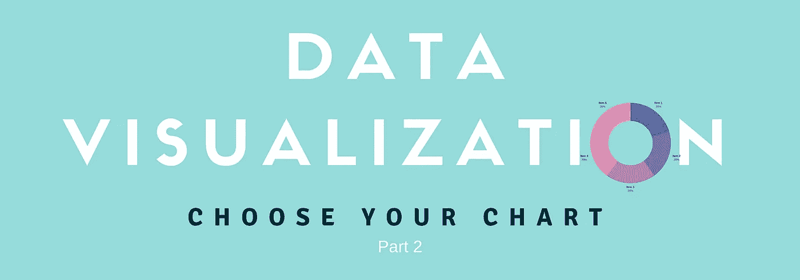
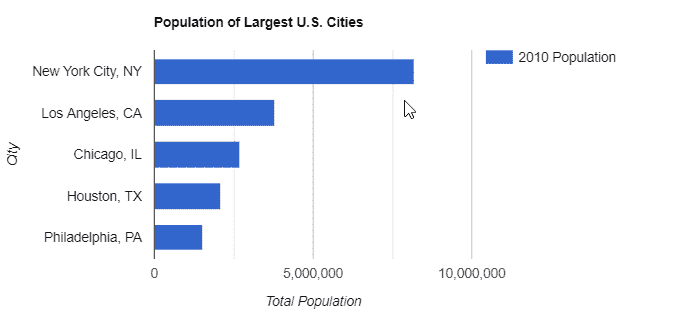
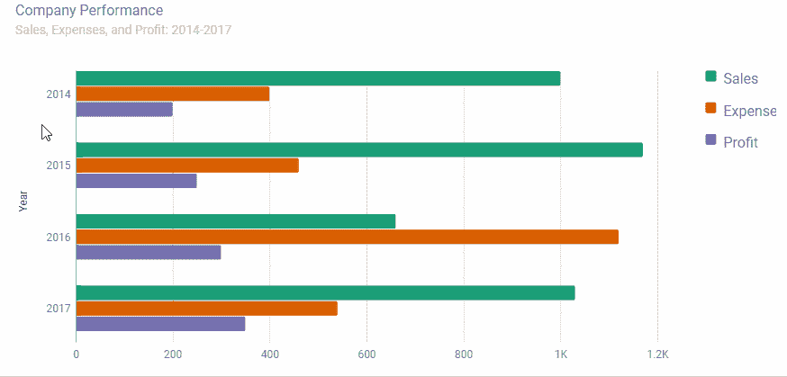
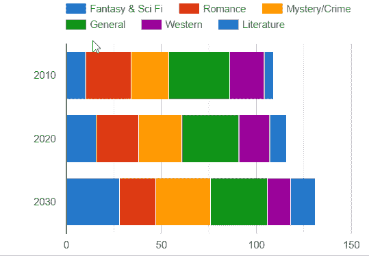
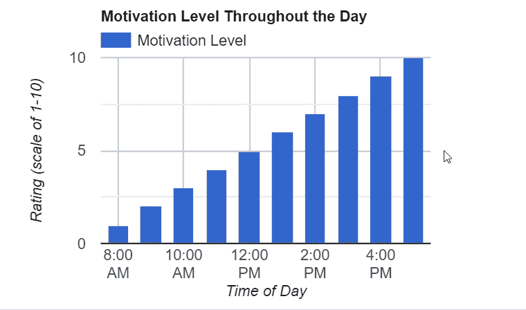
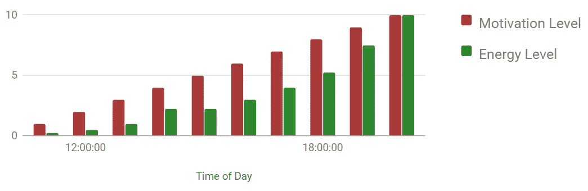
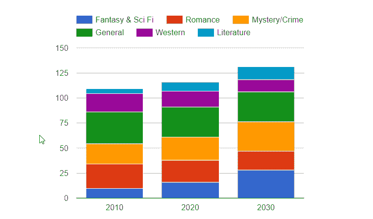
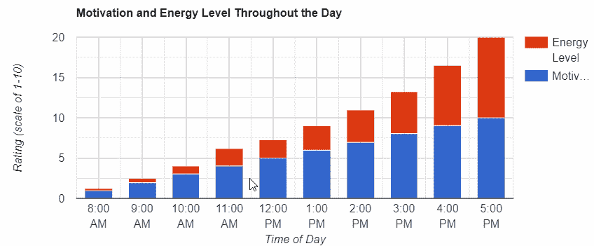
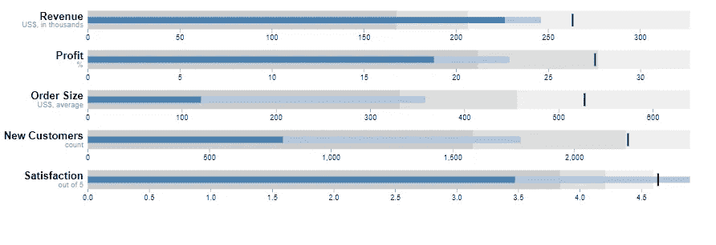
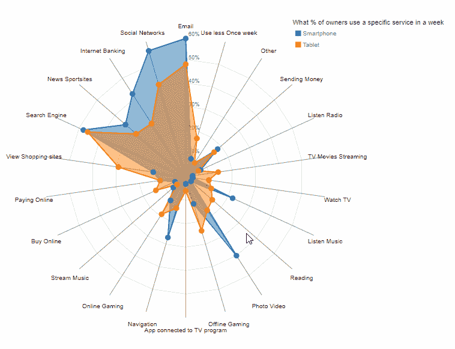

# 显示离散数据的最佳图表

> 原文：<https://medium.com/hackernoon/best-charts-to-show-discrete-data-ee7fd3c7365>

在数据可视化项目的这一部分，我们将回顾有助于发现各种数据类别之间的相似性和差异的图表，并讨论它们的用途和细节。

但首先，让我们弄清楚什么是离散数据。

## 什么是离散数据？

如果您能肯定地回答以下关于数据的问题，那么数据就是离散的:

*   可数吗？
*   有没有可能把数据分成更小的部分？(即，对其进行分类)

离散数据只能包含有限数量的值。它的一个显著特性是，与连续数据不同，它不能被测量，只能被计数。

**离散数据示例**:一个团队的队员人数，太阳系的行星数。
**非离散的例子**(连续)**数据**:身高，体重，长度，收入，温度。

## 条形图

最简单也是最流行的图表类型。它使用矩形条显示分组数据，矩形条的长度与值成比例。条形图广泛用于市场营销和金融领域。

*目的*

使用它来比较跨类别分布的数据点。

***优点***

*   如果类别的名称很长或者超过 10 个类别，则使数据更具可读性

*推荐*

*   按逻辑顺序排列图表上的条形:升序或降序

**示例和变体**

*   在一个类别中比较数值的**单系列**图表。

*   这是一个**聚集**(分组)**条形图**的例子。使用它来比较同一类别中的多个系列。

## 堆积条形图

堆积条形图由一个接一个水平堆积的多个条形图系列组成。对条形图的这种修改使得跟踪单个值及其总值的变化变得更加容易。

*目的*

如果您对类别占总数的比例或每个类别中的值的比例感兴趣，请使用该图。

***利弊***

*   如果设计合理，这种类型的图表是通过测量条形长度来比较多个类别的最佳选择

*推荐*

*   将图表限制在六到七个系列，否则，图表会很混乱，难以理解

**示例**

## 柱状图

它的构造方式与条形图相同，但垂直轴代表类别，水平轴代表它们的值。

*目的*

它通过比较总的列长度来帮助跟踪值随时间的变化。

***优点***

*   在比较少量类别(少于 12 个)之间的值时可读性很高

*推荐*

*   如果数据集有负值，请使用柱形图而不是条形图，因为负值与向下的方向相关联

**示例和变体**

*   一个**单系列**柱形图:

*   **聚类**(分组)柱形图:

## 堆积柱形图

堆积柱形图由多个相互堆叠的柱形图数据系列组成。

*目的*

堆积柱形图旨在比较总计，并注意可能对总计变化产生最大影响的项目级别的变化。

***优点***

*   最适合在一段时间内或跨类别进行部分到整体的比较。
*   它有助于在快速浏览时了解整体情况，而不关注细节。

**示例**

## 项目符号图

项目符号图是根据现代商业需求对条形图的修改。它可以垂直和水平显示。图表由代表目标值的**目标标记**、代表指标当前值的**成就栏**和**比较范围**组成。

*目的*

它是由斯蒂芬·诺设计的，用于跟踪目标的进展，测量你离目标还有多远。

***利弊***

*   它消除了在仪表板上使用圆形/线性仪表的必要性

*推荐*

*   使用自定义背景色对位于比较范围内的值的解释进行编码

**示例**

通常意义:背景越浅，效果越好。但是在“费用”的情况下，根据它的负面意义，你可以把数量尺度反过来。

## 蜘蛛图

在这个图表中，每个变量的轴从中心点开始。轴围绕它呈放射状排列。该值由轴上的锚点表示。该数据点通过一条线与轴相连。就是画多边形的过程。你可能注意到了，这让我想起了一张蜘蛛网；因此得名。等效的名称有'*极坐标图*'、*网聊*'、*雷达图*'、*星图*'。

*目的*

它是为比较有三个或更多数量变量的多元数据而设计的。

***优点***

*   通过强调产品的优势(特征)和劣势，最适合比较产品

*建议*

*   比较多个项目时，使用颜色编码和标签来区分它们。
*   不要被多边形的面积误导了:它是随着值的平方而增加的。因此，人们可能认为微小的变化比它们实际上更重要。
*   考虑到多边形的面积和形状可能会因轴的位置而有很大的不同。

**例题**

## 摘要

我们真诚地希望这个概述能帮助您决定哪些图表最适合您的数据，并大致了解如何以图形方式比较离散的数据组。

敬请关注进一步的更新！

## 有用的链接

*   [关于如何在演示中使用图表的建议](https://www.webdatarocks.com/blog/power-of-data-visualization-and-charts/?r=hn2)
*   [如何在谷歌图表中使用 WebDataRocks 数据透视表](https://www.webdatarocks.com/doc/integration-with-google-charts/?r=hn2)

## 民众

*   [柱形图](https://codepen.io/webdatarocks/pen/WLWdoq)
*   [条形图](https://codepen.io/webdatarocks/pen/EGJogZ)
*   [堆积柱形图](https://codepen.io/webdatarocks/pen/REOjjV)
*   [堆积条形图](https://codepen.io/webdatarocks/pen/robpOx)

*原载于*[*www.webdatarocks.com*](https://www.webdatarocks.com/blog/best-charts-discrete-data/)*。*