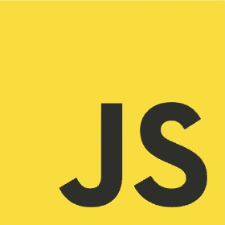
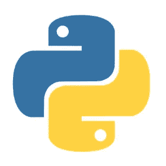
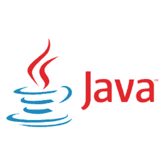
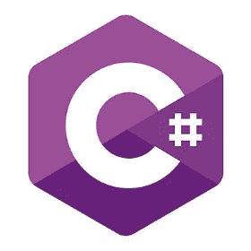

# 2019 年学习的最佳编码语言

> 原文：<https://medium.com/hackernoon/best-coding-languages-to-learn-in-2019-b49b49250a25>

## 在理想的世界中，您选择的编程语言应该无关紧要。大多数流行的语言都有相同的基本概念，对于没有受过训练的人来说，它们看起来都是一样的，并且让你获得或多或少相同的结果。从开发人员的角度来看，编程语言是一种工具，选择正确的语言将影响一个人的职业生涯、经济前景和未来的幸福。本文着眼于五种最受欢迎的编程语言，考察了它们各自的优缺点，并推荐了你应该在 2019 年学习的语言。

选择一种编码语言需要进行多方面的权衡。首先，你需要在所花费的时间和精力以及语言的好处之间找到一个平衡点。你还需要考虑任何特定语言的长期前景。对于 21 世纪初的 web 开发人员来说，PHP 和 Ruby on Rails 看起来是推进职业生涯的最佳语言。今天，主要的市场条件已经改变，PHP 和 Ruby 不在我们的推荐之列。

这篇文章为我们提供了 2019 年学习的最佳编码语言。对于每一种语言，我们都给你一个简单的语言概述，它的用途，以及它的长期前景。我们还列出了值得研究但更专业或服务于特定市场的语言的荣誉奖。为了显示每种语言的市场份额和采用情况，我们根据它们在[Stack Overflow 2018 年开发者调查](https://insights.stackoverflow.com/survey/2018/)中的排名选择了我们的选择。

学习一门新语言的关键原因之一是能够利用它提供的就业机会。编码面试是雇主了解你对自己选择的语言了解多少的一个机会。为了展示在编码面试中你可能会被问到的问题类型，我们为每个建议提供了一系列可能的问题。

请注意，我们的列表是基于堆栈溢出调查，但我们已经对我们最推荐学习的语言进行了排名。此外，我们将我们的选择限制在[命令式语言](/front-end-hacking/imperative-versus-declarative-code-whats-the-difference-adc7dd6c8380)，排除了声明式语言，如在调查中占据第二、第三和第四位的 HTML、CSS 和 SQL，以及 shell 脚本语言，如 Bash。

# 第一:JavaScript

根据 [Stack Overflow 的 2018 年开发者调查](https://insights.stackoverflow.com/survey/2018/#technology)，71.5%的职业开发者将 [JavaScript](/@dhope21/a-brief-history-of-javascript-9067ac4dce40) 列为最受欢迎的编程语言。与 2015 年[相比，这是一个相当大的增长，当时只有 54.4%的开发者将 JavaScript 列为最受欢迎的技术。](https://insights.stackoverflow.com/survey/2015/#tech)

这种跳跃的原因之一是 JavaScript 无处不在。在客户端，您可以使用前端 JavaScript 框架，如 [Angular](/@hamedbaatour/build-a-real-world-beautiful-web-app-with-angular-6-a-to-z-ultimate-guide-2018-part-i-e121dd1d55e) 、 [React](https://medium.freecodecamp.org/learn-react-js-in-5-minutes-526472d292f4) 和 [Vue](https://vueschool.io/the-vuejs-master-class) 来构建基于浏览器的 web 应用程序。在浏览器之外， [Node.js](/dailyjs/how-i-automated-my-job-with-node-js-94bf4e423017) 让您可以用编写客户端代码的语言编写后端应用程序。有了 Node，你可以编写 web 服务，管理物联网(IoT)，实验机器学习。选择 JavaScript 而不是其他语言的一个关键因素是它在整个软件行业的广泛支持——包括谷歌、脸书、微软和亚马逊的重大努力。你还可以找到各种各样的付费和免费课程、网站、书籍、视频和博客，涵盖了该语言以及与之相关的所有可能的话题。

在其历史的大部分时间里，JavaScript 被视为编程语言中的丑小鸭。虽然它从未像《儿童故事》中那样成为美丽的天鹅，但 JavaScript 社区已经齐心协力地将它从一种基于浏览器的脚本语言转变为一种现代的通用语言。随着时间的推移，JavaScript 的许多粗糙的边缘已经被打磨掉了，但有些仍然存在。

值得注意的是，就 JavaScript 而言，许多潜在雇主在编码面试中对潜在候选人的评估将基于他们对 JavaScript 更晦涩特性的了解。常见的编码面试问题涉及变量作用域、闭包、回调和条件运算符。任何想找一份涉及 JavaScript 工作的人都应该为这些和类似的问题做好准备。我们还建议您了解您感兴趣的公司，研究他们的开发堆栈，并在相关的现代框架(如 React、Angular 或 Vue)上练习展示您的技能。

# 第二:Python

根据栈溢出调查，Python 受到 37.9%的专业开发者的欢迎。我们的评估是基于 Python 的快速采用率，在过去的五年中，Python 的发展速度比任何其他语言都要快。Python 已经变得如此有影响力，以至于**经济学家、*(一本不以报道开发者相关话题而闻名的杂志)在[最近的一篇文章](https://www.economist.com/graphic-detail/2018/07/26/python-is-becoming-the-worlds-most-popular-coding-language)中写了关于这种语言的文章。*

**

*Python 受欢迎的部分原因是它摆脱了其他语言令人讨厌的约定，例如使用分号来表示语句的结束。这可能解释了为什么 Python 正在取代 Java 成为教授计算机科学的主要教学语言——不仅在大学，在高中和小学也是如此。Python 在学术界已经根深蒂固，是用于机器学习和数据科学的最流行的通用语言。事实上，Python 目前在这些领域占据主导地位，以至于最近有人提出了 Python 和数据科学语言之间的合并。*

*Python 与其他编码语言既相似又有很大不同。当谈到获得 Python 开发人员的工作时，编码面试将需要测试候选人对 Python 如何实现常见语言特性的理解，如数据类型、模块化、函数和类。他们可能还会问如何使用 Python 作为脚本语言、面向对象语言或函数式编程语言，或者你是否理解 Python 特有的数据类型和特性，比如元组、列表理解、字典和装饰符。*

# *第三:Java*

*排在第三位的是 [Java](http://www.bestprogramminglanguagefor.me/why-learn-java) ，根据 Stack Overflow 的 2018 年调查，45.5%的专业开发者青睐这款应用。*

**

*Java 具有持久吸引力的一个原因是 Java 虚拟机(JVM)T1。JVM 使得在不同的硬件平台和设备上运行每种语言成为可能。Java 还被设计用来处理许多与数据类型和内存管理相关的任务，这些任务让开发人员苦不堪言。Java 简化应用程序开发和跨不同操作系统部署应用程序的能力使 Java 成为大型组织的首选语言。这种语言能让你在大公司找到一份稳定的工作。Java 的另一个重要用途是编写原生 Android 应用程序。在智能手机操作系统领域， [Android 的市场份额比所有竞争对手加起来还要大，这是许多开发人员学习 Java 的主要动机之一。](https://www.statista.com/statistics/266136/global-market-share-held-by-smartphone-operating-systems/)*

*近年来，已经为 JVM 创建或移植了许多流行语言，这些语言广泛使用了 Java 生态系统。这些语言在特定的环境中很流行，包括 Scala、Closure 和 Kotlin。Kotlin 有许多有趣的用途，包括编写 [Android 应用](https://www.theverge.com/2017/5/17/15654988/google-jet-brains-kotlin-programming-language-android-development-io-2017)和使用 [Corda](http://www.corda.net/) 框架创建智能合同。*

*在寻找 Java 开发人员的工作时，理解这种语言的范围是很重要的。编码访谈可以包括任何可以想到的与 Java 相关的主题。对于企业开发工作，你可能需要展示你对 Java 基础设施的理解，所以期待关于 [JDK、JRE 和 JVM](https://www.journaldev.com/546/difference-jdk-vs-jre-vs-jvm) 的问题。Android 开发人员将被问及与 Android 相关的问题，包括 SDK 版本管理、意图、设备仿真和应用程序部署流程。如果你在面试一家运行 Java 以外的特定 JVM 语言的公司，磨练你的语言技能也能提供优势。*

# *数字 4: C#*

*参加 Stack Overflow 2018 年调查的职业开发者中，有 35.5%是[微软的 C#](https://mashable.com/2018/03/17/coding-course-class-bootcamp/) 的粉丝。不仅 Python 和 Java 的排名高于 C#，40.4%的开发人员都喜欢使用 [Bash](https://codeburst.io/learn-how-to-create-custom-bash-commands-in-less-than-4-minutes-6d4ceadd9590) 脚本语言，尽管许多开发人员对微软的所有东西都很反感。*

**

*在今天的市场上，Java 仍然是比 C#更好的选择，但从长远来看，有迹象表明这种情况可能会改变。 [Java 发布新特性](https://jnbridge.com/blog/java-10-emerging-problem-release-fatigue)的步伐已经放缓，而微软一直在积极地向 C#添加新特性和新能力。这是该公司摆脱对 Windows 操作系统依赖的共同努力的一部分，包括购买 [Xamarin](https://developer.xamarin.com/getting-started/) 及其跨平台开发环境，发布多平台[。NET Core](https://stackify.com/net-core-vs-net-framework/) ，以及其对 [Azure](https://www.howtogeek.com/337961/what-is-microsoft-azure/) 的持续投资。微软认为 C#在它的新战略中发挥了作用，并努力确保 C#既能与微软技术兼容，也能与开放行业标准兼容。*

*像 Java 一样，C#语言和生态系统是巨大的。这意味着，对于你申请的任何职位，做足功课，了解你未来雇主的市场是很重要的。像 Java 一样，大多数 C#编码面试都会包含与 C#的基础设施相关的问题，包括[。Net 框架](https://www.guru99.com/net-framework.html)和[公共语言运行时(CLR)](https://www.loginworks.com/blogs/clr-work-dot-net-framework/) 。同样值得注意的是，CLR 支持其他语言，比如 F#和 VB.net。如果你面试的公司除了 C#之外还使用了另一种 CLR 语言，那么用这种语言学习和编码是值得的。*

# *第五:C/C++*

*虽然 [C](https://mkdev.me/en/posts/three-reasons-to-learn-c-in-2018) 和 [C++](/@vardanator/why-cs-students-must-learn-c-as-their-main-programming-language-6d3b4f8720bd) 是具有不同编程模型的独立语言，但它们之间的联系如此紧密，以至于在本文中，我们将一起讨论它们。*

*对于通用和专用任务，如应用程序开发、用户界面、移动应用程序和机器学习，C 已经被列表中的其他语言所取代。然而，在嵌入式系统和构建操作系统方面，C 仍然坚持自己的立场。没有什么比 Linux 更能说明这一点了。Linux 是有史以来最受欢迎的操作系统，在大型主机和任何运行 Android 的设备上都有使用。Linux 的关键部分是 Linux 内核，Linux 内核是用 C 编写的，C 的另一个常见用途是编写其他编程语言，比如我们的第二个选择，Python。*

**

*C++是一种更现代的面向对象的 C 语言版本。C++是一种用于任何注重性能的应用程序的语言。例如，许多公司，尤其是金融部门，在他们的后端系统中使用它。C++既用于枯燥的东西，也用于一些最激动人心的技术领域。由于其高速工作的声誉，C++也是图形密集型应用程序的首选语言，包括游戏开发、图形引擎以及虚拟和增强现实。*

*找 C 或 C++语言的工作时，一些面试官会问一些适用于这两种语言的问题。这些包括关于数据类型、操作符、循环、条件语句、指针和内存管理的编码面试问题。你也可能被要求定义和解释链表，以及写一个实现和管理链表的短程序。由于 C++是一种面向对象的语言，你很有可能会被问到类似的关于它对对象、类、方法、属性等的支持的问题。*

# *荣誉奖*

*我们列表中的五个选项都是通用语言。下面是其他几种语言，它们要么更专业，要么服务于更小的利基市场。*

*一种受到大量关注的语言是苹果的 [Swift](https://www.makeuseof.com/tag/reasons-learn-swift-language/) 。Swift 原本是苹果新的通用语言，旨在取代 Objective-c。Swift 可用于编写 iOS 和 Mac 桌面应用程序，由苹果在开源许可下发布，希望它成为一种服务器语言。不幸的是，这个希望没有实现。*

*在 web 开发领域， [PHP](https://medium.freecodecamp.org/this-is-what-modern-php-looks-like-769192a1320) 仍然非常受欢迎。尽管 PHP 作为一种语言有其局限性，并且有更好的替代语言，但它仍被许多大型网站使用，如脸书和维基百科。脸书甚至创造了他们自己的 PHP 方言，叫做 Hack。PHP 也是许多大型开源平台使用的语言，比如 [WordPress](https://www.elegantthemes.com/blog/resources/php-tutorials-aspiring-wordpress-developers-should-walk-through) 和 [MediaWiki](https://www.mediawiki.org/wiki/How_to_become_a_MediaWiki_hacker) 。这些平台被广泛采用，PHP 被用来为它们创建插件。脸书仍然致力于 PHP，甚至创造了他们自己的语言的现代化版本，名为 [Hack](https://www.hacklangtutorial.com/hack-programming-language/) 。然后是 [Ruby](https://medium.freecodecamp.org/learning-ruby-from-zero-to-hero-90ad4eecc82d) ，一个现代的、设计更好的 PHP 替代品。Ruby on Rails web 开发框架得到了广泛的部署，并拥有一个庞大而活跃的支持社区。*

*对于更高度专业化的应用，比如系统编程，谷歌的 Go 和 T2 的 Rust 看起来都很有前途。这两种语言都是为构建高度并发的系统而设计的。在函数式编程领域， [Elixir](https://www.siliconrepublic.com/advice/elixir-programming-language-career) 是对 [Erlang](https://hackernoon.com/why-is-erlang-the-only-true-computer-language-4c7d1f195a02) 的现代替代， [Clojure](https://vampwillow.wordpress.com/2017/09/13/clojure-as-first-language/) 是运行在 JVM 上的 Lisp 的现代形式， [F#](https://www.infoworld.com/article/3269057/application-development/14-excellent-reasons-to-use-f-sharp.html) 是运行在。NET 运行时，并有许多主流功能。最后，如果你对快速增长的智能合约和[以太坊加密货币](https://blog.b9lab.com/learning-ethereum-my-experience-so-far-9064a816a39d)感兴趣，你应该研究一下[可靠性](/@robbertvermeulen/learn-solidity-the-ethereum-smart-contract-programming-language-7f106fc26d6)。*

# *结论:选择正确的语言*

*在我们研究的五种语言中，你如何选择一种适合你的呢？从目前的趋势来看，应用范围最广的最好的通用语言是 JavaScript。您可以在大多数设备上运行它，并使用它来构建客户端、服务器和无服务器应用程序。在过去的十年中，JavaScript 已经发生了变化，今天它与 C#和 Lisp 等现代语言有很多共同之处。是的，它仍然有一些粗糙的边缘，但它们不像以前那样突出了。*

*我们的第二个选择，Python，是从长远考虑他们职业生涯的开发人员的最佳选择。正如我们注意到的，它已经成为研究和教育使用的语言。它也是机器学习、人工智能和数据科学相关领域的主导语言。在构建用户界面时，JavaScript 比 Python 有很大的优势。但随着时间的推移，这种优势可能会变得不那么显著。首先，Web Assembly 标准使得使用任何高级语言编写基于浏览器的应用程序成为可能。此外，如果基于语音的用户界面被大众接受，图形用户界面将变得不那么重要。由于 Python 是用于为亚马逊的 Echo 语音助手编写技能的语言，它已经在这一领域占据了先机。*

*在企业领域，您需要在 Java 和 C#之间做出选择。这两种语言在语法、特性和基础设施方面非常相似，您可以根据个人偏好、工作机会或抛硬币来选择它们。正如我们所提到的，Java 比 C#存在的时间更长，更受欢迎，发布的职位也更多。另一方面，微软的积极支持和使 C#成为真正的跨平台解决方案的努力使它成为一个更好的长期赌注。Java 仍然是 Android 的语言，但微软的 Xamarin 允许你用 C#编写 Android、iOS 和 Mac 应用程序。请注意，C#在创业社区名声不好，在硅谷非常不受欢迎。在这些圈子里，C#开发者经常被当作二等公民。*

*同样重要的是要意识到，当申请 Java/C#企业计算职位时，面试官将关注你用这两种语言创建后端应用程序的能力，而不是特定的语言特性。当编写一个解决方案时，你会被期望写出惯用的代码，这是你在解决现实世界的问题时可以展示你的语言特性知识的地方。*

*最后，C 和 C++都算通用语言，但实际上主要用于特定领域。对于 C 来说，这些是系统和嵌入式编程；对于 C++，这些都是高性能、资源密集型应用，如实时图形。这两种语言都用于没有明确选择的情况，当您需要构建这些类型的应用程序时，您应该选择学习这些语言。*

*最重要的是，当去参加编码面试时，确保你知道任何语言适用于你申请的工作的来龙去脉。[编码面试](https://www.pramp.com/ref/hn_cod_lan)是申请过程中压力很大的一部分，但是琢磨一门语言的优势、局限和应用，并做好准备，会让任何面试和你的求职经历变得容易得多。*