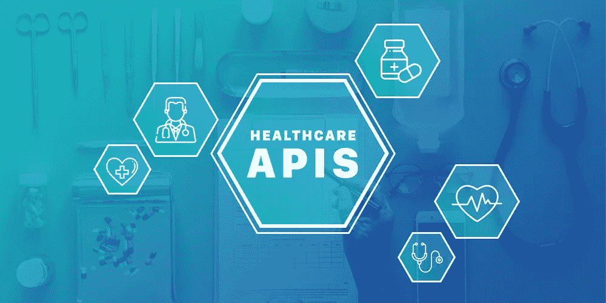
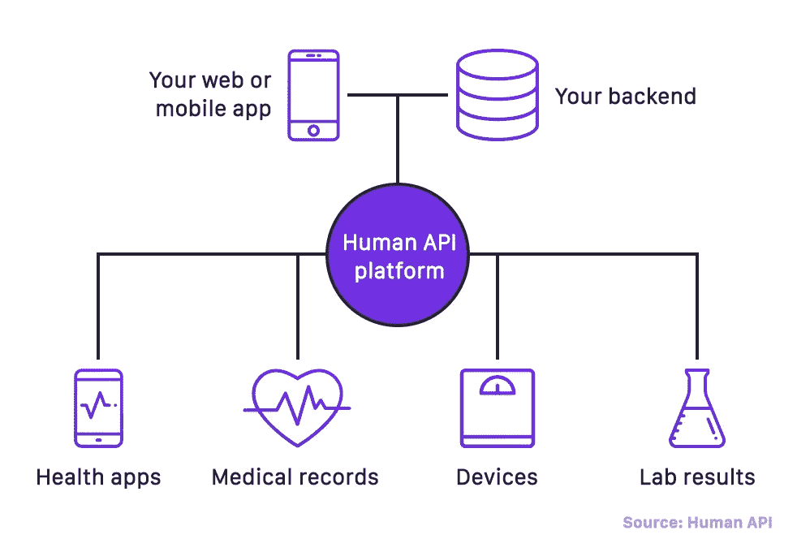
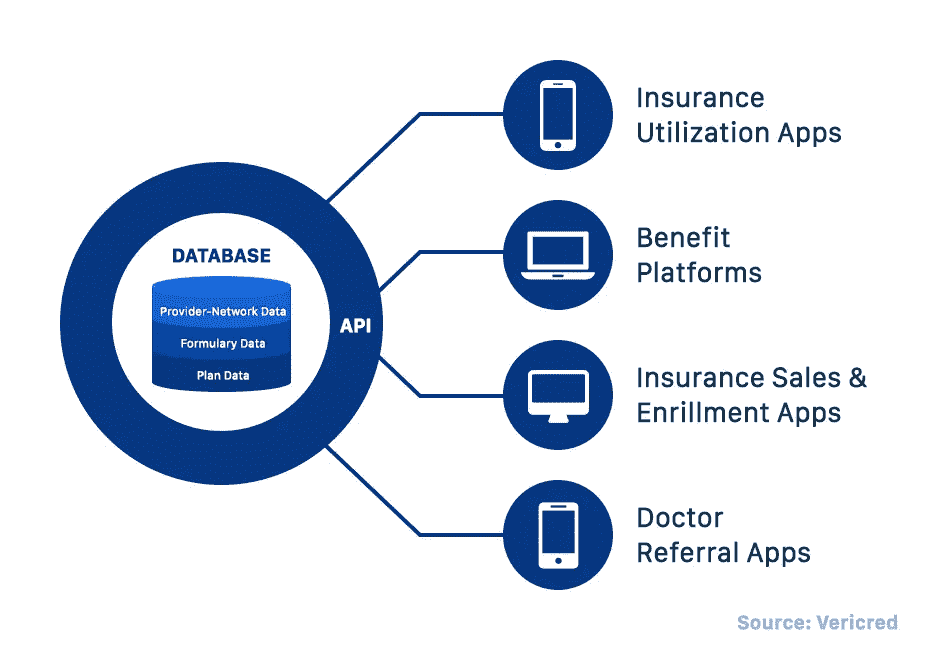

# 增强软件安全性的最佳医疗保健 API

> 原文：<https://medium.com/hackernoon/best-healthcare-apis-to-enhance-your-software-security-f188038257c0>

[医疗保健](https://dashbouquet.com/blog/mobile/blog/artificial-intelligence/transformation-of-healthcare-how-technology-redefines-one-of-the-oldest-industries-in-the-world)是世界上最大的行业之一，预计到 2020 年将达到约 10.06 万亿美元。由于对创新工具和服务的巨大需求，医疗保健一直是测试和实施尖端技术的先锋。

另一方面，医疗保健应该加倍注意其安全性，因为它处理高度个人化的信息。这些信息的滥用可能导致任何事情，甚至从身份被盗到死亡。

我们收集了一份最佳 API 列表，在我们看来，这些 API 可以帮助您保护您的医疗保健软件，并确保其按预期使用。

# 保护您的应用的基本要素

在我们进入第三方服务之前，让我们谈谈开发应用程序时应该考虑的基础知识。

应用程序开发是一个复杂的课题，涉及许多方面，如法规遵从性、数据加密等。以下是需要记住的事情:

## #设备安全性

医疗保健软件有多种形式。它不仅用于移动设备，还用于特定的医疗设备，由医疗专家或患者使用。因此，保护设备使其按预期用途使用非常重要。

对于用户来说，重要的是要记住每次完成会话时锁定设备。对于开发人员或企业家来说，添加远程设备跟踪功能(例如，通过 GPS)和远程锁定设备的选项将是一个好主意。

## #数据加密

用户请求数据，服务器发送数据——这是每个移动应用的运行方式，包括医疗保健应用。不幸的是，黑客有可能在这个过程中窃取它，这就是为什么你必须加密数据的主要原因。最好和最有效的方法之一是使用 TLS(传输层安全)协议。

## #受保护访问

如果你希望你的应用程序是安全的，确保它有一定数量的用户。为此，引入登录和授权选项，并要求用户创建复杂的登录和密码。

还有，不要犹豫增强安全性，对 app 实行双因素认证。

## #法规合规性

你一定听说过 2018 年生效的欧洲 GDPR。《一般数据保护条例》侧重于个人数据保护，影响了许多公司，其中医疗保健行业首当其冲。所以如果你是一家欧洲公司，你的产品应该符合[【GDPR】](https://privacypolicies.com/blog/gdpr-compliance-apps/)。

至于美国，该应用程序必须符合 HIPAA:健康保险便携性和责任法案。与 GDPR 一样，HIPAA 旨在保护个人数据，并确保处理这些数据的产品和服务的安全。您可以在此阅读更多关于 HIPAA 合规性的信息[。](https://www.archer-soft.com/en/blog/4-steps-make-your-app-hipaa-compliant)

## #软件测试

测试有不同的方面，但是因为我们讨论安全性，所以要特别注意安全性测试。

这种测试方法旨在识别软件漏洞，并评估破坏漏洞的难易程度。因此，在启动应用程序之前，请确保您已经完成了大量测试并成功通过。

# 用于处理大数据的 API

医疗保健与大数据密切相关，因此需要高效的工具来处理和分析大数据。此外，医疗保健需要足够强大的 API 来处理这样的数据量。以下是我们挑选的五大第三方服务，可以安全高效地处理您的大数据。

## [人类 API](https://www.humanapi.co/)

这个免费的 API 收集并与患者和企业共享实时健康数据，并允许轻松安全地访问健康信息。在机器学习的帮助下，该服务能够从众多文件中提取所需的数据，然后对其进行处理和分析。

该服务可以嵌入到各种健康应用中，包括人寿保险、健康保险和数字健康。此外，它符合 HIPAA 标准。

## [DrChrono](https://www.drchrono.com/api/)

另一项符合 HIPAA 标准的免费服务是 DrChrono，这是一个 SaaS 患者护理平台。其主要工作是 EHR(电子健康记录)、医疗计费、处方管理。

该服务附带了大量有用的文档，并为开发人员提供支持，使服务易于集成和使用。

## [可获奖](https://www.medable.com/)

这个云平台使用机器学习来分析患者的数据，并向医疗保健公司和研究人员提供这些数据。在 Medable 的帮助下，医疗专业人员可以更好地了解各种疾病，并更彻底地研究它们。

至于在移动应用程序中的使用，该平台可以扩展您的应用程序的功能，提供许多集成选项，并具有高级分析功能。

## [更好的医生](https://betterdoctor.com/about-betterdoctor/)

该服务帮助患者找到医生或特定医生的信息，这是一个相当酷的想法。如果你的应用程序与医生的搜索有些相似，这项服务将是一个很好的附加服务，并将为用户带来额外的价值。

该服务符合 HIPAA 标准，并提供免费试用。

## [BlueEHR](https://blueehr.com/)

正如他们在网站上所说，BlueEHR 的使命是“让每个人都能负担得起医疗保健”。该服务提供了一系列解决方案，从收入周期管理到电子处方。

在 BlueEHR 的帮助下，您可以定制您的医疗保健应用程序，为其添加新功能，并快速构建高效的应用程序。BlueEHR 将平凡而庞大的流程转变为一个单一且平稳运行的单元。

# 用于支付和保险的 API

我们提到过账单，账单意味着金融交易。任何金融操作都需要高度的安全性，因此请查看医疗融资方面最可靠的前 3 个 API。

## [已核实](https://vericred.com/)

根据网站上的描述，该服务提供许多健康保险服务，并作为数据转换层运行。Vericred 通过一个通用 API 提供结构化数据，面向医疗保险和员工福利领域。

## [合格](https://eligible.com/)

该服务帮助患者搜索保险公司，并提供保险和计费 API。Eligible 帮助用户将他们的应用程序与所选的保险公司连接，并使支付过程更快、更简单、更安全。

## [获取安全](https://www.hellogetsafe.com/)

Getsafe 是另一项专注于医疗保险的服务。它使医疗保险提供商能够方便地接触到患者，并为他们提供合适的保险计划。服务的整合对现有的和新的应用程序来说都很容易。

# 总结

医疗保健是一个需要加倍关注产品和服务质量的行业。因此，对于移动应用程序开发者来说，确保他们的产品符合法规，确实对患者和医疗专家的生活产生影响，并帮助行业向更好的方向转变是至关重要的。

[*纳塔利娅·库库什金娜*](https://www.linkedin.com/in/natalia-kukushkina-b62397132/)