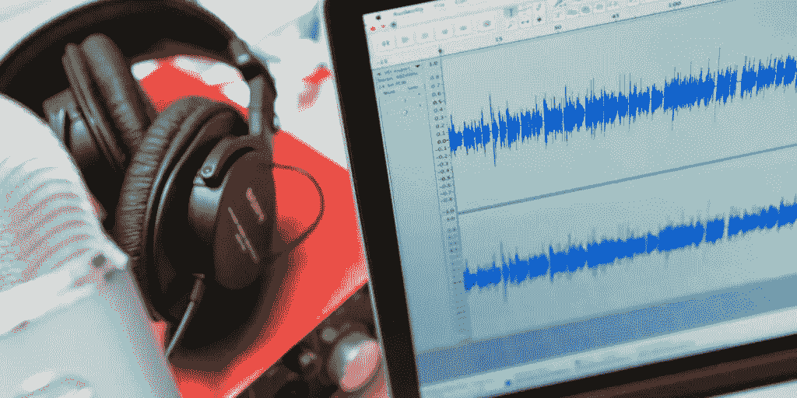

# 2019 年最佳播客录制软件(PC 版)

> 原文：<https://medium.com/hackernoon/best-podcast-recording-software-for-mac-pc-2019-9d9005b37549>

随着时间的推移，播客变得越来越受欢迎。大公司和小企业都开始使用播客来通知客户他们的产品和最新消息。如今，几乎所有内容都有播客可用。无论你是在寻找信息丰富的东西，还是在寻找一部好的喜剧，你都可以找到适合你需要的播客。很明显，播客很受欢迎，它们可以给企业主或普通人带来很多好处。然而，当谈到录制和编辑播客时，有许多程序和工具可用，但如果你想要最好的适用于 PC，你应该考虑不要 MP3。

## *录制您最喜欢的演讲，供离线使用*

你可能喜欢在不同的时间不同的地方听你喜欢的播客。甚至有一个很好的机会，当播客正在直播时，你可能不会在旁边听它。有时你可能只想在不上网的情况下听你最喜欢的播客。这就是最好的播客录制软件派上用场的地方。录制软件将允许你录制你最喜欢的播客，并直接下载到你的浏览器或移动设备上。这些录像可以通过许多应用程序播放；它们可以刻录在 CD 上，甚至可以添加到播放列表中，以便您可以在白天或晚上的任何时间访问它们。

## *创建自己独特的播放列表*

像' [NotMP3](https://notmp3.com/) '这样好的 Youtube 下载和 soundcloud 录音机最大的好处之一就是你可以创建自己独特的播放列表。YouTube 上有很多视频，你可以随时观看，但你必须经历搜索它们的麻烦，然后你必须等待广告。这就是一个好的 youtube 录像机派上用场的地方。有了录像机，你可以捕捉你最喜欢的视频，这样你就可以随时访问它们。你不必筛选数百个视频或与烦人的广告斗争，因为你的视频已经在你的电脑上等着你了。

## *最好的播客录制器是免费的*

最好的播客录制软件最大的优点是它是完全免费的。更令人印象深刻的是，您不必处理恼人的信息窃取广告、弹出窗口或调查。在下载该软件之前，您甚至不会被要求输入任何个人信息。这是很多播客记录器无法做到的。有了这个录音机，你所要做的就是在白天或晚上的任何时间浏览网站并从世界任何地方下载播客。

## *不构成任何威胁的记录器*

你可能已经知道互联网上有很多免费的播客录制软件程序。然而，许多这些自由软件程序充满了潜在的致命恶意软件和 T2 间谍软件程序。当你利用最好的播客录制软件时，这是你永远不必担心的事情。

## *多轨编辑很容易*

市场上有许多播客录制软件程序可以让你进行音频编辑。然而，使用这些其他程序，这个过程有时会变得不必要的复杂。当你利用最好的播客录制软件时，情况就不一样了。例如，对于某些软件程序，您必须创建一个新的项目文件，导入轨道，然后在多轨道编辑器中运行效果或编辑。有了最好的录音软件，你可以在同一个界面上编辑和挥手，这意味着你可以切换工作方式。除此之外，您甚至可以创建和编辑多轨道项目，而无需存储文件。

## *易于安装和操作*

当你想在 YouTube 上录制你最喜欢的音乐和视频时，这是你想马上做的事情。你可能不想花 10 到 20 分钟下载一个录音机，然后再花 30 分钟学习如何操作它。这是关于最好的 YouTube 记录器的最好的事情之一。不仅可以在短短几分钟内下载，而且它是直观的，比每一个更容易操作。只需短短几分钟，您就可以轻松录制您最喜爱的视频。

## *播客需要的东西都有了吗*

归根结底，音频编辑真的很简单。无非就是剪切、复制、粘贴声音剪辑。当然，你也可以调节音量和减弱声音，这是播客需要的大部分基本功能。好吧，最好的播客录制软件会超越这些限制，让你拥有一些前所未有的功能。