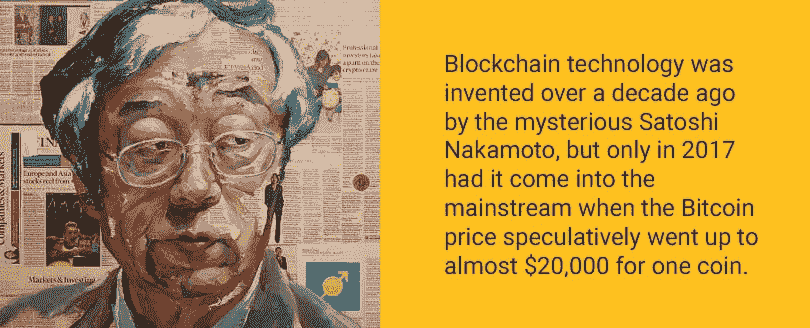

# 2019 年学习区块链开发的最佳资源

> 原文：<https://medium.com/hackernoon/best-resources-for-learning-blockchain-development-in-2019-ffcd5639739a>

*在制作*[*geek forge*](https://geekforge.io/)*——一个有趣的编码任务的每日列表——的时候，我们研究了几个你可以学习区块链开发的来源，我们认为与你分享这个列表是个好主意。*

区块链技术是由神秘的中本聪在十年前发明的，但直到 2017 年，当比特币价格投机性地上涨到几乎每枚硬币 20，000 美元时，它才成为主流。加密货币交易让一些人变得富有，然而，参与任何类型的交易活动都需要一定的技能，这些技能不一定与技术本身相关。

作为一名开发人员，不管加密货币市场的特定货币活动，包括比特币和以太坊，底层技术本身可能是一座金矿。区块链工程师的薪水正在飞涨，而且没有任何迹象表明会很快停止。考虑到财务利益，企业可以将区块链功能集成到其软件中并不奇怪。

下面，我为您精心挑选了最好的资源，帮助您开始学习或加深对区块链技术的了解。从纯理论到一般的演示，编码任务，甚至是一部网飞纪录片，一切都为你准备好了！

## 1) [区块链基础知识:以太坊，比特币，&更多在 Udemy](https://www.udemy.com/the-basics-of-blockchain/)

TED 演讲者 Bettina Warburg 将区块链的商业、经济和技术联系起来。

## 2) [从一个月开始学习区块链](https://onemonth.com/courses/blockchain)

这个免费的迷你课程解释了比特币的基础知识以及它所基于的强大技术——区块链。

## 3) [来自 GeekForge 的区块链编码任务每日邮件列表](https://geekforge.io/)

可以独立解决任务，也可以和社区讨论。这是让你学习新技术并建立你已完成任务的文件夹的最好方法。

## 4) [区块链:Coursera 的基础和用例](https://www.coursera.org/learn/blockchain-foundations-and-use-cases/)

本课程是面向开发人员和非开发人员的区块链的权威介绍。

## 5)[code mentor 区块链学习中心](https://www.codementor.io/learn/blockchain)

一个精选资源的集合，帮助您学习区块链编程，并了解区块链技术的最新发展。

## 6) [伊凡安科技学院区块链深度基础](https://ivanontech.teachable.com/p/blockchain-fundamentals)

本课程是为任何想深入了解区块链技术工作原理的人开设的。

## 7) [区块链:在 Lynda.com 超越基础](https://www.lynda.com/Blockchain-tutorials/Blockchain-Beyond-Basics/636127-2.html)

在本课程中，与 Jonathan Reichental 博士一起了解区块链以及分散式加密数据存储对企业和社会的影响。

## 8) [“掌握比特币:编程开放区块链”在亚马逊](https://www.amazon.com/Mastering-Bitcoin-Programming-Open-Blockchain/dp/1491954388/)

掌握比特币是你穿越看似复杂的加密货币世界的向导，为你提供参与货币互联网所需的知识。

## 9) [“区块链革命”在亚马逊](https://www.amazon.com/Blockchain-Revolution-Technology-Cryptocurrencies-Changing/dp/151135769X)

这本书还解释了区块链技术改变交易、货币和商业未来的不同方式。

## 10) [尼科西亚大学数字货币简介](https://digitalcurrency.unic.ac.cy/free-introductory-mooc/)

该课程由 Andreas Antonopoulos 和 Antonis Polemitis 教授，涵盖了去中心化数字货币的技术概述，以及它们更广泛的经济、法律和金融背景。

## 11) [比特币:是什么？在可汗学院](https://www.khanacademy.org/economics-finance-domain/core-finance/money-and-banking#bitcoin)

免费课程包括九个广泛的视频，谈论比特币、比特币的区块链、比特币交易、POW 共识机制等。

## 12) [认知类的比特币 101](https://cognitiveclass.ai/courses/introduction-to-bitcoin/)

了解这个令人兴奋的新数字支付系统的基本原理，用通俗易懂的语言解释，以便任何人都容易理解。

## 13) [斯坦福大学的加密货币班](https://explorecourses.stanford.edu/search?view=catalog&filter-coursestatus-Active=on&q=MGTECON%20515:%20Cryptocurrency&academicYear=20172018)

本课程将概述分布式账本和区块链技术的快速发展领域，重点关注经济和战略问题。

## 14) [普林斯顿大学的比特币和加密货币技术课程](https://piazza.com/princeton/spring2015/btctech/home)

学完本课程后，你将了解在阅读关于比特币和其他加密货币的声明时，区分事实和虚构所需的一切。

## 15)[B9 lab 面向开发者的以太坊介绍](https://academy.b9lab.com/courses/B9lab/X16-0/2016/about)

本课程将教你区块链的基本概念，并向你展示以太坊是如何运作的，以及你如何参与其中。

## 16) [网飞的比特币银行](https://www.netflix.com/vn/title/80154500)

这部纪录片以对爱好者和专家的采访为特色，涵盖了比特币的根源、未来和使其运转的技术。

区块链既不新也不旧；这才刚刚开始。加入技术革命就像访问上面列出的任何资源一样简单。你想从哪里开始？尽情观看区块链如何改变世界的视频系列，阅读“掌握比特币”的基础知识，或者在 GeekForge 上注册自己的日常任务。这些选择都比什么都不做好。