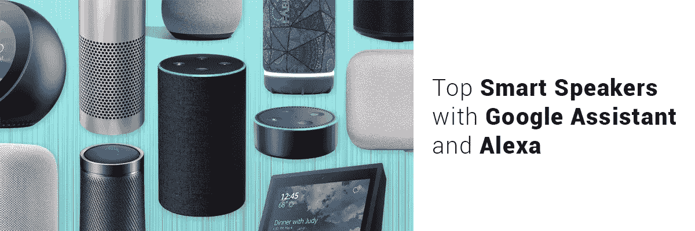
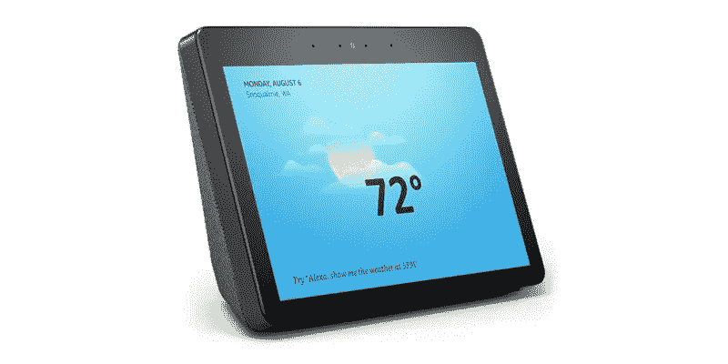
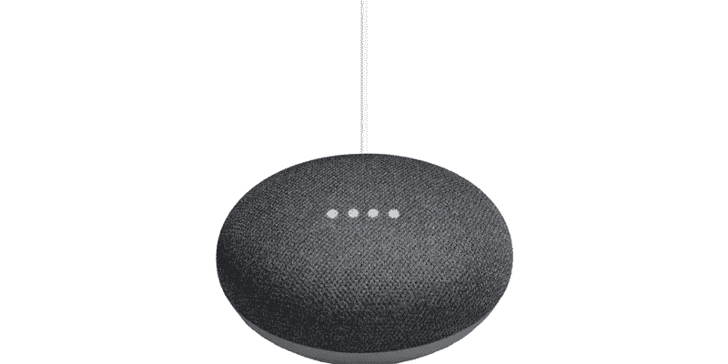
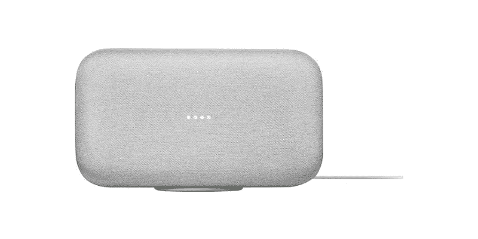
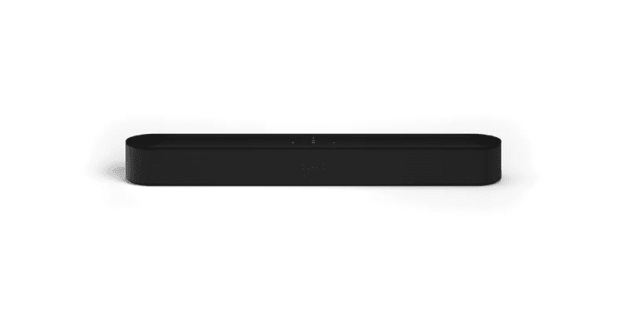
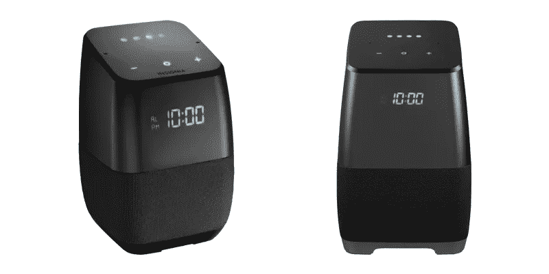
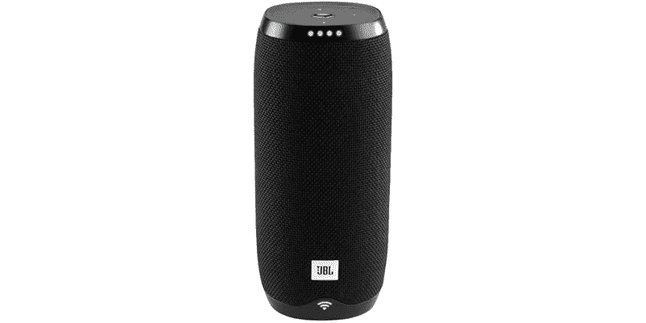
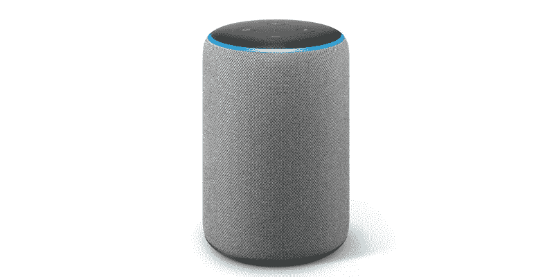
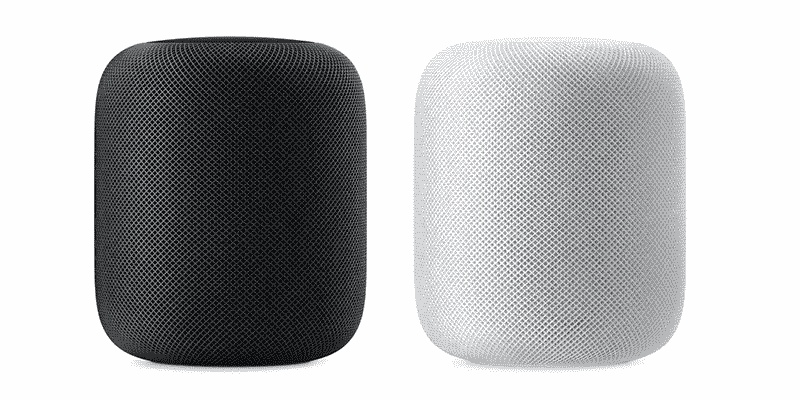

# 2019 年最佳智能音箱:你应该选择哪一款？

> 原文：<https://medium.com/hackernoon/best-smart-speakers-of-2019-which-one-should-you-opt-for-e4ff5f79463d>

市场上有几十种智能音箱。品牌种类越多，选择最好的[智能音箱](https://hackernoon.com/tagged/smart-speaker)就越困惑。

尤其是，[**Google home vs Alexa**](https://www.excellentwebworld.com/google-home-vs-amazon-alexa/)更是其他语音助手之间的热议。

如果你的脑海中充斥着这类问题:

**哪个的音乐质量最好？**

**无缝沟通买哪个好？**

**买触屏智能音箱值得吗？**

在这篇文章中，我们将讨论最热门的智能音箱，它们正在彻底改变我们的交流方式。

此外，它还推动普通人和企业将基于物联网的解决方案融入他们的家庭和企业。

# 亚马逊 Alexa 有最好的智能音箱吗？

随着市场上无数智能扬声器的出现，Alexa 已经领先于智能扬声器市场上的任何其他扬声器。

但是，是否有必要让所有的扬声器都根据用户的需求来实现这个目的呢？

# **亚马逊音箱:**

**亚马逊回声圆点**

**亚马逊 Echo(第二代)**

**亚马逊 Echo plus**

**回声秀**

**消防电视魔方**

**亚马逊回声斑**

其中，有一些扬声器适合不同的使用需求。比如说；聚会、家庭等。

# 最佳智能显示器

# 亚马逊回声秀(第二代)

该扬声器配有 10 英寸的全尺寸屏幕。你可以通过语音命令控制整个扬声器，但要通过屏幕查看正在播放的歌曲，可以暂停音频，跳到下一首歌曲，甚至检查歌词。

想看亚马逊 prime 视频或者每日简报视频？

亚马逊回声秀是给你的。

使用这款智能扬声器的最佳理由之一是它比第三方 Alexa 扬声器更有用，因为它可以调用和连接亚马逊的其他 echo 扬声器。

# 顶部迷你扬声器

# Google Home Mini

当谈到智能扬声器的范围时，谷歌是唯一一家在顶级智能扬声器方面与亚马逊进行激烈竞争的公司。

如果你对音乐不感兴趣，那么这个扬声器可能会让你感兴趣。紧凑、简单，但效率极高。

谈到小型扬声器的性能，谷歌 home mini 因其智能家居兼容性而领先于亚马逊的 echo dot。

音箱告诉你天气，为你播放白噪音，回答你随机的问题，比亚马逊的 echo dot 更有情境意识。

兼容性让你可以把它放在房间的任何地方，方便从一个地方搬到另一个地方。

# 什么对聚会最好？

# Google Home Max

如果你正在寻找一个强大的扬声器，用它的范围填满你的大房间或阳台，那么我们建议你去谷歌 Home Max。

由于其双 4.5 英寸低音扬声器，响度和低音是 Home Max 的 USP。触摸板音量控制性能良好，底部的磁性垫有助于扬声器滑动。

Max 根据你所在房间的声学特性自动调节声音，是不是很棒？

当 SONO 播放时，max 可以变得更大声，但是，它不像 Sonos 那样干净和平衡，但它在语音控制器选项中是无与伦比的。

# 顶级智能条形音箱

# Sonos 波束

Sonos 是一款小巧的条形音箱，用于连接电视。它集成了 Alexa、Airplay 和一些 Siri。Google home assistant 也即将进入 Sonos。

它可以很容易地无缝连接到其他 Sonos 扬声器。这样，您还可以添加其他扬声器来添加其他环绕声。

Sonos 在市场上的其他条形音箱中不是绝对最好的，但对于离开房间来说已经足够好了。紧凑的尺寸使其适用于各种尺寸的电视。例如，如果你拥有一台 fire 电视，那么 beam 可以通过语音命令播放电影和电视节目。

# 最佳床边伴侣

# 徽章声音

如果你想要一个负担得起的智能扬声器，那么你可能会想要 Insignia Voice。

该扬声器可以连接到谷歌主页，因为其正常价格从 25 美元到 40 美元不等。

它的正面有一个时钟，你也可以询问天气。音频清晰度真的很好，它做了你所期望的谷歌扬声器的一切。

# 顶部便携式扬声器

# JBL 链接 20

JBL 链接的可用性和便利性使其成为最受观众欢迎的演讲者之一。

JBL 链接 20 是防水和浮动的。当电池电量低时，它会提醒你还有多少剩余电量。此外，还可以了解 wifi 信号及其强度。

通过蓝牙配对也很容易。基本上，扬声器依赖于谷歌助手，谷歌助手在某些方面比 Alexa 更好。

设置非常简单，而且回答问题更加可靠。此外，它与谷歌地图、Spotify、Pandora 和 Youtube 音乐的兼容性是优于其他智能扬声器的优势。

**一些荣誉奖**也给上述演讲者带来了激烈的竞争。

# 亚马逊回声增强版

不仅是音乐，它听起来比亚马逊 echo 的任何其他扬声器都好。如果你想要更多的声音，你可以连接另一个 plus 和 Echo sub。

# 苹果忠诚者的苹果 HomePod

好吧，苹果唯一的最好的智能音箱只给那些与苹果合作了很长时间并且不想在一个品牌上妥协的人。

问题是它只能在 Apple music 上工作，不能像它的竞争对手一样控制许多设备。

**在苹果商店售价 349 美元。**

# 结论

目前是购买这些扬声器的最佳时机，因为大多数扬声器可能会使用几年。

Alexa 和谷歌正在创新新扬声器的方式，你应该选择与 Alexa 和谷歌助手的语音助手兼容的扬声器。

你对最好的智能音箱有什么看法？

欢迎提出建议和意见。