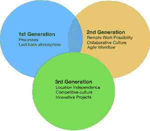

# 一如既往，2019 年最佳科技公司是虚幻的

> 原文：<https://medium.com/hackernoon/best-tech-company-to-work-for-in-2019-is-as-always-illusive-a1b88b87446c>

Workplace By rawpixel on pixabay

当你申请并敲定面试时，你经常会思考这是否是一个合适的机会。像 Glassdoor 这样的资源每年都会公布最佳科技公司。真正的答案比开发人员想象的要难以捉摸得多。

随着时间的推移，软件公司的发展速度比其他行业同行要快得多。原因很明显，因为他们通常是 IT 基础设施(云+互联网)的第一批受益者。根据趋势推断，将你未来的软件雇主分成三个不同的代是很容易的。你在为第三代软件公司工作吗？

## 什么是第一代软件公司？

他们经常无法进入最佳科技公司名单，因为科技公司已经发展了——在职业发展方面比其他行业好得多。但是他们还在附近。

他们蔑视那些吹嘘自己成功的工业时代企业的领导者。他们在一个几乎与 IBM 统治时期(T3)重合的时代(T2)蓬勃发展——在某种程度上也是苹果、微软、甲骨文的时代。这些公司对自己的流程引以为豪。更重要的是——这些过程旨在管理员工——并且经常缺少制造软件产品真正需要的东西。他们产品的伟大仅仅是几个摇滚明星开发者的结果，而不是整个团队的结果。

**症状:**

*   严格的时间和活动监控
*   橡木橱柜里放满了 60-70 年代的书，讲述着软件的一些创始原则——没有人从这个图书馆借书，但它们一直都在。
*   为经理和销售人员准备的高质量皮椅和豪华小木屋——与为开发人员准备的小隔间里的非 ergo 椅形成鲜明对比
*   无尽的文档—通常在纸面上。事实上，这是一个严格的规范——描述当用户的焦点移出每个文本字段时会发生什么——在 20 个字段的表单填充中。而且大部分时间都是需要写的！
*   手工测试是灯泡前的灯笼，你必须接受它。开发不能在 100%绿色测试用例评审之前开始，集成测试不能在 100%绿色单元测试图表之前开始。它们经常被记录在 excel 表格中，更糟糕的是，它们总是在团队内部通过电子邮件发送，但很少被版本化！
*   当产品到达最终用户手中时，制定规范的人可能已经退休/死亡/改变了这个行业。(不完全是，他们过去很有耐心！)
*   审查会议后的文档对正在构建的最终产品/服务几乎没有影响
*   你必须记录你工作的每一分钟——早些时候在纸上，现在在一个丑陋的监视系统中。
*   ISO / CMM 审核可能成就也可能毁掉你的职业生涯——确保你的食堂为审核员提供合适的食物，即使这不是你的工作。
*   更糟糕的是，对你的评估是基于你在上面写了什么。诚实往往会受到惩罚。
*   工作评估是基于行数的(**ewww…**)——员工通常会根据他们的代码编写量历史得到奖励。
*   这种奖励包括更具技术挑战性的任务，而不是金钱。
*   作为一名开发人员，你不能浏览互联网，除非它作为一种特权赋予你。
*   但是你得到了一部闪亮的私人电话(记住——没有手机！)在你的书桌上。尽情享受吧！

Photo by Jon Tyson on Unsplash

## 第二代软件公司的定义是什么？

准确地说，他们是谷歌一代公司，因为谷歌改变了一个软件公司应该如何更有效地运作，如果不是有效的话。事实上，这个时代诞生的公司引发了关于最佳科技公司的讨论。

吃这个:**尽管最初是一家广告公司，但在早期，谷歌提供的信息比他们从用户那里收集的要多得多，几乎是零。**

由于它倾向于内容相关性，与当时的其他选择相比，它以很少的广告费推动了初创公司的发展。与此同时，它也成为发现举行有意义对话的社区的工具——**Reddit**(2005 年)、 **Stackoverflow** (2008 年)和 **Github** (2010 年)。

这些社区建立了另一层超现代软件技术公司。因为互联网是他们的诞生地，因为互联网意味着*信息的民主化*，这些公司通过将他们的员工从第一代思维定势的束缚中解放出来来回报。

**我们来总结一下他们的症状:**

*   在工作场所浏览网页不是罪过，而是日常工作的重要组成部分。
*   受监管且有意义的网络浏览总是受欢迎的，但在办公时间浏览凯莉·詹娜的 instagram 仍然被认为是不酷的。不酷比面临禁令更可耻。
*   最小尺寸的文档是可以的，但是规格是不允许的。这实际上将你——开发人员——置于困境，因为你被假定知道事情应该如何工作，你必须修改它，直到它取悦你的经理。
*   会议是敏捷的，并且经常描述比源代码控制中更多的东西。
*   瓶颈是令人讨厌的，强调的往往是“让一切运转起来”，而不是“通用的解决方案”
*   如果你不出现在两周一次的啤酒聚会上，你就会被贴上“脱离文化”的标签，你必须解决这个问题。
*   远程工作是可以的，有可接受的借口(生病的孩子)，每个人都知道这是你的配偶想和你共度美好时光。<*眨眨眼。>* (电影院经常挤满了*远程*上班的老板:)。<*/使眼色* >
*   软件过程被敏捷工作流所取代，你仍然会被你完成的故事点所评判——不管那些故事点最初是如何分配的。
*   Scrum Master 即使在较小的团队中也是一个角色，如果你错过了推进 JIRA 门票或提交拉请求，你就是犯了通奸罪的女人，必须面对来自每个更大罪人的石头。
*   他们花更大的努力去了解什么让你快乐。额外津贴优先于薪水，你经常会被问及是否喜欢你的技术堆栈，尽管没有什么是可以保证的，因为这些选择通常是由业务需求决定的。

## 第三代软件公司的定义是什么？

像谷歌这样改变了人们工作方式的公司经常看到第二代公司的缺点，并在生命周期的早期就开始想办法改变科技员工的待遇。因此，我们有了第三代软件公司——它们不是靠名字存在，而是靠它们展现的文化存在。

**症状:**

*   在办公室里，很少或没有关于公司资产的规则——至少是有形资产:文具、互联网、健身房、自助餐厅、游戏室。该列表根据公司是 7 位数还是 10 位数进行扩展。
*   众所周知，脸书和谷歌提供了很多额外津贴，但是他们中的很多人也为你的孩子提供教育。只需查看一下[列表，其中包括熟悉的名字](https://tech.co/news/25-best-companies-perks-benefits-2017-12)，如 Paypal、Twitter、Airbnb、Intel 和 LinkedIn。他们中的大部分人总能进入最值得工作的科技公司名单。
*   它们都拥有中央知识库，人们可以在此基础上进行构建——预先构建的软件库和框架，人们可以随时使用。每一个开发者天堂都有相当规模的 Github 存在，包括[谷歌](https://github.com/google)、[脸书](https://github.com/facebook)、[苹果](https://github.com/apple) & [微软](https://github.com/microsoft)。
*   你可以将注意力转移到你感兴趣的项目上。谷歌不情愿地取消了 20%的宠物项目时间，但谷歌并不孤单。只要你不在交货日期上犹豫不决，通常，这种津贴是不需要宣布的。开源就是这样蓬勃发展的。这就是你如何通过在线学习获得更新的技术技能——即使是在工作场所。
*   **远程无处不在**:现在这才是令人兴奋的地方，如果你愿意，你可以称之为 **Gen 3.1** 。他们的基础设施允许开发人员在世界任何地方工作。这不仅仅是每周在家工作几天的优势。这是一辈子的。在泰国海滩工作不再是一种新时尚。虽然这可能适用于也可能不适用于巨头，但是有一些公司只存在于网络空间中。
*   你总是面临甜蜜的选择[根据生活成本选择工作场所](https://nomadlist.com/)，公司为你提供津贴。见鬼，你还可以直播你在海上生活时做的事情。
*   很少或很少跟踪工作时间。但是一些友好的合作工具总是会跟踪你——无论是 skype for business、微软 Teams、Slack 还是也被 WordPress 的开发者所使用。
*   准备好每年至少旅行一次，与你的国际同事会面，真正感受文化。

那么，问题出在哪里？

*   你可能已经想知道如何进入完全远程的公司——这就是套索变得更紧的地方。他们都有严格的 4-8 周面试系统，包括项目工作(通常在团队中)，以评估你是否真的适合独立工作。除此之外，整个过程并不透明，因为优秀的开发者很少写博客/吹嘘/抱怨他们遥远的天堂和地狱。这也是为什么它们是镖靶上最难瞄准的目标。
*   有些完全远程化的公司比第一代流程怪物还要糟糕——比如 GTeam (Devfactory)这样的 bodyshop。他们利用自由职业者平台上的开发人员——你正在等待 3 到 4 轮乏味的技术评估——一些你可以谷歌答案的测试，以及一些你可能有 1000 个理由失败/做出的奇怪的 it 项目。底线？所有关于雇佣和解雇员工的决定都是完全不透明的。
*   招聘代表是傀儡，呃，聊天机器人。
*   需求通常是高上下文的，这意味着您从单行中理解它们(“实现单点登录机制”)。如果没有谷歌你就无法编码，也不要问同事，因为你的每一分钟都是要付费的。任何与产品团队的期望相差甚远的事情都会让你被解雇。
*   如果整个团队是远程的，你的整个存在就是你在软件交付方面所完成的。你在公司中的存在不是由你是谁来定义的，而是由你所代表的开发者角色来定义的。祝你好运为你的工作感到骄傲。

## 结论:

Your best company to work for lies somewhere in the intersections

如果你开始在这张温图上绘制公司，你会注意到大多数最好的公司都落在与你自己的开发人员角色相吻合的交叉领域——这是使整个事情人性化的东西——你不能完美地分类它们——并不总是如此。

软件的目的是帮助人类，而不是取代人类。我的最佳选择既不是第二代软件公司，也不是第三代软件公司，而是介于两者之间的公司:第三代软件公司，提供创新自由，但自动化程度足以与人类保持联系；没有它，我永远无法更好地理解软件产品。

总而言之:也有一些程序员对他们在谷歌的角色不满意——他们中的很多人都是如此。“*最适合为*工作的科技公司”不是你去面试前阅读的一些一般数据，而是你的个人选择。

*原载于 2019 年 3 月 23 日*[*tipsnguts.com*](https://tipsnguts.com/the-grand-illusion-of-best-tech-company-to-work-for/)*。*