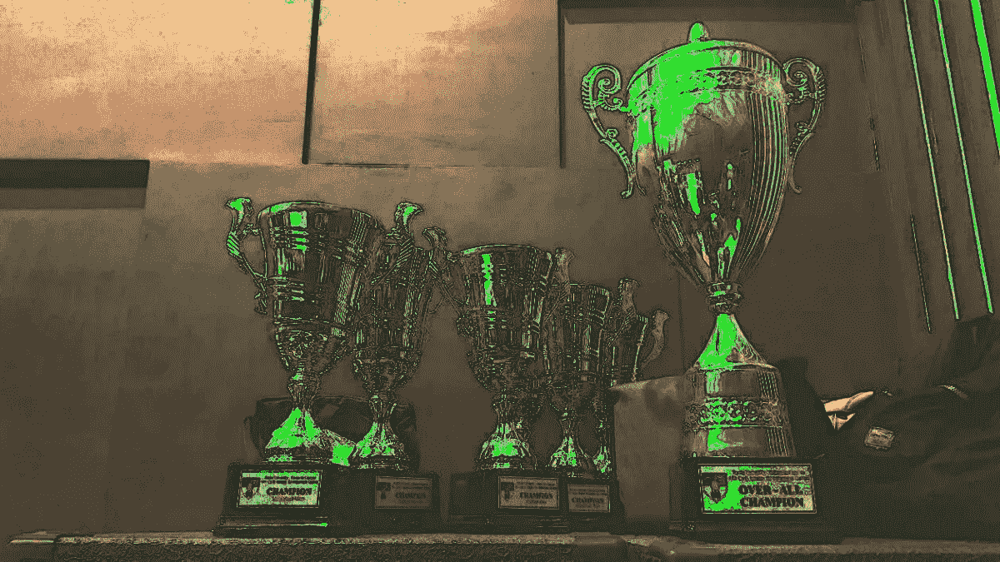

# 2019 年最佳科技故事(迄今为止)

> 原文：<https://medium.com/hackernoon/best-tech-stories-of-2019-so-far-1c2d78f89156>

## 你好好奇的黑客，

## 现在互联网上有这么多 2018 年最佳文章…在[黑客中午](http://hackernoon.com)，我们有前瞻性思维。以下是 2019 年度(目前为止)最好的 27 个故事。

**不过先来三个简短更新来自各地** [**黑客正午师部**](https://twitter.com/hackernoonhq) **:**

1.  [我们的股权众筹活动从 893 人](https://www.startengine.com/hackernoon) **中募集到**98.6 万美元。**Reg CF 最大募集金额为 107 万美元。 [**在一切结束前投资**](https://www.startengine.com/hackernoon) 。**
2.  我们将在明天(1 月 11 日)的[区块链连接大会:学术 2019](https://bit.ly/2M2xsn5) @三藩市万豪酒店成为媒体合作伙伴，[**Google Play**](https://hackernoon.com/useful-vim-tricks-for-2019-e7c1db7a18d6#)

    ## [牵引力](https://www.google.com/search?q=hackernoon.com%3A+traction&rlz=1C5CHFA_enVN829VN829&oq=hackernoon.com%3A+traction&aqs=chrome..69i57.2983j0j1&sourceid=chrome&ie=UTF-8)

    [**24 位专家在权衡:没有预算怎么获得流量？**](https://hackernoon.com/if-you-were-starting-from-scratch-in-2019-with-no-budget-what-would-you-do-to-gain-traffic-for-9196472e9d5e) 作者[数据，数据，数据](https://hackernoon.com/data-science/home)

    [**采访 kaggle 的数据科学家:Rachael Tatman**](https://hackernoon.com/interview-with-data-scientist-at-kaggle-dr-rachael-tatman-8bc61f9efdb9?source=collection_archive---------5---------------------)**by[Sanyam Bhutani](https://medium.com/u/a08b1e531f9c?source=post_page-----1c2d78f89156--------------------------------)(查看他关于[机器学习英雄](https://hackernoon.com/interviews-with-machine-learning-heroes-504762ba5dd6)的全系列)。***Rachael Tatman 博士:*** *就技术而言，我能给你最好的两条建议是，第一，尽可能多的练习。问问你是否能在当地活动或相关俱乐部发表演讲。你做的讲座越多，它们就越不让人伤脑筋，你就越了解什么对你有效。当你准备演讲时，练习是加倍重要的。在演讲前的一周里，我通常会每天至少排练两次，当我遇到尴尬的地方时，会做些小调整。当然，我不会对直播流这么做。我几乎把直播当成了技术采访；如果我犯了错误也没关系，只要我告诉你我在想什么，你就能跟上我的思维过程。我的第二条建议是尽可能具体。我个人最讨厌的一件事是关于“数据科学如何革新某些东西”的谈话，但那是非常模糊的。我想要我能实际应用的信息！如果你建立了一个做 X 的模型，谈谈为什么 X 很重要，你是如何建立这个模型的，是什么让你的模型与其他模型不同，以及它在各种情况下的表现如何。告诉我你具体做了哪些不起作用的事情，这样我就知道不要去尝试了。想想一年前你想知道的事情，然后告诉我。***

    ## **关于多样化的最后一个想法**

    **[**为什么每个人都应该投资 2019 年(注意，工程师)**](https://hackernoon.com/engineer-invest-2019-ac0794469c31) 作者[拉斐尔·贝尔丘](https://medium.com/u/2066c188a289?source=post_page-----1c2d78f89156--------------------------------)，他也写了现代时代的权威生产力帖子:[**2019 年或任何其他年份的 1337 个生产力技巧**](https://hackernoon.com/the-top-1-337-productivity-tips-for-2019-or-any-other-year-efdb241b97da) 。*2019 年刚刚开始，🎉我们又有了一个绝佳的机会来审视我们的生活、机遇、价值观和期望。***

    ****

    **Source: [https://dilbert.com/strip/2018-12-31](https://dilbert.com/strip/2018-12-31)**

    ***尽管是一个科技迷(*[*devo PS*](https://hackernoon.com/devops101-how-to-provide-infrastructure-to-your-startup-in-6-easy-steps-563b53e77281)*，* [*区块链*](https://hackernoon.com/blockchain-for-students-101-the-basics-part-1-f39b8201a7d5) *)，但我的道路向我展示了几种接近生活的方式和我所获得的知识。在某个时候，我注意到我们大学的教授没有教一些东西，这些东西会让我们成为更独立的人。钱。特别是，我对投资世界非常感兴趣，因为它可以让你用钱来赚钱。如果你不投资你的钱，它永远不会增加。你可能会花钱、送人或存钱(可能会在短期内花掉)。现在，你可能会问自己:为什么我们要关心投资和金钱？有哪些机会？我们不应该只是省钱吗？怎么开始好？如何避免被假古鲁诈骗？我们应该意识到的大局是什么？难道我们不应该把自己局限在对这个美丽宇宙的秘密奥秘的观察上吗？🌌***

    **直到下一次，不要把世界的现实想当然。**

    **亲切的问候，**

    **大卫·斯穆克**

    ****P.S.** 本周我们建立了 13 个新的集合，以便更容易地找到关于以下主题的精彩故事: [**生物黑客**](https://hackernoon.com/biohacking/)**[**比特币 ETF**](https://hackernoon.com/bitcoin-etf/)**[**区块链开发**](https://hackernoon.com/blockchain-development/)**[**编码**](https://hackernoon.com/coding/)**[**密码经济学**](https://hackernoon.com/cryptoeconomics/) [**黑客**](https://hackernoon.com/hacks/) **，** [**涟漪【XRP】**](https://hackernoon.com/ripple-xrp/)**，** [**安全令牌**](https://hackernoon.com/security-tokens) **，** [**技术经济学**](https://hackernoon.com/tech-economics/) **，&** [**科技女性**](https://hackernoon.com/women-in-tech/home)**********

    ******P.P.S.** [我们的股权众筹活动从 893 人](https://www.startengine.com/hackernoon) **募集到**98.6 万美元。**Reg CF 最大募集金额为 107 万美元。 [**趁早投资**](https://www.startengine.com/hackernoon) 。******