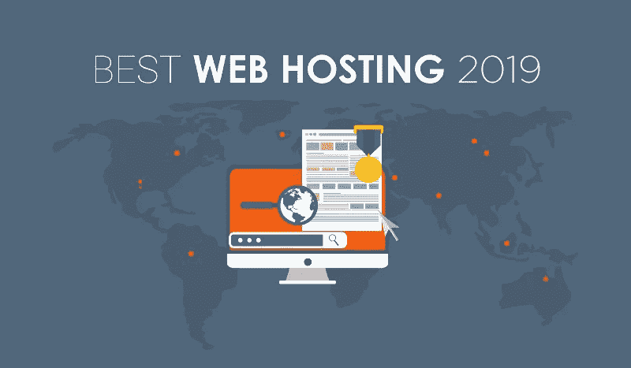

# 小型企业最佳虚拟主机服务

> 原文：<https://medium.com/hackernoon/best-web-hosting-services-for-small-businesses-75bfe010118d>

美国有如此多的小企业，如果它们都分裂出去，组成自己的国家，人口将超过 1.2 亿，大约相当于目前生活在日本的人口。

在过去，小企业可以靠口碑广告和多代顾客生存，但现在不行了。拥有一个可行的、吸引人的网站对于任何希望在竞争中保持优势的企业来说都是绝对必要的。对于没有经验的人来说，网站费用可能是一笔沉重的开支。小型企业的虚拟主机和网站维护是一个巨大的市场，有许多服务等级。找到一个适合你的特定需求的会花很多时间去研究，这是很多小企业主都没有的。

拥有一个好的主机也意味着你的网站维护会变得更容易。本指南着眼于市场上为小企业提供[虚拟主机的一些最好的产品，包括免费和付费的。](https://www.greengeeks.com/web-hosting/)

**GreenGeeks 虚拟主机:**如果你想在推广你的业务的同时给你的客户留下环保的印象，GreenGeeks 是一个很好的地方。其托管平台向电网中投入的可再生能源是向客户场所供电的三倍。它提供网络托管和 WordPress 托管，每月只需 2.95 美元，这也减轻了网站维护的痛苦。GreenGeeks 提供 24/7/365 支持，包括实时聊天、30 天退款保证和 99.9%的正常运行时间保证。

网站维护服务已经成为一个独立的行业，这就是为什么许多大大小小的主机服务提供商都积极参与提供相关的服务包。

十年前，GoDaddy 因其淫秽的超级碗广告而广为人知。那些广告印在人们的脑海里，让他们上网看看到底是怎么回事。今天，GoDaddy 拥有 1850 万客户，并非常关注小企业。它的博客上有数百个关于小企业小贴士的条目。它的经济优惠价格约为每月 8 美元，包括一个网站、100GB 的存储空间、不计费的带宽、一年免费的商务电子邮件以及一个免费的域名。他们还提供一系列网站安全服务，可以与您的整体托管计划捆绑在一起。

HostGator: HostGator 是一家可靠的一站式商店，可满足您的虚拟主机需求。对于新手来说，它提供了一个拖放式网站构建器，专注于模板和预制的部分，让你快速启动并运行。HostGator 可以从另一个 web 主机转移您现有的站点，也可以托管您现有的 WordPress 或 VPS 站点。其所有产品的主要特点包括通过电话或实时聊天提供 24/7/365 支持，99.9%的正常运行时间，以及保证 45 天[收回资金](http://www.assuredrecover.com)。

**InMotion 托管:** InMotion 是需要 [Magento 托管](https://www.greengeeks.com/magento-hosting)的企业的绝佳选择。它基于四个因素提供了三种不同的产品包:

*   需要多少个专用 IP 地址
*   需要多少可用内存
*   预期的每月保费转移将是多少
*   需要多少容错磁盘空间

其他功能包括端到端的客户管理、网站管理、综合报告和内置的、易于使用的 SEO 工具。

如果你有一个 WordPress 网站，并且想给它一个有很多附加功能的专用家，那么 Bluehost 是一个不错的选择。Bluehost 与 WordPress 非常一致，它包括了“一键安装 WordPress”的功能。这是它的特别介绍性优惠的一部分，每月只需 2.95 美元。该套餐还包括会员第一年的免费域名。还包括一个免费的 SSL 证书，这是一个很好的方式向您的客户展示他们的在线交易是安全的。如果你是一个 WordPress 鉴赏家，Bluehost 也提供其 WP Pro 功能，起价 19.95 美元/月。该软件包包括访问营销中心、Jetpack 站点分析、恶意软件检测和删除，以及 100 个免费的高级主题。

**1 & 1 IONOS:** 它没有最吸引人的名字，但 1 & 1 IONOS 是一家具有前瞻性思维的网络主机公司。它努力为经历快速增长的小型企业提供可扩展性。这体现在它提供免费的备份和恢复服务，并包括 10 个免费的电子邮件地址。此外，如果您的网站突然大受欢迎，1 & 1 IONOS 可以在几秒钟内增加您的内存和带宽以适应负载。

**Exai:** Exai 是当今市场上面向小型企业的领先解决方案之一。为什么？因为它是构建、托管和维护网站的一体化工具。该公司是针对小企业，正在寻找负担得起的，但可靠的小企业虚拟主机服务。如果您选择使用 Exai，您将获得顶级的可靠性、顶级的安全性、出色的客户服务和广泛的功能来支持您的小型企业。

*   安全的网站平台。
*   持续的客户支持。
*   顶尖的系统维护。
*   智能技术将帮助您脱颖而出。
*   发展业务的机会。

假设你根据自己的情况选择了正确的主机，但如果你在选择网站维护公司时选择了一个糟糕的选择，那该怎么办？同样重要的是，因为你不能独自完成这项工作，你需要专业知识在你身边。由于如今钱是一种稀缺资源，你不能继续把钱花在那些不会带来结果的公司上。

随着客户需求的增长，您将需要一个能做同样事情的网站。当你考虑投资一个虚拟主机网站时，记住不仅要考虑你的业务当前的需求，还要考虑 1 年、2 年和 5 年后的需求。