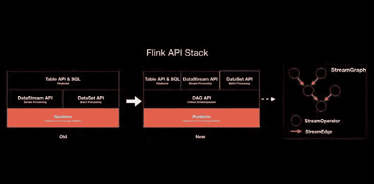

# 更好的给予和接受:阿里巴巴对 Flink 的开源贡献

> 原文：<https://medium.com/hackernoon/better-to-give-and-to-receive-alibabas-open-source-contributions-to-flink-295b3aef1da8>

## 在其 SQL 和运行时层之间，阿里巴巴已经帮助优化了 Apache Flink，用于像它自己这样的大规模生产环境

*本文是* [***阿里巴巴旗下 Flink 系列***](/@alitech_2017/a-flink-series-from-the-alibaba-tech-team-b8b5539fdc70) *的一部分。*

作为大数据计算的开源框架，Apache Flink 经过了广泛的优化，以满足一系列用户的增强需求。对于在大规模生产环境中部署框架的阿里巴巴集团来说，这些变化的需求促使其实时计算团队贡献了许多 Flink 最有价值的优化，使 Flink 社区和阿里巴巴都受益。

在本文中，我们关注阿里巴巴在该框架架构的两个关键方面的贡献，追踪包括 Flink 的查询处理器、BinaryRow 和 AsyncOperator 组件在内的开发。

# 贡献 Flink 的 SQL 层

为了使用户能够开发基于他们自己的业务逻辑的代码集，这些代码集可以由各种不同的场景同时运行，Flink 首先需要能够为这些用户提供一个统一的 API。阿里巴巴集团的实时计算团队确定，SQL 是实现这一目标的最佳选择，因为它是一个公认的经典，受益于批处理领域几十年的测试。

在流计算中，动态表的概念最近作为一种描述流计算的方式出现，它使用 SQL 作为批处理，基于等价的逻辑。这样，用户可以使用 SQL 来描述自己的业务逻辑，给定的查询语句在执行时可以是批处理任务，也可以是高吞吐量低延迟的流计算任务。此外，可以执行对这种报表的处理，使得在历史数据的处理被自动转换为流计算任务以处理最新的实时数据之前，首先使用批处理技术来计算历史数据。

在 SQL 声明式 API 下，引擎有更多的选择和更大的优化空间。接下来的几节将详细介绍几个最重要的优化。

## 用查询处理器优化 Flink 的 SQL 架构

阿里巴巴对 Flink 的第一次关键优化升级并替换了其 SQL 层架构。

通过研究或实际使用熟悉 Flink 的开发人员可能会意识到，Flink 有两个基本的 API:一个用于数据流(为流用户提供)，一个用于数据集(为批处理用户提供)。这两组 API 有完全不同的执行路径，也需要生成不同的任务来执行。在给定的一系列优化之后，Flink 的原生 SQL 层将调用 DataSet API 或 DataStream API，这取决于用户对流或批处理的要求。这经常导致用户在日常开发和优化中面临两套主要独立的技术堆栈，这意味着许多事情需要重复两次。这也将导致技术栈的一方的优化在另一方是不可用的。

为了解决这些问题，阿里巴巴在 SQL 层提出了一个新的查询处理器，主要由一个优化层(QueryOptimizer)和一个基于相同 StreamOperator 接口的查询执行器组成，该优化层可以尽可能多地被流和批处理重用。使用这种模型，超过 80%的工作(包括通用优化规则和底层数据结构)可以在两种技术栈上重用。同时，流和批处理仍然保留它们自己特定的优化和操作符来满足不同的作业。

## 用 BinaryRow 优化 Flink 的数据结构

在统一了 SQL 层的技术架构后，阿里巴巴开始寻求更高效的底层数据结构，让 Blink 在 SQL 层更高效。

在原生的 Flink SQL 中，统一使用了一种叫做 Row 的数据结构。它由一些 Java 对象组成，代表关系数据库中的一行。例如，如果当前数据行由一个整数、一个浮点数和一个字符串组成，那么 row 将包含一个 Java 整数、一个 Java 双精度数和一个 Java 字符串。正如开发人员所知，这些 Java 对象在堆中有很多开销，并且在访问数据时还会引入不必要的装箱和拆箱操作。

为了解决这些问题，阿里巴巴提出了一种新的数据结构，称为 BinaryRow，它像原来的行一样表示关系数据库中的一行，但以二进制存储数据。继续前面的例子，这三个不同类型的字段统一用 Java 的 byte[]表示，带来了很多好处。

首先，从存储空间中去除了大量不必要的消耗，使得对象的存储更加紧凑。其次，在处理网络或状态存储时，可以避免许多不必要的序列化和反序列化开销。最后，在删除了所有不必要的装箱和拆箱操作之后，整个执行代码对 GC 来说更加友好。

有了这种新的、高效的底层数据结构，SQL 层的整体执行效率提高了一倍以上。

## 优化实现级代码生成

在运营商的实施层面，阿里巴巴向 Flink 引入了更广泛的代码生成技术。Flink 的技术架构和底层数据结构的统一实现了许多代码生成技术的更大范围的重用。由于 SQL 的强类型保证，Flink 可以同时识别操作员需要提前处理的数据类型，从而生成更具体、更高效的执行代码。

在原生 Flink SQL 中，只有像 a>2 或 c+d 这样的简单表达式可以应用代码生成技术。由于阿里巴巴的优化，一些操作符能够执行整体代码生成，如排序和聚合，这允许用户更灵活地控制操作符的逻辑或直接将最终运行的代码嵌入到类中，从而消除函数调用的昂贵开销。此外，一些应用代码生成技术的底层数据结构和算法，如排序算法、基于二进制数据的 HashMap 等，也可以在流和批处理的操作符之间共享和重用，从而让用户真正享受到技术和架构统一的好处。通过为某些批处理场景优化数据结构和算法，还可以提高流计算性能。

到目前为止讨论的优化都集中在对 Flink 的 SQL 层的更改上。下面几节看看阿里巴巴对 Flink 的运行时层做出的重要改进。

# 改进 Flink 的运行时层

阿里巴巴的实时计算团队不出所料地发现了让 Flink 在阿里巴巴的大规模生产环境中扎根的诸多挑战。

## 支持大规模集群部署

在其他问题之前，将 Flink 与其他集群管理系统集成会出现一系列连续的问题，因为 Flink 的本地集群管理模型尚未完成，并且不能本地使用其他更成熟的集群管理系统。具体来说，阿里巴巴需要回答如何在多租户之间协调资源，如何动态申请和释放资源，以及如何指定不同的资源类型等问题。

为了解决这些挑战，阿里巴巴的实时计算团队进行了广泛的研究和分析，最终选择改造 Flink 的资源调度系统，以便 Flink 可以在 Yarn 集群上本地运行。此外，团队重构了主架构，使给定的作业对应于特定的主，这样主不再产生集群瓶颈。基于这一优势，阿里巴巴和 Flink 社区随后联合推出了新的 Flip-6 架构，将 Flink 资源管理变成了可插拔的架构，从而为 Flink 的可持续发展奠定了良好的基础。因此，Flink 现在可以在 YARN、Mesos 和 K8s 上无缝运行，有力地展示了这种架构的价值。

## 改进 Flink 的故障转移机制

在解决了上述挑战后，阿里巴巴接下来着眼于提高 Flink 的可靠性和稳定性，重点关注其故障转移机制，以确保生产环境中的高可用性。

这样做的第一步是改进 Flink 的主故障转移。Flink 的原生主故障转移重新启动所有作业，而阿里巴巴的改进确保了主故障转移不会以任何方式影响正常的作业运行。接下来，阿里巴巴引入了基于区域的任务故障转移，以最大限度地减少任务故障转移对用户的影响。随着这些改进，阿里巴巴的大量服务客户端已经开始将实时计算迁移到 Flink。

## 消除检查点瓶颈

Flink 的状态流能力是其最大的优势之一，因为其基于 Chandy-Lamport 算法的检查点机制支持其一次性一致性和计算能力。然而，早期的 Flink 版本在大规模数据量下遇到了检查点性能的特殊瓶颈，阿里巴巴试图通过优化检查点来解决这一问题。

首先，阿里巴巴开发了一种增量检查点机制，以处理阿里巴巴生产环境中大型作业产生的数十万亿字节的状态数据，因为实施完整的检查点将导致成本飙升。使用增量检查点机制，检查点的成本被降低到一个恒定但很小的流量。

其次，由于检查点文件数量不断增加导致的问题，阿里巴巴开发了一个在检查点合并小文件的模型。随着整个集群中 Flink 作业数量的增长，检查点文件的数量最终会超过 HDFS 命名节点。阿里巴巴的方法通过将大量较小的检查点文件有组织地合并成一个大文件，将 NameNode 的压力减少了几十倍。

## 使用 AsyncOperator 启用异步调用

尽管所有数据都可以存储在状态中，但由于历史原因，用户仍需要在外部 KV 存储位置(如 HBase)存储一些数据。然后，用户需要在 Flink 作业中访问这些外部数据，但是由于 Flink 一直是单线程处理模型，访问外部数据的延迟成为整个系统的瓶颈。虽然异步访问提供了解决这个问题的直接方法，但是用户很难在 UDF 中编写多线程，同时确保恰好一次语义。

为了解决这一挑战，阿里巴巴在 Flink 中提出了 AsyncOperator，这使得在 Flink 作业中编写异步调用变得非常容易，并为 Flink 作业的吞吐量提供了巨大的收益。

## 支持灵活的任务分派

Flink 的主要区别在于它的设计是一个统一批处理和流的计算引擎，因此它正在体验过其闪电般的流计算能力的批处理计算用户中获得兴趣。然而，批处理计算给框架带来了新的挑战，促使阿里巴巴通过原始组件贡献来解决这些问题。

在任务调度方面，阿里巴巴提供了更灵活的调度机制，可以根据任务之间的依赖关系进行更高效的调度。除此之外，Flink 的原生 shuffle 服务不与 TM 绑定，因此在任务执行后，原始 TM 被保留，资源不能被释放，而原始批处理 Shuffle 不合并文件(意味着它不能用于生产)。阿里巴巴在开发 Yarn Shuffle 服务功能的同时解决了这些问题，在开发新的 Shuffle 服务的过程中发现，在 Flink 的代码中，开发一个新的 Shuffle 服务涉及许多位置的不便入侵。为了使其他开发者能够轻松扩展不同的 Shuffle，阿里巴巴修改了 Flink Shuffle 架构，使其可插拔。作为如何部署的一个例子，阿里巴巴的搜索服务目前使用 Flink Batch Job 来服务于生产。

# 展望未来

上述优化涵盖了阿里巴巴三年的密集打磨，随后 Blink 开始有效地满足阿里巴巴作为大规模生产环境的独特需求。然而，运行时的优化和改进是无止境的，阿里巴巴继续致力于 Flink 未来版本的许多重要改进和优化。

*本文是* [***阿里巴巴旗下 Flink 系列***](/@alitech_2017/a-flink-series-from-the-alibaba-tech-team-b8b5539fdc70) *的一部分。*

# 阿里巴巴科技

关于阿里巴巴最新技术的第一手深度资料→脸书: [**“阿里巴巴科技”**](http://www.facebook.com/AlibabaTechnology) 。推特: [**【阿里巴巴技术】**](https://twitter.com/AliTech2017) 。