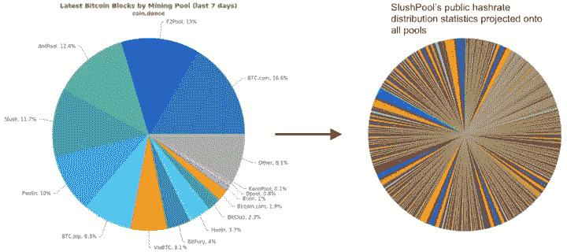
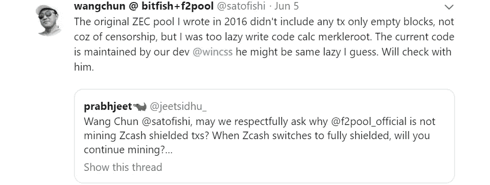
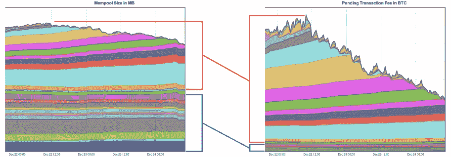
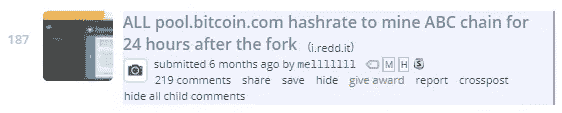
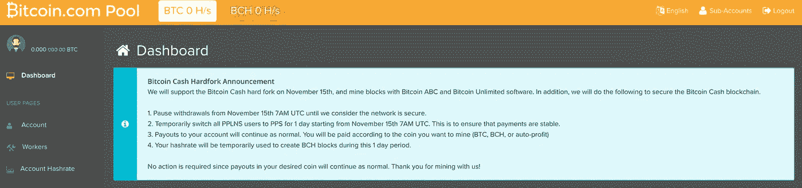
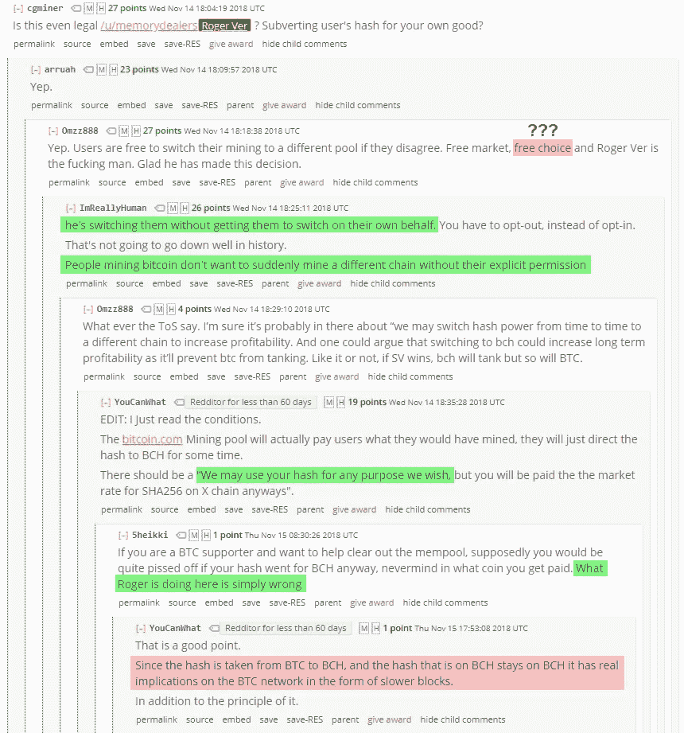
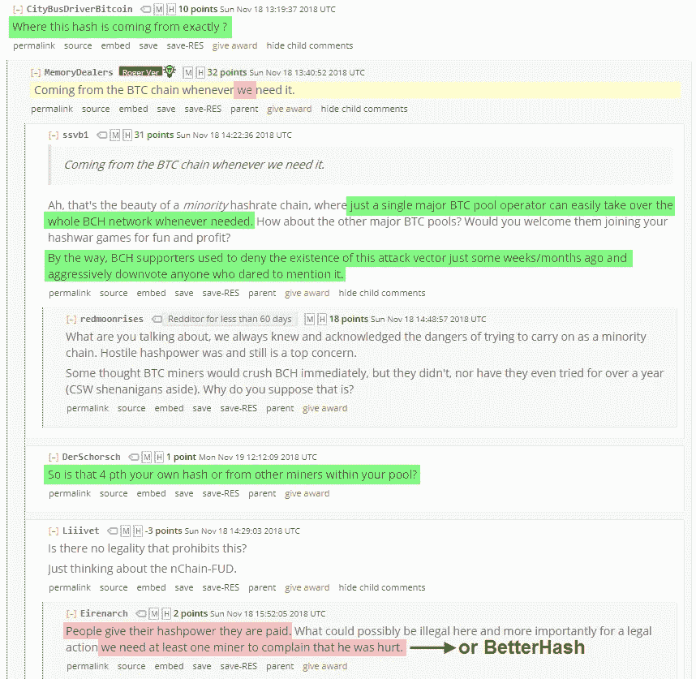
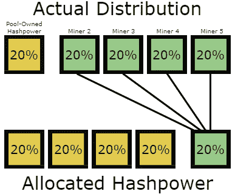
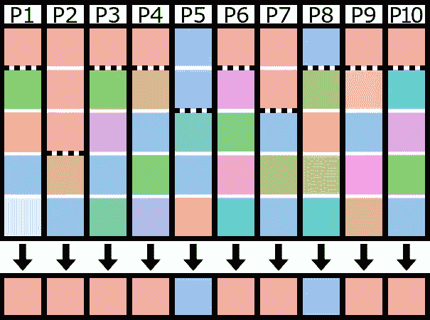
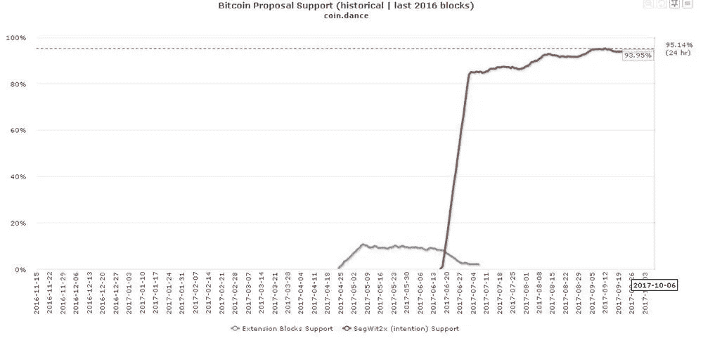

# BetterHash:用新的哈希协议去中心化比特币挖掘

> 原文：<https://medium.com/hackernoon/betterhash-decentralizing-bitcoin-mining-with-new-hashing-protocols-291de178e3e0>

## BetterHash 禁用的挖掘池利用概述

# 介绍

BetterHash 是目前正在开发的替代挖掘协议的工作名称。当它完成时，将需要足够多的矿工愿意使用这些协议切换到新的采矿池，或者现有的池愿意服务于新旧协议，同时矿工逐渐准备好切换。无论是哪种情况，最初的转变都需要有足够多的矿商支持，才能让这种转变有利可图，否则利润波动性会太高。最终，矿商将需要理解他们为什么应该转换，并且需要有前瞻性思维的资金池经营者，他们不想要目前资金池拥有的控制权。只有正确理解和传达当前系统的问题和风险，这种情况才会发生。

*免责声明:这不是一个分叉，或共识规则的改变。*

# 那么现在比特币挖矿到底出了什么问题？

比特币挖矿有一个表示问题。比特币挖矿*资金池*不是比特币*矿工，*然而资金池过度地向他们发出信号。池运行节点，构造块，选择事务，并可以选择所有 miner 的 hashpower 用于哪个 fork。这造成了一些激励问题，并使一些相当不受欢迎的政治杠杆成为可能。BetterHash 旨在解决这一问题，将这些责任交还给个体矿工，并从网络的更大利益出发，剥夺矿池的影响力。有了 BetterHash，矿工将控制他们自己的 Hash 权力，而 pools 将协调他们并分配奖励。

Mining **pool** hashpower distribution, versus Slush Pool’s **miner** distribution projected onto every pool.

本文旨在强调在*当前*采矿环境下可进行的各种开采，如果采用类似 BetterHash 的协议，则*不可能以牺牲矿工的最大利益为代价。池也可以被黑客攻击，然后被攻击者用来从事这种行为。在此之前，让我们简单回顾一下现有协议和 BetterHash 协议之间的结构差异。*

目前，许多矿工甚至不运行节点，只是使用 Stratum 之类的协议将他们的 ASICs 连接到矿池。该池运行节点，选择事务，创建他们想要挖掘的块，然后将该块发送给使用他们的池的所有挖掘者，挖掘者开始散列它。一旦矿工成功开采了一个区块，它就会被送回矿池，并被发送到比特币网络。

使用 BetterHash，挖掘者将单独运行他们自己的节点，选择事务，创建一个块，然后挖掘它。区块将被配置为支付该池，就像 Stratum 协议一样，那些不成功的区块*(称为“份额”)*将被矿工用来证明他们一直在为该池采矿。

**better hash 只是将创建要挖掘的块模板的人改为个体矿工**，而不是池所有者，然后围绕这个概念建立一个新的协议，从而规避了我们将要讨论的所有问题。

对于目前正在开发的 BetterHash 协议的更多技术概述，Matt Corallo 的演示应该足够了，但对于理解本文讨论的利用没有必要，因为概念上 BetterHash 在客观上更好，并且不需要存在完全编码的实现来理解这一点有多重要。

*应该注意的是，视频中提到的“BetterHash”这个名字并不确定。*

[https://www.youtube.com/watch?v=0lGO5I74qJM](https://www.youtube.com/watch?v=0lGO5I74qJM)

# 现状

为了理解为什么切换到 BetterHash 如此重要，让我们解开所有与矿工现在的事情方式相关的问题，如果他们使用 BetterHash 就不会存在这些问题。

简而言之，自己采矿的回报极有可能过于不稳定，这就是为什么自 2010 年以来就存在联营公司的原因。批评者将指向池分布，声称比特币采矿是集中的，尽管反驳者声称矿工可以切换他们使用的池，但事情并不总是那么简单。如果你是一名矿工，你的选择仅限于少数几个矿池，每个矿池都有自己的服务条款，你可能同意也可能不同意。池太大，无法提供多样化的选择。

在一天结束时，你别无选择，只能选择最适合你的游泳池，如果大多数或所有的游泳池决定一些你不喜欢或不同意的做法将成为规范，那么你没有真正的选择，只能处理这一点，因为开始自己的游泳池可能不会产生足够稳定的收入流。已经存在的矿池是相对较大的，并且通过在每个矿池下拥有许多矿工，矿池拥有超越他们的矿工的权力去做一些有问题的事情，我们将一个一个的讨论。

## 池可以:

*   确定哪些事务进入或不进入块
*   接受贿赂在合适的条件下重组区块链
*   积压交易内存池以抬高费率
*   未经同意的直接控制权&我的竞争对手
*   不诚实地我的，他们应该别有用心这样做
*   用矿工的权力表示对一项提议的支持

如前所述，所有这些问题本质上都是构建比特币区块的资金池而非矿工的直接结果。伴随池利用而来的是第三方对池的利用。池可以被黑客攻击，然后黑客可以潜在地进行这些利用，或者池可以从网络级别被攻击，然后矿工被留下来想办法解决问题或切换到另一个池。使用 BetterHash，池黑客将无法控制矿工的 hashpower，并且针对池的网络级攻击不会对使用该池的矿工产生直接影响。

网络级别的攻击同样令人担忧，如果不比利用其矿工的散列能力的池更令人担忧的话。攻击者可以破坏一大块 hashpower 或者随意重定向它。至少可以说，BGP 攻击很容易进行，从这些攻击中恢复所需的时间和资源令人担忧。**为了传达攻击者是如何轻而易举地窃取池的 hashrate 并利用本文中所写的任何漏洞**，请观看下面 3 分钟的演示:

[https://youtu.be/k_z-FBAil6k?t=353](https://youtu.be/k_z-FBAil6k?t=353) — Network level attacks discussed at the 5:52 mark, ends at 9:00.

毫无疑问，针对此类问题的协议有其好处，但针对前所未闻的潜在可能性的解决方案并不总是能很好地传达其必要性。我想揭示一些假设的场景，以及一些已经以某种方式发生的场景，这样必要性就更容易理解了。因此，让我们仔细看看它们是什么。*(请注意，其中一些是假设的，不太可能实际发生，一些需要非常具体的情况，而另一些已经以某种形式发生。)*

# 1:池决定了进入块的事务

在讨论 51%攻击的可能性时，经常会提出一个问题，如果可以说服足够多的池将某个交易类型或地址列入黑名单，即使是临时的*、*，那么如果您— *一个矿工—* 个人不在乎并会将它包括在内也没关系。这样做的动机可能是胁迫，也可能只是财务激励，无论是资金池自己的，还是外部支付给资金池的。

## 场景#1:审查服务的热钱包

想象一下，一家交易所的热门钱包被 40%的资金池列入黑名单，由竞争对手的交易所支付费用？它不会无限期地禁止钱包交易，但会明显减慢他们的交易处理速度。作为一名矿工，也许你不认为这种行为对生态系统是健康的，但也许你没有其他选择，因为你对你的游泳池秘密做什么没有发言权。

## 场景#2:审查机密交易类型

“Maybe the developer was the same kind of lazy”, resulting in code that ignored shielded transactions.

上面的[推文](https://twitter.com/satofishi/status/1136473662750486528)最终证明——*如果我们相信他的话*——这个例子是[非恶意的](https://twitter.com/nic__carter/status/1136592928388898816)，但是考虑像这样的事情被故意做的场景仍然很重要。比特币目前没有保密交易，可能永远也不会有保密交易，但它有不同的交易类型。如果一个池有这样做的理由，那么理论上他们可以忽略它们，这样特定类型的事务积压就会加剧，增加费用，并可能减慢任何使用这些特定事务的服务。

 [## ZCash 屏蔽交易审查

### 在 ZCash，隐私是可以选择的，不幸的是，这使得审查私人交易成为可能。

medium.com](/@levdubinets/zcash-shielded-transaction-censorship-12098f21090b) 

# 2:可以通过贿赂来重组区块链

与上面的例子类似，池可以决定它们不希望某个交易的某个特定的*版本*包含在分类帐中，然后尝试根据这个决定采取行动。这种情况几乎不可能自发或事后协调，但如果资金池如此倾向，那么只有少数几个资金池可以为贿赂做准备，然后立即采取行动，而矿工对此事没有任何发言权。

矿商可能认为，如果与他们分享贿赂，这符合他们的最大利益，但资金池给矿商的份额越高，就越没有动力这么做。此外，在黑客攻击的情况下，黑客可能会向池中行贿，使水变得更加浑浊。

这是在币安交易所被黑后提出的建议，尽管资金池没有为此做好准备，许多人利用这一点来论证比特币采矿被集中，而事实上，只有资金池对矿工有太多的影响力，甚至可能被滥用。关于这个问题的更多细微差别，请听下面的播客，并注意，如果使用 BetterHash，其中讨论的所有事情都无关紧要，因为如果矿工建造区块而不是池，这甚至不可能考虑。

# 3:池可以积压交易以抬高费率

资金池不仅可以禁止特定的交易，还可以选择忽略低于特定费率的所有交易，从而提高每个试图交易的人的成本。一些人认为这是一个无关紧要的问题，因为较小的资金池会抓住机会纳入这些交易，因为它们的回报更大，从长期来看是对弱者的回报。我不认为这是小事，因为我们已经看到这种行为的影响如何在政治舞台上引导短期内费用上涨的争论。

收费市场迟早会存在，但将网络限制在其一致认可的强制限制之下不应该成为一小撮人经营泳池的工具。虽然在池级别可能存在竞争来对抗这种行为，但我们继续看到选择池开采的[空块，因为财务激励是一致的，此外，在过去的实例中](https://www.theblockcrypto.com/tiny/close-to-19-of-mined-bitcoin-blocks-were-empty/)[几个特定池只有超过 5 satoshis/byte](https://www.reddit.com/r/Bitcoin/comments/6y5z6g/antpool_and_some_f2pool_miners_actively_refusing/) 的事务，即使积压中有剩余事务的空间。这可能需要泳池之间的一些协调才能产生效果，但如果激励措施一致，那么这种协调并不困难，甚至没有必要，现在一小群泳池运营商将拥有其他人没有的宝贵工具。

泳池也可以秘密地做到这一点。他们可以用看似合法的*但未经宣布的*交易来填充“未满”的区块，然后收集回自己，通过让人们、企业和费用估算者相信新的“现行费率”是真实的，来摆脱他们。一旦市场开始支付更高的价格，那么资金池可能会再次调整其恶意交易。在下图所示的时间里，在规模上处于底层 50%的 TX 积压**只占矿工从**费用**中获得的奖励的 7%。回报随着交易积压中的中间费率呈非线性增长，这使得这对于任何想要尝试这一点的足够大的池来说都是有利可图的努力。**

[https://www.reddit.com/r/Bitcoin/comments/7lwajx/spamming_the_network_unfortunately_doesnt_result/](https://www.reddit.com/r/Bitcoin/comments/7lwajx/spamming_the_network_unfortunately_doesnt_result/)

# 4:池可以不经同意直接使用 hashpower

从多方面来说，池选择延伸什么样的链。池喂养矿工一个街区，实际上只是说“开采这个街区”，矿工开采那个街区，直到有人找到它，然后池喂养他们下一个街区。矿工自己并不跟踪不同的分支，而且矿工通常认为该池是诚实的，并且开采你期望他们开采的硬币/叉子。许多矿工没有运行节点，所以他们没有验证共识规则。过去当池决定不再验证数据块，而是在无效数据块上进行“SPV 挖掘”时，这导致了[个问题。作为一名矿工，你应该想知道你的时间和金钱没有被你正在使用的游泳池浪费掉。](https://bitcoin.org/en/alert/2015-07-04-spv-mining)

## 一个场景:

你是一名矿工，你是 Pool_A 的一部分。你为 Pool 提供的 hashpower 数量会带来稳定的报酬。你已经做了数学，它检查出来，这永远不会改变。

Pool_A 的操作者决定使用您的 hashpower 为另一个面临风险的链提供“生命支持”。一个你不在乎，可能不喜欢或者认为是竞争的。联营公司继续为你的 SHA256 钻机支付“市场价格”,但是你的权力并没有*实际上*用在你认为你正在开采的链条上。

由于现在有一个完整的池在开采一个不同的链，网络的批量生产速度放缓——*减少回报*——市场可能被愚弄，认为对另一个链的支持比实际上更多——*减少你的链的潜在价值*。作为一名矿工，这可能是你想要避免的情况。不幸的是，**这种场景已经在现实生活中发生了**:

[https://www.reddit.com/r/btc/comments/9y5qpj/roger_ver_calvin_if_you_happen_to_watch_this/e9yj4fy/?context=10000](https://www.reddit.com/r/btc/comments/9y5qpj/roger_ver_calvin_if_you_happen_to_watch_this/e9yj4fy/?context=10000) [https://www.reddit.com/r/btc/comments/9x2ekv/all_poolbitcoincom_hashrate_to_mine_abc_chain_for/e9ozqes/](https://www.reddit.com/r/btc/comments/9x2ekv/all_poolbitcoincom_hashrate_to_mine_abc_chain_for/e9ozqes/)

# 5:池可以不诚实地使用矿工的哈希值采矿

把上面的场景看作是这种情况如何发生的最好例子:资金池对矿工们诚实地说出了他们的意图，他们至少在尝试补救他们认为会成为财务负担的事情。他们给矿工们提了个醒，告诉他们如果不喜欢就离开——这并不总是那么简单。但是如果他们不诚实呢？

Allocated Hashpower is what a pool signals to the world, but not necessarily what miners intended to mine.

如果一个池*显示*他们正在开采两个链，黄色&绿色&分别为 80% & 20%，而你正在通过他们开采绿色链，**你怎么知道他们是诚实的，只有 20%的矿工支持那个链？**他们可以单独告诉每个矿工*他们*是那 20%的人，他们是唯一支持这 20%的人，但实际上他们不是。矿工将不得不在辅助渠道上协调，并把他们的哈希值加起来，以确定他们是否被欺骗了。这方面的主要问题是，许多矿工是私有的，许多人希望保持私有，将保持私有，并且应该保持私有。像这样的协调是不切实际的避免被欺骗和操纵的方法。

这种谎言不仅允许完全利用所有矿工的联合权力，而且虚假信息可以影响市场对每个链条的估价。任何重视比特币网络长期健康的人都会希望避免这种情况。

# 6:池可以使用您的 hashpower 发出建议信号

这种操作的发生甚至不需要实际的链分裂。因为在实际的 fork 之前，池会向其保护伞下的所有 hashpower 发出信号，所以类似下面的情况看起来像是 80%的 hashpower 在发出支持或反对某个提议或 fork 的信号。鉴于发信号不是财务承诺，这样做几乎没有风险。如果你想让市场朝着你想要的方向发展，你只需要说服管理这些资金池的少数个人暂时发出支持信号。如果它失败了，就像我们看到的 NO2X 一样，那么它对矿池没有任何损失。无论结果如何，每个人的 hashpower 仍然工作。

Each column represents a pool. The top section of each column represents hashpower owned by that pool, while the bottom section is meant to represent the variety of other miners that use the pool.

没有人确切知道所有池实际拥有的权力与使用池的其他矿工拥有的权力的比例，但额外的透明度无疑是对沉默的大多数没有发言权的哈希权力的奖励。没有人希望出现另一个 NO2X 场景，也不应该有少数人能够“决定”大多数人支持某件事，而他们实际上并不支持。如果 BetterHash 几年前存在的话，也许 NO2X 运动就没有必要了。

Miners didn’t signal for Segwit2X, mining **pools** did.

# 结论:视角很重要

我预计人们在阅读这篇文章时会有两种不同的普遍反应，这两种反应我都已经从一些阅读这篇文章的人那里得到了。我认为向读者强调这一点并解决它是很重要的。

1.  “我不知道矿池有这么大的威力。”
2.  "这可能给人一种池拥有比实际更多控制权的印象."

对于“元考虑”，乍一看，人们可能会认为:

> “第一个人可能不太了解采矿或比特币，而第二个人已经在这个街区呆过了，理解其中的细微差别，足以更恰当地衡量这些场景。”

另一种看法是:

> “第一个人提供了一个新的、真实的视角来了解这个系统中的权力平衡，而第二个人已经存在了一段时间，已经变得太舒服了，对事情的方式和潜在的威胁麻木不仁。”

这两种最初的反应都是正确的。这两个元考虑都是有效的。如果 pools 没有可能滥用当前设置的系统，那么就没有动力去开发更好的协议，你也不会读到这篇文章。相反，如果资金池对比特币构成如此重大的威胁，那么他们现在应该已经以不可挽回的破坏性方式滥用了他们的权力。

## 除了这些两极化的观点，我希望你的答案是:

BetterHash 是需要实现的，因为 BetterHash 客观上比我们现在有的要好。池滥用和网络攻击应该是不可能的，我们可以通过**简单地让矿工运行他们自己的节点，以便他们可以创建他们自己的块**，并使用围绕这一简单但基本的变化构建的更好的池协议来缓解这些担忧。如果我们不提前解决我们知道如何解决的问题，总有可能会出现严重的问题，所以让我们来解决它。

# 额外资源

**Bob McElrath:** [分散的比特币矿池](https://www.youtube.com/watch?v=91WKy7RYHD4)

**与 Jimmy Song 合作:** [如何与 Matt Corallo 合作开发矿池](https://www.youtube.com/watch?v=dpCEa6NB7to)

**比特币做了什么:** [马特·科拉洛谈比特币如何工作](https://www.youtube.com/watch?v=Ew5m_NWEa7I)

# 更新

Slushpool 背后的公司 Braiins 宣布了“V2 地层”协议:

 [## V2 地层可能会彻底检查共享比特币采矿“比特币杂志

### 为了获得比单独采矿更可靠的收入流，如今大多数比特币矿工都通过矿池采矿…

bitcoinmagazine.com](https://bitcoinmagazine.com/articles/with-stratum-v2-braiins-plans-big-overhaul-in-pooled-bitcoin-mining) 

2: Blockstream 已宣布进军采矿领域，并正在为其池实现 BetterHash:

 [## 宣布区块流挖掘和池

### 今天，我们很高兴地宣布我们迄今为止最大的产品发布之一:块流挖掘！块流挖掘…

blockstream.com](https://blockstream.com/2019/08/08/en-mining-launch/)