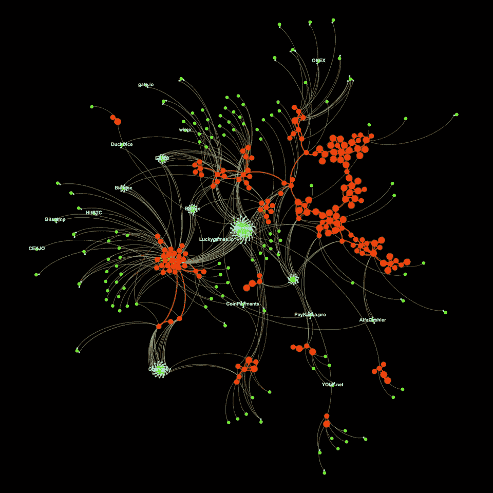

# 小心赠品骗局

> 原文：<https://medium.com/hackernoon/beware-of-the-giveaway-scam-4d5905b6d422>

如果你跟着钱走，你不可避免地会发现想偷钱的人。根据为《福布斯》撰写的文章 [Thomas Silkjaer](https://www.forbes.com/sites/thomassilkjaer/2019/04/05/the-dark-side-of-cryptocurrencies-scams/?ss=crypto-blockchain#b4573436c94e) ,诈骗者一直将目标锁定在 Ripple 的母语 XRP 的所有者身上，自 2018 年 12 月以来，这种情况一直在增加。

**什么是赠品骗局？**

术语“赠品骗局”是进入[密码](https://hackernoon.com/tagged/crypto)词典的又一个新术语。简而言之，该术语包括试图通过说服人们相信，如果他们向某个项目提供资金，他们将获得比他们投入更多的回报来欺骗他们，通常是通过“空投”。骗子通常冒充交易所或其他网站的客户支持部门，但更危险的是，他们在 Twitter、脸书和 Telegram 等社交媒体渠道上发布虚假资料，后者是加密相关项目尤其是 ico 的首选渠道。以太坊创始人 Vitalik Buterin 对这些骗局直言不讳，尤其是因为他的名字经常被骗子用来设立假账户。

**如何举报假账**

有办法举报这些假户口。去 [Bithomp](https://bithomp.com/explorer/fraud.html) 提交你认为是“骗局/诈骗 XRPL 账户”即可。然后 Bithomp 调查这些帐户，如果他们发现这些帐户是欺诈性的，他们会“向他们的 block explorer 服务添加警告，并通过 API 暴露这些地址。”

**有多少 XRP 赠品骗局？**

西尔科亚调查了《XRP 纪事报》，看看到底有多少“坏演员”参与了这一活动。他确认了大约 150 个与骗子或潜在骗子有关的账户。收到的付款总数为 1 830 笔，金额为 280 万 XRP。他认为，赠品骗局只涉及两个主要的诈骗集团，因为“一些支付目的地标签有多个关系，这意味着同一个目的地标签已被不止一个账户使用。”

**一点建议**

因此，如果你认为你可能成为 XRP 骗子的目标，这里有一个标准的建议:如果报价看起来好得不像真的，它可能是真的。不要向不明地址汇款，至少要谨慎。