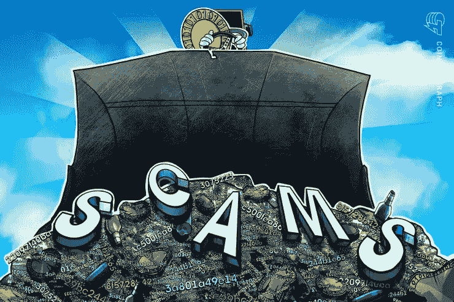
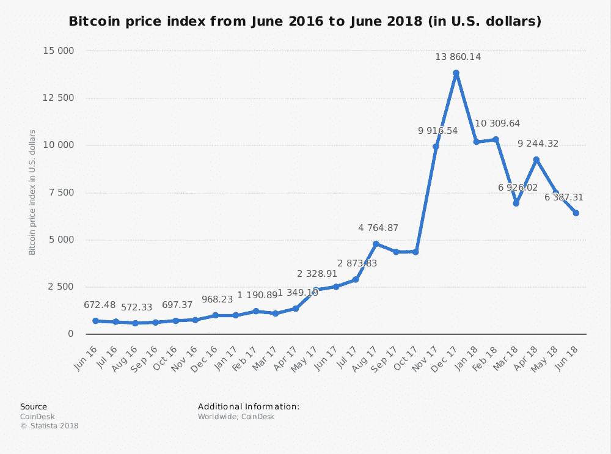
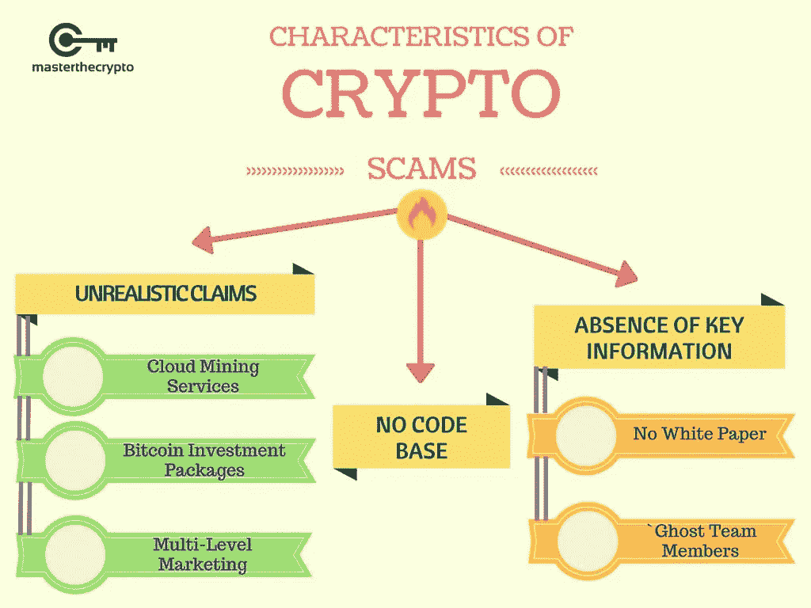
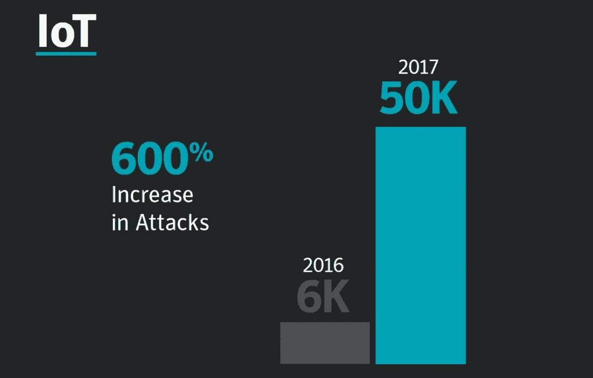

# 小心这 9 个加密货币骗局

> 原文：<https://medium.com/hackernoon/beware-of-these-cryptocurrency-scams-f49ef9b18a5d>

了解关于比特币骗局和其他加密货币的一些最新消息。让我们来盘点一下这种新型“货币”及其相关风险。

# 加密货币:欺诈增加

因为加密资产的世界不受普通机构(中央银行、金融市场管理机构等)的监管。)，很难获得欺诈数量的准确信息。这种监管的缺失吸引了对当前货币体系持批评态度的个人，以及自由主义经济观的倡导者，但这也增加了风险。

骗子通常会向投资者提供快速而丰厚的利润，并且知道如何坚持。身份盗窃案件也进行了审查，例如，中介冒充现有的律师事务所，使客户感到自信，然后再敲竹杠。

根据美国经济学家努里埃尔·鲁比尼的说法，五分之四的初始代币报价从一开始就是骗局。报告还指出，在这一领域运营的公司通常位于俄罗斯、中国或格鲁吉亚等透明度较低的国家。

金融市场管理局警告储户警惕加密资产诈骗:自今年年初以来，700 个人已经窃取了超过 3100 万欧元！

对于任何想要进入加密货币市场的人来说，谨慎比以往任何时候都更加合适！

**比特币下跌**

在 2017 年底超过 19，000 美元的门槛后，比特币不再值钱，在 2018 年 10 月初，只有约 6，500 美元。以太坊等其他加密货币经历了类似的下跌。

加密货币一词通常用于定义基于区块链技术的“虚拟货币”。然而，说加密货币会更严格，因为比特币或以太坊不具备传统货币的所有特征。

比特币历程的跳水未必是一个惊喜。许多经济学家，如“诺贝尔奖”获得者让·梯若尔、约瑟夫·施蒂格利茨或保罗·克鲁格曼，都对比特币的实用性表示怀疑，并定期警告围绕加密活跃世界的投机泡沫风险。

事实上，根据保罗·克鲁格曼(Paul Krugman)的说法，比特币没有给当前的货币体系带来任何东西，事实上是在新技术的掩盖下回到了 300 年前。

最后，围绕加密资产的欺诈已经导致许多个人离开，加剧了价格的下跌。

# 加密货币:如何避免骗局？

当加密货币诈骗越来越多的时候，如果你已经是受害者，发现主要的诈骗和补救措施。此外，找到我们的建议，以避免他们。

随着加密货币的普及和区块链技术的发展，虚拟货币的在线交易越来越快。随着越来越多的技术带来巨大的风险，骗子并不缺乏想象力来诱捕没有该领域经验的投资者。目前，尽管用户保持警惕，加密货币诈骗仍在网络上不断增加。

**了解主要的加密货币骗局**

这些骗局中最著名的是庞氏金字塔。伯纳德·麦道夫特别使用的这种技巧，是用新进入者带来的资金来回报客户的投资。最好的例子是 2015 年创造的 OneCoin。这种虚拟货币的创造者已经要求感兴趣的用户将钱兑换成 OneCoins。这些钱中的一部分用于支付其他受害者在购买投资后预期获得的金额。问题:这种加密货币不能在任何其他平台上兑换。

**推荐文章:**

 [## 如何从加密空投中获利并避免沿途诈骗

### 空投是加密货币领域的核心特征。第一次参加的时候，我甚至没有完全…

hackernoon.com](https://hackernoon.com/a-guide-to-navigating-the-world-of-cryptocurrency-airdrops-cef2777427db) 

另一个流行的骗局:假冒的加密货币交易平台。在这种情况下，用户信任一个网站或数字钱包来放置他们的比特币或其他加密货币。几天后，该网站将无法访问，投资者将永久失去他们的资金。2017 年，一个使用钱包比特币黄金的骗局已经向用户损失了相当于 300 万美元的资金。

网上挖矿也是一种新型骗局。提醒一下，由于使用高计算能力机器的未成年人操作的交易经过验证，比特币网络是安全的。根据赛门铁克的[报告，2017 年底，在网民不知情或加密劫持的情况下铸造的加密货币跃升了 8500%。](https://www.symantec.com/blogs/threat-intelligence/istr-23-cyber-security-threat-landscape)

**虚拟货币:骗局有哪些补救措施？**

银行有义务关注资金的来源和去向。这适用于他们所有的客户、个人和专业人士。事实上，《货币和金融法》第 L561-10-2 条规定，银行雇员“对任何特别复杂或金额异常高或似乎没有任何经济理由或合法目的的业务进行强化审查。”理论上，他们必须就交易的非法性、欺诈性或不稳定性对个人提出质疑。然而，通常很难援引银行收回资金的责任。

例如，在 ico 或首次发行硬币的情况下，这似乎是为创新融资的一个很好的方式，投资者应该被很好地建议在上游研究项目。事实上，经常发生的情况是，创作者不再提供任何消息，并带着投资者的资金离开。后者将没有追索权。更普遍的是，加密货币骗局的受害者可以通过填写在线表格或前往他们选择的警察局或宪兵队进行投诉。他们也可以联系 DGCCRF 或信息诈骗。

最后，诈骗的受害者也可以联系金融市场管理局(FMA)并报告欺诈平台。然后，它可以决定是否展开调查。然而，FMA 不会对受到经济处罚的受害投资者进行赔偿。大多数投资者无法收回他们的初始赌注。

**我们避免比特币和其他虚拟货币诈骗的技巧**

这些技巧可以帮助投资者避免加密货币世界中日益增多的骗局。

**查阅 FMA 金融市场管理局公布的黑名单**

FMA 定期发布[黑名单网站](https://fma.govt.nz/news-and-resources/warnings-and-alerts/)和提供加密货币等各种资产投资的实体名单。记得检查让你投资加密货币的网站是否在授权提供商名单上。

**不要低估投资加密货币的风险**

加密货币的投资目标是有经验的用户，他们对理解协议及其相关风险有最低限度的技术和财务需求。除此之外还有其他威胁:失去全部或部分投资资本、缺乏监管、缺乏详细信息、欺诈或诈骗。

**CFD 加密货币:需要双重警惕**

几家在线经纪商以差价合约(CFD)的形式向用户提供对比特币等数字资产的押注，以避免在线购买的技术复杂性。事实上，这种情况需要双重警惕:一方面是经纪人 CFD 批准的证明，另一方面是对 CFD 运作的了解。当心差价合约的杠杆效应，对于比特币这样不稳定的资产，这种效应的风险可能更大。

当局目前正在研究区块链，以避免失控，同时保护储户。从逻辑上讲，这一框架应该会进一步阻止骗子攻击加密货币市场。

# 顶级加密货币骗局

如果加密货币和 ico 大部分时间都是紧迫的，那么一些优惠都只是骗局，下面是我们的列表:

1.  [**【Bitconnect.com】**](https://hackernoon.com/bitconnect-anatomy-of-a-scam-61e9a395f9ed)这代表了近€16 亿的资本总额是基于一个原则你可以把你的 BitConnect 投资在 Bitconnect 贷款平台上(完全集中时很奇怪区块链的优势和分散)。然后，您将根据您的投资选择或多或少地获得每日利润，以及每天 0.10%至 0.25%或每月 40%的利率。Bitconnect 能够利用比特币的波动性进行 bot 交易，从而证明了这种回报的合理性。这让我想起了麦道夫的美丽故事，他也用纳斯达克的超级交易机器人解释了这些回报率。除了新客户之外，Bitconnect 还能支付利润，这要归功于它设立了一个非常不透明的角落。远离才是体面的庞氏骗局。
2.  [**Dascoin**](https://bitcoinafrica.io/2018/06/18/is-dascoin-the-next-scam-preying-on-new-cryptocurrency-users/) 多层次营销(MLM)公司，瞄准加密货币新投资者。其工作和操作风格与 OneCoin 传销颇为相似。这让我想起在我的国家印度，MLM 模式的 CoinX 交易骗局。创始人加德什·拉梅什后来因欺诈被捕。
3.  [**plex coin**](https://cointelegraph.com/news/us-sec-seeks-sanctions-against-individuals-behind-alleged-crypto-scam-plexcoin)**该提议指向一种新的基于以太坊的令牌，该令牌将提供“相关服务(PlexWallet、PlexCard 和 PlexBank ),旨在彻底改变加密货币的使用，并使其对所有人开放”,然而，有许多迹象表明这是一个骗局。关于拟议的 VISA PlexCard (Visa 卡)的无法核实和虚假的步骤。PlexCoin 网站缺乏透明度。提供项目的团队组成不明确。未知办公地址。匿名代理背后的注册域名魁北克金融市场管理局呼吁保持高度警惕，并要求关闭所有与 Plexcoin 活动相关的网站。**
4.  **[**Onecoin**](https://en.wikipedia.org/wiki/OneCoin) 大概是所有这些骗局中最知名的了。骗局是如何运作的？Onecoin 是一种基于庞氏骗局的代币，在直布罗陀 Onecoin Ltd .管理的私人区块上运行。由于积极的脸书营销策略，他的公司在一年的非法销售中窃取了超过 5000 万美元。意大利已下令停止所有促销活动，对这种货币处以巨额罚款。在经历了婴儿期的爆发式增长后，首席执行官刚刚离开的 OneCoin 现在必须面对后果。因此，意大利成为第一个对该公司处以 250 万欧元罚款的国家。**
5.  **[**S-Coin(Coin space)**](https://cointelegraph.com/news/onecoin-leads-top-3-scam-coins-list-s-coin-earthcoin-follow)在我们的加密货币骗局列表中占据显著位置。该公司出售风力发电，并希望通过电子邮件交付其令牌简直可笑。**
6.  **[**Earthcoin** 通过在该网站上的搜索，我们可以看到 Earthcoin 的市值约为 935，000 美元，可用供应量为 9，346，468，332 EAC，但这听起来不太有说服力。这些碎片是预先开采的，甚至是不稳定的，表明开发商不择手段。](https://cointelegraph.com/news/onecoin-leads-top-3-scam-coins-list-s-coin-earthcoin-follow)**
7.  **[**LCF 币**](https://steemit.com/cryptocurrency/@moneyforyou/lcf-coins-cryptocurrency-are-scam) 我们骗局名单上的下一个加密货币是 LCF。LCF 硬币让中国谈论它。目前，LCF Coins 处于预实施阶段，但没有任何网站或社交网络。相反，他们正在浏览谷歌表单。这看起来像是一个大骗局，表明罗斯柴尔德公司将是早期投资者。罗斯柴尔德公司已经警告了这种欺骗。**
8.  **[**百夫长币**](https://bitcointalk.org/index.php?topic=1780526.0) 也进入了我们的前十名。多亏了一个名为 Truffacoin 的意大利网站，我们可以看到《百夫长》是一个庞氏骗局。你有一个团队成员的名字，但是控制这个 MLM 计划的人的真实身份在一个迪拜公司后面是安全的。此外，根据他们的区块探索者，目前有 50 000 086 400 CNT 硬币在 12 月的第一区块被预开采。只是看起来很可疑。**
9.  **[**【Bitpetite.com】**](https://bitcointalk.org/index.php?topic=2356338.0)该网站提供了令人难以置信的每日 3.60%的回报率，持续九周就是 180%。但如何产生这样的回报全凭其随时收回投资的能力(没有流动性风险)。该网站涵盖了匿名比特币转账业务的这种回报，但没有任何行动可以支持这种回报，因此这是一个庞氏骗局(新投资者允许支付旧投资者)，直到它不存在的那一天。有足够多的新投资者来支付老投资者的回报。离开**