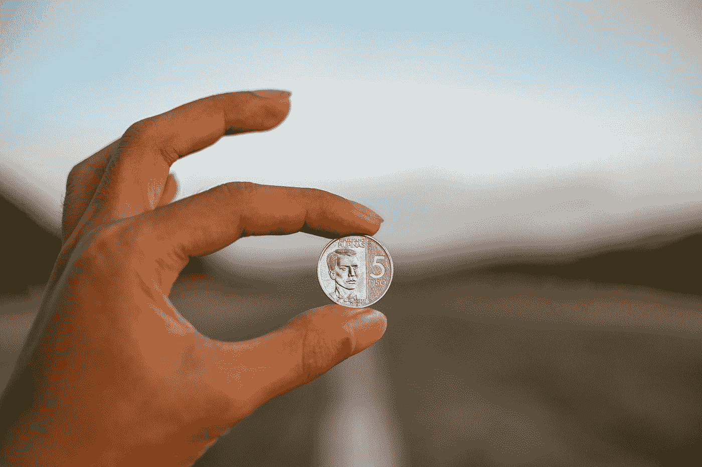

# 超越加密——区块链伦理

> 原文：<https://medium.com/hackernoon/beyond-crypto-blockchain-ethics-eabd8df6faf5>

Photo by [Virgil Cayasa](https://unsplash.com/@virgilcayasa?utm_source=medium&utm_medium=referral) on [Unsplash](https://unsplash.com?utm_source=medium&utm_medium=referral)

## 让伦理远离一个难以理解的话题是很容易的

这可能是一个众所周知的事实，但当我得知比特币的发明者是匿名的时，我确实感到震惊。一个隐藏的身份是否意味着区块链在线匿名的隐喻？或者，这是一种逃避责任的方式，因为它向世界释放了一个拥有足够权力最终统治全球货币的系统，却没有一个中央实体来监管它？

这个问题我没有答案。我认为区块链伦理学还没有被充分讨论到让我们知道。老实说，我认为没有人谈论这个，因为区块链是一个如此复杂的话题，大多数人甚至难以理解它是如何运作的。

几个月前，我也不知道什么是加密、区块链或比特币。这就是为什么我想让普通的非技术人员更容易接触到区块链的内部运作，试图开始一场公开的对话。对于那些一直想了解这一疯狂技术的更高层次、美丽概念的人，或者讨论不幸被忽视的黑暗面的人，在这里你可以找到一切。

欢迎来到*区块链的世界。*

# 这是什么？

自从 2008 年《 [*比特币:一个点对点的电子现金系统*](https://bitcoin.org/bitcoin.pdf) 》白皮书以化名中本聪写成以来，“区块链”已经成为一个不可避免的流行语。全球近 15%的金融机构都在使用区块链，很明显，这项技术正在迅速融入社会。尽管区块链技术不仅仅可以推动加密货币的发展，它最出名的还是运行比特币。

从根本上来说，区块链是一个完全去中心化的、非治理的交易系统。它通过许多节点运行在一起，形成一个区块链网络。每个网络包含一个分类账。这个分类账充当了真相的来源；它存储了网络上曾经发生过的所有交易。类似于银行如何存储用户的取款和存款交易，区块链分类账将存储网络上发生的每一笔交易。该分类帐对网络中的所有节点都是公开可用的。

比特币矿工可以运行自己的节点(计算机硬件)，希望通过处理能力和一点点运气的结合来获得一枚比特币。银行分类账和区块链分类账的区别在于，银行可以在任何时间点对他们的分类账进行修改，因为他们拥有所有的权力。另一方面，区块链总账不属于任何中央实体。它可由网络中的每个节点访问和拥有，[并且是完全不可变的](https://blocksdecoded.com/what-is-blockchain/)。

没有网络上的中央管理实体，每个交易都需要由大多数节点来验证。交易可以包括两个人之间转移加密货币，撤销旧交易，花费硬币，甚至阻止矿工使用自己的节点。例如，如果有人想将自己的比特币转移给其他人，他们需要网络中至少一半的节点来验证他们的交易。

很容易理解为什么这样的系统如此强大。

## 好人

加密货币最明显的好处是它为金融交易提供了更大的便利和自主权。在没有第三方管理货币交易的情况下，加密货币允许人们向他人汇款，特别是在其他国家，比以往任何时候都更加隐私和方便。

更进一步，在一个货币正在伤害人民的国家(见[欧元如何伤害希腊](https://www.washingtonpost.com/news/wonk/wp/2018/04/26/greeces-economic-crisis-is-over-only-if-you-dont-live-there/?noredirect=on&utm_term=.4ddefe7999f8))，一种不受监管的货币形式实际上可能对经济非常有益。加密货币没有中央集权，也没有政府干预，这意味着对这种货币的控制可能完全取决于普通公民的网络。在这方面，加密货币是自由主义者的梦想。

超越货币的思维，人类甚至可以开始使用区块链作为一个完全去中心化的网络世界的工具。区块链已经被用于[去中心化云存储](https://storj.io/)。在未来，我们可能不再需要盲目追随大型科技公司和他们的规章制度，因为互联网可能会变成区块链网。甚至有[讨论](/crypto-oracle/blockchain-securing-trust-identity-20eb0f05eead)关于区块链成为我们一直在寻找的存储我们个人身份的微小敏感数据的灯塔。

在这一点上，很明显，加密货币(实际上是整个区块链)有可能将数字世界的权力交到普通人手中，远离暴虐的公司或政府。

什么会出错？

# 不太好

## 51%的攻击和双倍支出

正如我之前提到的，区块链只是一起工作以创建网络的节点(人们的计算机)。这些节点的优点之一是它们的所有者是匿名的。不幸的是…这种匿名也是非常有害的。51%攻击是指一个人或实体获得了区块链网络的多数控制权(因此得名百分之五十一)。

51%攻击的最坏情况之一是双重消费，即一个数字货币单位被消费两次。这相当于有人用 20 美元在商店购买食品，然后用他们新获得的对美元的权力声明他们可以用同样的 20 美元再次购买他们想要的任何东西。

理论上，这可以发生在任何区块链网络中，只要规定的大多数节点同意交易。51%的攻击通常会导致重复消费的企图，因为“非法”交易很容易获得多数人的批准(因为多数属于试图进行“非法”交易的人)。

我用引号将“非法”括起来，以此提醒人们，对于一个无法无天、不受管制的实体来说，非法并不真正存在。

去年对 ZenCash 的攻击导致 55 万美元被重复花费。一次对比特币黄金的攻击损失了**1800 万美元。**实际上，2018 年是[历史上区块链袭击最严重的年份之一](https://unhashed.com/cryptocurrency-news/five-successful-51-attacks-earned-hackers-20-million-2018/)。这些攻击是一把双刃剑，因为随着公众得知攻击，目标加密货币在精神上贬值了。

这是一个重要的概念，因为它强调了一个事实，即*加密货币只有在人们认为它们是*时才有价值。(关于这个话题的更多内容，我强烈推荐阅读令人惊叹的尤瓦尔·诺亚·哈拉里关于[货币，就像宗教一样，只有通过相互信任才能发挥作用的思想](https://www.ynharari.com/topic/money-and-politics/)。

## 但是区块链孕育了可信度

精神贬值的好处甚至远不止阻碍 51%的攻击。加密货币的主观货币价值使得区块链技术不太容易腐败，因为它依赖于可信度。正如我前面所说的，银行可以对自己的分类账进行任何更改，或者在银行的任何用户都不知道的情况下，面临被黑客更改分类账的风险。

就区块链而言，只有当人们相信交易是真实的，他们才会重视加密货币。

> “区块链提供了数字信任的答案，因为它在公共空间记录了重要信息，不允许任何人删除它。它是透明的、有时间戳的、去中心化的。”—伯纳德·马尔

由于区块链公开与网络中的节点分享所有交易，透明性孕育了可信度；这直接赋予了加密货币货币价值。在一个分散的网络中，腐败是不受抑制的。

## 不受控制的系统滋生滥用

虽然区块链阻止腐败的概念是非常好的，但伴随这项技术还有一些更重要的伦理问题，我不能置之不理。

这些担忧大多源于无人管理网络这一事实。同样，股票的价值随着交易量的增加而变化，随着加密货币交易量的增加，加密货币的价值也会增加。

比特币早期的价格上涨(早期交易)可能几乎完全是由犯罪活动引导的。

由于网络中的每一笔交易都是匿名的，加密货币不受任何人控制，区块链因协助洗钱、出售武器或毒品以及其他传统的黑市交易而臭名昭著。许多人已经意识到对区块链网络进行潜在监管的必要性，但是该系统固有的分布式本质不允许任何集中监管。

为什么不试着去规范它呢？

要是有那么简单就好了。即使区块链理工大学被改造成允许集中监管……仍然会有问题。如果所有国家对产权、所有权、合同和交易都有不同的处理方式，那么如何才能制定出一套统一的规则或法律？如果对以前的交易有任何争议，谁是负责解决此冲突的管理实体？既然区块链是不可改变的，那么社会将如何处理一个遵守现代规则却无法遵守未知的未来规则的区块链呢？

# 我们做什么呢

此时此刻，区块链有可能走向两个截然相反的方向。网络的主观可信度可以产生一个道德的、分散的和值得信赖的平台，能够统一私有化的全球货币，使人类能够获得安全和私人的数字身份，并将互联网的力量交到人民手中。

或者，网络不可改变的性质和缺乏可治理性可能导致猖獗的滥用和系统脆弱性。

这就是为什么我早些时候问，中本聪选择匿名是作为一种声明，还是因为害怕承担向世界释放如此笨拙的技术和平的责任。

事实是，现在区块链出来了，没有什么能阻止它。那么，现在怎么办？

我不想写这篇文章来贬低区块链的好处。我也不想忽视这项技术的一些黑暗面。像往常一样，我只是想提高对这个话题的认识。

在我看来，解决问题的最佳方案来自受过教育的人的社区。希望我的话能为那些感觉被排除在对话之外的人充当理解的灯塔。对于那些已经在圈子里的人来说，也许这些想法激发了一些动力。不管怎样，我们该行动了。在教育和意识的引导下，让我们共同努力，利用区块链的惊人潜力，同时解决快速创新带来的一些意想不到的后果。