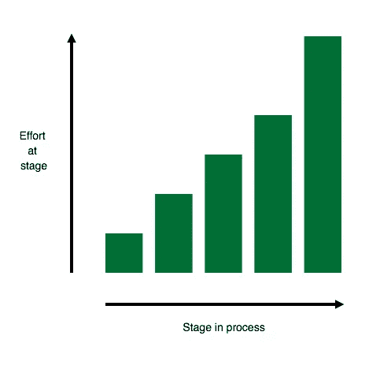
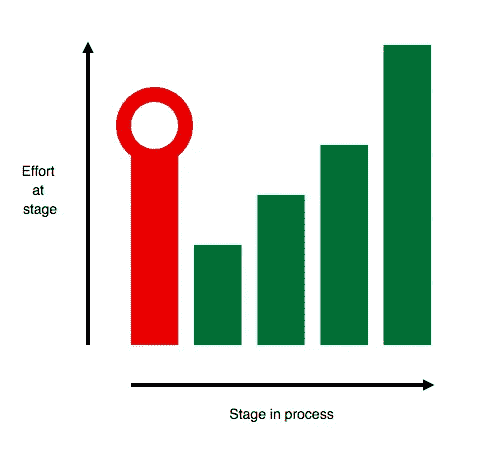
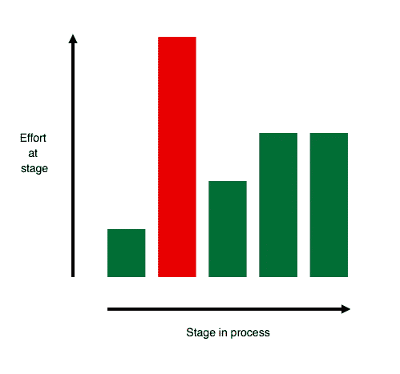
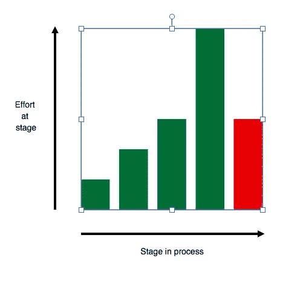
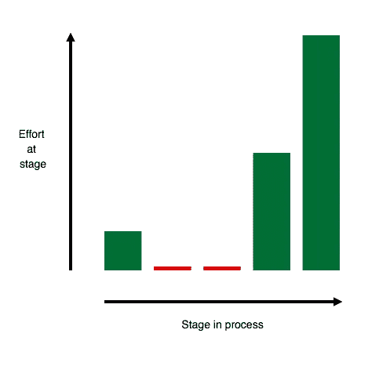

# 超越招聘漏斗:候选人攀升

> 原文：<https://medium.com/hackernoon/beyond-the-recruiting-funnel-the-candidate-climb-d9eb79ffcf0a>

Photo Credit: [Bruno Nascimento](https://medium.com/u/4f26fe4b9753?source=post_page-----d9eb79ffcf0a--------------------------------) on [Unsplash](https://medium.com/u/2053395ac335?source=post_page-----d9eb79ffcf0a--------------------------------)

如果你是创始人或经理，你能进行的最有效的活动之一就是招聘。在我们竞争激烈的市场中，这不是你可以搞砸的事情。

招聘流程的常见模式是*招聘漏斗*。从公司的角度来看，如果你观察候选人在招聘过程中的进展，事情就像一个漏斗。在漏斗的(宽)顶部是刚刚申请或你已经联系过的候选人。漏斗底部(狭窄)是你雇佣的候选人。漏斗越来越窄，因为在不同的阶段之间，候选人可能会退出漏斗——要么是因为他们对你的流程没有兴趣，要么是因为你认为他们不适合。

已经有很多关于招聘漏斗设计的文章:如何推动候选人前进，如何衡量你的进步，等等。这是一个很好的模型。但是漏斗模型是以 T2 公司为中心的。我想提出一个模型，从候选人的角度看问题。我称之为*候选人攀登。*

## 候选人攀登

在高层次上，候选人攀登与漏斗相似，它着眼于候选人在公司经历的不同阶段，以最终评估适合度。主要区别在于，候选人攀登不是看每个阶段的候选人数量，而是看(公司或候选人)花费的**时间和精力**。

典型的攀爬可能看起来像:

*   **候选人申请工作角色(低工作量)。**
*   **公司筛选简历(低努力):**往往简历几分钟([或几秒](https://www.glassdoor.com/blog/scanning-resumes/))就筛选完了！)
*   **初次聊天(中等强度):**求职者和公司人员之间 30-60 分钟的电话交谈。
*   **技术电话筛选(中等努力)**:应聘者通过电话进行一个小时的技术面试。
*   **现场面试(高强度):**候选人去公司进行为期一天的现场面试。

在那之后，可能还会有几个步骤:公司可能会进行一些背景调查，收集反馈，做出决定，然后延长和协商一份工作。但是如果你看看主要的阶段和需要的努力，它看起来像一个“攀登”。

A good climb

一次好的攀登的特征是:

*   增加努力(“分级”):候选人和公司在这个过程的早期花费较少的努力，只是在他们获得可能有合适人选的信心时才增加努力。
*   **平衡努力:**努力的增加在公司和应聘者之间是平衡的。双方都没有被要求单方面承担任何大型投资。

我意识到这听起来有点笼统，所以我将用一些我见过的公司应该避免的常见反模式来说明。

## “环跳”

**它是什么:**你在流程开始时要求候选人“穿过铁环”，要求他们在你的公司投资之前承担一项重大任务(例如一个项目)。

**为什么不好:**不平衡。可能会发生一些不好的事情。首先，最合格的候选人可能会在早期选择退出你的流程。他们可能有其他选择，所以他们为什么要在你之前投入时间呢？第二，如果你让他们通过测试，然后因为一个显而易见的原因拒绝他们，这是一个非常糟糕的候选人经历，这个原因可以在更早的时候发现。

**没问题的时候:**一些拥有大量候选人的公司可能会尝试使用这种方法，但同样，即使作为一个理想的雇主，早期跳槽也可能会让你失去最理想的候选人。在一些高工作量的情况下，你可能有很难评估的候选人——仅仅根据他们的申请，你可能已经拒绝了他们，但是你想给他们一个展示技能的机会。在这种情况下，在过程的早期进行具体的任务可能是一个好主意。

一些公司声称，这个环过滤掉了没有“承诺”的候选人。在这个过程的后期，当你表现出承诺的时候，这也是真的。但是如果你在早期就要求承诺，你可能只会得到绝望。

## “迅速升级”

Also known as the middle finger

**是什么:**在过程的早期，你进入了一个需要付出很多努力的阶段。例如，你可能在没有事先做任何筛选的情况下就把一个候选人带到了现场。

**为什么不好:**浪费你和应聘者的时间。也许有一个显而易见的原因，候选人和公司不太合适，但是在双方进行基本调查之前，你已经做出了很大的承诺。

**没事的时候:**有时候，你掌握的信息可信度很高，可能会让其他阶段变得多余。例如，也许你以前和那个候选人一起工作过，或者曾经面试过他们。或者有时，候选人可能时间紧迫，跳过一些阶段的风险可能是值得的。

## “安可”

**是什么:**在面试过程的最后，你用一个全新的、意想不到的步骤让应聘者大吃一惊——就像又一天的现场面试。

**为什么不好:**想象一下在马拉松比赛中到达终点线，却被告知*实际的*终点线还有一英里远。

**还好的时候:**偶尔，你可能会意识到，在你的过程结束时，你仍然遗漏了一些关于候选人的关键信息(或者可能有一些信息是矛盾的)。如果只是偶尔发生，也不是世界末日。但是如果有这种情况发生的模式，你的过程可能没有设计好，你需要找出如何在过程结束前更好地捕捉做出决策所需的信号。

## 宽阔的台阶

**是什么:**在你的流程的两个步骤之间，候选人需要等待很长一段时间。你在沟通或安排下一步行动方面行动迟缓。

**为什么不好:**一般来说，你的过程越慢，越容易流失候选人。他们可能会失去兴趣，或者被另一家公司抢走。

没事的时候:很少会没事。只要你不仓促行事，不马虎，不给候选人压力，你就应该尽可能快地行动。

候选人攀登只是对你的过程建模以避免常见“失误”的一种方式，所以这并不意味着详尽无遗。在招聘过程中，你可能会犯很多不同的错误，所以更一般地说，从应聘者的经历来看，你应该关注你的招聘过程。