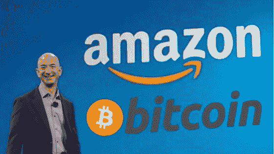

# 贝佐斯和比特币

> 原文：<https://medium.com/hackernoon/bezos-bitcoin-1baa8383518d>

他们有什么共同点？？ **RMF**

这不是一个关于 FOMO 的帖子。这是一个关于机会和抓住机会的帖子。这是一个关于 **RMF** 的帖子。

3 things very much worth betting on.

生活，尤其是在世界上更有特权的地方，我们不必担心基本的必需品，充满了机会。每一天，每一小时，每一分钟。

挑战在于知道选择哪一个，然后更重要的是，如何执行。

有些人会成功，有些人不会；如果你明智的话，你会从那些没有这样做的人仍然提供了大量的教训中得到安慰。

这也不是一篇关于我如何发现“杰夫·贝索斯买了比特币”或者他实际上是聪，或者他现在甚至在乎的帖子。

这是一篇关于你未来的自己可能会寄给现在的自己的两封信的帖子，以及一个由杰夫·贝索斯推广的心理框架，它列出了如何处理和利用这一代人最大的*潜在*机会之一，

> 比特币

是的。**比特币。**

现在——虽然你可能会说我疯了，有偏见，或者对互联网假钞的事情过于兴奋，但在你做出判断之前，请给我一点时间陈述我的观点。

# 现在是 2019 年。

我们环顾四周，一切都在“在线”运行。互联网的承诺是他们所说的一切，+更多；在不远的将来，它只会变得更加数字化和“在线化”。

马克·安德森的话听起来如此真实；

***软件过去、现在和将来都将继续蚕食这个世界。***

但并不总是这样。曾经有一段时间，人们谈论“互联网”是为了书呆子、怪人、黑客、投机者等。

互联网有起有落。互联网泡沫被认为是有史以来最大的市场“失败”,各种疯狂、愚蠢、聪明、过早、牵强的想法筹集了资本，最终吹了起来。

疯狂的想法无处不在……像网上书店、宠物店和鞋店——其中许多都失败了。但是——那些成功的人；改变了世界。不可逆转。

我想讨论的就是这些异常值——因为它们的重要性超乎你的想象。

接下来的 3 个视频是一次回忆之旅。

他们会让你谦卑，让你看到我们在不到两代人的时间里走了多远，并希望提醒你，总有一些重要的事情在边缘，就在拐角处。

## **1。20 世纪 90 年代初**

那时候，你必须去当地的图书馆，排队等着上电脑，花 20 分钟登录和连接，就为了发一封电子邮件..

今天，如果你的应用程序打开得不够快，你会想把它撞墙。

This is the internet…before search engines, email clients or any real GUI..

## 2.2000 年初

2003 年后。“网络泡沫”的大屠杀在每个人的脑海中仍然记忆犹新，这个疯子，杰夫·贝索斯，他的公司在崩溃中损失了 90%的价值，出来谈论互联网是如何改变世界的网络。

A true visionary

我已经分享了这个视频无数次，并将继续这样做，因为你可以用“比特币”来替换“互联网”这个词，听起来好像是在 2018 / 2019 年末录制的。

## 3.2000 年代中期

在杰夫开创性的 TED 演讲仅仅两年后，两个朋克小孩谈论他们建立的一些随机的“配对”网站。

这是崩盘后的几年，所以经济复苏如火如荼；但是这些概念被认为是边缘的、奇怪的和“少数人的”。

疯狂的工作。全部都是。

但是你猜怎么着…

## 数字

…如果你在 5 年前脸书上市的时候投资了它，你会赚 1000%。如果你在上面的视频中投资了 FB(不是说你可以，除非你是彼得·泰尔)，你可能会超过 100，000%。

2003 年的亚马逊怎么样？

你的 1000 美元将价值超过 750 万美元

而互联网呢？

如果你可以拥有它的“一大块”,那会值多少钱？

自从更广泛的公众采用互联网以来，你认为创造了多少生产力、创新和纯粹的经济价值？

我都不知道是否可以量化。

我举的一个例子是，我在 20 世纪 90 年代初购买了域名，并把它们作为“数字财产”。大多数。与 20-30 年前相比，现在 com 域名的价值会高出几个数量级。

即便如此——这只代表了互联网真实经济价值的极小一部分。

虽然你不能真正直接拥有任何互联网，但你可以通过脸书和亚马逊的世界，以及人们利用我们生活的这个数字化、互联、网络化的新世界的无数其他方式来接触互联网。

那么这一切有什么意义呢？

# 不对称

互联网是个例外。这是一场不对称的赌博，它从边缘地带不顾一切地获得了巨大的回报。

比特币很像，虽然这次；你实际上可以获得你自己的、自我主权的网络“块”——并拥有它；**直接*。***

请注意:我不是在对比特币和互联网的效用、功能或技术进行比较。从这个意义上说，它们是非常不同的。我正在绘制的连接如下:

a)它们都是通信网络。

b)它们都是一代人一次的边缘、异常赌注，有着不可思议的不对称上涨。

这才是最重要的，这也是为什么 10-20 年后，你很有可能会给年轻时的自己写两封信中的一封:

1.  感谢您的参与
2.  为什么我错过了？

像这样的不对称大约每一代只出现一次、两次或三次——尽管在过去的 30-40 年里，由于技术的发展，这种不对称很可能一直在加速。

无论如何，我个人已经 31 岁了，还太年轻，不能成为互联网早期的一部分，也不能成为最近的“移动互联网”子集有意义的一部分。

但是… 千禧一代，以及那些正在崛起的人，是这个新兴边缘领域的领导者。

我知道，如果一切都失败了，那只是这个过程的一部分，非常值得一试——但如果它成功了，变成了一笔“大买卖”，那么这将是我一生中最不对称的赌注之一。

另一种选择，即；知道这件事而没有参与，这不是我希望带着它到晚年的遗憾。

这让我想到了为什么我创造了这个博客；贝佐斯&比特币。

# 后悔最小化框架

当被问及为什么选择离开他在华尔街安全、高薪的工作，在这个被称为互联网的奇怪东西上追求一些随机的“在线书店”时，杰夫·贝索斯提到了他的 RMF，或“后悔最小化框架”。

用贝佐斯自己的话说:

> 我知道当我 80 岁的时候，我不会后悔尝试过这个。我不会后悔尝试参与这个被称为互联网的东西，我认为这将是一件非常重要的事情。我知道如果我失败了，我不会后悔，但我知道我可能会后悔的一件事是从来没有尝试过。

或者，如果您喜欢 3 分钟的快速剪辑:

Jeff’s RMF

*大多数遗憾是疏忽的结果，即:“不参与”，相对于委员会，即；做了某事。*

这句至理名言来自一个白手起家的人，他改变了世界&成为了历史上最富有的人。

所以…..

# 买些比特币

虽然我很清楚这种隐含的偏见，但作为比特币交易所的创始人，我们建立 Amber 的原因是因为我们相信世界上每个人都应该拥有一些比特币。句号。

不需要太多。

不一定是你一生的积蓄。它不应该过于复杂，并且您应该能够利用技术来自动化这个过程。

通过帮助你将美元平均成本转换成比特币，用你的零钱，你没有注意到的钱有一天也可能:

1.  消失，因为整个比特币的事情失败了；你永远不会注意到/它不会对你的生活产生任何实质性的影响。
2.  价值是它的 100 倍，你肯定会注意到。如果你每年 1000 美元的零花钱在 5-10 年内变成 50 万美元或 100 万美元，你的生活会受到什么影响？

圣诞节时，我让我妈妈、妹妹和其他几个亲戚住在琥珀里。

我姐姐说:

“我到底要用比特币做什么？”

我回答道:

“我希望我有一个哥哥，他在 14 年前给我买了一些‘无用的’亚马逊股票，并告诉我忘记它，或者更好的是从那时起每周向它投资 50 美元”。

这是这里最重要的信息！

如果你正在读这篇文章，不要错误地认为比特币是一种短暂的时尚，是边缘怪人的专利——因为边缘很可能成为焦点，让你只能从外面看。

现在一个小期权的价格，在未来一文不值地到期，远低于未来因为没有坚持到底和抓住一个小机会而后悔的代价。

买点比特币；不管是琥珀还是其他应用。

把它放在一边，不要碰它(除非你需要)，尽可能多买一些，用 Amber 这样的工具自动完成最后一部分，享受这一过程。

接下来的 20 年将不同于我们所见过的任何事情。

我希望你能从中得到一些价值。这是我自己的信息&所有@ Amber 团队都坚信这一点。

祝大家在 2019 年迎来精彩、繁荣的新篇章。

*如果你喜欢这篇文章，请给它一些爱，为它鼓掌(或几下)，并把它传给你认为应该读一读的任何人。*

**阿列克斯**

**CEO &联合创始人@ Amber Labs**

[www.getamber.io](http://www.getamber.io)

你可以在这里找到更多我的作品:

 [## 亚历山大·斯维茨基—中等

### 琥珀实验室的首席执行官+decentralizedpodcast.com.au 的共同主持人。比特币、金钱、哲学、商业、初创企业和企业家精神的出口

medium.com](/@AleksandarSvetski)  [## 亚历山大·斯维茨基——黑客正午

### 阅读《黑客正午》中亚历山大·斯维特斯基的文章。CEO @ www.getamber.io + Co 主持人@decentralizedpodcast.com.au…

hackernoon.com](https://hackernoon.com/@AleksandarSvetski) 

您可以在这里联系我:

 [## 亚历山大·斯维特斯基|职业简介| LinkedIn

### 查看 Aleksandar Svetski 在 LinkedIn 上的职业简介。LinkedIn 是世界上最大的商业网络，帮助…

www.linkedin.com](https://www.linkedin.com/in/alekssvetski/)  [## 亚历山大·斯维茨基(@亚历山大·斯维茨基)|推特

### Aleksandar Svetski 的最新推文(@AleksSvetski)。对金钱、BTC、人类学感兴趣的无毛黑猩猩…

twitter.com](https://twitter.com/AleksSvetski) 

跟着安珀走:

 [## 琥珀|随处投资

### Amber 是澳大利亚第一款让你用零钱兑换比特币和其他数字资产的应用。获得…

getamber.io](https://getamber.io)  [## 琥珀

### 制作数字货币…容易的

medium.com](https://medium.com/heyamber)  [## 琥珀

### 安珀。集应用程序、数字货币兑换和钱包于一身

www.facebook.com](https://www.facebook.com/getamber.io/)  [## 琥珀(@amberexchange) |推特

### 琥珀的最新推文(@amberexchange)。购买、出售、交换和存储数字货币，只需从您的…

twitter.com](https://twitter.com/amberexchange)