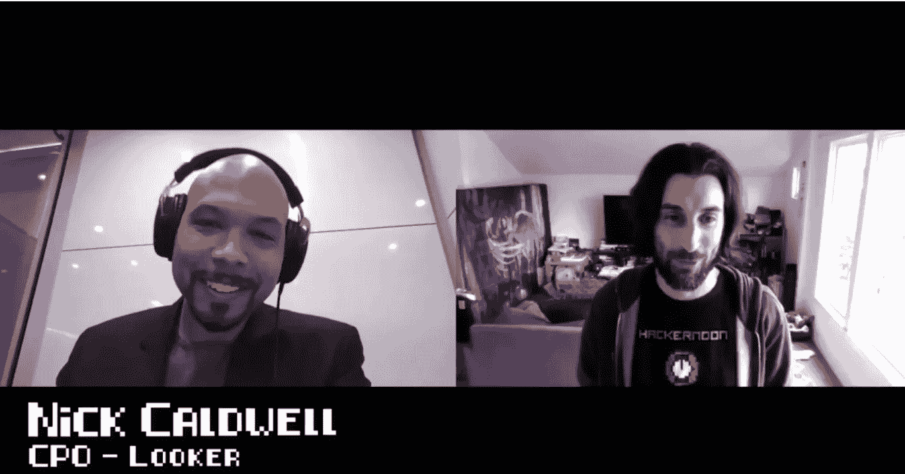

# 大数据和机器学习，来自 Looker 的 Nick Caldwell

> 原文：<https://medium.com/hackernoon/big-data-and-machine-learning-with-nick-caldwell-14ed702b1c64>

## 黑客午间播客第 39 集:在 [Looker](https://looker.com/) 采访前 Reddit 工程副总裁 Nick Caldwell CPO。

## 在 [iTunes](https://podcasts.apple.com/us/podcast/hacker-noon-podcast) 或者[谷歌播客](https://play.google.com/music/m/Dfuna5a4pzsmjr76bxabkxdrhim?t=Product_Iteration_with_Hacker_Noon_Interim_CTO_Dane_Lyons-Hacker_Noon_Podcast)上听采访，或者在 [YouTube](https://youtu.be/JGSnHpaCqZE) 上看。

在这一集里，Trent Lapinski 采访了来自 Looker 的 Nick Caldwell，你可以了解大数据、机器学习和人工智能。

> “现代数据存储非常强大。你可以把成吨成吨的数据放进去。您可以在不降低速度的情况下查询它们。在某些情况下，你甚至可以在数据库中进行分析。我们只是看到了数据层变得越来越强大的趋势，而 Looker 正在顺应这一趋势。”
> 
> “我最喜欢的学习还是数据工程领域正在发生的事情。当时，对我来说，这个大问题简直令人震惊。您将 4-5pb 的数据转储到一个大数据存储中，并一次性对其进行查询。对我来说太棒了。我不知道这是可能的。你可以以一种负担得起的方式做到这一点。”
> 
> “我的学位专注于机器学习，我认为现在当人们问我这种正规教育时，我会告诉他们，‘你可能不需要它。’你可以在机器学习方面走得非常非常远，只关注它的实际应用，而不必理解它的底层数学。我认为这是一个非常强大的东西，抽象。"
> 
> ***—尼克·考德威尔***

 [## 尼克·考德威尔的大数据和机器学习

### 黑客正午播客第 39 集:采访尼克考德威尔 CPO 在 Looker 和前工程副总裁在…

www.podbean.com](https://www.podbean.com/media/share/pb-fc8kt-ae7307) 

制作和音乐德里克·伯纳德—[haberdasherband.com/production](http://haberdasherband.com/production?fbclid=IwAR2d8t0cNGHRm1ajmUNWKZ-TMUMawREhvIHSy54LKcOElf7v_TOvkAjZ78Y)

主持人:特伦特·拉平斯基—[https://trentlapinski.com](https://trentlapinski.com)

*P.S .如果你喜欢新的* [*黑客正午播客*](http://podcast.hackernoon.com/) *，考虑一下* [*在 iTunes 上给我们一个 5 星评价。*](https://itunes.apple.com/us/podcast/the-hacker-noon-podcast/id1436233955?mt=2)

## 还可以查看[四月头条](https://hackernoon.com/archive/2019/04)、[最新报道](https://hackernoon.com/latest-tech-stories/home)和[今日首页](http://hackernoon.com/)。