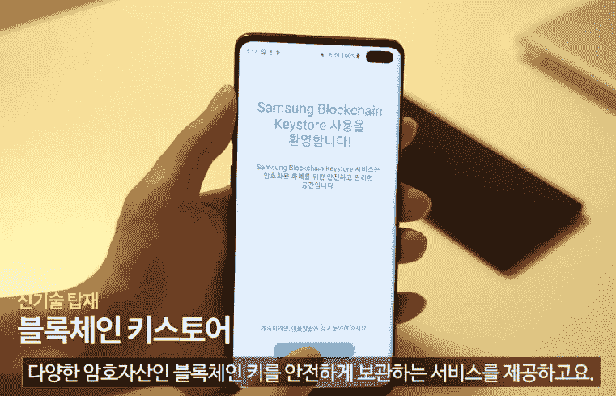
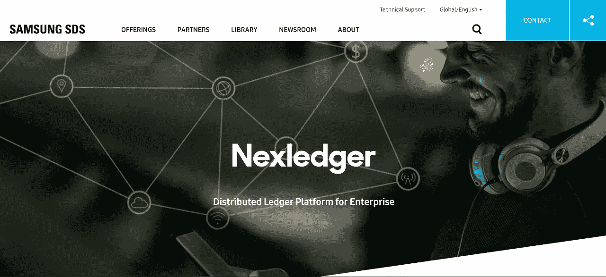
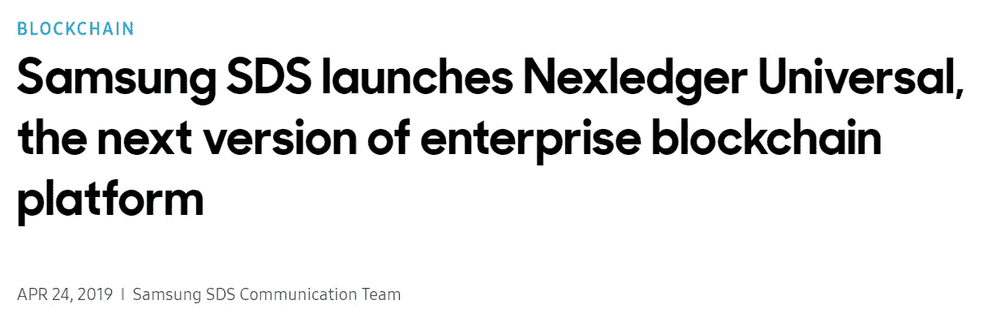
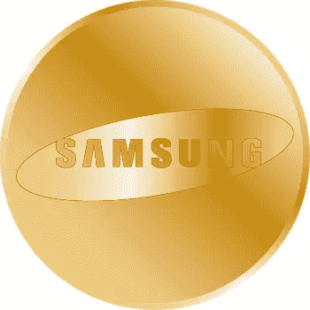
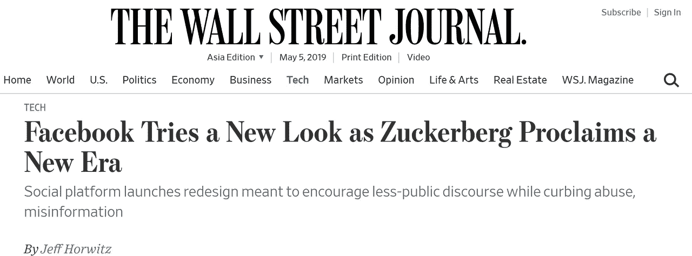

# “一派”的大玩家:三星和脸书的大招

> 原文：<https://medium.com/hackernoon/big-players-for-one-pie-samsung-and-facebooks-big-move-653693966ccc>

最近，许多主要的和顶级的公司不仅对区块链和密码产业有很大的兴趣，而且他们也用自己的资源运营真正的项目。

他们制作了自己的区块链测试网，并试图在很短的时间内运行他们自己的“硬币”。

Graphic by Amy Kang

我们需要关注两大巨头，三星和脸书。

首先，三星，实际上是它自己的子公司三星 SDS 自宣布其全新的智能手机产品 Galaxy S10 以来迅速崛起。Galaxy S10 甚至在正式推出之前就已经吸引了来自世界各地的众多目光，因为它大胆地走向了区块链 DApps。

[https://www.theverge.com/2019/2/25/18233131/samsung-galaxy-s10-bitcoin-cryptocurrency-wallet-features](https://www.theverge.com/2019/2/25/18233131/samsung-galaxy-s10-bitcoin-cryptocurrency-wallet-features)

Cryptowallet，Coin Duck 和 Cosme 将首先安装在 Galaxy S10 中，该团队现在正在寻找更多的 DApp 来安装。

自 2017 年以来，三星一直对区块链感兴趣，特别是企业平台，并正在讨论最著名的企业区块链项目 Hyperledger Fabric 的合作伙伴关系。

他们的第一个区块链项目诞生于 2017 年 4 月，由 Hyperledger 支持，名为 Nexledger。

[https://www.samsungsds.com/global/en/solutions/off/nexledger/Nexledger.html](https://www.samsungsds.com/global/en/solutions/off/nexledger/Nexledger.html)

同年 7 月，他们在货币 20/20 会议上发布了第一份公告。

[在三星卡等三星内部关联公司中应用了数字盖章技术，以降低数据泄露的风险，并在新客户获取成本中节省了约 35%的总成本。](https://www.samsungsds.com/global/ko/about/news/index.html)

自从三星涉足该行业以来，它一直专注于一个领域，即企业平台。

[4 月，三星 SDS 公布了 NexLedger 的新企业版“NexLedger Universal”。](https://www.samsungsds.com/global/ko/about/news/Nexledger-Universal.html)

[https://www.samsungsds.com/global/en/about/news/Samsung-SDS-launches-Nexledger-Universal-the-next-version-of-enterprise-blockchain-platform.html](https://www.samsungsds.com/global/en/about/news/Samsung-SDS-launches-Nexledger-Universal-the-next-version-of-enterprise-blockchain-platform.html)

[NexLedger Universal 提供标准 API，在 Hyperledger Fabric 或 Ethereum 上启用和使用 NCA(NEX ledger Consensus Algorithm)](https://www.samsungsds.com/global/ko/about/news/Nexledger-Universal.html)作为现有的企业平台已被广泛使用，Universal 版本已升级，为开发者节省 TPS 处理时间和资源。

**NEX ledger 和三星的最终目的是什么？
是“支付”。**

加密支付是许多其他区块链项目和公司想要实现的“圣杯”,也是构建 DEX 的“圣杯”。

几天前，4 月底，[三星 SDS 建造了他们自己的区块链，并秘密测试了他们自己的名为“三星币”的国产币。](https://www.ccn.com/samsung-coin-electronics-giant-secretly-tests-ethereum-blockchain-erc20-token-report)

Samsung Coin?

据《CCN》报道，他们在加密和加密钱包方面的大胆举措解释了为什么三星希望将加密钱包集成到其旗舰产品中。

这些步骤最终将引导他们进行加密支付。

另一个主要的全球 IT 巨头，脸书已经宣布，它将进入区块链业务，并进入支付业务。

[目前全球约有 27 亿人使用脸书作为 SNS 平台之一](https://www.socialmediatoday.com/news/facebook-reaches-238-billion-users-beats-revenue-estimates-in-latest-upda/553403/)，其用户基础惊人的稳固和有前景。我们很难想象脸书的用户群会如何影响区块链和加密市场。

[https://www.wsj.com/articles/facebook-gets-a-new-look-less-blue-more-groups-11556645587](https://www.wsj.com/articles/facebook-gets-a-new-look-less-blue-more-groups-11556645587)

5 月 3 日，5 月 3 日，[华尔街日报(WSJ)首先报道了脸书试图建立自己的基于硬币和加密货币的支付系统](https://www.wsj.com/articles/facebook-gets-a-new-look-less-blue-more-groups-11556645587)。

脸书提到，他们将使用“脸书币”向用户提供支付服务，这些广告提供商和客户也可以通过脸书币买卖他们的广告。

Google

他们称这个项目为“天秤计划”，价值 10 亿美元。

它已经计划和准备了一年多，并一直在与 Visa 和 Master Card 等信用卡公司以及大数据和电子商务公司进行讨论。

这个项目不仅将为我们提供移动支付服务，还将提供一个零费用的支付系统，因此许多现有的支付提供商，如银联、VISA 和美国运通，都可能受到脸书的威胁。

尽管如此，他们似乎需要我们公司的大力支持。

**来自美国和韩国的主要参与者正在积极向前发展。
那么，中国呢？**

当易贝在那个时刻主宰着电子商务行业的时候，中国的淘宝跳了出来，和易贝一起统治着这个行业。同样的情况发生在优步，贝宝，滴滴出行，所谓的中国优步现在成为共享经济的统治者和领导者。支付宝和微信支付在中国市场是任何服务都无法替代的。

那么，谁将撼动加密支付行业的中国市场？

如果 Libra 项目成功并按预期进展，显然未能进入中国市场的脸书将弥补中国市场行业的损失，成为先行者。

现在，与中国政府关系非常密切的支付宝，由于政府的监管，一直无法大规模开发区块链和加密技术，尽管它拥有 180 多项区块链技术专利。

那微信呢？还是会是腾讯？

任何人都将很快像淘宝和滴滴出行一样进入中国市场。

当这 12 亿用户和那些主要的顶级公司一起进入区块链产业时，我确信密码市场的“春天”将会到来。