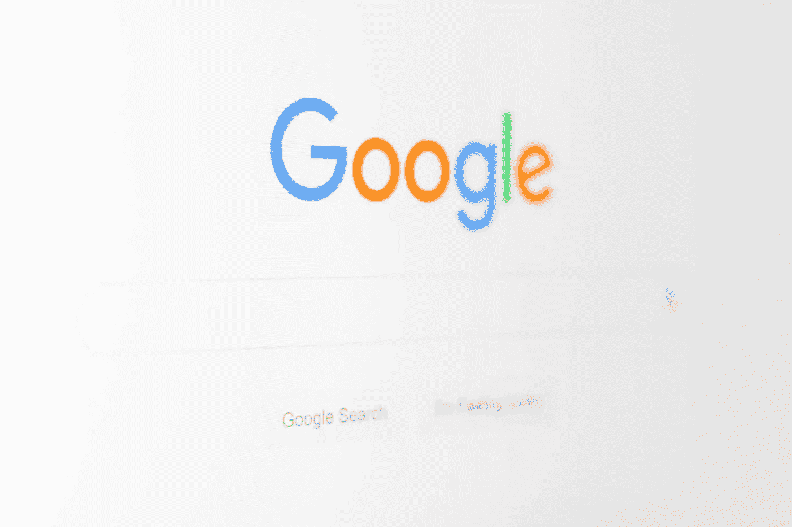
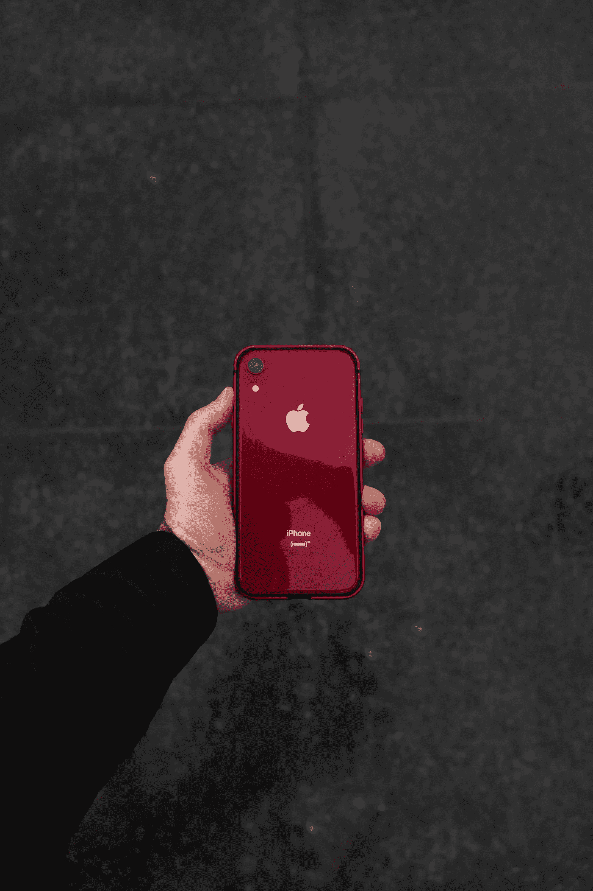
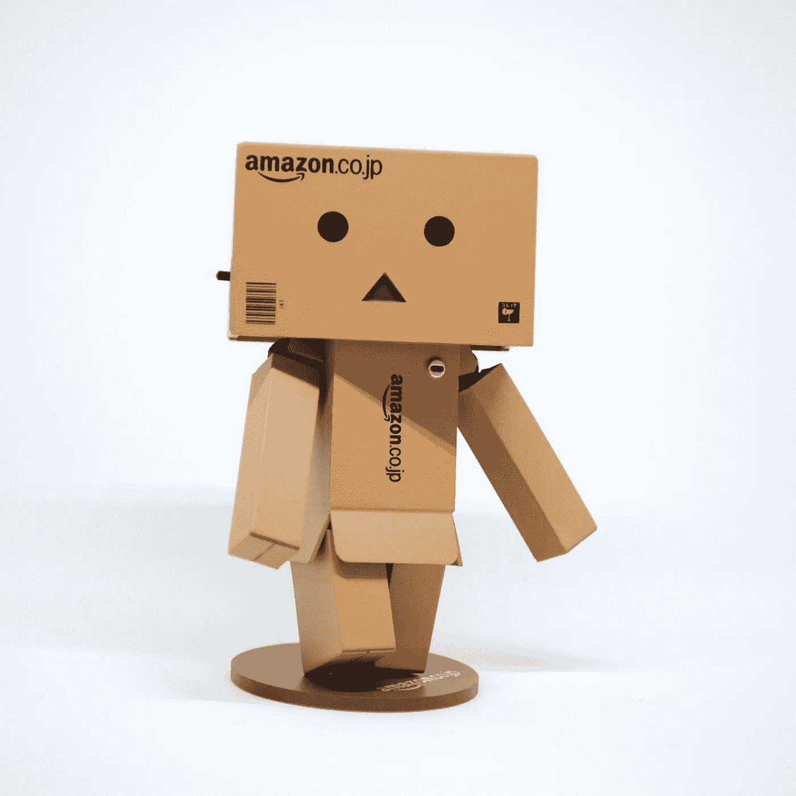
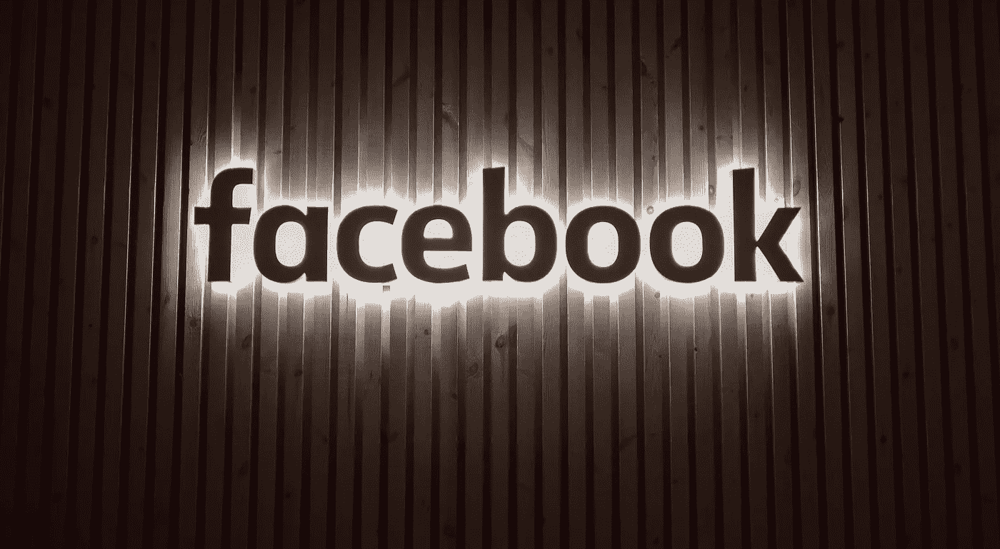

# 大科技的用户数据违规

> 原文：<https://medium.com/hackernoon/big-techs-user-data-violations-9e80632c4499>

## 人们把矛头指向了技术领域的大玩家。信任，这个神奇的词，正在崩溃。人们认为 GDPR 此举是为了挽回颓势，但互联网用户并不傻。他们现在开始提出问题

Photo by [Emiliano Bar](https://unsplash.com/photos/OeAWU9VSHzo?utm_source=unsplash&utm_medium=referral&utm_content=creditCopyText) on [Unsplash](https://unsplash.com/search/photos/prison?utm_source=unsplash&utm_medium=referral&utm_content=creditCopyText)

# 规程

如今，隐私问题，尤其是网络隐私，已经成为每个人的头等大事。最近的丑闻——脸书剑桥分析公司的骚动比任何其他丑闻都更加强烈——改变了人们对他们的私人数据在获得后如何被大型科技巨头使用的看法，更重要的是，改变了人们对这些数据后来被发送给谁的看法。

[**【GDPR】**](https://eugdpr.org/)**【通用数据保护条例】，欧盟对数据保护的回答，已经在某种程度上——至少在欧洲——扭转了潮流。然而，仍有许多国家不存在此类法规，或者即使存在，实施和控制也非常松散。当加利福尼亚州于 2018 年 6 月 28 日通过《加州消费者隐私法》，并于 2020 年 1 月 1 日生效时，美国出现了“布鲁塞尔效应”——欧盟以外的其他国家也遵循欧盟法规的情况，这与 GDPR 非常相似。**

这引发了关于科技行业巨头的问题:

> 我们应该相信他们的数据吗？

谷歌过去曾无数次表示，用户隐私是其商业模式的基石，但就在几天前，该公司发布了新的 Nest 隐私“承诺”。不幸的是，这一举动让许多业内人士有点害怕。Nest 是一项家庭自动化服务，谷歌声称*将解释你如何控制和管理你的数据，例如让你能够随时访问、查看和删除你的谷歌账户中存储的音频和视频。在最近的一次采访中，谷歌产品副总裁 Rishi Chandra 承诺，该公司不会窃取其客户的数据，只是希望“拥抱 Nest，让家庭变得有用——而不仅仅是‘智能’。他补充道，“隐私是每个人的，而不仅仅是少数人的。”*

*谷歌这样做的方式之一是让用户选择在三个月或十八个月的时间内自动删除他们的数据。该公司还表示，它希望给用户控制权，以便他们可以在匿名模式下上网冲浪，减少谷歌可用的数据量。*

# 豹子

这些都是高尚的举动，但是谷歌已经收集人们的数据将近 20 年了，并且知道如何操作这个系统。俗话说:*江山易改本性难移*，在这里很贴切。怀疑者自然会对谷歌的声明感到有点怀疑，但我们应该——至少在被证明并非如此之前——部分相信他们的善意。

***不管在这个问题上的角度或公司理念是什么，至少在理论上，所有的大型科技公司都非常重视客户的隐私问题。脸书的马克·扎克伯格一直在全国媒体上发表新闻文章，宣扬他在 it 方面的立场，而苹果也已经摊牌，声称用户数据隐私对其企业文化至关重要。***

不幸的是，一个人在理论上做的事情在实践中并不总是行得通。这适用于任何商业模式，但尤其是在科技主导商业格局的今天。当这些大型科技公司中的大多数都支持这种对数据保护的态度，并通过其商业模式的微细分和细分广告赚取数十亿美元时，人们会认为，这是一种纯粹的伪善，这些商业模式只对那些拥有用户个人信息庞大数据库的公司有效。

不到 10 年前，包括我在内的数百万人，当我们费心在脸书、亚马逊和苹果的网站上查找它们的隐私条款和条件时，根本不关心它们。你知道为什么吗？因为我们信任他们。我们信任他们，就像我们信任我们的银行一样(反正是大多数银行)。我们像信任父母一样信任他们。我们信任他们，因为至少在西方世界，你就是这么做的。公司在那里为我们服务。满足我们的所有需求。

> “顾客是上帝”。
> 
> “顾客最清楚”。

他们在那里让我们感到特别，而我知道这是悲观主义者在说我，他们拿走了我们辛苦赚来的钱。但后来事情变得一团糟。他们充分利用了这种信任:脸书所谓的对美国大选的干涉和已经提到的剑桥分析公司丑闻的丑闻，以及联邦贸易协定(FTC)提出的指控，即多媒体消息应用程序 [Snapchat“在其隐私和安全措施上欺骗用户”](https://www.cbc.ca/news/technology/snapchat-deceived-customers-u-s-federal-watchdog-says-1.2636507)让人们刮目相看。这些事件无疑是塞翁失马，焉知非福——人们从中觉醒了。这些科技公司几乎立即不得不评估自己的运营，否则它们作为优质服务提供商的声誉将面临永久受损的风险。

**对于许多公司来说，无论是数字公司还是基于更传统结构的公司，我们真的不必担心他们挖掘我们的数据或参与其他“黑色行动”。但是有四个，谷歌、苹果、亚马逊和脸书的 GAAF(我喜欢这样称呼他们)，如果他们不被控制，如果他们不被利用，他们可能——非常恶毒地——从我们的生活中获取每一条信息，并以他们认为合适的方式使用它。**

那么，我们能真正——我是说，真正——信任四大科技巨头多少呢？我认为现在是评估形势的时候了，因为如果我们不这样做，那么我们可能会走向一个许多年前用奥威尔的术语设想的地方，黑暗和险恶，在那里隐私不存在，人类已经失去了匿名的自由，非常可悲。

# 短篇小说

警官对嫌疑人说:“哦，通常的嫌疑人，站成一排，我们要这个警察阵容说出真相。”。

嫌疑犯都在监狱里。

侦探把这个人带进房间，这个人相信有人对他犯了罪。

"*准备好了吗？侦探问那个人。*

“是的，”这个人问。

“他们在那里，”侦探说，“一号、二号、三号和四号嫌疑人——谷歌的桑德尔·皮帅，代表苹果的蒂姆·库克，为亚马逊辩护的杰夫·贝索斯，以及来自脸书的马克·扎克伯格……你想让我给你概述一下他们的罪行吗，”侦探对那个人说，“在更大或更小的程度上？”

“会有帮助吗？”这个人回答。

**“有可能。我想他们都做错了什么。这会在某种程度上平衡信息，让你的判断更加客观。”**

“好吧，为什么不呢。”

“警官，”侦探对警官说，“确保他们都面对着那个人。”

“好的，先生，”警官一边拍着扎克伯格的肩膀一边说道。

"告诉皮查伊先生不要笑了——这一点也不好笑."

“马上，先生，”警官回答，然后责备皮查伊。

“好吧，既然这样，我们就从皮查伊先生开始吧。皮查伊先生，向前一步，”侦探说。皮查伊上前一步。“好吧，皮查伊先生，我想你认为你是干净的，你没有做错任何事情，我不得不说你对你的用户的总的态度和政策是好的，不是吗？但是，你的大部分收入不是来自 SERPS 吗？”

Photo by [Christian Wiediger](https://unsplash.com/photos/zhZydTyNMPg?utm_source=unsplash&utm_medium=referral&utm_content=creditCopyText) on [Unsplash](https://unsplash.com/search/photos/google?utm_source=unsplash&utm_medium=referral&utm_content=creditCopyText)

“什么是 SERPS？”这个人问侦探。

“它代表‘搜索引擎结果’，”侦探回答。皮柴点头道。“是的，搜索引擎来自于为访问网页的用户管理细分的广告客户。第三方网站也是如此。我听说你还管理着一个广告网络，在那里你拍卖用户的个人资料——这不是很好，是吗？在公司访问一个网站后，给他们一个用户的私人信息。这是非常不允许的…你知道这会导致什么吗？侦探接着问这个人。

“不，我不知道，”这个人茫然地回答。

“一种叫做‘迫害效应’的现象。"

**“那到底是什么，侦探？”**

“迫害效应是这样一种情况，一旦你的搜索被第三方——咳咳，咳咳谷歌——知道，他们就会在那些特定的领域给你做广告。”

“我还是不明白，”这位人士说。

“比方说，你正在爱丁堡为边缘艺术节找一家酒店。一旦谷歌知道了这一点，他们就会打广告——不，对不起——给你提供爱丁堡的酒店。*明白我现在说的吗？*

“算是吧，是的。我想这在我身上发生过无数次了。这让我很生气。”

“谷歌将你的搜索结果拍卖给出价最高的人。但是，谷歌不把用户的个人资料交给其他第三方，你谷歌吗？”侦探接着说。

皮柴只是点了点头。

“所以你是在告诉我这家公司是有道德的？”这个人问。

我不认为它在历史上经历过太多的安全丑闻，你呢，皮查伊先生？你对反垄断立法的态度还不算太差吧？”

皮查伊还是什么也没说。侦探命令警官让皮查伊退后。

“下一个是谁，先生？”中士接着说。

“给我接库克先生，”侦探回答。库克上前一步。“库克先生，你有什么要为自己辩护的吗？

库克保持沉默。中士推了推库克，但库克仍保持被动。

“也许他没什么可说的？”该人士评论道。

Photo by [George Beridze](https://unsplash.com/photos/YBbpgMG_vfg?utm_source=unsplash&utm_medium=referral&utm_content=creditCopyText) on [Unsplash](https://unsplash.com/search/photos/apple-phone?utm_source=unsplash&utm_medium=referral&utm_content=creditCopyText)

“有罪，是吗？总的来说，我认为你的鼻子是干净的。你从来没有真正对你的顾客做过广告，是吗？苹果更像是一个卖家，而不是广告商——是这样吗？”库克点点头。“你不会创建客户的个人资料，这很好。据我所知，没有丑闻。这是一个天才之举，你如何能够在不监视你的客户群的情况下，成为世界上最富有的公司之一。好极了。”

“这是令人钦佩的，侦探，”该人士说。

“总的来说，我认为人们信任苹果。”库克微笑着。“你可以退后了，库克先生……”贝佐斯先生，请上前。”贝佐斯向前迈了一步，非常轻微。

***是？*”贝佐斯温和地说道，一如既往地自信。世界上最富有的人并不是因为谦虚才达到那个位置的。**

"您如何看待贵公司在隐私法律法规方面的立场？"侦探问贝佐斯。

Photo by [Hello I’m Nik](https://unsplash.com/photos/r22qS5ejODs?utm_source=unsplash&utm_medium=referral&utm_content=creditCopyText) on [Unsplash](https://unsplash.com/search/photos/amazon?utm_source=unsplash&utm_medium=referral&utm_content=creditCopyText)

“符合我们国家的法律和世界各地的法律，笨蛋。”

"请不要耍嘴皮子，贝佐斯先生."

“我什么也没说。”

“让我们继续……贝佐斯先生，据我所知，亚马逊一直在用户隐私领域保持一致。但我有点担心你的虚拟助手 Alexa，更不用说你产品系列中的其他产品了。据我所知，从我的研究来看，你并没有真正尊重客户的隐私。"

"*我能说句话吗？贝佐斯接着插话道。*

“怎么了，贝佐斯先生？”侦探问道。

“我们不做这种事。”

“那是胡说，贝佐斯先生，你知道的——你监视你的客户的购物习惯，你得到的数据被用来向第三方出售广告时段，这为你的公司赚了一大笔钱，是不是，贝佐斯先生？"

“如果你这么说，侦探，”贝佐斯回答。

“你必须改变你的政策。罪名成立。”

“好吧，谢谢你，侦探。”

“你可以后退，贝佐斯先生……扎克伯格先生，向前迈几步，”侦探说。

不像皮查伊、库克和贝佐斯——他们都穿着漂亮的西装——扎克伯格用 t 恤和牛仔裤缓和了气氛。第一印象不好。

“好，好，好，扎克伯格先生，我们终于见面了，”侦探开始说道，“你有什么要说的吗？”

Photo by [Alex Haney](https://unsplash.com/photos/AGqzy-Uj3s4?utm_source=unsplash&utm_medium=referral&utm_content=creditCopyText) on [Unsplash](https://unsplash.com/search/photos/facebook?utm_source=unsplash&utm_medium=referral&utm_content=creditCopyText)

“我什么也没做。脸书在这里打开人们的思想，连接他们，让世界成为一个整体。”

“胡说，扎克伯格先生……你知道你面前的这个人是什么样的小人吗？”侦探对人说。

“我听说过一些传闻，但不是真的，没有，”这个人耸耸肩回答道。

“你想知道吗？”

“好的，请吧。”

"这个人的商业模式和他公司的古怪行为已经经历了一个又一个丑闻."侦探转向那个人。“扎克伯格先生骗走了大学里一些朋友的想法，是吗，扎克伯格先生？”

“那是谎言，”扎克伯格回答道，他脸上的笑容像撒哈拉沙漠中的冰一样虚假。

“那么听听这个:你是个骗子，一个大骗子，抄袭文克莱沃斯兄弟为脸书出的主意，是不是这样，扎克伯格先生？"

“那倒不是。文克莱沃斯双胞胎从来都不是我的朋友。他们可以下地狱了。”

“兄弟们认为是你干的。他们甚至可以证明这一点。”

“那就告诉他们把我送上法庭，”扎克伯格说，尽管他的面部表情仍然很自然，但现在他的眼里充满了愤怒。

“你的商业模式是不道德的。看看你卷入的所有丑闻。你的肮脏伎俩会惹上很多麻烦……我听到一些政府叫你什么来着……哦，是的，就是它……一个*数字黑帮*。扎克伯格先生，尽管你做了慈善工作，但你和你的庞大公司不能——我重复一遍——不能被信任。”

“如果你这么说，”扎克伯格回答，皮查伊、库克和贝佐斯惊讶地睁大了眼睛。

“补充一句，你的安全措施是一个笑话:*你是做什么的？*随心所欲地窃取您客户的数据，同时与第三方就该机密信息进行交易。"

“我不会把它和这个放在一起，我发誓。”

“恐怕你必须这么做，扎克伯格先生……先生，你把这些都收下了吗？”侦探问那个人。

**“是的，我是。至少我很震惊。”**

“你一点可信度都没有，扎克伯格先生。你让我恶心，”侦探继续说道。

“那是你的观点，”扎克伯格说。

“你对持续和最终剥削你的用户数据不感到羞耻吗？"

“无可奉告。”

另一名警察走进房间。

“侦探，”警察说，“我有一张便条给你。”

警察递过纸条，离开了房间。侦探打开折叠的纸——上面用快递字体打印了一小段话。

“哦，好吧，”侦探咯咯地笑着说，“这是一个幸运的机会——先生，”他接着补充道，“你必须听听这个——”

我现在可以走了吗？扎克伯格叹了口气打断了我。

“不，呆在那里，”侦探说。“听听这个，扎克伯格先生——你曾经的朋友克里斯·休斯认为脸书应该解体……他接着说:

> 马克的力量是前所未有的，非美国的…

有什么要说的吗，扎克伯格先生，有什么办法来对付插在胸口的匕首吗？"

“不，”扎克伯格回答道，贝佐斯笑了——“脸书的解体”会让他很开心。

“你所有的朋友都弃船了。你现在只能靠自己了，数码流氓。我会说，最好坦白承认，了结这件事。”

“警官，让扎克伯格先生回到原位，”侦探对警官说。警官把扎克伯格拉回到其他三个人的队伍中。“那么，先生，谁在隐私问题上最有罪，谁把他们的用户当成一大袋狗屎？”

“嗯，很明显，不是吗？”

“告诉我？”

> “脸书…”

# 最后的想法

当然，他的故事只是一个故事，但它在某种程度上告诉我们，许多公司在隐私问题上有多么有罪，以及他们如何利用从他们的用户数据库中挖掘的数据为自己创造财富。房间里那些愤世嫉俗的人会说这很清楚，这是从一开始就一直在发生的；其他倾向于信任这些公司的人可能会有非常不同的看法。

然而，不管站在什么立场，最终，我们都对这些公司的运营方式有自己的偏见和看法。在未来很长一段时间内(如果他们还活着的话)，他们将继续运营，同时尽可能地逃避责任。