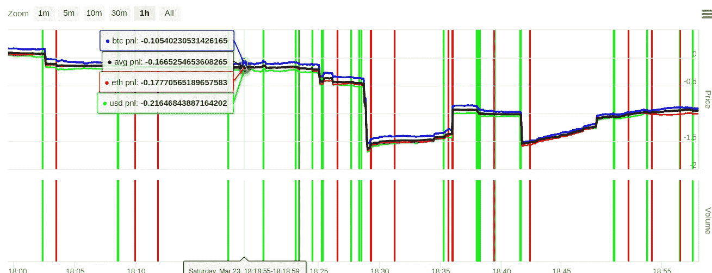

# 币安、HitBTC 等。，做市商推销:如何在网上致富

> 原文：<https://medium.com/hackernoon/binance-hitbtc-etc-market-maker-pitch-how-to-get-rich-online-2988c1d328ac>

# 廉价 VPS

[http://techvoices.club](http://techvoices.club)

大约 15 秒后按下“全部”

# 恰当的例子

想象一下这个没有绿色(购买)线支付费用急剧下降的每小时图表:

作为后续行动:

[https://hacker noon . com/making-markets-moveing-crypto-free-and-open-source-币安-9bcea607e57b](https://hackernoon.com/making-markets-moving-crypto-free-and-open-source-binance-9bcea607e57b)

https://github.com/DunnCreativeSS/privateMarketMakerRepo[**请求访问* *](https://github.com/DunnCreativeSS/privateMarketMakerRepo)

TL；博士加入我们这里[https://t.me/themarketmakerbot](https://t.me/themarketmakerbot)

# 电梯推销术

Deribit 和 BitMex 的做市失败，因为它指望市场在 0.25 美元的台阶上或多或少保持停滞。我们现在正在考虑为更小的交易量、更高的价差对自动化两种做市策略。

# 做市商交易商

我们在最高价以上买入，在最低价以下卖出。我们使用碱基对中账户余额的一部分重复这一过程，直到我们看到价格波动在接近无穷大的意义上相互抵消的净利润，同时我们在“相对订单”策略中吸收价差本身的利润。

在对话中，还没有编码的是“交错订单”策略，你为该对选择一个最高和最低价格，然后在订单簿上上下交错订单，按照设定的间隔进行买卖。

资源:需要靠近不同交易所的服务器。

扩展性:币多；更大规模

优点:在过去的 24 小时里，我在“相对”策略下价值 18 美元的存款中有 0.57 个比特币，同时保持了约-0.5%的增长率。我们可以在其他交易所(有些有保证金)复制这个机器人，比如 bitfinex/ethfinex，他们每月用自己的专有硬币支付做市商回扣，或者 liquid，他们对以前在 qryptos 上的货币对提供做市商回扣

补充优点:在币安，我可以通过我的推荐链接实现 20%或 40%的费用收入，在 HitBTC，联盟计划暂停，但我最终可能会实现 75%——尽管 HitBTC 联盟的潜在收益较少，因为最终将有 0%或回扣的制造商费用

反对:要证明在币安或 HitBTC 上盈利，你需要取消费用或实现做市商回扣。在币安，这涉及到交易量以及持有 BNB——同时仍需支付一些费用，而在 HitBTC，这仅涉及先建立交易量——实现 0%的做市商费用，然后是 0.01%的回扣。在 HitBTC 上还有一个做市程序[https://hitbtc.com/mm](https://hitbtc.com/mm)。

# 证明生存能力

# 在所有类型的市场上保持一致，但要确定何时表现更好

从长远来看，价格波动比“相对”策略更有助于“交错”策略
波动较小但仍有交易量，从“相对”策略中会有收益
潜在损失为 1。费用 2。抓住一个立即死亡的硬币，包括。
如果你要取消费用或实现费用回扣，这种风险就会降低
如果你自动化许多对，你就会减轻抓住一个硬币死亡的负面影响
交谈中，可以创建一个止损来进一步降低这种风险

# 开发的沉没成本

无—需要编码“交错”策略，我可以做到

# 给定当前市场流动性和容量的可扩展性

在像币安或 HitBTC 这样的交易所，有许多交易量很大的硬币对，我们可以无限扩大规模
机器人目前检查每个基础资产的平均交易量，然后检查给定对的价差，只进入那些满足最小和最大交易量和目标价差以及最小订单量和最大订单量的市场(以避免 sh#tcoins)

基数:市场对:基数中的成交量，看起来像这样:

{ BTC: { XDNBTC: 69.3393775486，VETBTC: 42.606415325 }，
TUSD: { NXTUSD: 67247.7248096，TNTUSD: 53891.073732 }，
MUSD:{ QTUMUSD:2545776.043225 }，
NUSD: { XDNUSD: 280614 .
PUSD: { ETPUSD: 68.5015549，ZAPUSD: 40.1461164 }，
YUSD: { DAYUSD: 338.8757426，BERRYUSD: 248.9052084 }，
QUSD: { STQUSD: 6039.7474451 }，
IUSD:{ WIKIUSD:10575.2656811 }，【关键词

# 正向测试

这个策略在 48 小时前在币安被首次编码。它在一天内损失了约 0.5%，成交量为 0.46 BTC。

第二次迭代是在 HitBTC 上，大约 10-12 小时前有 0.12 BTC 的量(跨许多较小的订单，而不是币安的测试版本在一对上冒险)。

在这段时间里，它损失了大约 0.23%:

我的计算基于平均每天损失 0.5%的入门费和 HitBTC 在 30 天交易量中 1500BTC 后的 0%做市商费，表明在一定时间后，当交易一定余额时，我们可以实现 0%的费用，从而影响利润:

[https://docs . Google . com/spreadsheets/d/1 u 343 x4 ghe _ au 9q 3 qwhzhw 8 a 0 wiwwprgp 23 mndkozae/edit？usp =共享](https://docs.google.com/spreadsheets/d/1U343CX4ghe_Au9Q3QwHZHW8A0WIwwprgP23mndKOzAE/edit?usp=sharing)

这还不包括我们获得做市商福利或 6000 BTC 交易量后 0.01%
的回扣的机会。

# 结论

有了足够的容量，一切皆有可能。来加入我们吧！[https://t.me/themarketmakerbot](https://t.me/themarketmakerbot)