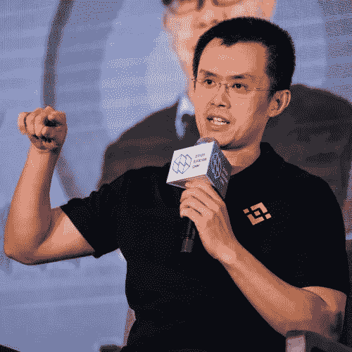

# 币安新加坡庆祝菲亚特加密支付网关的公开发布

> 原文：<https://medium.com/hackernoon/binance-singapore-celebrates-public-launch-with-fiat-crypto-payment-gateway-fe14f1348b77>

世界上最大的加密货币交易所的新加坡分支机构已经宣布公开并引入一个法定加密网关。[币安新加坡](https://www.binance.sg/en)于 2019 年 4 月举行了试运行，它与 [Vertex](https://vertexventures.cn/) 联手，使这个岛国的交易员能够用新加坡元(SGD)买卖加密货币。

自 4 月份推出以来，币安新加坡已实现 20%的周增长率，现在正准备进行更大规模的扩张。该平台最初只列出了[和](https://cryptoslate.com/bitcoin-news/)BTC，此后又引入了 BNB 和瑞士联邦理工学院，它们与新加坡元配对，并计划在不久的将来添加更多的加密货币对。

通过新加坡快速电子资金转账系统，交易者可以 24/7 全天候存取资金，提供了一个通往加密资产世界的直接通道。此举反映了币安与子公司币安新泽西和币安乌干达部署的战略。

Binance CEO Changpeng Zhao

在一份声明中，币安首席执行官赵昌鹏表示，他“对币安新加坡公司的积极市场反应感到谦卑”，这在很大程度上归功于战略投资伙伴 Vertex 的努力，他将该公司描述为“通过其与当地监管机构和金融机构的值得信赖的合作，参与新加坡社区的关键驱动力”CZ 还热情赞扬了 Vertex“可持续发展新加坡更广阔的区块链生态系统的能力”

由于其有利的监管环境和精通技术的人口，新加坡成为亚洲密码市场的门户。因此，它被视为寻求向邻近的东南亚地区扩张的公司的起点。通过 Vertex Ventures China 以及 Vertex 的东南亚和印度部门的支持，币安旨在发展其新加坡加密交易所业务，并吸引更广泛的生态系统参与者，从投资者到区块链开发公司。币安已经通过其币安实验室孵化器基金对亚洲的初创公司进行了大量投资。

新加坡加密货币交易商已经有丰富的平台可供选择，但币安是针对利润丰厚的市场建立专门交易所的最大公司。除了币安品牌的巨大影响力之外，该地区最低的交易、存款和取款费用也吸引着交易员。币安的全球扩张战略一直围绕着与地区公司合作，这些公司可以提供介绍和专业知识，以方便其进入新市场。在美国，它与 FinCEN 批准的合作伙伴联手，而在新加坡，金融科技初创公司 [Xfers](https://www.xfers.com/) 协助客户入职和平台扩展，Vertex 协助安全和合规。

Chua Kee Lock, Managing Partner for Vertex Ventures

Vertex Ventures 的管理合伙人蔡基锁(Chua Kee Lock)表示:“这种合作关系将带来更多好处。“我们期待与币安密切合作，因为我们在降低加密货币的准入门槛方面处于有利地位，同时保持行业领先的世界级安全措施。”由于新建立了 fiat-crypto 支付网关，新加坡居民和公民现在可以在新加坡币安上全天候存款和交易加密货币。