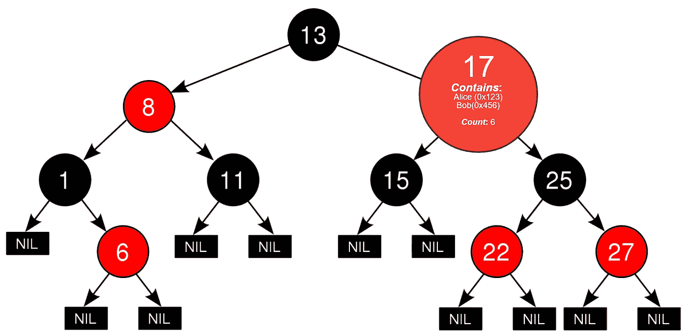

# 以太坊坚固性中的二分搜索法树和序统计量

> 原文：<https://medium.com/hackernoon/binary-search-trees-and-order-statistics-for-ethereum-db47e2dd2c36>

## 无限集合的有限树


Photo by [Luke Chesser](https://unsplash.com/@lukechesser?utm_source=medium&utm_medium=referral) on [Unsplash](https://unsplash.com?utm_source=medium&utm_medium=referral)

# 这不应该是首选

这篇文章是关于当我们用尽了所有的选择后我们能做什么。

我以前写过，排序几乎总是可以在以太坊智能合约之外处理:[智能合约设计中极简主义的快乐](https://blog.b9lab.com/the-joy-of-minimalism-in-smart-contract-design-2303010c8b09)。

而且，我以前写过关于在无序列表中有效组织数据的模式。[固体污垢](/@robhitchens/solidity-crud-part-1-824ffa69509a)。

多亏了映射，通常不需要“搜索”来找到 Solidity 合同中感兴趣的记录。因此，对记录进行分类的一个主要原因，即再次找到它们，通常不是增加分类成本和复杂性的合理理由。

在许多情况下，经过排序和过滤的数据是软件客户感兴趣的。但是，由于软件客户自己能够很好地对信息进行分类，这也不能成为让智能合同承担对列表进行分类的重担的正当理由。

许多统计数据，如最低值、最高值、平均值和移动平均值，都可以即时计算出来，而无需对数据进行排序。这些也不是以太坊智能合约中排序列表的好理由。

如果契约只需要找到上一条和下一条记录，并按排序顺序枚举它们，那么链表就是一种简单的模式。当结合关于从哪里开始的提示时，插入成本可以是比例不变的。这就是我们想要的，因为任何随着场景扩展而变得更加昂贵的东西都可能是一个严重的缺陷:[变得不稳定](https://blog.b9lab.com/getting-loopy-with-solidity-1d51794622ad)。

> 相对于复杂得多的列表排序，我们应该更喜欢高效的变通方法。

然而，在有些情况下，排序顺序对合同很重要，而上述工具都不适合这项工作。

如果一个合约需要知道一个集合中的中值怎么办？或者说，给定值的秩？或者说，某个等级的值？例如，考虑在曲线上评分的测试分数。假设排序测试结果的前 10%中的每个人都将获得 A+和契约逻辑(也许是奖品？)取决于这个结果。并且，假设这个需求需要通过一个契约来处理。Oracle 是一种可能性，但是如果暗示的集中化回归是不可接受的呢？

直观上，我们可以看到这样一个过程既简单又确定。一份聪明的合同应该能够做到这一点。但是，这样的计算可能依赖于一个排序列表和一种链表不擅长的随机访问。

像这样的情况需要一个通用且高效的排序解决方案。

> 这是一项艰巨的任务，如果能够成功应用，提到的替代方案更适合以太坊。

# 挑战

我相信尼克·约翰逊首先开始谈论智能合同中工作的分期偿还。这个想法是把那些一次性处理会耗费太多天然气的过程分解成更小的任务，这些任务可以在有限的天然气预算下单独完成。一些额外的困难来自于需要确保契约状态在任何时候都是有效的，即使整个过程只是部分完成。

如果我们要处理排序列表，那么处理一直排序的列表是一个好主意，而不是一个对完全无序的集合进行排序的单一进程。一个[二叉查找树](https://www.geeksforgeeks.org/binary-search-tree-set-1-search-and-insertion/)就是这样一个结构。

这里不赘述细节。总之，BST 通过在添加和删除数据时维护一组指针来维护有序列表。

BST 提供了某些保证。例如，在一个“完美平衡”的树中，任何记录都可以在 *O(log n)* 步骤中找到。在一组 1，024 条记录中，最多可以在 10 个步骤中找到任何记录，因为 2 * 10 是 1，024。每个节点是一个排序值，最多有两个子节点，通常称为 left 和 right。左边指向较小的东西，右边指向较大的东西。这是结构的“树”方面。

“完全平衡”是指树中的任何一个节点在左右两边都有~相等(+/- 1)个子节点，所以搜索算法每走一步就可以把搜索区域缩小一半。这是 BST 的“二进制”方面。在插入和删除期间，通过重组来实现和维护这种[平衡。(修改是删除后插入)。](https://www.geeksforgeeks.org/avl-tree-set-1-insertion/)

当一切都像这样组织时，总是有可能找到一个空节点，可以在其中插入新数据，同时保持树的可搜索性。通过稍微重新安排节点位置，树平衡的重新组织总是可能的。但是，记住 *O(log n)* 。随着树越来越大，执行成本也会增加。并且，平衡增加了插入和移除过程的步骤。

这种安排对于以太坊智能合约的经济学来说并不是最优的。智能合约成本主要用于写操作，因此在忽略频繁、复杂的重组成本的情况下，完美优化读回效率没有太大意义。

随着树的增长，交易成本上升是以太坊智能合约的一个严重问题，因为这意味着使用合约的成本可能会增加到不切实际甚至无法使用的程度。当天然气成本超过区块天然气限额时，即使有人愿意支付，也不可能进行交易。那通常是不能接受的。

另一方面,“明显不平衡”的树也是不可接受的。它违背了使用 BST 的目的，并且我们会以与遍历链表相当的代价结束。

> 我们需要某种妥协。

# 红色黑色的树

一棵[红黑树](https://www.geeksforgeeks.org/red-black-tree-set-1-introduction-2/)是 BST 的变种，它通过容忍树中的*有限不平衡*来降低更新成本。这样的树可能有点不平衡，但不会太多。在最坏的情况下，仍然有可能推断出最大成本。容忍有限的不平衡会大大降低必要重组的频率和程度。

成本仍会随着规模的增加而增加，但增加的速度会降低。我们以显著降低的更新成本获得了平衡树的大部分好处。

这是进步，但是…

> 我们真正需要的是固定的最大成本，所以我们可以确定总是有可能以合理的成本使用合同。

# 无限集合的有限树

回到最初排序的目的，有问题可以用*不完善排序*解决。找到前 10%的记录就是这样一种情况。*容忍不那么完美的排序*将是确保有可能在一组无限大小的上为*最坏情况计算固定成本的关键。*

让我们考虑在一个精确的百分位等级上精确定位数值(比如说…测试分数)的问题。假设我们希望 100，000 个测试分数的第 90 个百分位数在 0/50 到 50/50 的范围内。

一种简单的方法是考虑对结果进行排序，这意味着 BST 有 100，000 个节点。我们可以马上看到，这可能太贵了，而且容易失败，因为插入和删除任何类型的树结构都要耗费大量的资源。我们真的需要这么做吗？

也许令人惊讶的是，我们可以用 51 个节点的树来完成我们的目标。

*每一个节点都将是某一等级考试分数的集合*。可能的分数范围是 0-50，所以最多会有 51 个不同的分数。将会有成千上万的记录共享同一个等级，但这并不重要。*根据定义，他们也享有相同的等级*。

重点是，我们不需要对 100，000 个测试分数进行排序，只需要对 51 个唯一的可能值进行排序。我们可以将每个唯一值视为一个集合，其中包含来自许多实例的许多结果(学生测试结果)。我们需要知道每个节点上有多少这样的实例，这样我们就可以算出上下有多少实例，这样我们就可以算出等级。

为了强调，我们根本不需要对结果相同的测试进行排序。



Each node contains the unordered set of instances that share the same sorted value and the count of the instances that exist in the subtree starting at that node. Illustration adapted from image at [https://en.wikipedia.org/wiki/Red%E2%80%93black_tree](https://en.wikipedia.org/wiki/Red%E2%80%93black_tree)

# 如果我们想要更精确呢？

假设我们有 1-5，000，000 范围内的值(以及许多值),并且我们希望能够精确定位等级、百分位、中值等。，精确到三位有效数字。*节点计数*与要排序的实例数量甚至排序值的范围无关。重要的是要排序的*唯一值*的数量。

我们可以对这些值进行缩放和舍入，以保证树中的节点永远不会超过 1000 个，并确保我们*不会为超出我们实际需要的精度的排序付出代价*。

我们根本不需要对结果相同的相似值进行排序*。*

*树中的每个节点都包含一组*值与*值大致相等的实例。这些被视为一个*无序的*集合。*

> **限制树的大小是确定最大更新成本的关键。这意味着最坏情况下总会有可计算的成本。"**

*我们知道我们可以使用 [Solidity CRUD](/@robhitchens/solidity-crud-part-1-824ffa69509a) 模式在每个节点中维护一个无序集，所以…*

*如果我们有最大采油树维护成本和最大集合维护成本，那么我们就有*排序的(足够)列表，其中包含任何规模的最大天然气成本。**

**

*Photo by [Zoltán Cse](https://unsplash.com/@che_zo_lee?utm_source=medium&utm_medium=referral) on [Unsplash](https://unsplash.com?utm_source=medium&utm_medium=referral)*

*答对了。我们可以利用这一点。一个已知插入和删除成本*的 BST 在任何规模*下都适合以太坊。*

> *您可以将任意多的实例放入这样的结构中，它永远不会超过预先确定的最大气体成本。*

# *限制树大小的 FIFO 方法。*

*对于像信誉系统这样的东西，当超过限制时，通过首先弹出最老的记录，将树限制为最近的记录就足够了。*

*限制整个树大小的方法是灵活的。只是不要跳过它。在使用这个结构之前，您应该能够展示您的总体设计是如何对树的大小施加上限的。*

# *订单统计树*

*订单统计树是一个 BST，其节点包含一个计数。该计数计算从每个节点开始的子树中的实例数。这使得有可能有效地(便宜地)计算出任何位置上方和下方的实例数量。当你有以上和以下计数，你有等级。当您拥有给定值的等级和每个级别的记录时，您可以枚举前 10%的所有记录，这就是我们想要做的。*

> *契约可以看到这样的事实，即在第 65–70 百分位中有 37 条记录，它可以枚举它们。*

*在链接的[实现](https://github.com/rob-Hitchens/OrderStatisticsTree)中，带有插入和删除逻辑的无序列表(参见 [Solidity CRUD](/@robhitchens/solidity-crud-part-1-824ffa69509a) )包含共享给定节点排序值的所有实例的标识符。这是一个自平衡树，使用红黑树重新平衡算法。这就是我们对于便利的树探索和统计函数的所有需求。*

*为了获得最大的灵活性，有意省略了树大小限制过程。上面描述了两个概念，precision 和 FIFO。设想了更多。这里你有灵活性。使用你喜欢的任何策略，只要在你最大可能的树尺寸下，汽油成本是可接受的。*

# *其他统计树*

*示例实现从维护节点级别的计数中获益匪浅。类似的方法可以应用于关于集合的各种统计。*

*例如，考虑一个订单簿，其中出价和数量的乘积是有趣的。如果每个节点在节点*、*的子树中包含*出价 x 交易量*之和，那么计算出*高于和低于*任何价格的市场深度将同样快(并且便宜)。这会对合同有影响吗？维护这种结构的过程和算法可能会应用到许多甚至还没有被考虑的统计数据中。*

***提醒一句:**这是一个没有经过审计的非常重要的库。你应该考虑它的实验性，并记住它是没有任何形式的担保。建议您在没有公开披露您的质量保证流程、代码审计、测试计划和 bug 赏金之前，不要在生产合同中使用它或它的任何变体。你使用它的风险由你自己承担。*

*感谢您的反馈和贡献。*

*代码:[https://github.com/rob-Hitchens/OrderStatisticsTree](https://github.com/rob-Hitchens/OrderStatisticsTree)*

## *下面是库中函数的一部分:*

```
*using HitchensOrderStatisticsTreeLibrary for ... Library.TreeHitchensOrderStatisticsTreeLibrary.Tree tree;function snippet() public {
        uint value;       // inspecting by value
        uint row;         // inspecting instances of value, by row
        uint _rank;       // inspecting by rank
        uint _percentile; // inspecting by percentile uint root = tree.root;
        uint frst = tree.first();
        uint last = tree.last();
        uint next = tree.next(value);
        uint prev = tree.prev(value);
        bytes32 key = tree.valueKeyAtIndex(value,row);
        bool vexs = tree.exists(value);
        bool kexs = tree.keyExists(key, value);
        uint cont = tree.count();
        uint pctl = tree.percentile(value);
        uint prml = tree.permil(value);
        uint atpc = tree.atPercentile(_percentile);
        uint atpm = tree.atPermil(value);
        uint medn = tree.median();
        uint rank = tree.rank(value);
        uint belw = tree.below(value);
        uint abov = tree.above(value);
        uint atrk = tree.atRank(_rank); // Insert and Remove key/value pairs tree.insert(key, value);
        tree.remove(key, value);
    }*
```

*向第一个发布 Solidity 红黑树实现的 Bokky Poobah 欢呼吧，订单统计树就是在这个基础上构建的。*

*[*Rob Hitchens*](https://ethereum.stackexchange.com/users/5549/rob-hitchens) *是加拿大智能合约设计顾问，以太坊智能合约审核员*[*solidified . io*](https://www.solidified.io)*和以太坊、Hyperledger Fabric、Hyperledger 锯齿湖、Corda 和 Quorum bootcamps 的课件合著者和讲师由*[*B9 lab*](https://www/b9lab.com)*。**