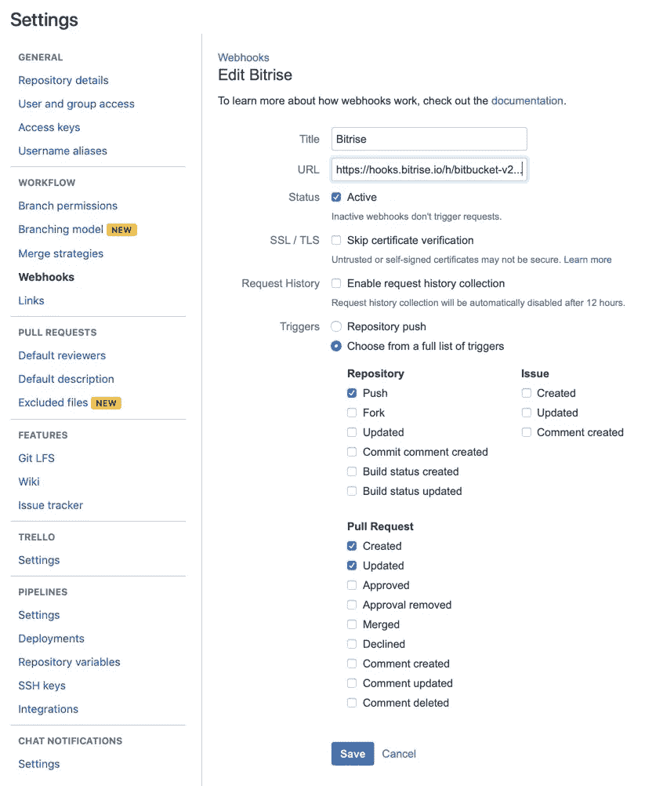
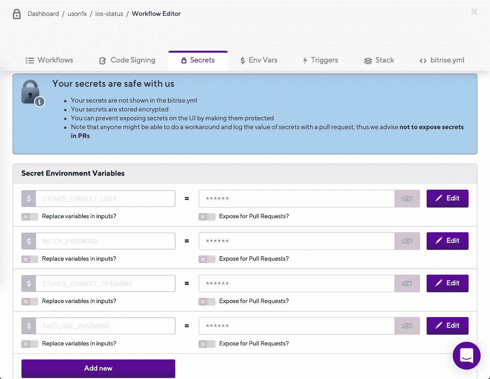
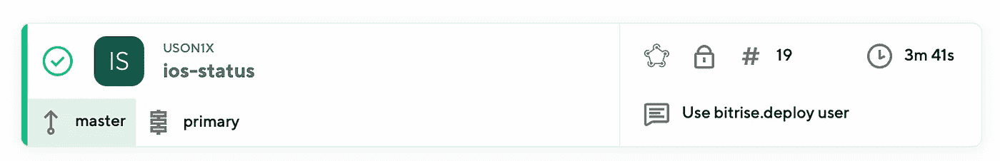

# Bitbucket + Bitrise:为 iOS 应用配置持续集成

> 原文：<https://medium.com/hackernoon/bitbucket-bitrise-configuring-continuous-integration-for-an-ios-app-8974474bca6b>

这是 Ivan Parfenchuk 为 Bitbucket 撰写的客座博文。Ivan 是一名独立的 iOS 和 Ruby 开发人员，热衷于构建愉快的体验。和他在 Twitter 上联系[*@ gazebushka*](https://twitter.com/gazebushka)*。*

当 iOS 应用程序开始增长时，在某个时候，拥有一个快速的开发-发布-测试反馈循环变得至关重要。您可以通过手动完成所有工作来创建这个循环，但是如果您使用持续集成(CI)工具，它会更快更高级。

使用 CI 工具，您可以构建发布的历史，并快速查看哪个构建包含了什么。您可以对每个构建自动运行测试，并捕捉一些不可避免的错误。您可以在发行说明中保持一致性。您还可以简化您的发布周期，从而自动化您的清单。

听起来有趣吗？让我们尝试使用 Bitbucket Webhooks、Bitrise 和 fastlane 来构建这个反馈回路。

# 部署流程

我们将用于持续集成的流程如下所示:

1.  在 Bitbucket 中创建和合并拉请求
2.  [Bitbucket](https://bitbucket.org/product) 对 Bitrise 执行“web hook”HTTP 请求
3.  [Bitrise](https://www.bitrise.io/) 开始构建流程并启动 fastlane
4.  [fastlane](https://fastlane.tools/) 构建应用并将其发送至 App Store Connect
5.  App Store Connect 处理构建，并在 TestFlight 中可用

# Bitbucket Webhooks 和 git 分支模型

每次部署都从我们创建一个拉取请求开始。

假设您的团队正在使用主 git 分支来处理处于可发布状态的代码。它还通过将这个主分支合并到发布分支来生成新的发布。

以下部分描述了如何手动创建 Webhook。但是，如果你使用 Bitrise，它可以自动为你创建一个 Webhook，所以，请随意跳到 Bitrise 部分。

# 手动 Webhook 配置

接下来，让我们配置 Bitbucket Webhooks，以便每当有人推送释放分支或合并 Pull 请求以释放分支时，都会触发 Webhook。

要做到这一点，请进入您的 Bitbucket 存储库，然后单击侧边菜单中的“设置”。然后点击“工作流程”部分的“Webhooks”，然后点击“添加 webhook”

填写标题、URL(见下文)，将状态设置为活动，并为触发器选择“从完整的触发器列表中选择”。我们将使用的触发器是:

1.  存储库:推送
2.  拉式请求:创建、更新

要获取我们的 Webhook 的 URL:

1.  去 Bitrise，创建一个新的应用程序
2.  打开仪表板->您的应用->代码选项卡
3.  滚动到 Incoming Webhooks 部分，然后单击手动设置。
4.  选择“Bitbucket Webhooks”并复制 Webhook URL



# Bitrise 和自动 Webhook 配置

Bitrise 是一个持续集成的平台。您可以在其中配置不同的部署“工作流”，并让 Bitrise 服务器构建和发布您的应用程序。下面是为我们的 CI 设置创建新部署工作流的步骤。

1.  首先在 Bitrise 注册，进入仪表盘，点击“添加新应用”
2.  如果您希望您的配置和日志保持私有，请选择“私有”
3.  选择 Bitbucket 并将其连接到您的帐户
4.  点按“自动添加 SSH 密钥”或手动配置 SSH 访问
5.  在“选择分行”步骤中，输入“release”作为分行名称
6.  在项目构建配置中选择“快速通道”，检查浪子通道是否设置为“ios 版本”。
7.  选择您通常用来构建应用程序的堆栈或最新可用的 Xcode/macOS，然后点按“确认”。
8.  在最后一步“Webhook 设置”中，点击“为我注册 Webhook”

最后一步在 Bitbucket 中创建了一个 Webhook，所以您不需要手动做任何事情。你可以去 Bitbucket repository，在 Settings -> Webhooks 中检查 Webhook 的配置。

在我们的设置中，我们将使用 fastlane 构建应用程序并将其发布到 App Store Connect。

# 浪子构型

浪子是一套自动化开发和发布过程的工具。

按照本指南安装 fastlane: [设置— fastlane 文档](https://docs.fastlane.tools/getting-started/ios/setup)

简而言之，您需要安装 Xcode 开发工具:

```
xcode-select --install
```

然后通过 RubyGems 安装 fastlane

```
sudo gem install fastlane -NV
```

或者通过 brew:

```
brew cask install fastlane
```

然后在终端打开你 app 的工作目录，初始化 fastlane。

```
cd /path/to/your/app 
fastlane init
```

选择“3。🚀自动化应用商店分发”

然后按照配置要求进行操作。浪子可以为您创建和配置新的应用程序 Id，并创建一个示例部署“通道”Lane 只是完成某些场景所需的步骤的集合。

一旦配置完成，让我们打开已经创建的 Fastfile 并配置我们的第一个部署脚本。浪子有一大套自动化各种过程的工具，比如代码签名、上传截图、运行测试等等。但是，我们将从一个简单的设置开始:

```
default_platform(:ios) platform :ios do   
  desc "Push a new release build to the App Store"   
  lane :release do     
    build_app(scheme: "CITest")     
    upload_to_app_store(force: true, skip_metadata: true, skip_screenshots: true)   
  end 
end
```

“释放”车道将

1.  执行项目 build_app 的构建(scheme:“CITest”)
2.  将生成的 ipa 文件上传到 App Store Connect upload _ to _ App _ Store。在本指南中，我们将跳过浪子元数据上传。

您可以通过在“终端”中打开项目目录并运行 fastlane release 来测试您的设置:

```
cd /path/to/your/app/directory 
fastlane release
```

# 代码签名

如果您发现代码签名有问题，请从这里开始:[故障排除—快速通道文档](https://docs.fastlane.tools/codesigning/troubleshooting)。您可以使用 fastlane match 来管理代码签名，但是要小心:如果您已经生成了证书和预置描述文件，match 可能会出错。然而，如果这是一个全新的设置，或者你不太关心现有的配置文件，match 将大大加快速度。

我们将在示例中使用快速通道匹配:

```
cd /path/to/your/app/directory 
fastlane match development 
fastlane match adhoc 
fastlane match appstore
```

然后打开 Xcode，关闭自动代码签名，选择 match 生成的预置描述文件。

之后，我们可以将 match 添加到我们的 Fastfile:

```
default_platform(:ios)

platform :ios do 
  desc "Push a new release build to the App Store" 
  lane :release do 
      match(type: "appstore", readonly: true) 
    build_app(scheme: "CITest") 
    upload_to_app_store(force: true, skip_metadata: true, skip_screenshots: true) 
  end 
end
```

# 完成 Bitrise 设置



Bitrise 正在其服务器上构建该项目，这些服务器上没有代码签名和上传应用程序到 App Store Connect 所需的任何密码和凭据。因此，我们必须分享其中一些，确切地说是这两个:

1.  App Store Connect 用户的登录名/密码
2.  解密匹配存储库的密码(如果使用匹配)

App Store Connect 用户不必是您用来控制应用程序的用户。您可以在 App Store Connect 中创建新用户，该用户只能访问您自动化的应用程序，并且至少拥有开发人员角色。

一旦你设置了新的应用商店连接用户，前往 Bitrise，打开工作流编辑器标签，然后秘密。添加两个新秘密:

ITUNES_CONNECT_USER 和 ITUNES_CONNECT_PASSWORD 以及此新用户的 App Store 凭据。另外，将相同的密码输入 FASTLANE_PASSWORD secret。

如果您使用 match，那么再添加一个名为 MATCH_PASSWORD 的密码，这个密码就是您用来加密 match repository 的密码。

# 结论

应该就是这样了。尝试创建一个新的 Pull 请求并合并它，看看 Bitrise 是否会触发新的构建。如果一切顺利，您将在 TestFlight 中看到新版本，并能够为您的新 iOS 应用程序版本选择它。



通过自动化部署，您可以做更多的事情，例如:

1.  使用快速通道扫描进行测试
2.  自动化内部版本号递增
3.  dSYM 上传到 Crashlytics_Raygun_etc

然而，首先从简单的事情开始。希望这个指南对你有帮助！

*喜欢分享你的技术专长吗？了解更多关于* [*Bitbucket 编写程序*](http://bitbucket.org/product/write) *。*

*原载于 2019 年 4 月 29 日*[*https://bitbucket.org*](https://bitbucket.org/blog/bitbucket-bitrise-configuring-continuous-integration-for-an-ios-app)*。*