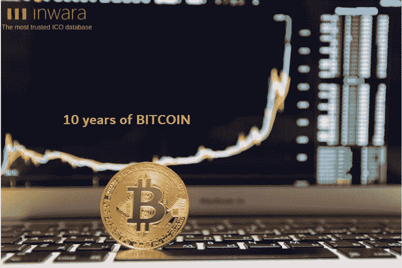
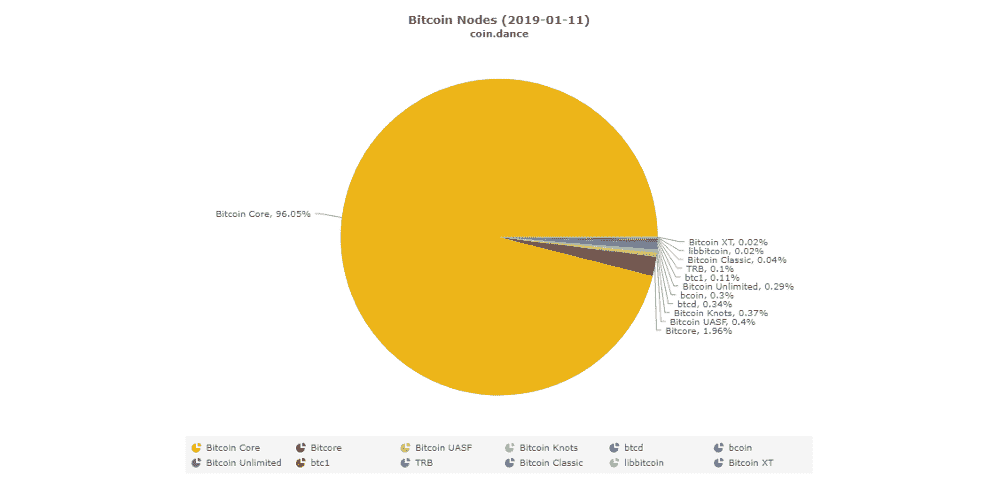
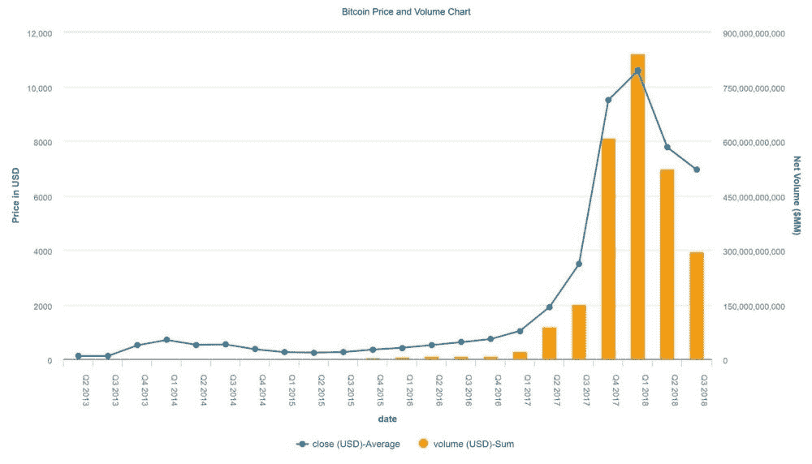
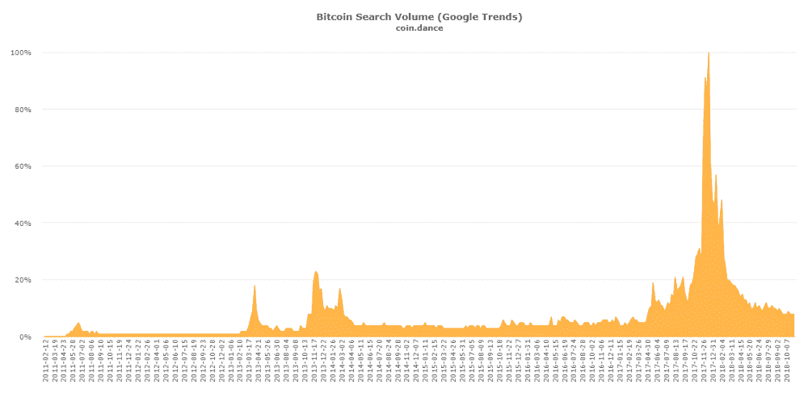
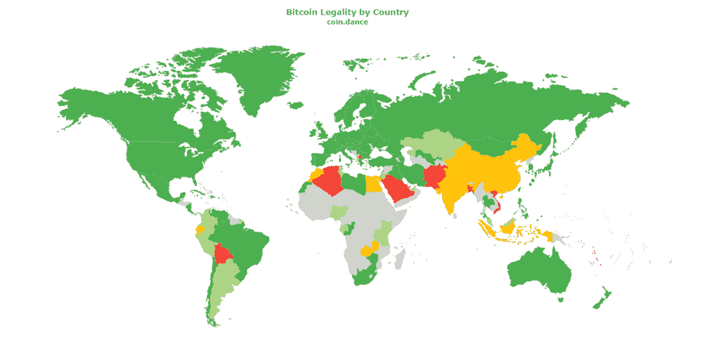

# 比特币——颠覆、分配、数字化、去中心化和抽选的十年

> 原文：<https://medium.com/hackernoon/bitcoin-a-decade-of-disruption-distribution-digitization-decentralization-and-decimation-42d0b7ddd666>

## 从抽象概念到成为世界上最大的加密货币的旅程

[*InWara*](http://InWara provides research on ICO and STO projects. In addition to ICOs/STOs, we provide research on Crypto exchanges and their security, private blockchain companies, Hedge Fund, VC, HNI and angel investments in the Blockchain industry and Mergers/Acquisitions in the space. Disclaimer: this is not financial advice. For more details visit terms and conditions.) *提供 ICO 和 STO 项目研究。除了 ico/sto，我们还研究加密交易所及其安全性、私人区块链公司、对冲基金、风险投资、HNI 和天使投资，以及区块链行业的并购。*

*免责声明:这不是财务建议。有关更多详情，请访问* [*条款和条件。*](https://www.inwara.com/disclaimer)

> [下载 40 页 ICO 景观年报 2018](https://www.inwara.com/report/annual-report-2018?utm_source=bithacker&utm_medium=bithacker&utm_campaign=bithacker)

比特币作为一种颠覆性技术诞生，有可能改变人们选择全球交易的方式。自从中本聪和马尔蒂·马尔米思这两位最早的开发者注册“比特币. org”域名以来，已经过去了 10 年。

到目前为止，比特币的发展历程是一把双刃剑，既有坏处也有好处。尽管有批评者，比特币今天无疑是世界上最大的加密货币，占据超过 52%的市场主导地位。

过去 10 年，比特币试图彻底改变全球银行和金融生态系统。比特币唤起了数字货币的概念，并成为资产令牌化的催化剂。

# 比特币及其遗产

来源:[关于比特币 10 年你需要知道的一切](/swlh/10-years-of-bitcoin-all-you-need-to-know-5b68a2721a46)

比特币是中本聪在 2008 年次贷危机和最终金融市场崩溃后对传统银行体系和法定货币失去信心的副产品。

## 中本聪自己写道

> “必须相信央行不会让货币贬值，但法定货币的历史充满了对这种信任的破坏。必须信任银行持有我们的钱，并以电子方式转移，但他们在信贷泡沫的浪潮中贷出这些钱，储备几乎没有一部分。我们必须相信他们会保护我们的隐私，相信他们不会让身份窃贼盗取我们的账户。”

# 比特币的源代码基于 9000 多个节点

比特币的去中心化系统是为了分散权力，以防止任何个人或团体控制金融市场而发明的。取而代之的是，共同所有者控制着最终的发布，很多时候，活动是通过公共拉取请求过程系统化的。

Source: Coin.dance

> [下载 40 页 ICO 景观年报 2018](https://www.inwara.com/report/annual-report-2018?utm_source=bithacker&utm_medium=bithacker&utm_campaign=bithacker)

# 越来越多的人接受

2009 年，比特币正处于盗窃时期。快进到 2018 年——比特币经历了近 20，000 美元的[历史新高，跌至 3，125 美元的年度低点。经历了这种疯狂的波动，比特币作为市场上的一种金融工具确实已经成熟。](https://www.inwara.com/?utm_source=Profiles&utm_medium=Profiles&utm_campaign=inblogpost3)

[Source: InWara’s database](http://www.inwara.com/?utm_source=bithacker&utm_medium=bithacker&utm_campaign=bithacker)

购买、交易和搜索“比特币”的人数随着时间的推移不断增加，在 2017 年第四季度达到创纪录水平，这一事实也证明了这一点。同样，与价格一致，即使是这种趋势在 2018 年下半年似乎也出现了暴跌。

Source: Coin.dance

随着比特币在立法者和传统金融公司中获得牵引力，接受比特币的企业、机构甚至银行的数量正在稳步增加。随着市场的发展，韩国、日本、美国、印度、瑞士、加拿大等国家的监管机构纷纷效仿，实施限制并要求问责。

尽管有这些规定，比特币的存在和采用在 110 个国家呈上升趋势，全球近 40%的国家已经在支持比特币的名单中。

Source: Coin.dance

# 比特币的未来

最近的泡沫破裂和随后比特币价格的稳定显示了市场成熟的早期迹象。比特币的高票泵和转储在市场上不再频繁。在替代硬币出现之前，交易者通常会屈服于高票泵和转储导致的不利价格波动。然而，随着更多的替代硬币和稳定硬币进入市场，这些交易已经显示出平稳的早期迹象。

不利的市场发展并没有挫伤企业家和思想领袖的精神，他们继续带着新产品进入市场。

*在撰写本文时，专家认为比特币价格和加密市场是稳定的，正在从最近的崩盘中复苏。加密市场的总市值超过 640 亿美元，比特币在市场上的主导地位飙升至 52%以上。*

> [下载 40 页 ICO 景观年报 2018](https://www.inwara.com/report/annual-report-2018?utm_source=bithacker&utm_medium=bithacker&utm_campaign=bithacker)

# 比特币的发明者选择匿名背后的原因？

来源:[关于比特币 10 年你需要知道的一切](/swlh/10-years-of-bitcoin-all-you-need-to-know-5b68a2721a46)

鉴于这一历史，2007 年，首批数字货币之一的电子黄金被政府以洗钱为由关闭。此外，在过去，也有夏威夷居民试图在数字货币领域做一些事情，但最终被指控违反联邦法律，并被判处 6 个月的软禁，以及 3 年的缓刑。

比特币的发明者选择匿名是有原因的。通过保持匿名，他们避开了所有不利的法律实体，这使得他们的匿名至少是这种货币成功的部分原因。

创造比特币背后的愿景是为所有对传统银行体系不满的人提供一种选择。只有时间才能证明比特币能否实现这一目标。

> [下载 40 页 ICO 景观年报 2018](https://www.inwara.com/report/annual-report-2018?utm_source=bithacker&utm_medium=bithacker&utm_campaign=bithacker)

