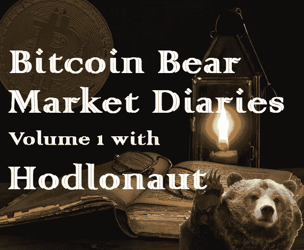
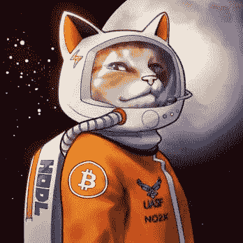

# 霍德洛纳特的比特币熊市日记第 1 卷

> 原文：<https://medium.com/hackernoon/bitcoin-bear-market-diaries-volume-1-with-hodlonaut-124c4467b05e>

《比特币熊市日记》是一系列采访，讲述了比特币生态系统中各种重要的声音和观点。每个受访者都是经过精心挑选的，并被问及同一组问题。主要目标是为世界提供一个关于当前比特币和加密市场状况的评论和观点的集合。有些名字你会认识，而其他人不希望成为焦点，但有很好的洞察力和经验，我们都可以学习。

*这些采访是未经加工和过滤的，除了给每个人说出自己想法的机会之外，没有任何议程。如果你喜欢你所看到的，请分享给你的朋友。如果有什么冒犯了你，你可能应该 X 出来，找另一个给你温暖模糊的秘密绒毛片。*

**姓名:**霍德洛瑙特

**国家:**挪威

**别人是怎么认识你的？**

正如推特上的 [@hodlonaut](https://twitter.com/hodlonaut) 。

**你对比特币感兴趣多久了？**

自 2013 年以来

**最佳比特币体验？**

2017 年 UASF 和 No2x 的胜利。哦……还有#信任链是如何爆炸的！

**最差的比特币体验？**

BitFinex 被黑的时候有很多资金。

**你认为比特币最大的威胁是什么？**

分裂社区的社会攻击。我认为当前推动减小块大小的努力，尽管很少澄清或讨论，是极其错误的。

**你对比特币的各种分叉有什么看法？**

都是屎，只是味道不同而已。

你看好这个领域的什么？

几乎所有关于比特币的东西。但最重要的是，这里有这么多优秀的人，每天都在建设和教育。

**上次牛市期间最大的遗憾？**

当然，我没有卖掉顶部，这样我就可以增加我的筹码，但这并不是一个遗憾。我相信太难卖了，即使是顶级的。:)

在当前的熊市中，你学到了什么？

熊市是健康的。我从来没有像现在这样清楚地看到，我们在比特币领域有多少优秀的人才，社交和基础设施领域的废话已经一去不复返，真正的狗屎正在建立。

**熊市期间你见过最大的败笔是什么？**

可能凯文·范跳进了 BSV 小丑车。

你认为是什么引发了当前的熊市？

我们兴奋过头了。此外，比特大陆和 bcash boyz 大举抛售也是支撑 bcash 的一个因素。

你认为最近的价格下跌对买家情绪造成了什么样的损害？

不多。一旦势头再次转变，羊群就会回来。他们只需要从他们当地的 msm 真理渠道听到比特币回来了。

**你对闪电网络的现状和未来有什么看法？**

极其看涨。自从发现比特币后的蜜月以来，我还没有对它这么兴奋过。

**你对比特币有什么看法？**

对我来说唯一合理的方法。当我发现我相信的东西，可以实现有意义的改变时，我觉得有责任尽可能多地投入到游戏中。而且我更相信比特币，除了我女儿:)

你对另类硬币有什么想法？

我不像其他人那样黑白分明。我认为有些人可能会有未来。我有几个包，当然是红色的。但我确实认为大多数替代硬币非常接近直接诈骗。

你有吗？如果没有，为什么？

是的，我知道。主要是为了增加我的比特币筹码。

**你认为 alt 币的激进下跌会对他们的未来产生什么样的影响？**

我认为世上不乏愚蠢和贪婪。我还认为下一轮牛市会比上一轮更好，并带来大量的 alt 欣快感。

**关于比特币化的想法？**

我认为它会发生。我觉得这是必然的。

**你对哪些比特币创业公司感到兴奋？**

卡萨霍德尔，萨莫赖，闪电实验室…很多。也对 Blockstream 所做的一切印象深刻，但不确定他们是否还有资格成为初创公司:)

**你认为哪些“加密影响者”会弄错，为什么？**

JW·韦瑟曼、理查德·哈特温、克里斯·德罗斯……我认为他们的自负战胜了他们。

**你认为什么样的“加密影响因素”能让事情变得正确，为什么？**

我认为有很多。皮埃尔·罗查德是我非常尊敬的人。他建造东西，诚实而理性，有时间和无知的人在一起，很好地论证自己的观点。

如何才能扭转这一熊市？

我认为我们只是缺少点燃火药桶的火花。机构采取行动，埃隆发表声明，几个吸毒成瘾的寡头硬闯……如果这些都没发生，时间会帮我们做到。我认为我们将在 2019 年看到牛市的开始。

尽管比特币最近有所回落，你对它有多乐观？

10/10.

你想给刚接触比特币的人一些建议吗？

只需购买和持有比特币。不要盲目追随任何人。批判，独立思考，参与讨论！

**储存比特币的最佳技巧？**

获得一个硬件钱包，安全地存储您的种子。我用特雷索。

**说出一些你最喜欢的信息源和/或播客。**

我主要使用 twitter。惊讶于有这么多好的账户，其中大多数都很少有人关注。我确实认为斯蒂芬利维拉，来自地穴的故事，比特币和。。。和使用加密的乐趣都是很棒的播客的例子！

**有什么至理名言吗？**

对自己和周围的人都要诚实。吃玉米卷。

*敬请关注下一期熊市比特币日记。我有一些令人敬畏的采访在排队，并将定期投放新的卷。特别感谢 Hodlonaut。*