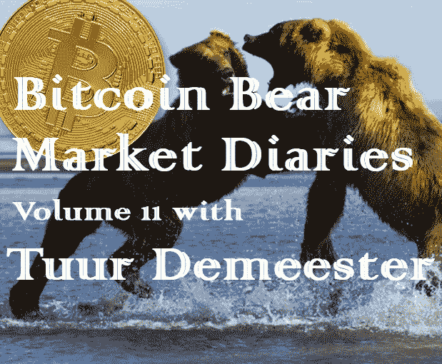

# 比特币熊市日记第 11 卷

> 原文：<https://medium.com/hackernoon/bitcoin-bear-market-diaries-volume-11-tuur-demeester-f5fc5ef740a2>

T 何[比特币熊市日记](https://hackernoon.com/@piratebeachbum)是一系列采访，讲述了比特币生态系统中各种重要的声音和观点。每个受访者都是经过精心挑选的，并被问及同一组问题。主要目标是为世界提供一个关于当前比特币和加密市场状况的评论和观点的集合。有些名字你会认识，而其他人不希望成为焦点，但有很好的洞察力和经验，我们都可以学习。

*这些采访是未经加工和过滤的，除了给每个人说出自己想法的机会之外，没有任何议程。如果你喜欢你所看到的，请分享给你的朋友。如果有什么冒犯了你，你可能应该 X 出来，找另一个给你温暖模糊的秘密绒毛片。*

Tuur Demeester 是一位具有奥地利经济学背景的经济学家和投资者。他也是坚定资本的创始合伙人，多年来一直撰写深度市场研究报告。

**名称:** [图尔·德默斯特](https://twitter.com/TuurDemeester)

国家:美国

**别人怎么认识你？**

人们通常从我的推特风暴，或者从我专注于比特币的研究报告中了解我。

**你对比特币感兴趣多久了？**

我第一次了解比特币是在 2011 年的布宜诺斯艾利斯。2012 年初，我开始以接近 5 美元的价格向我的金融时事通讯订阅者推荐它。

**最佳比特币体验？**

对我来说，比特币最大的好处就是你一路上结交的朋友。没有什么比在一个遥远的地方的比特币会议上意外遇到一个老朋友更好的了。

**最差的比特币体验？**

对我来说，最糟糕的经历是当我发现那些我认为值得信任的人最终证明他们并不值得信任。

此外，有时我会被大众的心理所困扰，他们通常是错的。当这种情况发生时，我会给自己一段艰难的时间，并努力找出为什么我放弃了独立的观点。

**你认为比特币最大的威胁是什么？**

自满。如果比特币用户作为一个整体不再关心去中心化、隐私、协议健壮性，那么随着时间的推移，生态系统中将开始出现重大漏洞。

**你对比特币的各种分叉有什么看法？**

我认为它们对生态系统非常健康，如果你算上所有从比特币分叉出来的替代币，那么到目前为止我们已经有超过 1000 个分叉。比特币叉子让人们看到，如果他们不同意，他们随时可以自由离开，以自己的方式做事。这里没有强制，没有进出的障碍。当然，当人们不仅想离开，还积极试图攻击和抵制比特币区块链时，这是令人痛苦的，但从长远来看，这些攻击是可以预料的，只会有助于改善生态系统的免疫系统。

你看好这个领域的什么？

经过十年的生产，该技术非常强大，我们有坚实的基础以模块化的方式扩展该平台。比特币有一些我见过的最聪明的人。

**上次牛市中最大的遗憾？**

过早开始销售。我有一种保守的偏见，这有时让我很难把握市场狂热的动态和全部潜在范围。

**在当前的熊市中，你学到了什么？**

耐心和一定程度的超然是健康和必要的。对熊市周期的心理规划会带来巨大的回报。我学到了更多关于比特币估值的知识(这是我们关于这个话题的文章)。

**熊市期间你见过最大的败笔是什么？**

去年夏天，在 6000 美元左右的水平，我们觉得与非常疲软的需求相比，市场仍有太多的乐观和希望。我们当时发表了一篇观点文章，警告下半年价格会下跌。

你认为是什么引发了当前的熊市？

熊市的种子是在牛市阶段播下的，这里没有什么不同。大约在 2017 年夏天，我们进入了一个绝对繁荣的阶段，散户参与度很高。这是一个真正的柠檬市场，有很多信息不对称、扭曲的激励、低透明度和过多的低质量资产。

你认为最近的价格下跌对买家情绪造成了什么样的损害？

我们认为我们目前正处于投降阶段。零售商的情绪非常悲观，甚至无动于衷。许多人把“crypto”作为一个篮子购买，现在觉得被欺骗了，因为如此多的 ico 似乎没有去任何地方——这是互联网崩溃的倒退。另一方面，高净值个人和价值导向的机构正在积累。

**你对闪电网的现状和未来有什么感觉？**

Lightning 目前的状态是非常实验性的，有很多 bug，目前故障率相对较高。但在我看来，基础架构是健全的。我之所以得出这个结论，是因为自从这些想法在多年前首次提出以来，我还没有看到它在概念上被证伪，也就是说，我还没有看到令人信服的、深入的论点，来解释为什么比特币上的支付通道层不能工作，或者为什么它不能扩展。同样令人鼓舞的是，有不同的、经过广泛测试的 Lightning 实现，它们的事务可以相互兼容。

**你对 HODLing 比特币有什么想法？**

了解比特币的唯一途径是通过霍德林。这就好像真正理解智能手机的唯一方法是打开它并使用它。比特币是数字黄金，这自然会让投资者长期持有它作为价值储存手段。

**你对另类硬币有什么看法？**

我认为存在比特币的替代品很重要，尽管我认为替代比特币的生态系统非常复杂，而且经常被误解。替代硬币的存在证明了我们现在确实在与一个自由的创业货币市场打交道。我认为比特币最终将占据 80 %- 90%的市场主导地位，这为替代货币开辟利基市场留下了相当大的空间。

**你有吗？如果没有，为什么？**

我在 altcoins 上的长期投资是我在 2014 年的北海巨妖股票投资(一个加密交易所)，这是一种接触整个市场的方式。我认为，如果散户投资者在某个时候对替代硬币感兴趣，北海巨妖会做得很好，他们确实感兴趣了，事实也确实如此。我目前持有一些莱特币，并接触了 Chia 网络。莱特币是一种零售宠儿(尽管在熊市中受到憎恨)，已经存在了 6 年多，通常被视为比特币的对冲工具。我希望比特币不要尝试新功能，因为我认为它的吸引力恰恰在于这样一个事实，即除了挖掘算法之外，它与 BTC 几乎相同，因此可以系统地导入比特币核心开发者经过战斗测试的所有代码。我喜欢在概念上接近比特币的硬币，因为我认为 Satoshi 的重大突破就是通胀控制的证明。我不相信利害关系证明可以适当地保护一个分散的加密货币协议。

你认为另类硬币的大幅下跌会对他们的未来产生什么样的影响？

我预计他们中的许多人，可能超过 90%，将在未来五年内陷入昏迷。当时没有很多人，但 2013 年也出现了替代硬币热潮。当时，投资者认为国家硬币将会成为一种东西，并开始注入像“西班牙硬币”和“荷兰盾”这样的东西。但在随后的 2014 年至 2015 年熊市期间，大量原始替代硬币持平，这意味着矿工、交易员和节点运营商集体放弃了它们，转而青睐其他替代硬币或比特币。去 https://deadcoins.com 了解一下吧。

**关于比特币化的想法？**

我同意丹尼尔·克拉维斯(Daniel Krawisz)最初的定义，即超比特币化是“比特币诱发的去货币化”。我认为，如果比特币能够保留其去中心化、抵制审查和控制通胀的属性，它很有可能在未来几十年内在全球范围内引发比特币化。

**你对哪些比特币初创公司感到兴奋？**

我喜欢这个领域的许多初创公司，它们的创新速度相当惊人。仅举几个名字:Blockstream，北海巨妖，Trezor，Unchained Capital，Casa，Bitrefill，Zap，Lightning Labs，HodlHodl。

**你认为哪些“加密影响者”会弄错，为什么？**

我经常和维塔利克·布特林发生争吵，通常是因为我不同意他论点背后的一个前提。

**你认为什么样的“加密影响因素”能让事情变得正确，为什么？**

根据我的经验，随着时间的推移，工作和正直会产生复合效应。当我听到像 Adam Back、Pieter Wuille、Gregory Maxwell、Andrew Poelstra、Bryan Bishop 或 Tamas Blummer 这样的人分享观点或提出论点时，我总是会停下来听一听。

如何才能扭转这一熊市？

价值投资者足够的积累会导致价格上涨，最终会引起散户的注意。

**尽管比特币最近有所回落，但你对它有多乐观？**

我非常看好比特币。这是完美风暴。我们通过 Lightning、新一代硬件钱包、卫星和网状节点实现了自下而上的第二层扩展。我们通过机构托管解决方案、流动侧链网络、贷款初创公司、比特币证券化、比特币保险等，实现了自上而下的比特币金融化。

**你想给刚接触比特币的人一些建议吗？**

很难给出一般性的建议，但我认为“不要相信，要核实”的信条至今对我很有用。

**储存比特币的最佳技巧？**

我会说谷歌“多签名钱包”，然后买一个 Trezor 硬件钱包。在你的研究中尽量彻底，但避免把事情弄得太复杂。到目前为止，大多数硬币很可能只是因为人们忘记了密码而丢失的。

**说出一些你最喜欢的信息源和/或播客。**

对我来说，Twitter 作为一个巨大的信息聚合器工作得很好，所以我跟踪那里的个人，看看他们链接到什么。出于某种原因，我目前没有消费很多加密播客——我认为我已经整天沉浸在比特币中，所以我更喜欢使用播客和有声读物来拓宽我的视野，超越比特币。

**有什么至理名言吗？**

我将在这里重复我的推文:“在越来越多的人眼中，比特币是数字黄金。在某种程度上，这个群体已经在按照比特币的标准运作:投资是根据其产生比特币回报的能力来评估的。”

[*敬请期待下一期熊市比特币日记。你可以在这里找到更多的卷和文章！*](https://hackernoon.com/@piratebeachbum)