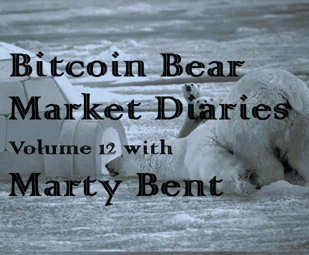
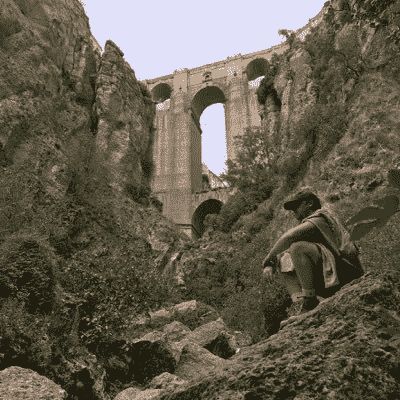

# 比特币熊市日记第 12 卷马蒂·本特

> 原文：<https://medium.com/hackernoon/bitcoin-bear-market-diaries-volume-12-marty-bent-20a4df0e224d>

T 何[比特币熊市日记](https://hackernoon.com/@piratebeachbum)是一系列采访，讲述了比特币生态系统中各种重要的声音和观点。每个受访者都是经过精心挑选的，并被问及同一组问题。主要目标是为世界提供一个关于当前比特币和加密市场状况的评论和观点的集合。有些名字你会认识，而其他人不希望成为焦点，但有很好的洞察力和经验，我们都可以学习。

*这些采访是未经加工和过滤的，除了给每个人说出自己想法的机会之外，没有任何议程。如果你喜欢你所看到的，请分享给你的朋友。如果有什么冒犯了你，你可能应该 X 出来，找另一个给你温暖模糊的秘密绒毛片。*

**马蒂·本特(Marty Bent)**是一位资深的比特币创造者，他最出名的是他的每日比特币简讯和播客* [*来自地穴的故事*](https://twitter.com/TFTC21) *，这是最近 Twitter 和 Square 联合创始人兼首席执行官* [*杰克·多西*](https://twitter.com/jack) *的特色。马蒂是一个非常博学和善于表达的人，每个人都应该关注他。**

**

***名称***

*[玛蒂本特](https://twitter.com/MartyBent)*

***国家***

*美国*

*人们是如何认识你的？*

*比特币人最了解我的可能是我关于比特币的每日时事通讯、马蒂的《best》和我的播客《来自地穴的故事》(Tales from the Crypt)，其中包括由我主持的对比特币感兴趣的人的采访系列，以及由我和马特·奥德尔(Matt Odell)共同主持的名为“兔子洞回顾”(Rabbit Hole Recap)的每周专题新闻节目。*

*你对比特币感兴趣多久了？*

*太长*

***最佳比特币体验？***

*那是一个困难的问题。说得俗一点，最好的比特币体验是我多年来的旅程。迫使我质疑我对许多事情的信念，将我推入我从未想过会探索的主题，并将我介绍给我一生中见过的一些最聪明、最有激情的人。*

*我有一个特别的经历，当我想起它时仍然会起鸡皮疙瘩，那就是我在旅行时的一个“哦，妈的，这太疯狂了”的时刻。我的预算很糟糕，很快就像一个时间偏好狂一样花光了分配给我的资金。幸运的是，我采取了先发制人的行动，创建了一个钱包，在出发去旅行之前在里面放了一些 BTC，并在最小的一张纸上写下了种子短语。我被困在异乡，没有资金，在紧要关头，我在一个朋友的电脑上下载了一个 Electrum 钱包，用小纸片上的种子找回了我的钱包，并把一些资金转移到了一个与我的借记卡相关的账户上，以备不时之需。那一刻，我感到一种难以置信的安全感和力量。使用 12 个单词通过软件变戏法赚钱，这个软件对世界上任何人都是免费开放的。那是我的钱，只有我能变出它来。*

***最差的比特币体验？***

*早期跟随大卫·希曼。*

***你认为比特币最大的威胁是什么？***

*太阳耀斑。*

***你对比特币的各种分叉有什么看法？***

*到目前为止都很无趣。*

***你看好这个领域的什么？***

*我对 UX 在不久的将来对 multisig 钱包/方案的改进非常乐观。用户在使用比特币时，这是一个非常不受重视和未被充分采用的功能，我认为到目前为止，缺乏采用是 UX 的一个问题。巨大的改进正在进行中，这将使比特币用户在持有比特币时更加确定和安心。最终，这将降低“5 美元扳手攻击”的可能性，因为潜在的攻击者将被劝阻不要以参与多签名方案的用户为目标。*

*此外，Schnorr 签名，因为它们将有助于在效率、可伸缩性和可替代性方面提供实质性的收益。*

***上次牛市期间最大的遗憾？***

*沉浸在兴奋中。当我们处于熊市的最深处时(就像我们现在一样)，你会告诉自己不会去做这件事，但很难不被所有的炒作所吸引。*

*在当前的熊市中，你学到了什么？*

*认真致力于帮助比特币成功的人比我想象的要多得多。我原以为会有更多的人被价格冲掉。*

***熊市期间你见过最大的败笔是什么？***

*坚持被市场拒绝的想法和项目的人。*

*你认为是什么引发了当前的熊市？*

*基础设施的不成熟，即交易所和内存池备份的故障，加上公开的骗局和不代表底层基本面的兴奋情绪。精明的投资者看到了这一点，并从中获利。新的、过度扩张的散户资金第一次经历了一些波动，恐慌并抛售。很可能锁定损失并加速熊市。*

*你认为最近的价格下跌对买家情绪造成了什么样的损害？*

*这取决于有人买了什么。话虽如此，但损失肯定还不足以阻止另一轮由散户主导的反弹。一串绿色蜡烛会让人很快失忆。*

***你对闪电网络的现状和未来有什么看法？***

*谨慎乐观。比我想象的要远得多。尽管如此，大部分旅程仍在我们前面。仍然有许多事情需要测试、实现和克服。*

***你对比特币有什么看法？***

*我认为，如果你相信比特币有机会实现其为世界提供分布式点对点现金系统的目标，这是合乎逻辑的事情。*

*你对另类硬币有什么想法？*

*它们是不可避免的，为比特币提供了掩护和研究，但也用“更好的比特币”的诱惑吸引了不知情的更大傻瓜。它们是一把双刃剑。*

*你有吗？如果没有，为什么？*

*我确实持有一些关注隐私的比特币，但它们在我的持股中并不占很大比例，我也不像收购比特币时那样担心比特币的可替代性问题。*

***你认为 alt-coins 的大幅下跌会对他们的未来产生什么样的影响？***

*对大多数人来说，历史上影响低价位的相同影响经历了彻底的下降，僵尸化允许新的作物进入并搅动比特币之后的“顶级”低价位。*

***关于比特币化的想法？***

*我认为它正在发生。缓慢但坚定。决定用自己的工作或法令来换取 BTC 的人数似乎在增加，以缓慢的速度催生了比特币，但速度仍然很快。即便如此，比特币化的速度也是不同的，这取决于你在这块我们称之为地球的岩石上的位置。*

***你对哪些比特币创业公司感到兴奋？***

*以安全为重点的创业公司，尤其是围绕多重监护的创业公司。和游戏创业公司利用 BTC/LN 提供的独特盈利途径。*

***你认为哪些“加密影响者”会弄错，为什么？***

*那些把自己看得太重的人，拒有压倒性的证据与他们的立场相矛盾，他们还是拒绝改变自己的观点。有些人需要更多的谦逊。*

*你认为什么样的“加密影响者”能让事情变得正确，为什么？*

*我讨厌“密码影响者”这个词。*

***如何才能扭转这场熊市？***

*绿色蜡烛和通过生存+财富保存模式的强制收养在世界的某些地方为一些人被启用。*

***尽管比特币最近有所回落，但你对它有多乐观？***

*比以往任何时候都更乐观。*

***你想给刚接触比特币的人一些建议吗？***

*确保你理解比特币成功的世界所带来的引力。这是一种破坏性的力量，在未来可能会遇到一种对立的、协调的力量。为这一现实做好准备。我全心全意地相信，比特币对世界将是一个净利好，但在积累大量价值的过程中，它将淘汰许多根深蒂固的权力，而根深蒂固的权力可能不会对此感到太高兴。*

***储存比特币的最佳技巧？***

*练习。在多种储存方式中分散你的资产。旨在建立一个信任网络，你可以建立多签名方案来帮助保护你自己和你的比特币。*

***说出一些你最喜欢的信息源和/或播客。***

*Twitter 是我的头号信息来源。多年来，我一直在整理一份清单，这份清单为我提供了丰富的知识和源源不断的链接。*

*有什么至理名言吗？*

*不要害怕加入战斗。*

*[*敬请期待下一期熊市比特币日记。你可以在这里找到更多的卷和文章！*](https://hackernoon.com/@piratebeachbum)*