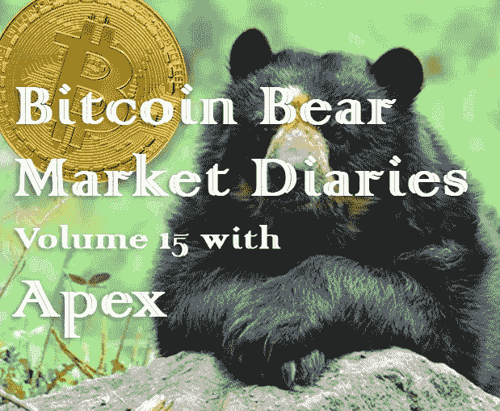
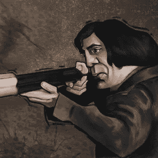

# 比特币熊市日记第 15 卷

> 原文：<https://medium.com/hackernoon/bitcoin-bear-market-diaries-volume-15-with-apex-c96b7a8d8760>

T 何[比特币熊市日记](https://hackernoon.com/@piratebeachbum)是一系列采访，讲述了比特币生态系统中各种重要的声音和观点。每个受访者都是经过精心挑选的，并被问及同一组问题。主要目标是为世界提供一个关于当前比特币和加密市场状况的评论和观点的集合。有些名字你会认识，而其他人不希望成为焦点，但有很好的洞察力和经验，我们都可以学习。

*这些采访是未经加工和过滤的，除了给每个人说出自己想法的机会之外，没有任何议程。如果你喜欢你所看到的，请分享给你的朋友。如果有什么冒犯了你，你可能应该 X 出来，找另一个给你温暖模糊的秘密绒毛片。*

*Apex 是一名委内瑞拉比特币创造者，由于地缘政治问题和该国的快速通货膨胀，他比大多数人更了解比特币的价值主张。*

**名称**

顶点

**国家**

委内瑞拉/美国

**别人是怎么认识你的？**

推特中的@malandrox7

**你对比特币感兴趣多久了？**

2016 年 12 月

**最佳比特币体验？**

即使有 segwit2x 这部剧，2017 年也很棒

**最差的比特币体验？**

没有“最糟糕”的比特币体验

**你认为比特币最大的威胁是什么？**

唯一未知的是我们不知道的软件错误的可能性。尽管如此，在比特币 10 年的历史中，代码中意想不到的漏洞已经由非凡的比特币开发者专业地解决了。

**你对比特币的各种分叉有什么看法？**

它们变成了更多的比特币。除此之外，他们是无用的产卵。

你看好这个领域的什么？

年轻一代的用户和开发人员将构建我们甚至无法理解的用例。就像在 1990 年，我们无法想象我们可以与地球另一端的人进行视频直播的电话交谈。此外，改进的图形用户界面和安全存储。

**上次牛市期间最大的遗憾？**

没有“拉格雷特”。

我想我可以拿出更多的硬币，但是谁想拿着一枚硬币？

在当前的熊市中，你学到了什么？

如果你对比特币是什么和它的能力有很强的理解，熊市是积累更多比特币的好机会。

**熊市期间你见过最大的败笔是什么？**

没有受过金融教育的人得到了他们的屁股，并暂时放弃了这一惊人的，一生一次的资产。

你认为是什么引发了当前的熊市？

隐形运动衫和隐形指甲。

**你认为最近的价格下跌对买家情绪造成了什么样的损害？**

那些比我更早拥有比特币的人都知道，比特币过去是、现在仍然是散户投资者先于机构投资者进入的机会。现在，那些卖出比特币的散户投资者将被机构投资者吃掉午餐…..又来了。

**你对闪电网络的现状和未来有什么看法？**

闪电开发者活在比特币的气息中。他们是最聪明的人，夜以继日地工作来创造这些分层的解决方案，这些解决方案具有我们甚至无法想象的 MoE 和能量转移的可能性。未来看起来很神奇。此外，如果比特币保持其诞生以来的状态，它仍将服务于其合理的货币用途。

**你对 HODLing 比特币有什么想法？**

比特币持有者正在为他们自己和他们的家庭创造一份遗产，而他们甚至不知道这一点。我的预测是，在下一轮中，“hodl”将被收入韦氏词典词典。

你对另类硬币有什么想法？

如果人们想交易它们来获得更多的比特币，那么无论如何…他们可能会在拉斯维加斯的老虎机上运气更好，因为从统计数据来看，10 个交易者中有 1 个会长期赚钱。如果不是因为比特币，我也不会涉足比特币。下面我来解释。

你有吗？如果没有，为什么？

我的大麻贩子是让我进入比特币的人。他要求我用乙醚支付他，并开始给我上一堂“它是如何工作的”速成课。由于有金融背景，我立刻被吸引住了。我认为，由于我在几周内接受的金融教育，我很快就认定比特币是唯一重要的加密货币。我所有的加密货币研究都投入了比特币，这是我唯一拥有的比特币。

我的大麻经销商现在完全拥有比特币，因为我们诱导，冥想的对话。；)

**你认为 alt-coins 的大幅下跌会对他们的未来产生什么样的影响？**

老实说，我不知道也不在乎。

关于比特币化的想法？由于比特币的经济性，我认为这是不可避免的。在核心层面，全球民众已经对我们的金融体系失去了信任。比特币是你的读者和追随者已经知道的所有腐败和错误的替代品。

**你对哪些比特币创业公司感到兴奋？**

@beautyon 参与的任何事情。这家伙明白了，我鼓励每个人都跟着他。光是跟着他我就学会了很多。阿兹特克是他的公司。

你认为哪些“潜在影响者”弄错了，为什么？

对我来说，与其说是影响者，不如说是选择消费他们内容的人。这是一个自由的市场，人们有权跟随、阅读和观看他们想看的任何人。但是，您可以自行决定是否这样做。就我个人而言，我的小回声室让我每天都更有知识。

**你认为什么样的“加密影响者”能做到这一点，为什么？**

见上文。

**如何才能扭转这场熊市？**

有一次我剪了头发，但是我还没剪完，所以大家都要等。

尽管比特币最近有所回落，你对它有多乐观？

我对这次回调完全失去了信心。我是生活和比特币的永久多头。

**你想给刚接触比特币的人一些建议吗？**

通俗地说，把比特币当做你的储蓄账户。因此，无论你留出多少比例的收入用于储蓄，都要全部投入比特币，并继续努力争取更多。

**储存比特币的最佳技巧？**

如果你对你的遗产很认真的话。

**说出一些你最喜欢的信息源和/或播客。**

亚当·梅斯特在 YouTube 上的“比特币的这一周”。他有最好的客人，每次我看，我都以#stackingmoresats 结束

我偏爱他的节目也是因为他为我们国家的形势提供了急需的启示。委内瑞拉。

有什么至理名言吗？

投资你的金融教育。不幸的是，世界各地的教育系统对此强调不够。投入时间由你决定。只有强有力的金融教育才能实现金融主权。

[*敬请期待下一期熊市比特币日记。你可以在这里找到更多的卷和文章！*](https://hackernoon.com/@piratebeachbum)