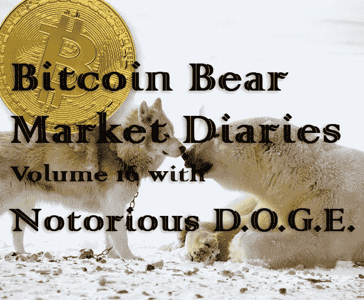
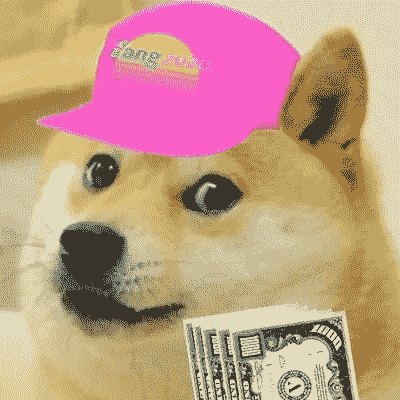

# 比特币熊市日记第 16 卷臭名昭著的 D.O.G.E。

> 原文：<https://medium.com/hackernoon/bitcoin-bear-market-diaries-volume-16-notorious-d-o-g-e-d6810c083e0c>

T 何[比特币熊市日记](https://hackernoon.com/@piratebeachbum)是一系列采访，讲述了比特币生态系统中各种重要的声音和观点。每个受访者都是经过精心挑选的，并被问及同一组问题。主要目标是为世界提供一个关于当前比特币和加密市场状况的评论和观点的集合。有些名字你会认识，而其他人不希望成为焦点，但有很好的洞察力和经验，我们都可以学习。

*这些采访是未经加工和过滤的，除了给每个人说出自己想法的机会之外，没有任何议程。如果你喜欢你所看到的，请分享给你的朋友。如果有什么冒犯了你，你可能应该 X 出来，找另一个给你温暖模糊的秘密绒毛片。*

臭名昭著的 D.O.G.E .是一位长期的比特币创造者，我们许多人都曾在 twitter 上与他争论过他对 shitcoins 的迷恋以及他对比特币最大化的直言不讳的批评。尽管如此，他对比特币的热爱以及在两次熊市中幸存下来的经历，让他成为了一个值得倾听的有趣视角。

**名称**

[破坏殴打](https://twitter.com/sabotagebeats)又名 Dogecoin 百万富翁又名[臭名昭著的 D.O.G.E.](https://twitter.com/sabotagebeats)

[twitter.com/sabotagebeats](https://twitter.com/sabotagebeats)

**国家**

美利坚合众国

**别人怎么认识你？**

我是网络上的黄狗

你对比特币感兴趣多久了？

2 次全面熊市

**最佳比特币体验？**

这整件事是一种体验，令人惊叹。

**最差的比特币体验？**

看着让我进入比特币的朋友毁了自己的生活

**你认为比特币最大的威胁是什么？**

比特币极大主义分裂加密货币社区，引发内斗。

比特币创造者和比特币最大化者是有区别的。

比特币人有积极的态度，DYOR，他们帮助人们，教授和建设，但比特币最大化主义者盲目地憎恨他们不理解的一切，不建造任何东西，只是对他们不同意的人撒尿。

做一个比特币制造者，而不是“比特币最大化者”。积极向上，给空间带来美好。创造东西，鼓励他人。

**你对比特币的各种分叉有什么看法？**

这比试图改变比特币本身来满足叉商的需求要好——理想情况下，他们会制作自己的 alt，但不会从比特币中窃取 utxo 集。比特币分叉真的操纵了市值。此外，比特币不是最公平的分配方式，莱特币的分配方式更公平。我跑题了，除了虚假的市值和可泵性，真的没有理由采取 utxo 设置。

你看好这个领域的什么？

加密货币社区作为一个整体，削弱银行和政府，自我主权

**上次牛市最大的遗憾？**

我本来想在波多黎各买辆新车和房子，但是我买了辆二手车，哈哈

**在当前的熊市中，你学到了什么？**

盐是真的！BTFD！当所有东西看起来都是垃圾的时候买。

**熊市期间你见过的最大失败是什么？**

QuadrigaCX

你认为是什么引发了当前的熊市？

在我看来，这是循环往复的——一切都基于 halvings

**你认为最近的价格下跌对买家情绪造成了什么样的损害？**

哈哈，这个问题可能在最后一次抽水后就过时了，但是的情绪正在上升

**你对闪电网的现状和未来有何感想？**

LN 很酷。目前不要用。Dogecoin 对我来说已经够快了，而且在链条上工作。非常接受！我目前使用比特币作为 rai 石。

**你对霍德林比特币有什么想法？**

如果只有 2100 万枚比特币被生产出来，那么这个星球上的比特币比百万富翁还少。朋友，去 HODL 可能是个好主意。

你对另类硬币有什么想法？

Altcoins 对比特币有帮助。每当比特币内存池满了，替代币就会溢出来帮助人们交易。

你有吗？如果没有，为什么？

是的，一堆，现在是我提行李的时候了吗？总督，海浪，LSK，DCR，GRS，LTC。我有比其他任何东西都多的硬币。这就是我如何成为一个最大化主义者。但我在 BTC 拥有的美元比其他任何东西都多——引用埃隆·马斯克的话来说，价值是可变的

你认为另类硬币的大幅下跌会对他们的未来产生什么样的影响？

🚀🚀🚀🚀🚀🚀🚀🚀🚀🚀

关于比特币化的想法？

希望如此！我认为比特币是民族国家之间的货币转移工具，因为一旦一只 satoshi 达到 100 美元，连锁费用对普通人来说将过于昂贵。闪电不会解决这个问题，因为你仍然需要依靠锁链来关闭你的通道。

**你对哪些比特币创业公司感到兴奋？**

大多数比特币创业公司之所以失败，是因为它们没有增值，只是寻租者。

你认为哪些“潜在影响者”弄错了，为什么？

许多最大化主义者讨厌每个人，却不为自己或自己的项目工作。如果你不建造任何东西或做任何工作来支持比特币，你为什么要讨厌那些正在工作和建造来支持一个 altcoin 的人呢？最好给空间带来积极的一面。

然后有一群秘密的影响者，他们都是有影响力的，炒作的和追随者，这对我来说是愚蠢的。

你认为哪些“潜在影响者”会让事情变得正确，为什么？

埃隆·马斯克。他喜欢 dogecoin，是我最喜欢的 lol

**如何才能扭转这场熊市？**

看起来它在转变:)但是我们需要最大的痛苦来转变它——BTFD！

**尽管比特币最近有所回落，你对它有多乐观？**

超级看涨 BTC 10 万美元到 40 万美元的下一轮牛市——和 dogecoin 到 1 美元

**你想给刚接触比特币的人一些建议吗？**

别理混蛋。DYOR 称之为骗局之前。DYOR 总是在所有的事情上。你为什么信任我？DYOR。

**储存比特币的最佳技巧？**

1:不是你的钥匙也不是你的硬币——不要在交易所持有密码

2:你是自己最大的敌人。退后点。不要因为没有备份种子短语而失去一切。不要把你的种子短语存储在任何电子设备中——把它写在纸上！

3: Ledger、trezor、keepkey、cool wallet——在可信的硬件钱包中分散投资，以防一种类型存在漏洞。

**说出一些你最喜欢的信息源和/或播客。**

我更喜欢看书。Andreas Antonopoulos 在 github 上免费获得他的书籍！

有什么至理名言吗？

你为什么要相信一只黄狗的秘密建议？DYOR！

[*敬请期待下一期熊市比特币日记。你可以在这里找到更多的卷和文章！*](https://hackernoon.com/@piratebeachbum)