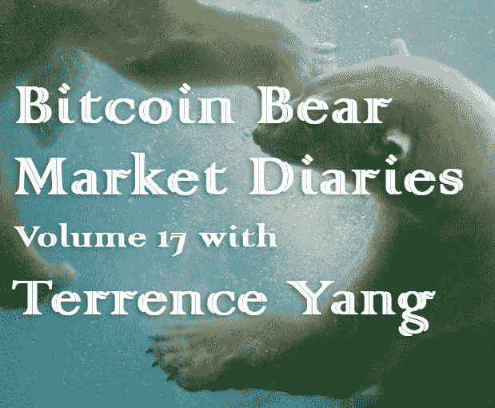

# 泰伦斯·杨的比特币熊市日记第 17 卷

> 原文：<https://medium.com/hackernoon/bitcoin-bear-market-diaries-volume-17-with-terrence-yang-7c3fdfac1f8c>

T 何[比特币熊市日记](https://hackernoon.com/@piratebeachbum)是一系列采访，讲述了比特币生态系统中各种重要的声音和观点。每个受访者都是经过精心挑选的，并被问及同一组问题。主要目标是为世界提供一个关于当前比特币和加密市场状况的评论和观点的集合。有些名字你会认识，而其他人不希望成为焦点，但有很好的洞察力和经验，我们都可以学习。

*这些采访是未经加工和过滤的，除了给每个人说出自己想法的机会之外，没有任何议程。如果你喜欢你所看到的，请分享给你的朋友。如果有什么冒犯了你，你可能应该 X 出来，找另一个给你温暖模糊的秘密绒毛片。*

杨泰伦(Terrence Yang)是 Yang Ventures 的创始人，该公司专注于天使投资他们认识多年的创始人朋友或比特币、法律和金融相关项目。特伦斯是哈佛法学博士，为比特币世界带来了非常有趣的视角。

**名称**

[泰伦斯杨](https://twitter.com/YangVentures)

**国家**

美国

**别人怎么认识你？**

[@yangventures](https://twitter.com/YangVentures) ，Quora

**你对比特币感兴趣多久了？**

2014

**最佳比特币体验？**

现在。我喜欢比特币推特。许多聪明人分享见解和信息，包括面对面和私下的。

**最差的比特币体验？**

最终意识到我站在了 UASF/No2X 运动的错误一边。我仍然被一些最大化主义者阻挡，但我明白了。正如有人在比特币 Twitter 上告诉我的那样，我们都有自己的旅程。

**你认为比特币最大的威胁是什么？**

冷漠。如果没有足够多的人关心，那就结束了。其他人可能会说比特币核心的灾难性软件错误，但我敢打赌，如果足够多的聪明人坚持下去，尝试不同的事情，保持乐观，就能找到解决方案。

**你对比特币的各种分叉有什么看法？**

这不是建议，而是考虑在它们归零之前把它们全部抛出——这可能是它们的前进方向。

你看好这个领域的什么？

比特币第 1 层在安全性、可扩展性以及隐私方面的改进。

液体。

闪电。

不断增加的事务和对完整节点的不断使用，这可能是由闪电采用和试验推动的。

比特币社区，他们抵制比特币审查，并与无币者和替代币者传播的错误信息作斗争。

像杰克·多西、安东尼·庞普利阿诺、纳维尔·拉维坎特这样的人变得更“比特币化”

**上次牛市期间最大的遗憾？**

不要忽视价格，或者有更多的信心在上涨时抓住势头，然后在下跌时做空。

**在当前的熊市中，你学到了什么？**

忽略价格，除非你有坚定的信念。

**你在熊市中见过的最大失败是什么？**

人们以为一切都结束了。看看你认为最差的一些山寨币目前的市值。它们的市值是多少？比特币尚未与替代币脱钩。加密是年轻的，而比特币才刚刚超过 10 年。这些事情需要时间。

你认为是什么引发了当前的熊市？

以下各项的组合:

狗屎铸币者没有愿意抛弃的寡妇和孤儿了。

鲸鱼和食人魔获利。

中国禁止密码交易所，遏制大部分中国资本外逃和中国在密码洗钱。

价格上涨的速度太快，时间太短。不可持续。

你认为最近的价格下跌对买家情绪造成了什么样的损害？

比特币的买家情绪受到了严重打击。你怎么能不从$19.5K 涨到$ 3.2K。我不认为我们已经触底，但现在情绪似乎不错。

**你对闪电网的现状和未来有什么感觉？**

当前:进展良好。喜欢它似乎正在推动更多的用户运行和使用完整的节点。

未来:像任何其他技术一样，我需要看到 LN 或 Lightning 应用程序满足未满足的需求。最好是一个大而重要的未满足的需求。

**你对霍德林比特币有什么想法？**

霍德林比特币很棒。

更喜欢 DCA 积累，但霍德林是第二好的。

你对另类硬币有什么想法？

避免几乎所有这些。

咧嘴笑是有希望的。如果市场不希望比特币填补电子现金功能，那么 Grin 有机会成为私有的、审查抵制的电子现金，拥有随着时间推移而缓和的已知通胀时间表、良好的 DNA、良好的开发人员和良好的社区。

*出于充分的谨慎而披露&自我推销:*

彼得·泰尔也投资了我的第一层。他们是积极参与 Grin 的加密投资者。

你有吗？如果没有，为什么？

我只拥有或 HEDL 比特币，HNS 和 QSP。

我买了 HNS，去中心化互联网由约瑟夫·潘创立，白皮书合著者有 Founders Fund，Draper，红杉，a16z，潘迪拉等。共同赞助。

Quantstamp 首席执行官理查德·马给了我很多 QSP 过去的帮助。我都没想到。所以我请他帮我把它 HODL 化。他们做安全审计。伟大的团队。

你认为另类硬币的大幅下跌会对他们的未来产生什么样的影响？

超过 99.9%的人从来没有未来。这一点现在对更多的人来说更加明显了。

**关于比特币化的想法？**

超级比特币化最终会发生，但美元和美国经济有如此大的惯性。我希望比特币创造者们专注于让比特币化首先在希腊、伊拉克、委内瑞拉等国发生。

**你对哪些比特币初创公司感到兴奋？**

因为便利性和用户体验如此重要，所以我很兴奋:

链码实验室——尤其是 Optech

Square — CashApp 和 Square Crypto

卡萨霍德尔

Samourai 钱包

但我也对 Blockstream 和麻省理工学院媒体实验室在比特币核心开发和闪电实验室在 L2 和 LN 上的工作做出的巨大贡献感到兴奋。

**你认为哪些“加密影响者”会弄错，为什么？**

任何偏离比特币太多的秘密影响者。

任何不明白为什么审查阻力对区块链的价值支柱至关重要的加密影响者。

私人许可的区块链可以工作，但它们是集中的，所以它们更像共享数据库，也许有一个可交易的虚拟令牌。

**您认为哪些“加密影响因素”会让事情变得正确，为什么？**

不胜枚举，但这里有一些

尼克·卡特

阿里·保罗

霍德洛瑙特

哈纳库基

沃伦·托加米

乌迪·韦特海默

埃里克·隆布罗佐

埃里克·马丁代尔

StopandDecrypt

皮埃尔·罗查德

彼得·托德

弗朗西斯·波利奥特

Dovey Wan

Theonevortex

哈素福尔

图尔·德梅斯特

莱恩·雷蒂格

[@**PeterMcCormack**](https://twitter.com/PeterMcCormack)

如何才能扭转这一熊市？

更好的用户体验和更多的便利。

像富达这样提供机构监管的人。

**尽管比特币最近有所回落，你对它有多乐观？**

总体相当看涨。

关于比特币的技术，我是:

看涨。我不是技术人员，但我认识的最聪明的开发人员都对比特币核心在隐私、可伸缩性和安全性方面的所有进展感到兴奋。

对于比特币的采用，我持乐观态度:

杰克·多西和 Square 正在努力推动更多主流应用。我喜欢他们不提供其他硬币，虽然我怀疑@sqcrypto 是 Twitter 的一个句柄，他们选择给他们一些灵活性，以便以后添加另一个硬币，例如 Grin。

关于比特币的价格:

短期看跌。

中期不确定。

长期看涨，意味着未来 10 年以上。比特币至少可以取代黄金(市值约 8 万亿美元)，因为一切都将无现金化，电子化，黄金是实物。

看好技术进步。

**你想给刚接触比特币的人一些建议吗？**

找到你的使命。比特币并不适合所有人。

找到你 BT 的声音。

读起来。提问。练习向比你更年轻的人解释你刚刚学到的东西。

多发推特，这样你可以更好地写作和思考。你必须发货并听取反馈。寂静震耳欲聋。要有趣，要有用。

**储存比特币的最佳技巧？**

正常人应该只使用 CashApp 和 hodl。你不会控制你的私人钥匙，但这不值得。

技术人员和非普通人应该遵循其他人写的指南，控制他们的私钥并使用完整的节点。

**说出一些你最喜欢的信息源和/或播客。**

比特币推特。梅瑟里。街区。

有什么至理名言吗？

培养坚定的信念。

只要读完你最感兴趣的东西，并感到有必要这样做。

然后学会比别人更好地表达自己的观点。斯蒂尔曼。

直到你能做到这一点，你才真正了解你的东西。而且在内心深处，当压力来临时，你不会有信心做出正确的决定。

[*敬请期待下一期熊市比特币日记。你可以在这里找到更多的卷和文章！*](https://hackernoon.com/@piratebeachbum)