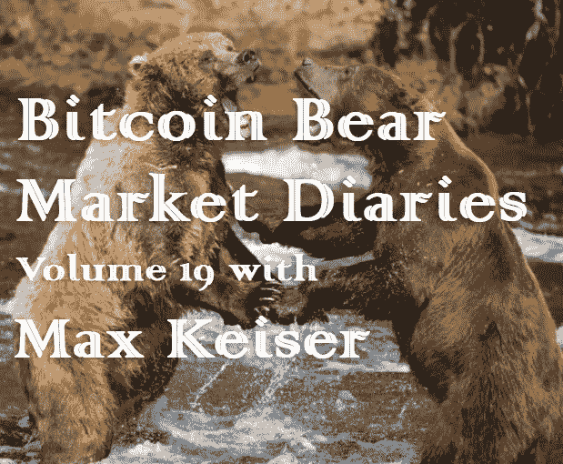

# 比特币熊市日记第 19 卷 Max Keiser

> 原文：<https://medium.com/hackernoon/bitcoin-bear-market-diaries-volume-19-max-keiser-79ee0006b095>

T 何[比特币熊市日记](https://hackernoon.com/@piratebeachbum)是一系列采访，讲述了比特币生态系统中各种重要的声音和观点。每个受访者都是经过精心挑选的，并被问及同一组问题。主要目标是为世界提供一个关于当前比特币和加密市场状况的评论和观点的集合。有些名字你会认识，而其他人不希望成为焦点，但有很好的洞察力和经验，我们都可以学习。

*这些采访是未经加工和过滤的，除了给每个人说出自己想法的机会之外，没有任何议程。如果你喜欢你所看到的，请分享给你的朋友。如果有什么冒犯了你，你可能应该 X 出来，找到另一个给你温暖模糊的秘密绒毛片。*

如果你不知道 Max Keiser 是谁，或者至少以前听过他的名字，你真的需要多出去走走。马克斯自 2011 年比特币价格为 1 美元时就开始涉足比特币，此后一直在进行大胆的市场预测。马克斯还是首批加密风险投资基金之一的 [*海森堡资本*](https://twitter.com/HeisenbergCap) *的联合创始人，并投资了 Kraken、₿itstamp、Shapeshift、Bitfinex、Bitso、BitPesa、BitPay、CasaHODL、Unocoin、opposite、Minds、BitRefill、ABRA、Kim 等公司，不胜枚举。*

**名称**

马克斯·凯泽

**国家**

各种各样的

人们是如何认识你的？

[凯泽报告](https://twitter.com/KeiserReport)

你对比特币感兴趣多久了？

2011 ($1)

**最佳比特币体验？**

聪圆桌会议

**最差的比特币体验？**

克雷格·赖特

**你认为比特币最大的威胁是什么？**

比特币没有已知的掠食者。它是终极顶级掠食者。所有法定货币都会消亡。

**你对比特币的各种分叉有什么想法？**

冒名顶替者。

**你看好这个领域的什么？**

银行和央行将继续倒闭。随着它们的崩溃，比特币将席卷全球经济。比特币最大化主义者杰克·多西是一个巨大的利好。

**上次牛市期间最大的遗憾？**

不是写书。

在当前的熊市中，你学到了什么？

写书永远不嫌晚。

**熊市期间你见过最大的败笔是什么？**

BitTorrent。

你认为是什么引发了当前的熊市？

美国消费者新闻与商业频道。

**你认为最近的价格下跌对买家情绪造成了什么样的损害？**

没有。当价格开始上涨时，它们都会回来，甚至更多。

**你对闪电网络的现状和未来有什么看法？**

这是未来。去年秋天，棕榈泉的 CryptoSprings 帮助大规模启动了照明。Crypto Springs 今年又回来了。依我看，这是一年中最重要的事件。伊丽莎白·史塔克和杰克·多西今年将会让人们大吃一惊。

**你对 HODLing 比特币有什么想法？**

这是头号用例。

你对另类硬币有什么想法？

我没有花太多时间去思考另类硬币。

你有吗？如果没有，为什么？

没有。浪费时间。

**你认为 alt-coins 的大幅下跌会对他们的未来产生什么样的影响？**

没有。

**关于比特币化的想法？**

它来了。

**你对哪些比特币创业公司感到兴奋？**

我认为，我们的风险投资基金 Heisbenberg Capital 是这个领域的第一个风险投资基金(与 Roger Ver 几乎同时投资 BTC 的初创企业)。我们对投资北海巨妖感到非常兴奋，这是一只巨大的独角兽。我们最近刚刚投资了 CASAhodl。我们很快就会投资 BitRefill。还有萨姆森·莫的《无限舰队》我们现在正专注于照明，并已与该领域的一些初创公司进行了洽谈，我们将为其提供资金。

**你认为哪些“加密影响者”会弄错，为什么？**

秘密影响者很快变成了锅炉房。抬起你的头，否则你会得到 REKT。

你认为哪些“潜在影响者”会做出正确的选择，为什么？

[@隐血。](https://twitter.com/cryptoblood_) 他保持真实。

如何才能扭转这一熊市？

当美联储最近在 BTC 3300 美元附近发出“无限 QE”信号时，金价触底。全球央行即将破产。

尽管比特币最近有所回落，你对它有多乐观？

从 2011 年我在 1 美元时推荐 BTC 开始，我的立场就没有改变过，也从未改变过。价格将达到 10 万美元。我们仍在为此努力。

你想给刚接触比特币的人一些建议吗？

阅读白皮书。研究一下。它有你需要知道的 90%的一切，有一个警告。用“黄金”代替“现金”任何了解密码朋克历史的人，或者读过 Satoshi 著作和聊天记录的人都清楚，比特币应该是数字黄金，而不是数字法定货币。这就是我和罗杰·弗不同的地方。我认为他从根本上误读了白皮书，几年后，我们看到我在这方面的立场正在赢得市场。不要从罗杰那里拿走任何东西。他是一个先锋，可能和凯泽报告一样吸引了很多人对比特币感兴趣。附注:我们认为我们已经在世界各地创造了超过 30 万名左右的比特币百万富翁，他们从 BTC 1 美元的时候就开始观看我们的节目。

**储存比特币的最佳技巧？**

卡萨霍尔德/特雷佐尔

**说出一些你最喜欢的信息源和/或播客。**

有两种信息来源是最好的，也是值得的:

詹姆森·洛普和特蕾西·迈耶。

**有什么至理名言吗？**

如果你不准备持有 10 年或更长时间，你就是在赌博，而不是投资。

[*敬请期待下一期熊市比特币日记。你可以在这里找到更多的卷和文章！*](https://hackernoon.com/@piratebeachbum)