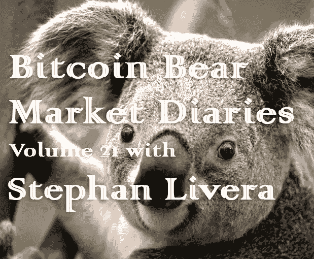

# 比特币熊市日记第 21 卷

> 原文：<https://medium.com/hackernoon/bitcoin-bear-market-diaries-volume-21-stephan-livera-ef4bbc75bd9>

T 何[比特币熊市日记](https://hackernoon.com/@piratebeachbum)是一系列采访，讲述了比特币生态系统中各种重要的声音和观点。每个受访者都是经过精心挑选的，并被问及同一组问题。主要目标是为世界提供一个关于当前比特币和加密市场状况的评论和观点的集合。有些名字你会认识，而其他人不希望成为焦点，但有很好的洞察力和经验，我们都可以学习。

*这些采访是未经加工和过滤的，除了给每个人说出自己想法的机会之外，没有任何议程。如果你喜欢你所看到的，请分享给你的朋友。如果有什么冒犯了你，你可能应该 X 出来，找另一个给你温暖模糊的秘密绒毛片。*

[*斯蒂芬·利维拉*](https://stephanlivera.com/) *是一名澳大利亚比特币创造者，他主持了一个名为* [*斯蒂芬·利维拉*](https://stephanlivera.com/) *的播客节目，节目中有许多在比特币世界有影响力的声音。在专业方面，他是一名澳大利亚特许会计师，在金融服务领域担任技术审计员。*

**名称**

斯蒂芬·利维拉

**国家**

澳大利亚

人们是如何认识你的？

主要来自我的 twitter [@stephanlivera](https://twitter.com/stephanlivera) 和我的播客(Stephan Livera Podcast)，关注比特币和奥地利经济。我采访过许多比特币领袖，从比特币商业领袖、经济学家到计算机科学家和软件开发人员。

你对比特币感兴趣多久了？

自 2012 年 12 月以来。

**最佳比特币体验？**

我一路上结交的朋友！

**最差的比特币体验？**

看到人们，例如 shitcoiner 和 blockchainers，为了信用/宣传而将自己与比特币联系起来，然后转向 shit coiner。当他们这样做时，这意味着合法的比特币制造者必须做更多的工作来撤销他们的叙述。

**你认为比特币最大的威胁是什么？**

政府实际上减少了货币干预。这些干预的例子包括:作为最后贷款人的中央银行、法定货币法、资本收益税法、对银行的隐性和显性救助担保、保释、金融犯罪/监视法、资本控制。在这种情况下，对比特币的需求可能会下降，因为我们已经有了一种由市场选择的合理货币，或者至少是更接近它的货币。

我认为这种威胁不太可能，因为政治经济原因，政客们向世界承诺却不承担此时此地增税的政治成本是很常见的。因此，他们选择通过债务和政府债券为他们的运营融资，将成本转嫁给后代，或者在某种意义上，掠夺社会积累的财富用于他们的政治项目和战争。只有当他们能够迫使我们的货币质量下降(通过上面列出的货币干预实现)时，整个环境才会“起作用”。

**你对比特币的各种分叉有什么看法？**

他们都是狗屎硬币。它们都不具备比特币的可销售性(想想流动性)。他们的存在主要是为了让 shitcoin 创始人发财，不管他们是否明白这一点。

**你看好这个领域的什么？**

比特币和那些忙于建设、教育和管理的诚实的比特币制造者。这些人知道如何玩长线游戏。

**上次牛市最大的遗憾？**

没有做更多的工作来对抗狗屎硬币/区块链叙事。

在当前的熊市中，你学到了什么？

我极大地提高了我对比特币和闪电网络的了解，也发展了我对比特币经济学的想法。

**熊市期间你见过最大的败笔是什么？**

愤怒退出者和 CSW 就是很好的例子。

你认为是什么引发了当前的熊市？

最终，我们在那一波中“接触到了我们能接触到的每一个人”。在这两个时期之间，上一波的赌徒和更疯狂的投机者被彻底消灭。一些新人实际上花时间学习比特币的经济和技术，他们成为新的铁杆比特币/霍德勒类型。一旦我们经历了一段足够长的熊市/横盘行情，新一波行情就会随着一批新的人涌入比特币进行投机而开始。

**你认为最近的价格下跌对买家情绪造成了什么样的损害？**

从某些方面来说，这是一件好事，因为它让人们在决定分配一小部分投资组合和/或定期累积 sat 来投机比特币之前，能够更好地了解比特币。这比人们在牛市中简单地进场要好，因为这些进场者是在为自己重新获利做准备。

**你对闪电网的现状和未来有什么感觉？**

我非常看好 lightning network，但说实话，noobs 还需要一两年的时间才能轻松地以一种“独占的”、完全有效的方式使用它，在这种方式下，他们持有密钥并运行底层的完整节点(而不是使用保管钱包等)。但话虽如此，我非常兴奋地看到许多开发工作正在进行。例如，即将到来的闪电网络规范版本将包括像双资助渠道，放大器，等等。

在更远的未来，如果/当我们获得 Schnorr 签名、eltoo 和多方渠道(例如渠道工厂和其他类似的想法)时，我们就可以真正看到 Lightning 网络进入下一个级别！

**你对比特币有什么看法？**

霍德勒是支持这一愿景的重要力量。那些学习比特币经济和技术的人将在即将到来的比特币世界中处于非常有利的位置。有时候做起来不容易，但是回报潜力很大。正如我的朋友 Vijay Boyapati 所说，比特币是一种不对称的赌注。

**你对另类硬币有什么看法？**

绝大多数是 shitcoin 骗局。对狗屎硬币非常仁慈，其中一些可能在技术上很有趣，但从货币经济学的角度来看，它们仍然是狗屎硬币。

你有吗？如果没有，为什么？

仅限比特币！

**你认为 alt-coins 的大幅下跌会对他们的未来产生什么样的影响？**

可悲的是，每分钟都有一个傻瓜出生，还有一个狗屎骗子来利用他们。所以我们将会看到更多的屎币泵出现，对此我们无能为力。

**关于比特币化的想法？**

我认为这将在未来几十年内发生。人们会慢慢升级到比特币作为他们的新货币，但我们会看到一波又一波的上涨/下跌。

**你对哪些比特币创业公司感到兴奋？**

ZK 零食(Wasabi Wallet)、Samourai Wallet、Casa、Nodl、Lolli、OpenNode、BTCPayServer(严格来说不是初创公司，但仍然是)是我能想到的几个。

**你认为哪些“加密影响者”会弄错，为什么？**

所有的狗屎硬币和区块链。任何对世界有多种观点的人。他们从根本上推动了这种观点，即它是一个“加密”行业，而实际上它是一个比特币行业。比特币，不是密码。

**你认为哪些“加密影响因素”会让事情变得正确，为什么？**

那些从根本上“比特币奥地利”观点的人。其中包括皮埃尔·罗查德、迈克尔·戈尔茨坦、赛费丁·阿摩斯、维杰·博雅帕蒂、吉米·宋、贾科莫·祖科、弗朗西斯·波利奥特等等。

如何才能扭转这场熊市？

我认为它更多的是一个时间的函数，而不是一个特定的行为或事件。

**尽管比特币最近有所回落，你对它有多乐观？**

极其看涨。比特币仍然是包中之王，比特币每天都在扩大其对所有狗屎硬币的领先优势。

**你想给刚接触比特币的人一些建议吗？**

我们在这一领域面临的一个挑战是提供最新和全面的信息。人们试图编写新的入门指南，但几个月后指南就过时了。因此，在 Twitter 上关注声誉好的人往往更好。我建议听听我的播客系列，让自己快速跟上进度，也给我一些建议，告诉我该跟谁学。

**储存比特币的最佳技巧？**

你对比特币的安全性和考虑应该与你的投资水平相称。一旦你提高了你的投资水平，你应该考虑以下几点:

*   备份
*   硬件钱包
*   通过完整节点验证您的收入付款
*   使用 Electrum Personal Server 等软件帮助减少隐私泄露
*   通过 Wasabi Wallet、Join Market、Samourai Wallet 等进行共同加入和其他混合技术
*   多签名、多设备、多位置(Casa 使用的方法)

**说出一些你最喜欢的信息源和/或播客。**

播客:节点播客，来自地穴的故事(& Rabbit Hole Recap)，Cryptocast Network 的 Vortex 新闻节目，Trace Mayer 的比特币知识，Block Digest，Max Hillebrand 在世界加密网的工作，Bottomshelf 比特币，鲁莽评论，公民比特币。

时事通讯:Marty's Bent，Bitcoinoptech

新闻/文章:要小心，这个领域的许多新闻网站会让你误入歧途。我建议关注特定的知名人士，比如 Aaron van Wirdum 和 Kyle Torpey，以获得优秀的比特币新闻。对于其他写作，我建议在 twitter 上关注有声望的人(同样，查看我的播客嘉宾列表)，看看他们分享了什么文章。

有什么至理名言吗？

想办法做贡献。寻找差距所在，比如还没有做好的事情，然后寻找可以利用你的技能做出贡献的方法。一些例子:

*   编写操作指南或创建分步 YouTube 视频
*   比特币/闪电项目的软件开发、审查或文档贡献
*   测试比特币/闪电软件，并向开发者提供反馈
*   在当地建立比特币聚会
*   建立比特币业务

一点一滴都有帮助，随着你的帮助，你的技能、知识和声誉都会提高。玩长线游戏。

[*敬请期待下一期熊市比特币日记。你可以在这里找到更多的卷和文章！*](https://hackernoon.com/@piratebeachbum)