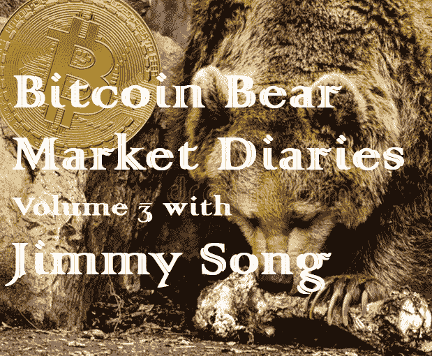
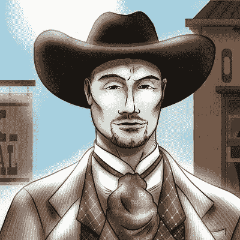
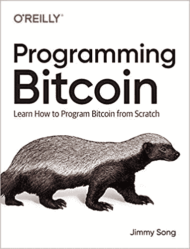

# 吉米·宋的比特币熊市日记第 3 卷

> 原文：<https://medium.com/hackernoon/bitcoin-bear-market-diaries-volume-3-with-jimmy-song-24bfb9350b2c>

《比特币熊市日记》是一系列采访，讲述了比特币生态系统中各种重要的声音和观点。每个受访者都是经过精心挑选的，并被问及同一组问题。主要目标是为世界提供一个关于当前比特币和加密市场状况的评论和观点的集合。有些名字你会认识，而其他人不希望成为焦点，但有很好的洞察力和经验，我们都可以学习。

*这些采访是未经加工和过滤的，除了给每个人说出自己想法的机会之外，没有任何议程。如果你喜欢你所看到的，请分享给你的朋友。如果有什么冒犯了你，你可能应该 X 出来，找另一个给你温暖模糊的秘密绒毛片。*

*吉米·宋(Jimmy Song)是比特币教育家、开发者和企业家，也是该领域的资深人士。*

**姓名:**宋吉米

国家:美国

**人家是怎么认识你的？**

[Programming Bitcoin is available on Amazon](https://www.amazon.com/Programming-Bitcoin-Learn-Program-Scratch-ebook-dp-B07NM32WGH/dp/B07NM32WGH/ref=mt_kindle?_encoding=UTF8&me=&qid=)

博客、YouTube 视频、我的课程和我的书 [*编程比特币*](https://www.amazon.com/Programming-Bitcoin-Learn-Program-Scratch-ebook-dp-B07NM32WGH/dp/B07NM32WGH/ref=mt_kindle?_encoding=UTF8&me=&qid=)

**你对比特币感兴趣多久了？**

8 年

**最佳比特币体验？**

因写代码而获得 BTC。

**最差的比特币体验？**

托普会被骗。我在 2014 年买了一枚 Alitin 2BTC 硬币。他们保留了私钥，当然也遭到了黑客攻击。不知道是内部的还是外部的黑客，但还是很糟糕。

紧随其后的是买东西(牛肉干和缝纫机)，然后看着价格上涨。

**你认为比特币最大的威胁是什么？**

缺乏开发者。这并不容易，但谢天谢地，激励措施是这样的，每天都有更多的人进来。

**你对比特币的各种分叉有什么看法？**

对那些会编码的人来说是好的红利！这只是人们试图印自己的钱或成为自己的中央银行。

你看好这个领域的什么？

每一个“负面”事件似乎都会给比特币带来更多的抗脆弱性。我喜欢生存每次都强化比特币。

**上次牛市期间最大的遗憾？**

没什么，真的。我喜欢它。

在当前的熊市中，你学到了什么？

熊市造就真正的信徒。

**熊市期间你见过最大的败笔是什么？**

巴布/BSV

你认为是什么引发了当前的熊市？

供给过多，需求不足。太多的人什么都不知道就买了，只是在赌博。

你认为最近的价格下跌对买家情绪造成了什么样的损害？

长期的，不多。短期来看，它会教人们不要赌博。

**你对闪电网络的现状和未来有什么看法？**

还在发展中。很多技术上的改进会让它变得更好。UX 需要改进，只是需要更多的企业家参与其中。

**你对比特币有什么看法？**

那是杀手级应用。不被膨胀或被中央政权控制的价值储存手段。

你对另类硬币有什么想法？

大部分像钱一样无趣，但技术上可能有趣。不过，大多数都不是。

你有吗？如果没有，为什么？

我可能在某个地方有一些残留物，但我已经把它们处理掉了。我不持有他们，因为我不相信他们未来的成功。至少不是比特币的水平。

**你认为 alt-coins 的大幅下跌会对他们的未来产生什么样的影响？**

不多。总会有人试图印钞票。真正需要清醒的是市场，我不认为这种情况会发生得太快。

**关于比特币化的想法？**

只是时间的问题，而不是如果。可能要花很长时间。

**你对哪些比特币创业公司感到兴奋？**

我建议去 Lvl.co，因为他们有更好的收费系统(这是一种交换)。加密进展是认真对待硬件安全和主要的技术家伙是一个以前的学生(https://cryptoadvance.io/pages/product)

**你认为哪些“加密影响者”会弄错，为什么？**

那些寻找比特币 2.0 或者确信自己找到了的人。在过去一年左右的时间里，他们大多都吸取了惨痛的教训。

**你认为什么样的“加密影响因素”能让事情变得正确，为什么？**

最大化主义者的大多数观点都是正确的。他们知道什么是健全的货币，为什么比特币是有价值的。

如何才能扭转这一熊市？

时间。我们需要首先清除大量对 altcoins 和 ICOs 的错误投资。

尽管比特币最近有所回落，你对它有多乐观？

非常。长期来看，供给是固定的，需求会上升。这是一个耐心的问题。

你想给刚接触比特币的人一些建议吗？

长期投资，而不是短期投资。

**储存比特币的最佳技巧？**

我还在想办法。对于大多数人来说，一个硬件钱包可能就足够了。

说出一些你最喜欢的信息源和/或播客。

Noded。推特。比特币杂志。

有什么至理名言吗？

专注于做出好的长期决定，你会没事的。为了短期利益而做一些违背你信仰的事情会导致毁灭。

[*敬请关注下一期熊市比特币日记。我有一些令人敬畏的采访在排队，并将定期投放新的卷。你可以在这里找到更多的卷和文章！*](https://hackernoon.com/@piratebeachbum)